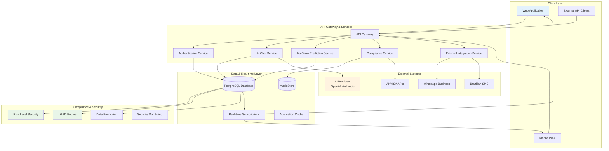

# NeonPro System Architecture

## Introduction

This document defines the high-level system architecture for **NeonPro AI-First Advanced Aesthetic Platform**, focusing on architectural patterns, system design principles, and component relationships. It serves as the architectural blueprint for AI-driven development of Brazilian aesthetic clinic management systems.

**Scope**: System-level design decisions, architectural patterns, and component interactions
**Target Audience**: Architects, senior developers, and technical decision makers
**Focus**: Brazilian aesthetic clinics with LGPD/ANVISA compliance requirements

### Architectural Context

**Project Type**: Greenfield aesthetic clinic platform with regulatory compliance requirements
**Domain**: Brazilian aesthetic clinic operations (botox, fillers, facial harmonization, laser treatments)
**Compliance**: LGPD data protection, ANVISA cosmetic regulations, aesthetic professional council standards
**Scale**: Multi-clinic platform with real-time operations and AI-driven insights

### Change Log

| Date       | Version | Description                                                  | Author       |
| ---------- | ------- | ------------------------------------------------------------ | ------------ |
| 2025-09-09 | 4.0.0   | Enhanced architecture with clear content boundaries          | AI IDE Agent |
| 2025-09-09 | 3.0.0   | Restructured to focus on high-level system architecture only | AI IDE Agent |
| 2025-09-09 | 2.2.0   | Migrated to TanStack Router + Vite architecture              | AI IDE Agent |
| 2025-09-06 | 2.1.0   | Aligned with real monorepo structure                         | AI IDE Agent |

## System Architecture Overview

### Architectural Philosophy

NeonPro employs a **domain-driven, compliance-first architecture** specifically designed for Brazilian aesthetic clinic operations. The system prioritizes data protection, real-time aesthetic workflows, and AI-enhanced decision making while maintaining strict regulatory compliance.

**Core Principles**:

- **Compliance by Design**: LGPD, ANVISA, and aesthetic professional council requirements embedded in architectural decisions
- **Real-time First**: Live updates essential for clinic operations and client satisfaction
- **AI-Enhanced**: Predictive analytics and conversational AI integrated throughout
- **Multi-tenant Ready**: Designed for multiple clinics with data isolation
- **Audit-Complete**: Comprehensive logging for aesthetic clinic regulatory requirements

### System Architecture Style

**Primary Pattern**: **Event-Driven Microservices with Shared Database**

The architecture combines the benefits of microservices modularity with the consistency guarantees of a shared database, optimized for aesthetic clinic compliance and real-time operations.

**Key Characteristics**:

- **Modular Services**: Distinct services for AI, appointments, compliance, and integrations
- **Shared Data Layer**: Single PostgreSQL database with Row Level Security for data isolation
- **Event-Driven Communication**: Real-time updates via WebSocket subscriptions
- **API Gateway Pattern**: Unified entry point for all client requests
- **CQRS Implementation**: Separate read/write operations for audit compliance

### System Architecture Diagram

## Core Architectural Patterns

### Primary Patterns

**1. Event-Driven Architecture**

- **Purpose**: Real-time clinic operations and client communication
- **Implementation**: WebSocket subscriptions for live appointment updates, notifications, and status changes
- **Benefits**: Immediate response to critical aesthetic clinic events, improved client experience
- **Compliance**: Supports audit trail requirements with event sourcing

**2. API Gateway Pattern**

- **Purpose**: Unified entry point for all client requests
- **Implementation**: Single gateway handling authentication, rate limiting, and request routing
- **Benefits**: Centralized security, monitoring, and cross-cutting concerns
- **Compliance**: Consistent audit logging and access control

**3. CQRS (Command Query Responsibility Segregation)**

- **Purpose**: Separate read and write operations for aesthetic clinic compliance
- **Implementation**: Distinct models for data modification vs. data retrieval
- **Benefits**: Optimized performance, comprehensive audit trails, regulatory compliance
- **Compliance**: Required for LGPD data access logging and aesthetic clinic audit requirements

**4. Multi-Tenant Architecture with RLS**

- **Purpose**: Secure data isolation between clinics
- **Implementation**: PostgreSQL Row Level Security policies for automatic data filtering
- **Benefits**: Database-level security, simplified application logic, regulatory compliance
- **Compliance**: Ensures LGPD data protection and clinic data isolation

### Supporting Patterns

**Repository Pattern**

- **Purpose**: Abstract data access logic for testability and flexibility
- **Benefits**: Enables testing, future database migrations, and consistent data access patterns

**Circuit Breaker Pattern**

- **Purpose**: Resilience for external service integrations (AI providers, WhatsApp, SMS)
- **Benefits**: Graceful degradation, improved system stability, better user experience

**Saga Pattern**

- **Purpose**: Distributed transaction management for complex aesthetic clinic workflows
- **Benefits**: Data consistency across services, compensation for failed operations

## System Components

### Core System Components

**1. API Gateway Service**

- **Responsibility**: Request routing, authentication, rate limiting, and cross-cutting concerns
- **Key Interfaces**: HTTP REST endpoints, WebSocket connections, authentication middleware
- **Dependencies**: Authentication service, monitoring systems
- **Patterns**: Gateway pattern, middleware chain, circuit breaker

**2. Authentication & Authorization Service**

- **Responsibility**: User authentication, session management, role-based access control
- **Key Interfaces**: Login/logout endpoints, session validation, role checking
- **Dependencies**: User database, audit logging
- **Patterns**: JWT tokens, role-based access control (RBAC), session management

**3. AI Chat Service**

- **Responsibility**: Portuguese-optimized conversational AI for appointment scheduling and client inquiries
- **Key Interfaces**: Chat message API, streaming responses, context management
- **Dependencies**: AI providers (OpenAI, Anthropic), client context, audit logging
- **Patterns**: Strategy pattern for AI providers, circuit breaker, PII sanitization

**4. Anti-No-Show Prediction Service**

- **Responsibility**: Machine learning-based prediction of appointment no-shows with intervention recommendations
- **Key Interfaces**: Risk score calculation, intervention recommendations, model training
- **Dependencies**: Client history, appointment patterns, communication preferences
- **Patterns**: Prediction pipeline, feature engineering, model versioning

**5. Compliance Engine**

- **Responsibility**: LGPD compliance automation, consent management, audit trail generation
- **Key Interfaces**: Consent management API, data retention automation, audit queries
- **Dependencies**: User consent data, audit logging, data classification
- **Patterns**: Policy engine, event sourcing, automated workflows

**6. External Integration Service**

- **Responsibility**: Communication with WhatsApp Business API, Brazilian SMS providers, aesthetic regulatory systems
- **Key Interfaces**: Message sending, webhook handling, device validation
- **Dependencies**: External service credentials, rate limiting, error handling
- **Patterns**: Adapter pattern, webhook processing, retry mechanisms

## Data Architecture

### Data Flow Patterns

**1. Command-Query Separation**

- **Commands**: All data modifications flow through dedicated command handlers
- **Queries**: Read operations use optimized query models and caching
- **Benefits**: Clear separation of concerns, optimized performance, comprehensive audit trails

**2. Event Sourcing for Audit**

- **Implementation**: Critical aesthetic clinic events stored as immutable event log
- **Events**: Client data changes, appointment modifications, consent updates
- **Benefits**: Complete audit trail, regulatory compliance, data recovery capabilities

**3. Real-time Data Synchronization**

- **Pattern**: WebSocket subscriptions for live updates
- **Use Cases**: Appointment status changes, new client registrations, procedure guidance alerts
- **Benefits**: Immediate clinic workflow updates, improved client experience

### Data Security Architecture

**1. Encryption Strategy**

- **At Rest**: AES-256 encryption for sensitive data (CPF, client treatment records)
- **In Transit**: TLS 1.3 for all communications
- **Key Management**: Separate encryption keys per clinic for data isolation

**2. Row Level Security (RLS)**

- **Implementation**: PostgreSQL RLS policies for automatic data filtering
- **Scope**: All client data, appointments, and clinic information
- **Benefits**: Database-level security, simplified application logic, regulatory compliance

**3. Data Classification**

- **PII (Personally Identifiable Information)**: CPF, RG, contact information
- **Client Treatment Information**: Aesthetic treatment records, procedure history
- **Operational Data**: Appointments, schedules, clinic information
- **Audit Data**: Access logs, data modifications, consent records

## Integration Architecture

### External System Integration Patterns

**1. AI Provider Integration**

- **Pattern**: Strategy pattern with failover capability
- **Providers**: OpenAI (primary), Anthropic (fallback)
- **Features**: Circuit breaker, timeout handling, response caching
- **Compliance**: PII sanitization, conversation logging, LGPD compliance

**2. Communication Platform Integration**

- **WhatsApp Business API**: High-priority client communications
- **Brazilian SMS Providers**: Fallback communication method
- **Pattern**: Adapter pattern for unified messaging interface
- **Features**: Message queuing, delivery confirmation, rate limiting

**3. Regulatory System Integration**

- **ANVISA API**: Cosmetic product validation and compliance checking
- **Pattern**: External service adapter with caching
- **Features**: Product registration validation, compliance status checking

### API Design Principles

**1. RESTful Design**

- **Resource-based URLs**: `/clients/{id}`, `/appointments/{id}`
- **HTTP Methods**: Proper use of GET, POST, PUT, DELETE
- **Status Codes**: Meaningful HTTP status codes for different scenarios

**2. Real-time Capabilities**

- **WebSocket Subscriptions**: Live updates for critical clinic operations
- **Event Broadcasting**: Appointment changes, client updates, procedure guidance alerts
- **Connection Management**: Automatic reconnection, heartbeat monitoring

**3. API Versioning**

- **Strategy**: URL-based versioning (`/api/v1/`, `/api/v2/`)
- **Backward Compatibility**: Maintain previous versions during transition periods
- **Deprecation Policy**: Clear timeline for version sunset

## Compliance Architecture

### LGPD (Brazilian Data Protection) Compliance

**1. Data Protection by Design**

- **Principle**: Privacy considerations embedded in all architectural decisions
- **Implementation**: Automatic data encryption, consent management, retention policies
- **Monitoring**: Continuous compliance checking and violation detection

**2. Consent Management Architecture**

- **Granular Consent**: Separate consent for data processing, marketing, aesthetic procedure photos
- **Consent Versioning**: Track consent changes over time with audit trail
- **Withdrawal Mechanism**: Easy consent withdrawal with automatic data handling

**3. Data Subject Rights**

- **Right to Access**: Automated data export functionality
- **Right to Rectification**: Controlled data modification with audit trail
- **Right to Erasure**: Secure data deletion with compliance verification
- **Data Portability**: Standardized data export formats

### ANVISA (Cosmetic Product) Compliance

**1. Product Registration Validation**

- **Real-time Validation**: Automatic checking of cosmetic product registration numbers
- **Compliance Monitoring**: Continuous monitoring of product compliance status
- **Alert System**: Notifications for expired or invalid product registrations

**2. Audit Trail Requirements**

- **Complete Logging**: All product usage and client interactions logged
- **Immutable Records**: Audit logs protected from modification
- **Regulatory Reporting**: Automated compliance report generation

## Scalability Architecture

### Horizontal Scaling Strategy

**1. Stateless Service Design**

- **Principle**: All services designed to be stateless for easy horizontal scaling
- **Implementation**: Session data stored in database, no server-side state
- **Benefits**: Easy load balancing, fault tolerance, elastic scaling

**2. Database Scaling**

- **Read Replicas**: Separate read replicas for query optimization
- **Connection Pooling**: Efficient database connection management
- **Query Optimization**: Indexed queries and materialized views for performance

**3. Caching Strategy**

- **Application Cache**: Frequently accessed data cached at application level
- **CDN Caching**: Static assets and API responses cached at edge locations
- **Database Query Cache**: Expensive queries cached to reduce database load

### Performance Architecture

**1. Response Time Optimization**

- **Target**: <200ms for critical aesthetic clinic operations
- **Implementation**: Optimized database queries, efficient caching, CDN usage
- **Monitoring**: Real-time performance monitoring and alerting

**2. Throughput Optimization**

- **Concurrent Users**: Designed to handle 1000+ concurrent users per clinic
- **Request Processing**: Asynchronous processing for non-critical operations
- **Resource Management**: Efficient memory and CPU usage patterns

## Error Handling & Resilience Architecture

### Error Handling Strategy

**1. Graceful Degradation**

- **Principle**: System continues to function even when non-critical components fail
- **Implementation**: Circuit breakers for external services, fallback mechanisms
- **Examples**: AI chat fallback to human support, SMS fallback when WhatsApp fails

**2. Comprehensive Error Logging**

- **Structured Logging**: Consistent error format across all services
- **Error Classification**: Critical, warning, info levels with appropriate alerting
- **Context Preservation**: Full request context maintained for debugging

**3. Recovery Mechanisms**

- **Automatic Retry**: Exponential backoff for transient failures
- **Manual Recovery**: Clear procedures for manual intervention when needed
- **Data Consistency**: Compensation patterns for distributed transaction failures

### Monitoring & Observability

**1. Health Monitoring**

- **Service Health**: Continuous monitoring of all service endpoints
- **Database Health**: Connection pool monitoring, query performance tracking
- **External Dependencies**: Monitoring of AI providers, communication services

**2. Performance Monitoring**

- **Response Times**: Real-time tracking of API response times
- **Throughput**: Request volume and processing capacity monitoring
- **Resource Usage**: CPU, memory, and database utilization tracking

**3. Business Metrics**

- **Appointment Success Rate**: Tracking of successful appointment completions
- **No-Show Prediction Accuracy**: ML model performance monitoring
- **Client Satisfaction**: Indirect metrics through system usage patterns

## Architectural Decision Records (ADRs)

### ADR-001: Event-Driven Architecture for Real-time Operations

**Decision**: Implement event-driven architecture using WebSocket subscriptions
**Rationale**: Aesthetic clinic operations require immediate updates for client satisfaction and clinic efficiency
**Consequences**: Increased complexity but essential for aesthetic clinic workflows
**Status**: Accepted

### ADR-002: Multi-Tenant Architecture with Row Level Security

**Decision**: Use PostgreSQL RLS for data isolation between clinics
**Rationale**: Database-level security provides strongest guarantee for aesthetic clinic data protection
**Consequences**: Simplified application logic, regulatory compliance, potential performance considerations
**Status**: Accepted

### ADR-003: CQRS Pattern for Audit Compliance

**Decision**: Separate read and write operations for aesthetic clinic data
**Rationale**: Required for LGPD audit trails and aesthetic clinic regulatory compliance
**Consequences**: Additional complexity but necessary for compliance
**Status**: Accepted

### ADR-004: AI Provider Strategy Pattern

**Decision**: Implement strategy pattern with multiple AI providers (OpenAI, Anthropic)
**Rationale**: Redundancy for critical aesthetic clinic communications, cost optimization
**Consequences**: Additional integration complexity but improved reliability
**Status**: Accepted

## Cross-Cutting Concerns

### Security

- **Authentication**: Multi-factor authentication with WebAuthn support
- **Authorization**: Role-based access control with database-level enforcement
- **Data Protection**: End-to-end encryption with key management per clinic
- **Audit Logging**: Comprehensive logging for all aesthetic clinic data access

### Performance

- **Caching**: Multi-layer caching strategy (application, database, CDN)
- **Optimization**: Database query optimization with proper indexing
- **Monitoring**: Real-time performance monitoring with alerting
- **Scalability**: Horizontal scaling capability for growing clinic networks

### Compliance

- **LGPD**: Automated data protection with consent management
- **ANVISA**: Medical device validation and compliance monitoring
- **Audit**: Immutable audit trails for all system operations
- **Reporting**: Automated compliance reporting and violation detection

## Implementation Guidance

### Development Principles

- **Domain-Driven Design**: Organize code around business domains (clients, appointments, compliance)
- **Test-Driven Development**: Write tests first for critical aesthetic clinic functionality
- **Security First**: Security considerations in every architectural decision
- **Compliance by Design**: LGPD and ANVISA requirements embedded from the start

### Quality Attributes

- **Reliability**: 99.9% uptime for critical aesthetic clinic operations
- **Performance**: <200ms response time for patient-facing operations
- **Security**: Healthcare-grade security with comprehensive audit trails
- **Scalability**: Support for 1000+ concurrent users per clinic
- **Maintainability**: Clear separation of concerns and comprehensive documentation

## Conclusion

The NeonPro system architecture provides a robust, scalable, and compliant foundation for Brazilian aesthetic clinic operations. The event-driven, multi-tenant design ensures real-time responsiveness while maintaining strict data isolation and regulatory compliance.

**Key Architectural Strengths**:

- **Compliance-First Design**: LGPD and ANVISA requirements embedded in architectural decisions
- **Real-time Capabilities**: Event-driven architecture for immediate clinic workflow updates
- **AI Integration**: Seamless integration of conversational AI and predictive analytics
- **Security**: Multi-layered security with database-level data isolation
- **Scalability**: Designed for growth from single clinic to multi-clinic networks

**Next Steps**:

- Review [Tech Stack](./tech-stack.md) for specific technology choices and rationale
- Examine [Source Tree](./source-tree.md) for code organization and structure
- Consult [Coding Standards](../rules/coding-standards.md) for implementation guidelines

---

**Document Status**: ✅ **Architecture Complete**
**Compliance**: LGPD + ANVISA + Professional Council Ready
**Target**: Brazilian Aesthetic Clinics
**Last Updated**: September 2025
