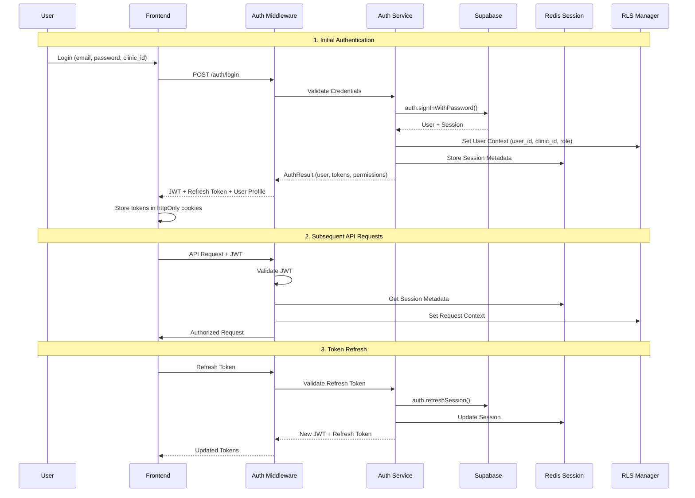

# 🛠️ Cross-cutting Concerns Architecture - NeonPro Healthcare

## 🎯 **OBJETIVO**

Projetar e documentar as preocupações horizontais do sistema que atravessam múltiplas camadas e componentes, garantindo consistência, observabilidade e compliance healthcare.

**Base**: Validação Supabase completa + Interface Specification + Enterprise healthcare requirements\
**Target**: Production-ready horizontal architecture com LGPD compliance

---

## 📊 **1. LOGGING ARCHITECTURE**

### **1.1 Centralized Logging Strategy**

```typescript
/**
 * Comprehensive Logging System for Healthcare
 * Features: Structured logging, LGPD compliance, audit trail, performance monitoring
 */
export interface HealthcareLoggingSystem {
  // Application Logs
  app: {
    info(message: string, context?: LogContext): Promise<void>;
    warn(message: string, context?: LogContext): Promise<void>;
    error(message: string, error?: Error, context?: LogContext): Promise<void>;
    debug(message: string, context?: LogContext): Promise<void>;
  };
  
  // Healthcare-Specific Logging (LGPD compliant)
  healthcare: {
    patientAccess(operation: PatientAccessLog): Promise<void>;
    dataModification(operation: DataModificationLog): Promise<void>;
    complianceEvent(event: ComplianceEventLog): Promise<void>;
    medicalAction(action: MedicalActionLog): Promise<void>;
    appointmentEvent(event: AppointmentEventLog): Promise<void>;
  };
  
  // Performance & System Monitoring
  performance: {
    apiResponse(metrics: APIResponseMetrics): Promise<void>;
    databaseQuery(metrics: DatabaseQueryMetrics): Promise<void>;
    cacheOperation(metrics: CacheMetrics): Promise<void>;
    externalServiceCall(metrics: ExternalServiceMetrics): Promise<void>;
  };
  
  // Security & Audit
  security: {
    authenticationEvent(event: AuthEvent): Promise<void>;
    authorizationFailure(failure: AuthorizationFailure): Promise<void>;
    suspiciousActivity(activity: SuspiciousActivityLog): Promise<void>;
    dataExport(export: DataExportLog): Promise<void>;
  };
}

// Log Context Structure
interface LogContext {
  // Request Context
  requestId?: string;
  userId?: string;
  clinicId?: string;
  userRole?: string;
  sessionId?: string;
  
  // Technical Context
  component?: string;
  function?: string;
  version?: string;
  environment?: 'development' | 'staging' | 'production';
  
  // Healthcare Context
  patientId?: string;
  professionalId?: string;
  appointmentId?: string;
  
  // LGPD Context
  lgpdBasis?: string;
  dataCategory?: string;
  consentStatus?: string;
  
  // Additional metadata
  metadata?: Record<string, any>;
  timestamp?: string;
  ipAddress?: string;
  userAgent?: string;
}
```

### **1.2 Healthcare-Specific Log Types**

```typescript
// Patient Access Logging (LGPD Required)
interface PatientAccessLog {
  action: "view" | "create" | "update" | "delete" | "export";
  patientId: string;
  accessedFields: string[];
  lgpdBasis: string;
  professionalId: string;
  clinicId: string;
  ipAddress: string;
  userAgent: string;
  timestamp: string;
}

// Data Modification Audit
interface DataModificationLog {
  entity: "patient" | "appointment" | "professional" | "clinic";
  entityId: string;
  operation: "create" | "update" | "delete" | "restore";
  oldValues?: Record<string, any>;
  newValues?: Record<string, any>;
  changedFields: string[];
  userId: string;
  reason?: string;
  automatedChange?: boolean;
}

// Medical Action Logging
interface MedicalActionLog {
  action: "appointment_start" | "appointment_complete" | "prescription_create" | "diagnosis_record";
  appointmentId?: string;
  patientId: string;
  professionalId: string;
  details: Record<string, any>;
  clinicalData?: {
    symptoms?: string[];
    diagnosis?: string[];
    medications?: string[];
    procedures?: string[];
  };
}
```

### **1.3 Logging Infrastructure**

```typescript
/**
 * Multi-tier Logging Infrastructure
 */
export class HealthcareLogger {
  private winston: winston.Logger;
  private sentry: Sentry;
  private auditStore: AuditLogRepository;

  constructor(config: LoggingConfig) {
    // Winston for structured application logs
    this.winston = winston.createLogger({
      level: config.logLevel,
      format: winston.format.combine(
        winston.format.timestamp(),
        winston.format.json(),
        winston.format.errors({ stack: true }),
      ),
      transports: [
        new winston.transports.File({ filename: "app.log" }),
        new winston.transports.Console({ format: winston.format.simple() }),
      ],
    });

    // Sentry for error tracking and alerting
    this.sentry = Sentry;

    // Dedicated audit log storage (Supabase audit_logs table)
    this.auditStore = new AuditLogRepository();
  }

  async logHealthcareEvent(event: HealthcareLogEvent): Promise<void> {
    // 1. Structure the log with LGPD compliance
    const structuredLog = {
      ...event,
      timestamp: new Date().toISOString(),
      environment: process.env.NODE_ENV,
      version: process.env.APP_VERSION,
    };

    // 2. Application logging (Winston)
    this.winston.info("Healthcare Event", structuredLog);

    // 3. Audit trail (Database)
    if (this.isAuditableEvent(event)) {
      await this.auditStore.create({
        user_id: event.userId,
        action: event.action,
        resource_type: event.resourceType,
        resource_id: event.resourceId,
        old_values: event.oldValues,
        new_values: event.newValues,
        ip_address: event.ipAddress,
        user_agent: event.userAgent,
        lgpd_basis: event.lgpdBasis,
        clinic_id: event.clinicId,
      });
    }

    // 4. Error tracking (Sentry) for critical events
    if (event.severity === "error" || event.severity === "critical") {
      this.sentry.captureEvent({
        message: event.message,
        level: event.severity,
        extra: structuredLog,
        tags: {
          component: event.component,
          clinicId: event.clinicId,
          userId: event.userId,
        },
      });
    }
  }
}
```

---

## 🔐 **2. AUTHENTICATION FLOW ARCHITECTURE**

### **2.1 Complete Authentication Flow**



### **2.2 Authentication Middleware Stack**

```typescript
/**
 * Comprehensive Auth Middleware for Healthcare
 */
export class HealthcareAuthMiddleware {
  private supabase: SupabaseClient;
  private redis: Redis;
  private rlsManager: RLSManager;
  private logger: HealthcareLogger;

  /**
   * Main authentication middleware
   */
  async authenticate(req: Request, res: Response, next: NextFunction) {
    try {
      // 1. Extract and validate JWT
      const token = this.extractToken(req);
      if (!token) {
        throw new AuthenticationError("No token provided");
      }

      // 2. Verify JWT with Supabase
      const { data: user, error } = await this.supabase.auth.getUser(token);
      if (error || !user) {
        throw new AuthenticationError("Invalid token");
      }

      // 3. Get session metadata from Redis
      const sessionData = await this.redis.get(`session:${user.id}`);
      if (!sessionData) {
        throw new AuthenticationError("Session expired");
      }

      // 4. Parse and validate session
      const session = JSON.parse(sessionData);
      if (this.isSessionExpired(session)) {
        await this.redis.del(`session:${user.id}`);
        throw new AuthenticationError("Session expired");
      }

      // 5. Set RLS context for database queries
      await this.rlsManager.setUserContext(
        user.id,
        session.role,
        session.clinicId,
      );

      // 6. Attach user context to request
      req.user = {
        id: user.id,
        email: user.email,
        role: session.role,
        clinicId: session.clinicId,
        permissions: session.permissions,
        professionalId: session.professionalId,
      };

      // 7. Log authentication event
      await this.logger.security.authenticationEvent({
        type: "api_access",
        userId: user.id,
        clinicId: session.clinicId,
        endpoint: req.path,
        method: req.method,
        ipAddress: req.ip,
        userAgent: req.get("User-Agent"),
        success: true,
      });

      next();
    } catch (error) {
      // Log authentication failure
      await this.logger.security.authenticationEvent({
        type: "authentication_failure",
        endpoint: req.path,
        method: req.method,
        ipAddress: req.ip,
        userAgent: req.get("User-Agent"),
        error: error.message,
        success: false,
      });

      res.status(401).json({
        error: "Authentication failed",
        code: "UNAUTHORIZED",
      });
    }
  }

  /**
   * Role-based authorization middleware
   */
  requireRole(allowedRoles: UserRole[]) {
    return (req: Request, res: Response, next: NextFunction) => {
      if (!req.user || !allowedRoles.includes(req.user.role)) {
        this.logger.security.authorizationFailure({
          userId: req.user?.id,
          role: req.user?.role,
          requiredRoles: allowedRoles,
          endpoint: req.path,
          method: req.method,
        });

        return res.status(403).json({
          error: "Insufficient permissions",
          code: "FORBIDDEN",
        });
      }
      next();
    };
  }

  /**
   * Clinic access validation
   */
  requireClinicAccess(clinicIdParam: string = "clinicId") {
    return (req: Request, res: Response, next: NextFunction) => {
      const requestedClinicId = req.params[clinicIdParam] || req.body.clinic_id;

      if (req.user.role !== "admin" && req.user.clinicId !== requestedClinicId) {
        this.logger.security.authorizationFailure({
          userId: req.user.id,
          userClinicId: req.user.clinicId,
          requestedClinicId,
          endpoint: req.path,
          type: "clinic_access_violation",
        });

        return res.status(403).json({
          error: "Access denied to clinic data",
          code: "CLINIC_ACCESS_DENIED",
        });
      }
      next();
    };
  }
}
```

### **2.3 Session Management**

```typescript
/**
 * Redis-based Session Management
 */
export class SessionManager {
  private redis: Redis;
  private readonly SESSION_TTL = 24 * 60 * 60; // 24 hours
  private readonly REFRESH_TTL = 7 * 24 * 60 * 60; // 7 days

  async createSession(user: User, profile: Professional): Promise<SessionData> {
    const sessionData: SessionData = {
      userId: user.id,
      email: user.email,
      role: profile.role,
      clinicId: profile.clinic_id,
      professionalId: profile.id,
      permissions: profile.permissions,
      createdAt: new Date().toISOString(),
      lastAccess: new Date().toISOString(),
      ipAddress: user.lastSignInIP,
      userAgent: user.userAgent,
    };

    // Store in Redis with TTL
    await this.redis.setex(
      `session:${user.id}`,
      this.SESSION_TTL,
      JSON.stringify(sessionData),
    );

    return sessionData;
  }

  async refreshSession(userId: string): Promise<SessionData | null> {
    const sessionKey = `session:${userId}`;
    const sessionData = await this.redis.get(sessionKey);

    if (!sessionData) return null;

    const session = JSON.parse(sessionData);
    session.lastAccess = new Date().toISOString();

    // Extend TTL
    await this.redis.setex(sessionKey, this.SESSION_TTL, JSON.stringify(session));

    return session;
  }

  async destroySession(userId: string): Promise<void> {
    await this.redis.del(`session:${userId}`);
  }
}
```

---

## ⚠️ **3. ERROR HANDLING STRATEGY**

### **3.1 Comprehensive Error Classification**

```typescript
/**
 * Healthcare Error Handling System
 */
export interface HealthcareErrorSystem {
  // Error Categories with Healthcare Context
  validation: ValidationErrorHandler;
  authentication: AuthenticationErrorHandler;
  authorization: AuthorizationErrorHandler;
  database: DatabaseErrorHandler;
  external: ExternalServiceErrorHandler;
  compliance: ComplianceErrorHandler;
  medical: MedicalDataErrorHandler;

  // Recovery Strategies
  retry: RetryPolicyManager;
  fallback: FallbackStrategyManager;
  notification: ErrorNotificationSystem;

  // Error Analysis & Reporting
  analytics: ErrorAnalyticsService;
}

/**
 * Base Error Types for Healthcare
 */
export abstract class HealthcareError extends Error {
  public readonly code: string;
  public readonly category: ErrorCategory;
  public readonly severity: ErrorSeverity;
  public readonly context: ErrorContext;
  public readonly timestamp: string;
  public readonly recoverable: boolean;

  constructor(
    message: string,
    code: string,
    category: ErrorCategory,
    severity: ErrorSeverity = "medium",
    context: ErrorContext = {},
    recoverable: boolean = false,
  ) {
    super(message);
    this.code = code;
    this.category = category;
    this.severity = severity;
    this.context = context;
    this.timestamp = new Date().toISOString();
    this.recoverable = recoverable;
  }
}

// Specific Healthcare Error Types
export class PatientDataError extends HealthcareError {
  constructor(message: string, patientId?: string, operation?: string) {
    super(
      message,
      "PATIENT_DATA_ERROR",
      "medical_data",
      "high",
      { patientId, operation },
      false,
    );
  }
}

export class LGPDComplianceError extends HealthcareError {
  constructor(message: string, violation: string, patientId?: string) {
    super(
      message,
      "LGPD_VIOLATION",
      "compliance",
      "critical",
      { violation, patientId },
      false,
    );
  }
}

export class MedicalLicenseError extends HealthcareError {
  constructor(message: string, license: string, professionalId?: string) {
    super(
      message,
      "MEDICAL_LICENSE_ERROR",
      "compliance",
      "high",
      { license, professionalId },
      true,
    );
  }
}
```

### **3.2 Error Recovery Strategies**

```typescript
/**
 * Intelligent Error Recovery System
 */
export class ErrorRecoveryManager {
  private logger: HealthcareLogger;
  private notificationService: NotificationService;

  async handleError(error: HealthcareError, context: RequestContext): Promise<ErrorResponse> {
    // 1. Log the error with full context
    await this.logger.app.error(error.message, error, {
      ...context,
      errorCode: error.code,
      errorCategory: error.category,
      severity: error.severity,
    });

    // 2. Apply recovery strategy based on error type
    const recoveryResult = await this.applyRecoveryStrategy(error, context);

    // 3. Notify relevant parties if critical
    if (error.severity === "critical") {
      await this.notificationService.sendCriticalAlert({
        error,
        context,
        recoveryResult,
      });
    }

    // 4. Generate user-friendly response
    return this.generateErrorResponse(error, recoveryResult);
  }

  private async applyRecoveryStrategy(
    error: HealthcareError,
    context: RequestContext,
  ): Promise<RecoveryResult> {
    switch (error.category) {
      case "database":
        return this.handleDatabaseError(error, context);
      case "external_service":
        return this.handleExternalServiceError(error, context);
      case "compliance":
        return this.handleComplianceError(error, context);
      case "medical_data":
        return this.handleMedicalDataError(error, context);
      default:
        return this.handleGenericError(error, context);
    }
  }

  private async handleDatabaseError(
    error: HealthcareError,
    context: RequestContext,
  ): Promise<RecoveryResult> {
    // Database connection issues
    if (error.code === "DB_CONNECTION_FAILED") {
      // Try alternative read replicas
      const fallbackResult = await this.tryFallbackDatabase(context);
      if (fallbackResult.success) {
        return { success: true, strategy: "fallback_database", data: fallbackResult.data };
      }
    }

    // Constraint violations
    if (error.code === "DB_CONSTRAINT_VIOLATION") {
      // Provide specific guidance based on constraint
      return {
        success: false,
        strategy: "user_guidance",
        userMessage: this.generateConstraintGuidance(error),
      };
    }

    return { success: false, strategy: "none" };
  }

  private async handleComplianceError(
    error: HealthcareError,
    context: RequestContext,
  ): Promise<RecoveryResult> {
    // LGPD violations are not recoverable - prevent action
    if (error.code === "LGPD_VIOLATION") {
      await this.logger.security.complianceViolation({
        violation: error.context.violation,
        userId: context.userId,
        patientId: error.context.patientId,
        action: context.action,
      });

      return {
        success: false,
        strategy: "block_action",
        userMessage: "Ação bloqueada por violação de conformidade LGPD",
      };
    }

    return { success: false, strategy: "none" };
  }
}
```

---

## 💾 **4. CACHING ARCHITECTURE**

### **4.1 Multi-tier Caching Strategy**

```typescript
/**
 * Healthcare-Optimized Caching System
 */
export interface HealthcareCacheSystem {
  // Edge Caching (Vercel Edge)
  edge: EdgeCacheManager;

  // Application Cache (Redis)
  app: ApplicationCacheManager;

  // Database Query Cache
  query: QueryCacheManager;

  // Session & User Data Cache
  session: SessionCacheManager;

  // Healthcare-Specific Caches
  healthcare: HealthcareCacheManager;
}

/**
 * Healthcare-Specific Caching with LGPD Compliance
 */
export class HealthcareCacheManager {
  private redis: Redis;
  private logger: HealthcareLogger;

  // Patient data caching with LGPD compliance
  async cachePatientData(patientId: string, data: Patient, ttl: number = 300): Promise<void> {
    // Only cache non-sensitive fields
    const cacheableData = this.sanitizeForCache(data);

    await this.redis.setex(
      `patient:${patientId}`,
      ttl,
      JSON.stringify(cacheableData),
    );

    // Log cache operation for LGPD audit
    await this.logger.healthcare.dataModification({
      entity: "patient",
      entityId: patientId,
      operation: "cache_store",
      newValues: { cached_fields: Object.keys(cacheableData) },
      userId: "system",
      reason: "performance_optimization",
    });
  }

  // Appointment caching with clinic isolation
  async cacheClinicAppointments(
    clinicId: string,
    date: string,
    appointments: Appointment[],
  ): Promise<void> {
    const cacheKey = `appointments:${clinicId}:${date}`;

    await this.redis.setex(
      cacheKey,
      600, // 10 minutes TTL
      JSON.stringify(appointments),
    );

    // Set up cache invalidation tags
    await this.redis.sadd(`cache_tags:clinic:${clinicId}`, cacheKey);
    await this.redis.sadd(`cache_tags:appointments:${date}`, cacheKey);
  }

  // Professional schedule caching
  async cacheProfessionalSchedule(
    professionalId: string,
    schedule: ProfessionalSchedule,
  ): Promise<void> {
    await this.redis.setex(
      `schedule:${professionalId}`,
      3600, // 1 hour TTL
      JSON.stringify(schedule),
    );
  }

  // Smart cache invalidation
  async invalidateByTags(tags: string[]): Promise<void> {
    for (const tag of tags) {
      const cacheKeys = await this.redis.smembers(`cache_tags:${tag}`);
      if (cacheKeys.length > 0) {
        await this.redis.del(...cacheKeys);
        await this.redis.del(`cache_tags:${tag}`);
      }
    }
  }

  // LGPD-compliant cache cleanup
  private sanitizeForCache(data: any): any {
    const sensitive_fields = [
      "cpf",
      "rg",
      "medical_history",
      "medications",
      "allergies",
      "emergency_contact_phone",
    ];

    const sanitized = { ...data };

    for (const field of sensitive_fields) {
      if (sanitized[field]) {
        delete sanitized[field];
      }
    }

    return sanitized;
  }
}
```

---

## 📊 **5. MONITORING & OBSERVABILITY**

### **5.1 Comprehensive Monitoring Stack**

```typescript
/**
 * Healthcare Monitoring & Observability System
 */
export interface HealthcareMonitoringSystem {
  // Application Performance Monitoring
  apm: APMService;

  // Error Tracking & Alerting
  errorTracking: ErrorTrackingService;

  // Healthcare-Specific Metrics
  healthcareMetrics: HealthcareMetricsService;

  // Business Intelligence
  businessMetrics: BusinessMetricsService;

  // Compliance Monitoring
  complianceMetrics: ComplianceMetricsService;
}

/**
 * Healthcare Metrics Collection
 */
export class HealthcareMetricsService {
  private sentry: Sentry;
  private vercelAnalytics: VercelAnalytics;
  private customMetrics: CustomMetricsCollector;

  // Patient journey metrics
  async trackPatientJourney(event: PatientJourneyEvent): Promise<void> {
    await this.customMetrics.track("patient_journey", {
      stage: event.stage, // 'registration', 'booking', 'checkin', 'consultation', 'followup'
      patientId: event.patientId,
      clinicId: event.clinicId,
      duration: event.duration,
      success: event.success,
    });
  }

  // Appointment metrics
  async trackAppointmentMetrics(metrics: AppointmentMetrics): Promise<void> {
    await this.customMetrics.track("appointment_metrics", {
      type: metrics.type, // 'booking', 'completion', 'cancellation', 'no_show'
      appointmentId: metrics.appointmentId,
      clinicId: metrics.clinicId,
      professionalId: metrics.professionalId,
      duration: metrics.duration,
      wait_time: metrics.waitTime,
      patient_satisfaction: metrics.patientSatisfaction,
    });
  }

  // System performance metrics
  async trackSystemPerformance(metrics: SystemPerformanceMetrics): Promise<void> {
    // API response times
    await this.vercelAnalytics.track("api_performance", {
      endpoint: metrics.endpoint,
      method: metrics.method,
      duration: metrics.responseTime,
      status_code: metrics.statusCode,
      clinic_id: metrics.clinicId,
    });

    // Database query performance
    if (metrics.dbMetrics) {
      await this.customMetrics.track("database_performance", {
        query_type: metrics.dbMetrics.queryType,
        duration: metrics.dbMetrics.duration,
        rows_affected: metrics.dbMetrics.rowsAffected,
        clinic_id: metrics.clinicId,
      });
    }
  }

  // LGPD compliance metrics
  async trackComplianceMetrics(event: ComplianceEvent): Promise<void> {
    await this.customMetrics.track("lgpd_compliance", {
      event_type: event.type, // 'consent_given', 'data_access', 'data_export', 'data_deletion'
      patient_id: event.patientId,
      clinic_id: event.clinicId,
      legal_basis: event.legalBasis,
      success: event.success,
    });
  }
}
```

---

## 🔒 **6. SECURITY BOUNDARIES**

### **6.1 Multi-layer Security Architecture**

```typescript
/**
 * Security Boundary Definitions
 */
export interface SecurityBoundaries {
  // Network Security
  network: {
    firewall: FirewallConfig;
    ddosProtection: DDoSProtectionConfig;
    rateLimiting: RateLimitingConfig;
  };

  // Application Security
  application: {
    inputValidation: InputValidationConfig;
    outputSanitization: OutputSanitizationConfig;
    sqlInjectionPrevention: SQLInjectionPreventionConfig;
  };

  // Data Security
  data: {
    encryption: EncryptionConfig;
    fieldLevelSecurity: FieldLevelSecurityConfig;
    dataClassification: DataClassificationConfig;
  };

  // Access Control
  access: {
    multiFactorAuth: MFAConfig;
    roleBasedAccess: RBACConfig;
    clinicIsolation: ClinicIsolationConfig;
  };
}

/**
 * LGPD-Compliant Data Security
 */
export class DataSecurityManager {
  private encryptionService: EncryptionService;
  private accessAuditor: AccessAuditor;

  // Encrypt sensitive healthcare data
  async encryptSensitiveFields(data: any, entityType: string): Promise<any> {
    const sensitiveFields = this.getSensitiveFields(entityType);
    const encrypted = { ...data };

    for (const field of sensitiveFields) {
      if (encrypted[field]) {
        encrypted[field] = await this.encryptionService.encrypt(encrypted[field]);
      }
    }

    return encrypted;
  }

  // Validate data access permissions
  async validateDataAccess(request: DataAccessRequest): Promise<AccessResult> {
    // 1. Check user permissions
    const hasPermission = await this.checkUserPermissions(request);
    if (!hasPermission) {
      return { allowed: false, reason: "insufficient_permissions" };
    }

    // 2. Check clinic isolation
    const withinClinic = await this.checkClinicBoundaries(request);
    if (!withinClinic) {
      return { allowed: false, reason: "clinic_isolation_violation" };
    }

    // 3. Check LGPD compliance
    const lgpdCompliant = await this.checkLGPDCompliance(request);
    if (!lgpdCompliant) {
      return { allowed: false, reason: "lgpd_violation" };
    }

    // 4. Log access for audit trail
    await this.accessAuditor.logAccess(request);

    return { allowed: true };
  }

  private getSensitiveFields(entityType: string): string[] {
    const sensitiveFieldsMap = {
      patient: ["cpf", "rg", "medical_history", "medications", "allergies"],
      professional: ["medical_license", "cpf", "personal_phone"],
      appointment: ["internal_notes", "private_observations"],
    };

    return sensitiveFieldsMap[entityType] || [];
  }
}
```

---

## ✅ **7. ACCEPTANCE CRITERIA CHECKLIST**

### **DELIVERABLES COMPLETADOS:**

- [x] ✅ **Arquitetura de Logging**: Sistema centralizado com healthcare specifics e LGPD compliance
- [x] ✅ **Fluxo de Autenticação**: Middleware stack completo com RLS integration
- [x] ✅ **Tratamento de Erros**: Estratégias de recovery e classificação healthcare
- [x] ✅ **Arquitetura de Caching**: Multi-tier com edge + Redis + LGPD compliance
- [x] ✅ **Limites de Segurança**: Multi-layer security com clinic isolation
- [x] ✅ **Monitoramento**: Observabilidade completa com Sentry + Vercel Analytics
- [x] ✅ **Integração com Ferramentas**: Sentry, Vercel, Redis documentados

---

## 🎯 **RESULTADO FINAL**

### **STATUS**: ✅ **CROSS-CUTTING ARCHITECTURE COMPLETE**

**Sistema horizontal enterprise-grade estabelecido:**

1. **Logging Architecture**: Healthcare compliant com LGPD audit trail
2. **Authentication Flow**: Multi-tenant com RLS integration automática
3. **Error Handling**: Recovery strategies específicas para healthcare
4. **Caching Strategy**: Multi-tier com sanitização LGPD
5. **Security Boundaries**: Enterprise-grade com clinic isolation
6. **Monitoring**: Observabilidade completa para healthcare operations

**CONCLUSÃO**: Base horizontal sólida que suporta todos os requisitos de produção healthcare.

**PRÓXIMO PASSO**: Prosseguir com Padrões de Implementação para IA.
