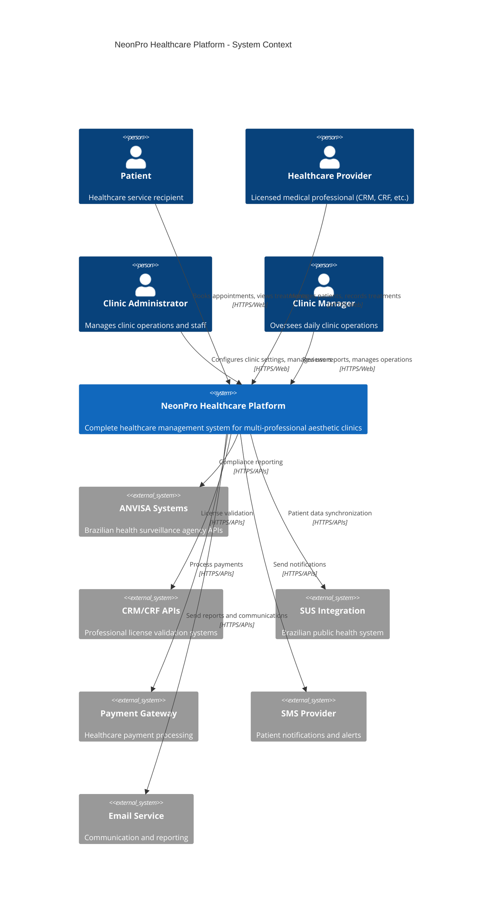
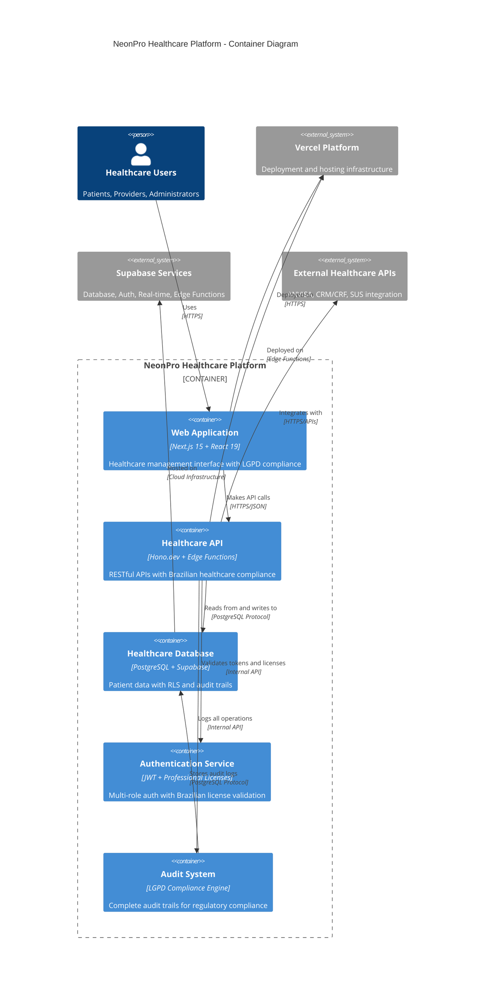
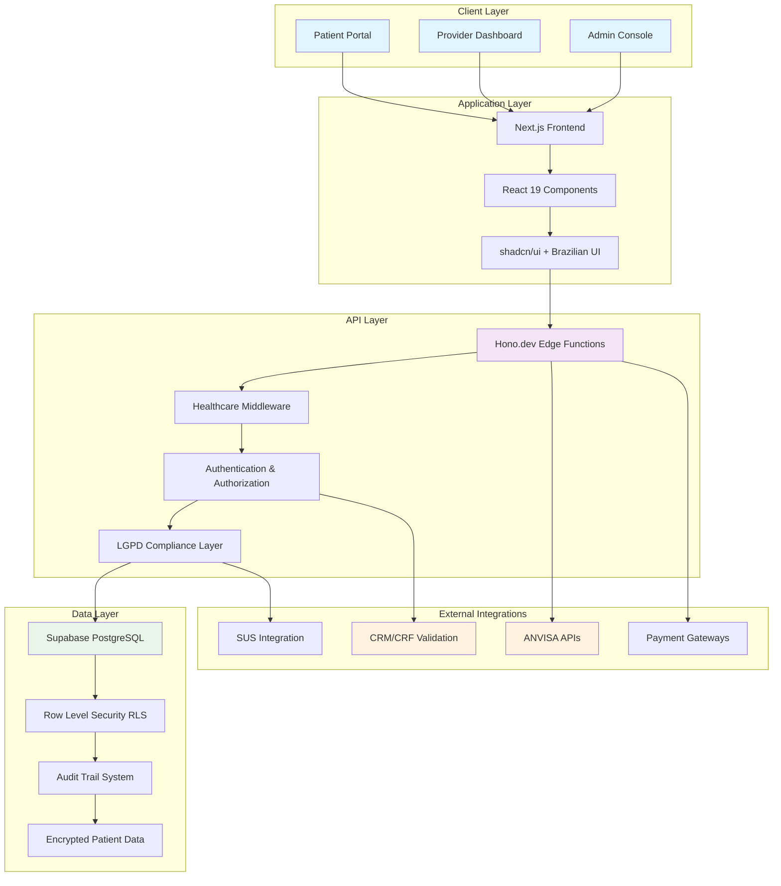
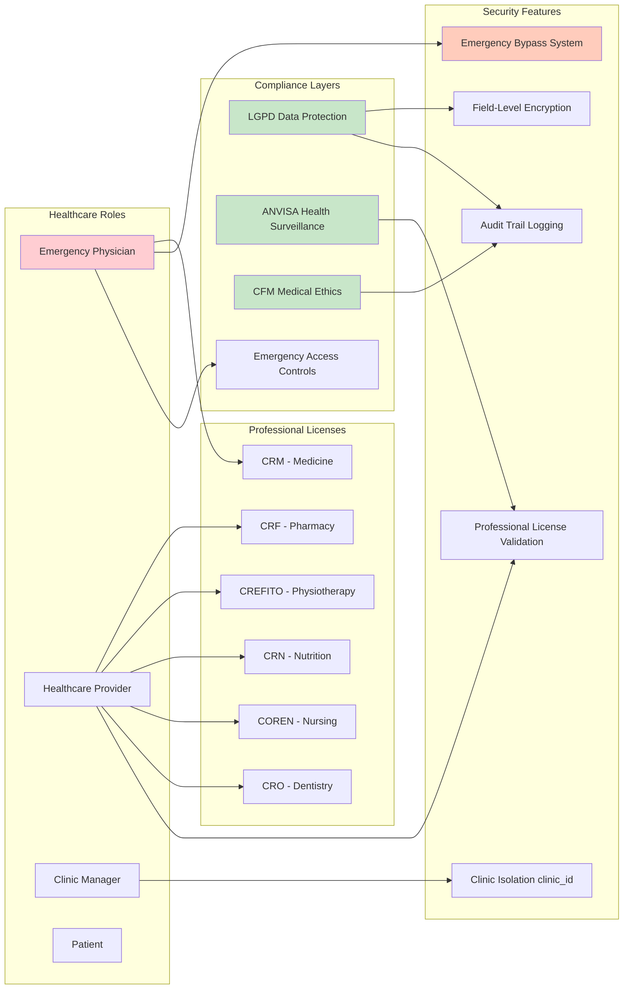
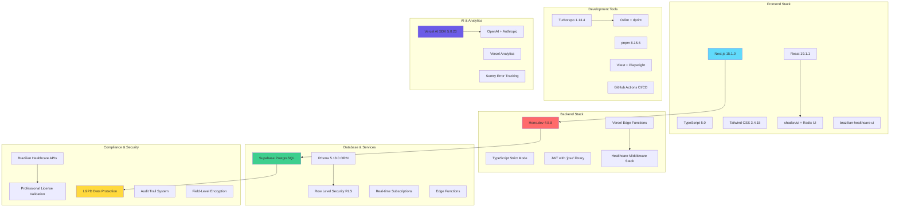

# 🏥 NeonPro Healthcare Platform - System Overview

## 📊 C4 Level 1: System Context Diagram

## 🏗️ C4 Level 2: Container Diagram

## 🔄 High-Level Data Flow

## 🏥 Healthcare-Specific Architecture

## 📱 Technology Stack Overview

---

## 📋 Architecture Principles

### 🎯 Core Design Principles
- **Healthcare First**: All components designed for medical data handling
- **LGPD Compliance**: Privacy by design with comprehensive audit trails
- **Multi-Tenant**: Clinic-based isolation with `clinic_id` everywhere
- **Professional Standards**: Brazilian healthcare regulatory compliance
- **Emergency Access**: Critical patient access with proper oversight

### 🔒 Security Architecture
- **Zero Trust**: Every request validated and logged
- **Role-Based Access**: Healthcare professional license requirements
- **Field-Level Encryption**: Sensitive patient data encrypted at rest
- **Audit Everything**: Complete trails for regulatory compliance
- **Emergency Procedures**: Licensed physician emergency access

### ⚡ Performance Architecture  
- **Edge-First**: Vercel Edge Functions for global performance
- **Real-Time**: Supabase real-time for critical notifications
- **Caching**: Multi-layer caching with healthcare data sensitivity
- **Monitoring**: Comprehensive observability with Sentry + Vercel Analytics

### 🏥 Healthcare Compliance
- **ANVISA Ready**: Medical device software classification compliance
- **CRM/CFM Integration**: Professional license validation and oversight
- **SUS Compatible**: Brazilian public health system integration ready
- **Emergency Standards**: Medical emergency access protocols