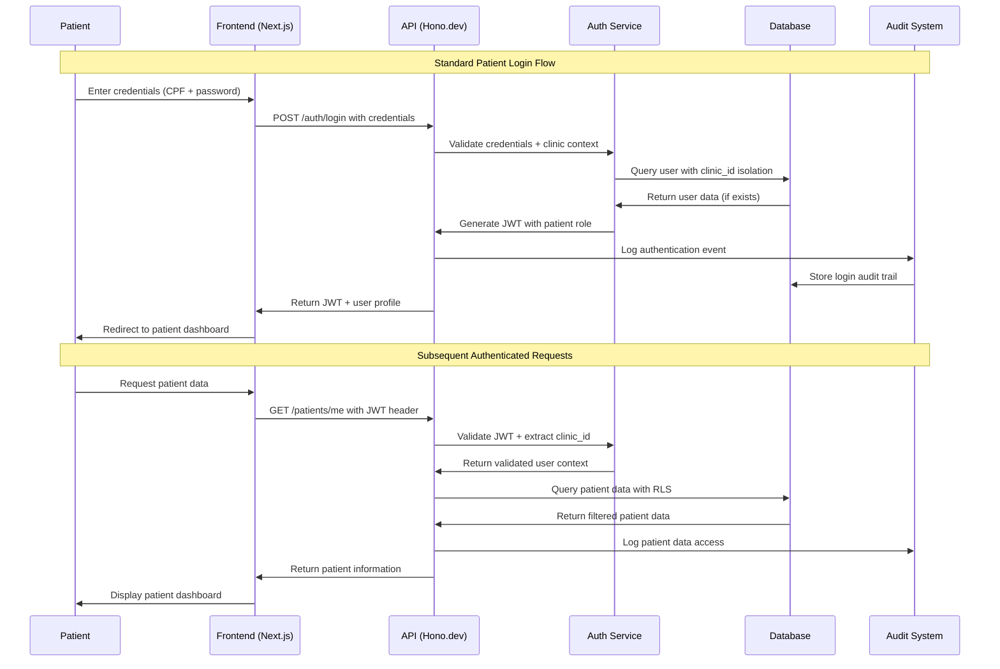
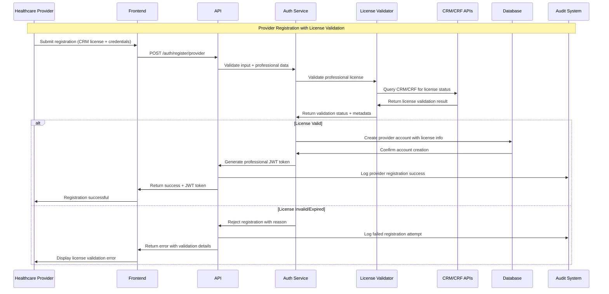
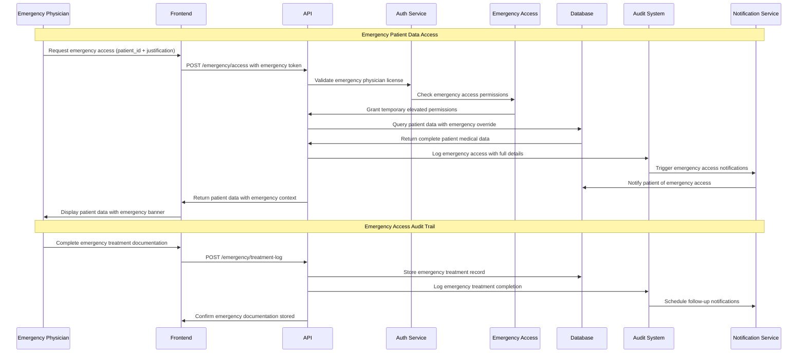
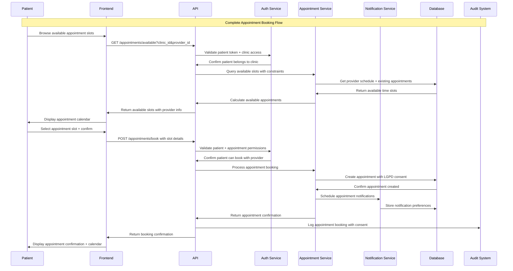
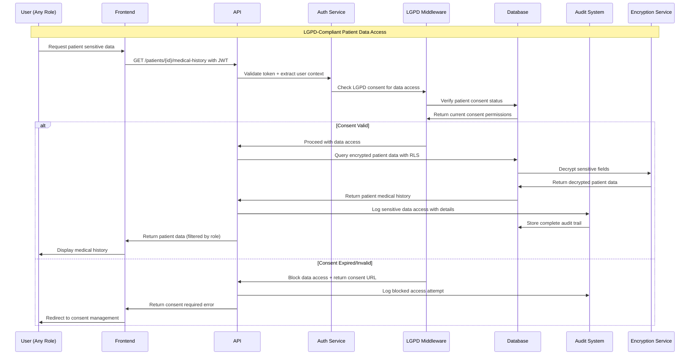
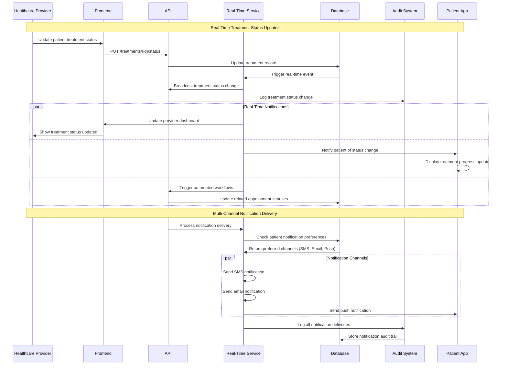

# 🔄 NeonPro Healthcare Platform - Data Flow Sequences

## 🔐 Patient Authentication & Authorization Flow



## 🏥 Healthcare Provider Professional License Validation



## 🚨 Emergency Access Protocol Flow



## 📋 Patient Appointment Booking Flow



## 🔍 LGPD Data Access & Audit Flow



## 🔄 Real-Time Patient Status Updates



---

## 🔐 Security & Compliance Data Flows

### 🛡️ Security Middleware Stack Processing Order

1. **Request ID Generation** - Unique identifier for request tracking
2. **Rate Limiting** - Healthcare-specific endpoint protection
3. **Authentication** - JWT validation with professional licenses
4. **Authorization** - Role-based access with clinic isolation
5. **LGPD Compliance** - Consent validation for patient data
6. **Input Validation** - Brazilian healthcare data format validation
7. **Audit Logging** - Complete request/response logging
8. **Response Security** - Headers and data sanitization

### 📊 Audit Trail Data Structure

```json
{
  "audit_id": "uuid",
  "timestamp": "2025-08-28T22:15:00Z",
  "user_id": "uuid",
  "clinic_id": "uuid",
  "action": "patient_data_access",
  "resource": "/patients/123/medical-history",
  "method": "GET",
  "ip_address": "client_ip",
  "user_agent": "browser_info",
  "professional_license": {
    "type": "CRM",
    "number": "12345-SP",
    "validated_at": "timestamp"
  },
  "lgpd_consent": {
    "patient_id": "uuid",
    "consent_version": "v1.2",
    "granted_at": "timestamp"
  },
  "emergency_context": {
    "is_emergency": false,
    "justification": null
  },
  "data_accessed": ["medical_history", "current_treatments"],
  "processing_time_ms": 245,
  "response_status": 200
}
```

### 🏥 Healthcare Role Permissions Matrix

| Role                | Patient Data     | Medical Records  | Emergency Access | License Required  |
| ------------------- | ---------------- | ---------------- | ---------------- | ----------------- |
| Patient             | Own Only         | Own Only         | No               | No                |
| Healthcare Provider | Clinic Patients  | Clinic Patients  | No               | Yes (CRM/CRF/etc) |
| Emergency Physician | All (with audit) | All (with audit) | Yes              | Yes (CRM)         |
| Clinic Manager      | Clinic Overview  | Summary Only     | No               | Optional          |
| Admin               | Configuration    | No               | No               | No                |
