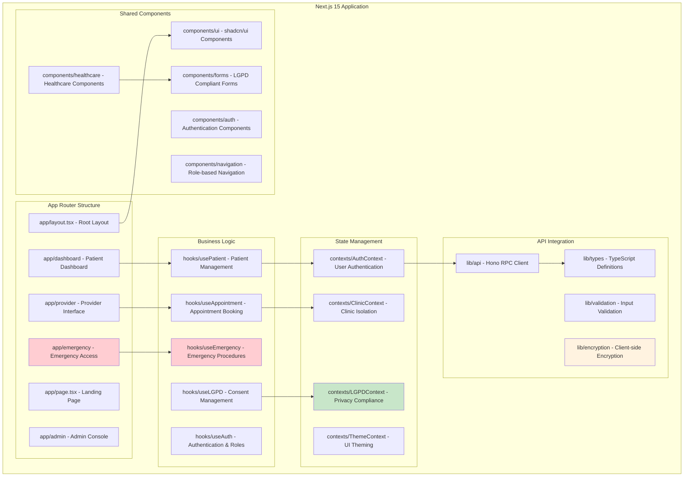
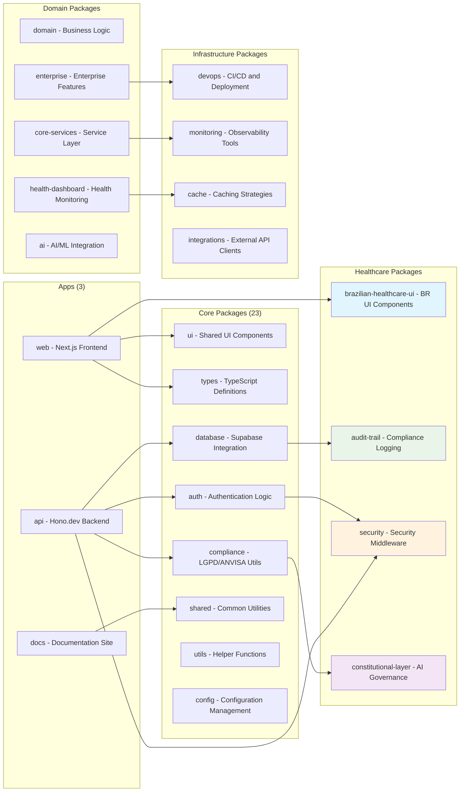
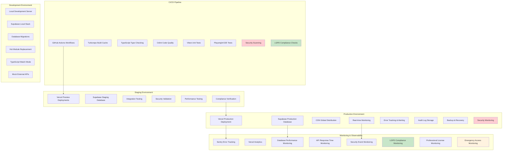
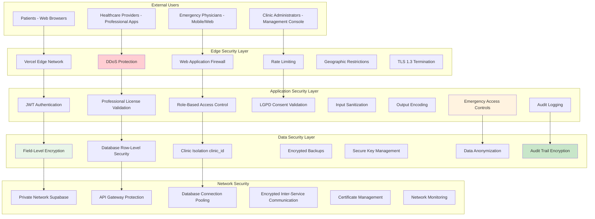

# 🏗️ NeonPro Healthcare Platform - Components & Deployment

## 🧩 C4 Level 3: Component Diagram - Healthcare API

```mermaid
C4Component
  title NeonPro Healthcare API - Component Architecture

  Container_Boundary(api, "Healthcare API Container") {
    Component(router, "Hono Router", "TypeScript", "HTTP request routing and middleware orchestration")
    Component(auth_comp, "Authentication Component", "JWT + jose", "Professional license validation and token management")
    Component(rate_limiter, "Rate Limiter", "Healthcare-aware", "Endpoint-specific rate limiting with emergency bypass")
    Component(validator, "Input Validator", "Zod + Brazilian schemas", "CPF, CNS, and healthcare data validation")
    Component(lgpd_comp, "LGPD Middleware", "Compliance engine", "Data access consent and audit logging")
    Component(encrypt_comp, "Encryption Service", "AES-256-GCM", "Field-level encryption for patient data")
    Component(audit_comp, "Audit Logger", "Structured logging", "Complete audit trails for regulatory compliance")
    Component(emergency_comp, "Emergency Access", "Professional oversight", "Licensed physician emergency procedures")
    
    Component(patient_svc, "Patient Service", "Business Logic", "Patient management with LGPD compliance")
    Component(appointment_svc, "Appointment Service", "Business Logic", "Scheduling with professional validation")
    Component(treatment_svc, "Treatment Service", "Business Logic", "Medical treatment tracking and reporting")
    Component(compliance_svc, "Compliance Service", "Regulatory", "ANVISA, CRM/CFM integration and reporting")
    
    Component(db_client, "Database Client", "Supabase SDK", "PostgreSQL connection with RLS enforcement")
    Component(external_apis, "External API Client", "HTTP Client", "Brazilian healthcare system integrations")
  }

  Rel(router, auth_comp, "Validates requests", "Internal API")
  Rel(router, rate_limiter, "Checks limits", "Internal API")
  Rel(auth_comp, validator, "Validates input", "Internal API")
  Rel(validator, lgpd_comp, "Checks consent", "Internal API")
  Rel(lgpd_comp, encrypt_comp, "Encrypts data", "Internal API")
  Rel(router, audit_comp, "Logs operations", "Internal API")
  Rel(auth_comp, emergency_comp, "Emergency access", "Internal API")

  Rel(router, patient_svc, "Routes requests", "Internal API")
  Rel(router, appointment_svc, "Routes requests", "Internal API")
  Rel(router, treatment_svc, "Routes requests", "Internal API")
  Rel(router, compliance_svc, "Routes requests", "Internal API")

  Rel(patient_svc, db_client, "Queries data", "SQL")
  Rel(appointment_svc, db_client, "Queries data", "SQL") 
  Rel(treatment_svc, db_client, "Queries data", "SQL")
  Rel(compliance_svc, external_apis, "Integrates APIs", "HTTPS")

  UpdateLayoutConfig($c4ShapeInRow="3", $c4BoundaryInRow="1")
```



## 📱 Frontend Component Architecture



## 🏗️ Monorepo Package Architecture



## ☁️ Deployment Architecture

```mermaid
C4Deployment
  title NeonPro Healthcare Platform - Production Deployment

  Deployment_Node(cdn, "Vercel Edge Network", "Global CDN") {
    Deployment_Node(edge_locations, "Edge Locations", "Worldwide") {
      Container(static_assets, "Static Assets", "CSS, JS, Images", "Cached static content")
      Container(edge_functions, "Edge Functions", "Hono.dev Runtime", "API endpoints at the edge")
    }
  }

  Deployment_Node(vercel_platform, "Vercel Platform", "Serverless Infrastructure") {
    Deployment_Node(frontend_runtime, "Next.js Runtime", "Node.js 18+") {
      Container(nextjs_app, "NeonPro Web App", "Next.js 15", "Healthcare management interface")
    }
    
    Deployment_Node(api_runtime, "Hono Runtime", "Edge Runtime") {
      Container(healthcare_api, "Healthcare API", "Hono.dev 4.5.8", "RESTful APIs with Brazilian compliance")
    }
  }

  Deployment_Node(supabase_cloud, "Supabase Cloud", "Database Infrastructure") {
    Deployment_Node(db_cluster, "PostgreSQL Cluster", "High Availability") {
      ContainerDb(primary_db, "Primary Database", "PostgreSQL 15", "Patient data with RLS")
      ContainerDb(replica_db, "Read Replicas", "PostgreSQL 15", "Query performance optimization")
    }
    
    Deployment_Node(supabase_services, "Supabase Services", "Managed Services") {
      Container(auth_service, "Auth Service", "GoTrue", "User authentication and sessions")
      Container(realtime_service, "Realtime Service", "WebSocket", "Real-time data synchronization")
      Container(edge_functions_sb, "Database Functions", "PostgreSQL", "Database-level business logic")
    }
  }

  Deployment_Node(external_services, "External Services", "Third-party Integrations") {
    System_Ext(anvisa_apis, "ANVISA APIs", "Brazilian health surveillance integration")
    System_Ext(crm_systems, "CRM/CRF Systems", "Professional license validation")
    System_Ext(payment_gateways, "Payment Systems", "Healthcare payment processing")
    System_Ext(notification_services, "Notification Services", "SMS, Email, Push notifications")
  }

  Deployment_Node(monitoring_stack, "Observability Stack", "Monitoring & Logging") {
    Container(sentry, "Sentry", "Error Tracking", "Application error monitoring and alerting")
    Container(vercel_analytics, "Vercel Analytics", "Performance", "Real user monitoring and performance metrics")
    Container(audit_storage, "Audit Storage", "Long-term Storage", "LGPD compliance audit logs")
  }

  Rel(cdn, vercel_platform, "Routes traffic", "HTTPS")
  Rel(nextjs_app, healthcare_api, "API calls", "HTTPS/JSON")
  Rel(healthcare_api, primary_db, "Database queries", "PostgreSQL Protocol")
  Rel(primary_db, replica_db, "Replication", "Streaming Replication")
  Rel(healthcare_api, auth_service, "Authentication", "Internal API")
  Rel(nextjs_app, realtime_service, "Real-time updates", "WebSocket")
  
  Rel(healthcare_api, anvisa_apis, "Compliance reporting", "HTTPS")
  Rel(healthcare_api, crm_systems, "License validation", "HTTPS")
  Rel(healthcare_api, payment_gateways, "Payment processing", "HTTPS")
  Rel(healthcare_api, notification_services, "Send notifications", "HTTPS")
  
  Rel(nextjs_app, sentry, "Error reporting", "HTTPS")
  Rel(healthcare_api, sentry, "Error reporting", "HTTPS")
  Rel(nextjs_app, vercel_analytics, "Performance data", "HTTPS")
  Rel(healthcare_api, audit_storage, "Audit logs", "HTTPS")

  UpdateLayoutConfig($c4ShapeInRow="2", $c4BoundaryInRow="1")
```

## 🔧 Infrastructure Components



## 🌐 Network Architecture & Security



---

## 🔧 Component Dependencies & Data Flow

### 📦 Package Dependency Graph

```
┌─ apps/web (Next.js Frontend)
│  ├─ @neonpro/ui (Shared Components)
│  ├─ @neonpro/types (TypeScript Definitions)
│  ├─ @neonpro/brazilian-healthcare-ui (BR Components)
│  ├─ @neonpro/auth (Authentication)
│  └─ @neonpro/compliance (LGPD Utils)
│
├─ apps/api (Hono.dev Backend)  
│  ├─ @neonpro/database (Supabase Client)
│  ├─ @neonpro/auth (JWT Validation)
│  ├─ @neonpro/security (Middleware)
│  ├─ @neonpro/compliance (LGPD Engine)
│  ├─ @neonpro/audit-trail (Logging)
│  └─ @neonpro/integrations (External APIs)
│
└─ shared packages
   ├─ @neonpro/types (Shared TypeScript)
   ├─ @neonpro/utils (Common Utilities)
   ├─ @neonpro/config (Configuration)
   └─ @neonpro/domain (Business Logic)
```

### 🏥 Healthcare Component Interactions

```
Patient Request → Rate Limiter → JWT Auth → License Validation → 
LGPD Consent → Input Validation → Business Logic → Database (RLS) → 
Audit Logger → Response Encryption → Client
```

### 🔐 Security Component Stack

1. **Network Layer**: TLS 1.3, DDoS protection, WAF
2. **Authentication Layer**: JWT with professional licenses
3. **Authorization Layer**: RBAC with clinic isolation
4. **Application Layer**: Input validation, output encoding
5. **Data Layer**: Field encryption, RLS, audit trails
6. **Monitoring Layer**: Security events, anomaly detection
