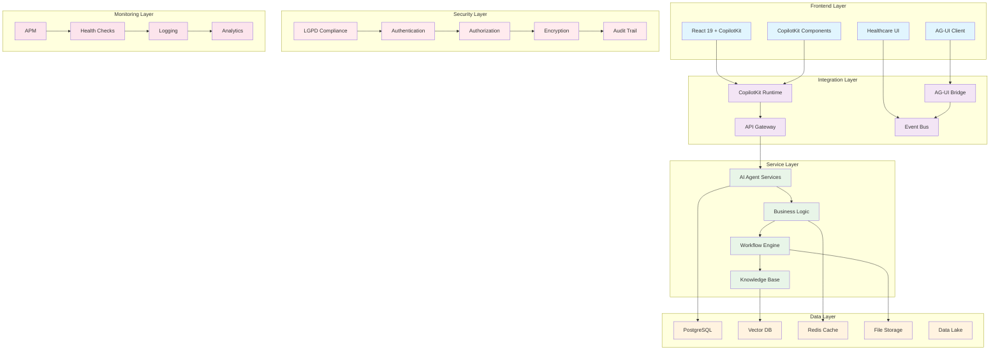
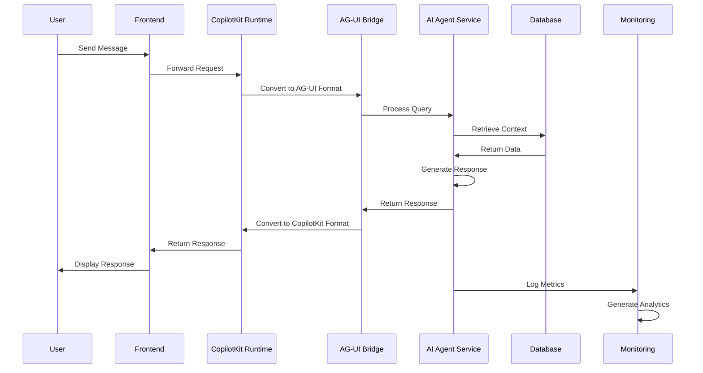
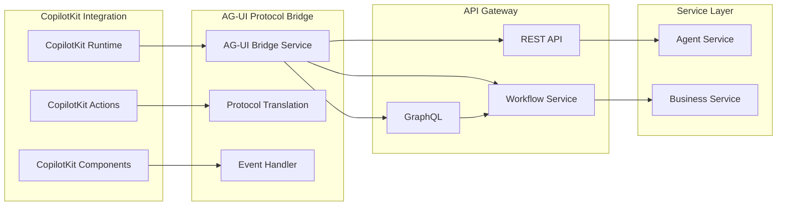
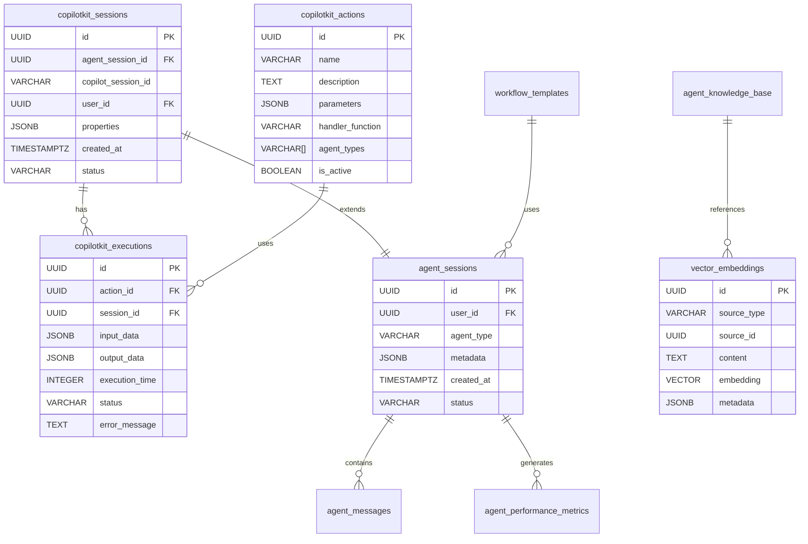
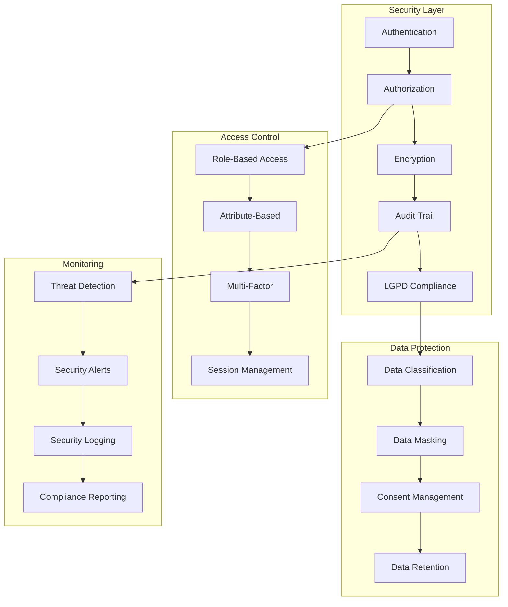
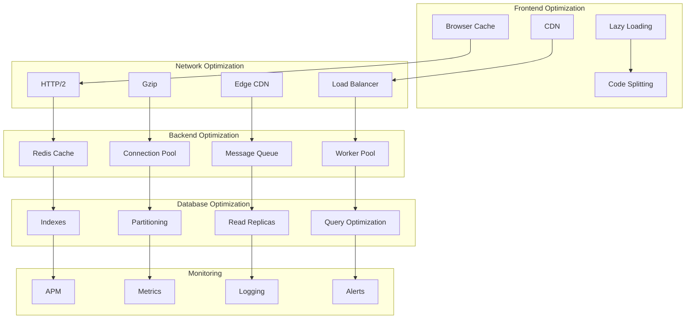
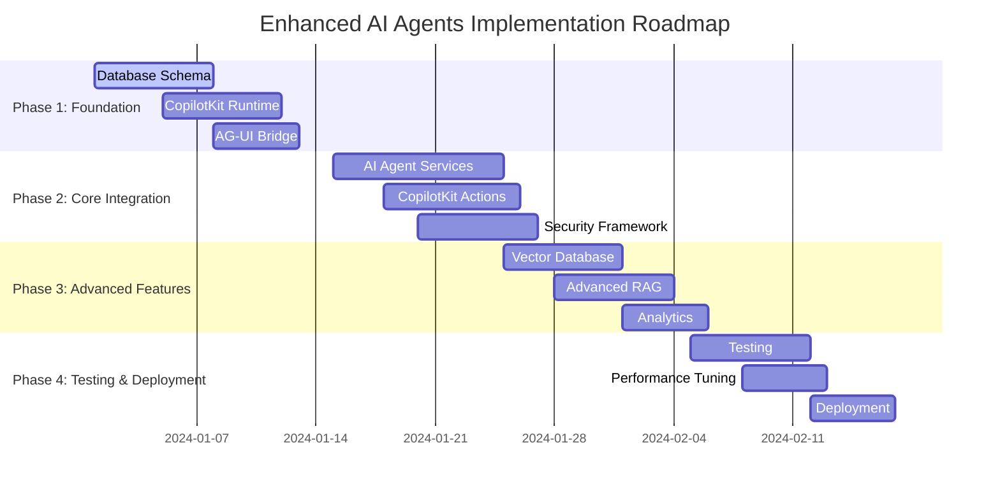
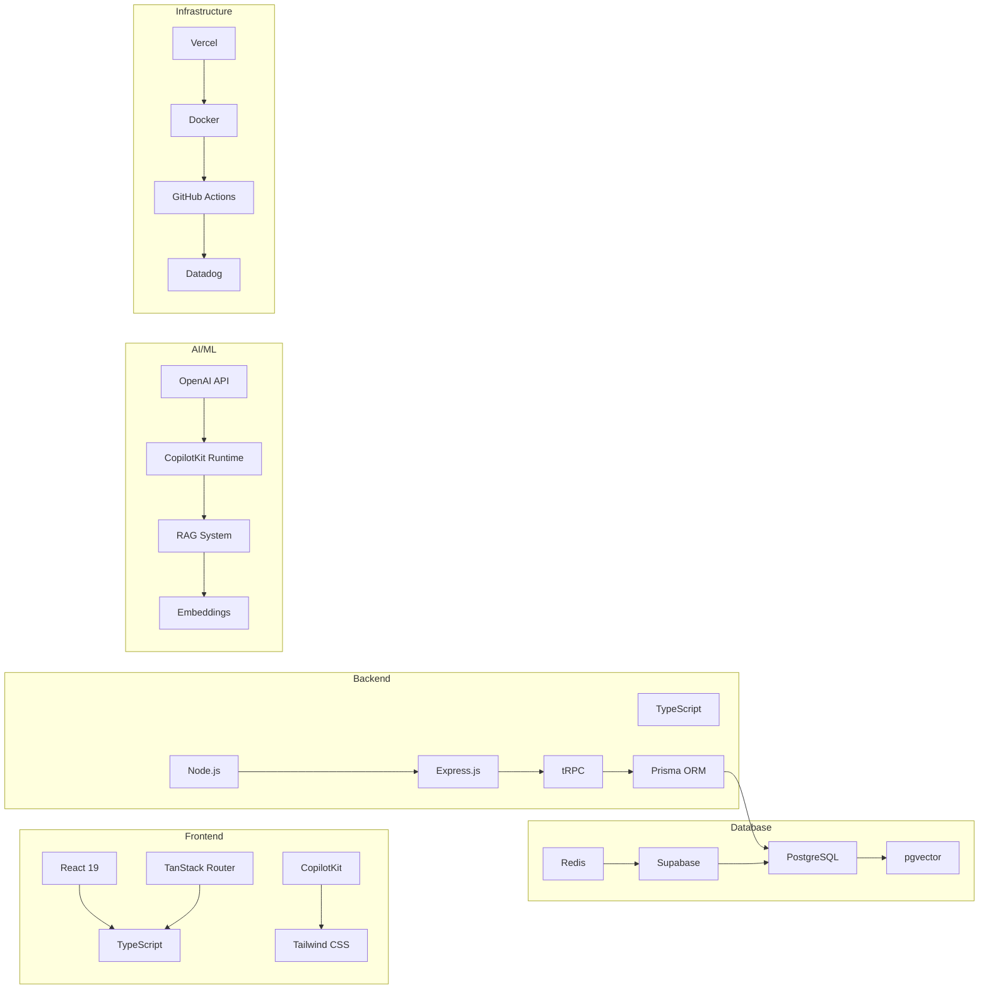
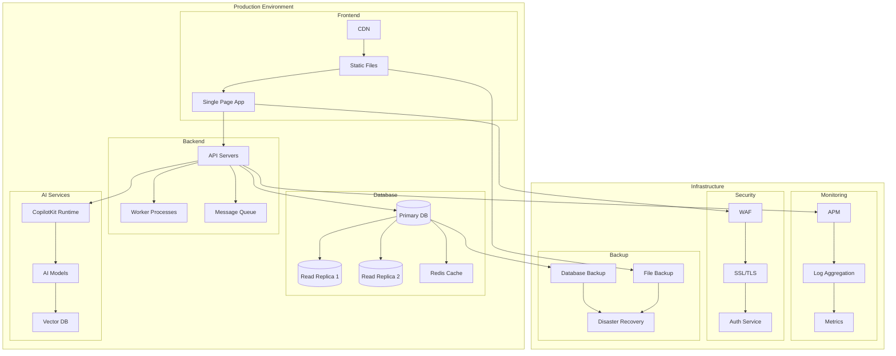

# Enhanced AI Agents Architecture Diagram

## High-Level Architecture Overview

## Data Flow Architecture

## Integration Layer Details

## Database Schema Architecture

## Security Architecture

## Performance Architecture

## Implementation Roadmap Timeline

## Component Interaction Matrix

| Component      | Frontend | Integration | Service | Data | Security | Monitoring |
| -------------- | -------- | ----------- | ------- | ---- | -------- | ---------- |
| React UI       | ●        | ●           | ○       | ○    | ○        | ○          |
| CopilotKit     | ●        | ●           | ●       | ○    | ○        | ○          |
| AG-UI Bridge   | ●        | ●           | ●       | ○    | ●        | ○          |
| Agent Service  | ○        | ●           | ●       | ●    | ●        | ●          |
| Database       | ○        | ○           | ●       | ●    | ●        | ○          |
| Security Layer | ○        | ○           | ●       | ○    | ●        | ●          |
| Monitoring     | ○        | ○           | ●       | ○    | ○        | ●          |

● = Direct Interaction\
○ = Indirect Interaction\
○ = No Direct Interaction

## Technology Stack

## Deployment Architecture

This comprehensive architecture diagram provides a visual representation of the enhanced AI agents system, showing component relationships, data flows, and deployment strategies.
