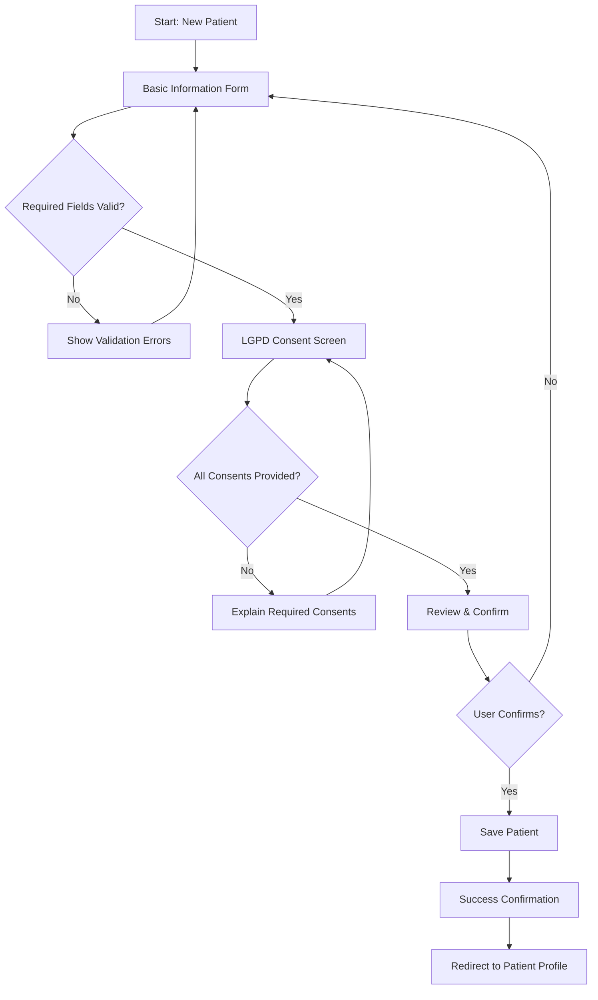
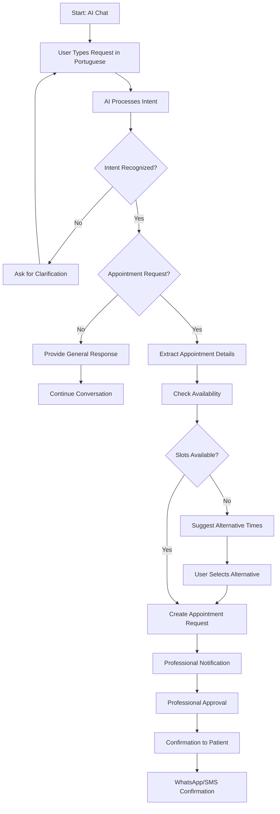
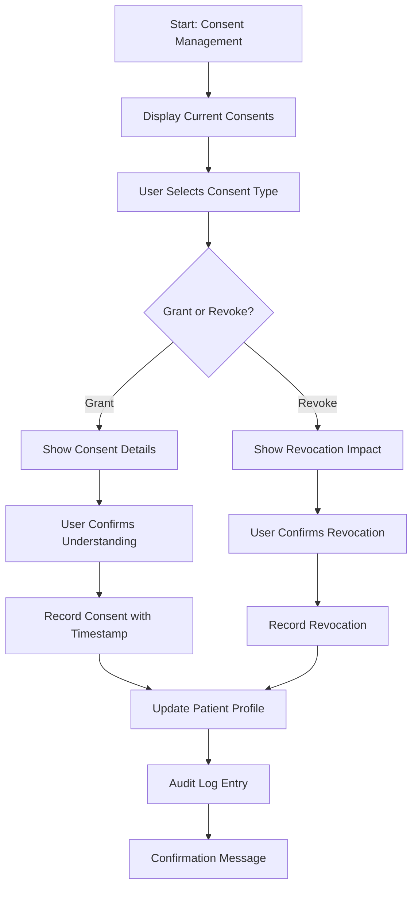

# NeonPro UI/UX Specification

## Introduction

This document defines the user experience goals, information architecture, user flows, and visual design specifications for **NeonPro AI-First Advanced Aesthetic Platform**'s user interface. It serves as the foundation for visual design and frontend development, ensuring a cohesive and user-centered experience for Brazilian aesthetic clinic management.

**Target Audience**: UI/UX designers, frontend developers, product managers\
**Focus**: Brazilian aesthetic clinics with Portuguese-optimized user experience\
**Compliance**: LGPD, ANVISA, WCAG 2.1 AA accessibility standards\
**Platform**: Web-first with mobile responsiveness

### Overall UX Goals & Principles

#### Target User Personas

**Primary Persona - Marina Silva (Aesthetic Professional)**

- **Age**: 35-45 years
- **Role**: Technical aesthetic professional (dermatologist, aesthetician, nurse)
- **Tech Comfort**: 6/10 (moderate)
- **Goals**: Efficient patient management, reduced administrative burden, compliance assurance
- **Pain Points**: Complex software interfaces, time-consuming data entry, compliance uncertainty
- **Needs**: Zero workflow disruption, <5% performance impact, 60% admin time reduction

**Secondary Persona - Carlos Santos (Clinic Administrator)**

- **Age**: 28-40 years
- **Role**: Clinic coordinator/administrator
- **Tech Comfort**: 7/10 (good)
- **Goals**: Operational efficiency, compliance monitoring, staff coordination
- **Pain Points**: Manual scheduling conflicts, compliance tracking, communication gaps
- **Needs**: Real-time visibility, automated compliance, streamlined communication

**Tertiary Persona - Ana Costa (Patient)**

- **Age**: 25-55 years
- **Role**: Aesthetic clinic patient
- **Tech Comfort**: 5/10 (basic to moderate)
- **Goals**: Easy appointment booking, clear communication, treatment information
- **Pain Points**: Complex booking processes, unclear procedures, communication delays
- **Needs**: Simple interfaces, Portuguese language, mobile accessibility

#### Usability Goals

- **Ease of learning**: New users can complete core tasks within 5 minutes of first use
- **Efficiency of use**: Power users can complete frequent tasks with minimal clicks (≤3 clicks for common actions)
- **Error prevention**: Clear validation and confirmation for destructive actions with Portuguese messaging
- **Memorability**: Infrequent users can return without relearning interface patterns
- **Accessibility**: Full WCAG 2.1 AA compliance with Portuguese screen reader optimization

#### Design Principles

1. **Clareza sobre inteligência** - Prioritize clear communication over aesthetic innovation
2. **Revelação progressiva** - Show only what's needed, when it's needed
3. **Padrões consistentes** - Use familiar UI patterns throughout the application
4. **Feedback imediato** - Every action should have a clear, immediate response
5. **Acessível por padrão** - Design for all users from the start, including Portuguese language support

### Change Log

| Date       | Version | Description                                          | Author           |
| ---------- | ------- | ---------------------------------------------------- | ---------------- |
| 2025-09-06 | 2.0.0   | Enhanced with UI/UX specification template structure | AI IDE Agent     |
| 2024-12-01 | 1.0.0   | Initial frontend development guide                   | Development Team |

## Information Architecture (IA)

### Site Map / Screen Inventory

```mermaid
graph TD
    A[Landing Page] --> B[Authentication]
    B --> C[Dashboard Principal]
    
    C --> D[Gestão de Pacientes]
    D --> D1[Lista de Pacientes]
    D --> D2[Perfil do Paciente]
    D --> D3[Novo Paciente]
    D --> D4[Histórico Médico]
    
    C --> E[Agendamentos]
    E --> E1[Calendário]
    E --> E2[Novo Agendamento]
    E --> E3[Detalhes do Agendamento]
    E --> E4[Lista de Espera]
    
    C --> F[Chat IA Universal]
    F --> F1[Interface de Chat]
    F --> F2[Histórico de Sessões]
    F --> F3[Configurações de IA]
    
    C --> G[Analytics & Relatórios]
    G --> G1[Dashboard de Performance]
    G --> G2[Previsão Anti-No-Show]
    G --> G3[Relatórios Financeiros]
    G --> G4[Métricas de Satisfação]
    
    C --> H[Conformidade LGPD]
    H --> H1[Centro de Consentimentos]
    H --> H2[Logs de Auditoria]
    H --> H3[Exportação de Dados]
    H --> H4[Configurações de Privacidade]
    
    C --> I[Configurações]
    I --> I1[Perfil Profissional]
    I --> I2[Configurações da Clínica]
    I --> I3[Integrações]
    I --> I4[Notificações]
```



### Navigation Structure

**Primary Navigation**: Sidebar navigation with collapsible sections for main functional areas

**Secondary Navigation**: Breadcrumb navigation for deep hierarchies and contextual tabs for related content

**Breadcrumb Strategy**: Always show current location with clickable path back to parent sections

## User Flows

### Patient Registration Flow

**User Goal**: Register new patient with LGPD compliance

**Entry Points**: Dashboard → Patients → New Patient button, AI Chat suggestion, Quick action menu

**Success Criteria**: Patient successfully registered with all required consents obtained

#### Flow Diagram



#### Edge Cases & Error Handling:

- Duplicate CPF detection with merge option
- Network connectivity issues with offline form saving
- Incomplete consent handling with clear explanations
- Data validation errors with Portuguese error messages

**Notes**: Form auto-saves progress every 30 seconds to prevent data loss

### AI Chat Appointment Booking Flow

**User Goal**: Book appointment through natural language conversation in Portuguese

**Entry Points**: Dashboard AI Chat widget, dedicated AI Chat page, patient profile chat button

**Success Criteria**: Appointment successfully scheduled with professional confirmation

#### Flow Diagram



#### Edge Cases & Error Handling:

- Ambiguous procedure requests with clarification prompts
- No availability with waitlist option
- Professional unavailable with alternative suggestions
- PHI detection with automatic sanitization

**Notes**: All conversations logged for compliance with PHI protection

### LGPD Consent Management Flow

**User Goal**: Manage patient data consents in compliance with LGPD

**Entry Points**: Patient profile, compliance center, automated consent renewal prompts

**Success Criteria**: Consent status updated with proper audit trail

#### Flow Diagram



#### Edge Cases & Error Handling:

- Required consent revocation with service impact explanation
- Consent expiration with renewal prompts
- Bulk consent updates with individual confirmation
- Legal basis changes with automatic updates

**Notes**: All consent changes trigger immediate audit log entries## Visual Design

### Design System Foundation

#### Color Palette

**Primary Colors** (Healthcare Trust & Professionalism)

```css
:root {
  /* Primary - Medical Blue */
  --primary-50: #eff6ff;
  --primary-100: #dbeafe;
  --primary-500: #3b82f6; /* Main brand color */
  --primary-500-rgb: 59, 130, 246; /* RGB for rgba() usage */
  --primary-600: #2563eb;
  --primary-900: #1e3a8a;

  /* Secondary - Aesthetic Gold */
  --secondary-50: #fffbeb;
  --secondary-100: #fef3c7;
  --secondary-500: #f59e0b; /* Accent color */
  --secondary-600: #d97706;
  --secondary-900: #92400e;

  /* Success - Brazilian Green */
  --success-50: #f0fdf4;
  --success-500: #22c55e;
  --success-600: #16a34a;

  /* Warning - Attention Orange */
  --warning-50: #fffbeb;
  --warning-500: #f59e0b;
  --warning-600: #d97706;

  /* Error - Medical Alert Red */
  --error-50: #fef2f2;
  --error-500: #ef4444;
  --error-600: #dc2626;

  /* Neutral - Professional Grays */
  --neutral-50: #f9fafb;
  --neutral-100: #f3f4f6;
  --neutral-200: #e5e7eb;
  --neutral-300: #d1d5db;
  --neutral-400: #9ca3af;
  --neutral-500: #6b7280;
  --neutral-600: #4b5563;
  --neutral-700: #374151;
  --neutral-800: #1f2937;
  --neutral-900: #111827;
}
```

**Color Usage Guidelines**:

- Primary blue for main actions, navigation, and trust elements
- Secondary gold for premium features and highlights
- Success green for confirmations and positive states
- Warning orange for caution and attention-needed states
- Error red for critical alerts and validation errors
- Neutral grays for text, borders, and backgrounds

#### Typography

**Font Stack**: Inter (primary), system fonts fallback for Brazilian Portuguese optimization

```css
/* Heading Scale */
.text-h1 {
  font-size: 2.25rem;
  font-weight: 700;
  line-height: 1.2;
} /* 36px */
.text-h2 {
  font-size: 1.875rem;
  font-weight: 600;
  line-height: 1.3;
} /* 30px */
.text-h3 {
  font-size: 1.5rem;
  font-weight: 600;
  line-height: 1.4;
} /* 24px */
.text-h4 {
  font-size: 1.25rem;
  font-weight: 500;
  line-height: 1.4;
} /* 20px */
.text-h5 {
  font-size: 1.125rem;
  font-weight: 500;
  line-height: 1.5;
} /* 18px */

/* Body Text Scale */
.text-lg {
  font-size: 1.125rem;
  line-height: 1.6;
} /* 18px - Large body */
.text-base {
  font-size: 1rem;
  line-height: 1.6;
} /* 16px - Default body */
.text-sm {
  font-size: 0.875rem;
  line-height: 1.5;
} /* 14px - Small text */
.text-xs {
  font-size: 0.75rem;
  line-height: 1.4;
} /* 12px - Captions */

/* Special Purpose */
.text-display {
  font-size: 3rem;
  font-weight: 800;
  line-height: 1.1;
} /* 48px - Hero text */
.text-mono {
  font-family: "JetBrains Mono", monospace;
} /* Code/IDs */
```

**Typography Guidelines**:

- Use sentence case for buttons and labels (not title case)
- Maintain 1.6 line-height for body text readability
- Ensure minimum 16px font size for mobile accessibility
- Use font-weight 500+ for Portuguese text clarity

#### Spacing & Layout

**Spacing Scale** (8px base unit for consistent rhythm)

```css
:root {
  --space-1: 0.25rem; /* 4px */
  --space-2: 0.5rem; /* 8px */
  --space-3: 0.75rem; /* 12px */
  --space-4: 1rem; /* 16px */
  --space-5: 1.25rem; /* 20px */
  --space-6: 1.5rem; /* 24px */
  --space-8: 2rem; /* 32px */
  --space-10: 2.5rem; /* 40px */
  --space-12: 3rem; /* 48px */
  --space-16: 4rem; /* 64px */
  --space-20: 5rem; /* 80px */
}
```

**Layout Grid**:

- 12-column grid system with 24px gutters
- Maximum content width: 1200px
- Sidebar width: 280px (collapsed: 64px)
- Mobile breakpoints: 320px, 768px, 1024px, 1200px

#### Component Specifications

**Buttons**

```css
/* Primary Button */
.btn-primary {
  background: var(--primary-500);
  color: white;
  padding: 12px 24px;
  border-radius: 8px;
  font-weight: 500;
  min-height: 44px; /* Touch target */
  transition: all 0.2s ease;
}

.btn-primary:hover {
  background: var(--primary-600);
  transform: translateY(-1px);
}

/* Secondary Button */
.btn-secondary {
  background: transparent;
  color: var(--primary-500);
  border: 1px solid var(--primary-500);
  padding: 12px 24px;
  border-radius: 8px;
}

/* Destructive Button */
.btn-destructive {
  background: var(--error-500);
  color: white;
  padding: 12px 24px;
  border-radius: 8px;
}
```

**Form Elements**

```css
/* Input Fields */
.input {
  border: 1px solid var(--neutral-300);
  border-radius: 8px;
  padding: 12px 16px;
  font-size: 16px; /* Prevents zoom on iOS */
  min-height: 44px;
  transition: border-color 0.2s ease;
}

.input:focus {
  border-color: var(--primary-500);
  box-shadow: 0 0 0 3px rgba(var(--primary-500-rgb), 0.2);
  outline: none;
}

.input:invalid {
  border-color: var(--error-500);
}

/* Labels */
.label {
  font-weight: 500;
  color: var(--neutral-700);
  margin-bottom: 6px;
  display: block;
}

/* Error Messages */
.error-message {
  color: var(--error-600);
  font-size: 14px;
  margin-top: 4px;
}
```

**Cards & Containers**

```css
.card {
  background: white;
  border: 1px solid var(--neutral-200);
  border-radius: 12px;
  padding: 24px;
  box-shadow: 0 1px 3px rgba(0, 0, 0, 0.1);
}

.card-header {
  border-bottom: 1px solid var(--neutral-200);
  padding-bottom: 16px;
  margin-bottom: 16px;
}
```

### Responsive Design

#### Breakpoint Strategy

| Breakpoint | Width           | Target Device | Layout Changes                    |
| ---------- | --------------- | ------------- | --------------------------------- |
| Mobile     | 320px - 767px   | Smartphones   | Single column, stacked navigation |
| Tablet     | 768px - 1023px  | Tablets       | Two columns, collapsible sidebar  |
| Desktop    | 1024px - 1199px | Small laptops | Three columns, full sidebar       |
| Large      | 1200px+         | Large screens | Four columns, expanded content    |

#### Mobile-First Approach

**Navigation**:

- Mobile: Bottom tab navigation with 4 primary sections
- Tablet: Collapsible sidebar with icon + text
- Desktop: Full sidebar with nested navigation

**Content Layout**:

- Mobile: Single column with full-width cards
- Tablet: Two-column grid with responsive cards
- Desktop: Three-column layout with fixed sidebar

**Touch Targets**:

- Minimum 44px height and width for all interactive elements
- 8px minimum spacing between touch targets
- Swipe gestures for mobile navigation

#### Accessibility Considerations

**WCAG 2.1 AA Compliance**:

- Color contrast ratio ≥ 4.5:1 for normal text
- Color contrast ratio ≥ 3:1 for large text
- Focus indicators visible and high contrast
- All interactive elements keyboard accessible

**Portuguese Language Support**:

- Screen reader optimization for Portuguese
- Proper lang attributes (lang="pt-BR")
- Cultural date/time formats (DD/MM/YYYY)
- Brazilian currency formatting (R$ 1.234,56)

**Assistive Technology**:

- ARIA labels for all interactive elements
- Semantic HTML structure with proper headings
- Skip navigation links for keyboard users
- Alternative text for all images and icons

## Component Library

### Core Components

#### PatientCard Component

**Purpose**: Display patient information with privacy controls and quick actions

**Usage**: Patient lists, search results, dashboard widgets

**Props**:

```typescript
interface PatientCardProps {
  patient: Patient;
  userRole: UserRole;
  showSensitiveData?: boolean;
  onViewDetails: (patientId: string) => void;
  onScheduleAppointment?: (patientId: string) => void;
  className?: string;
}
```

**Visual Specifications**:

- Card height: 120px minimum
- Avatar: 48px circle with initials fallback
- Privacy mask for CPF/RG based on user role
- Risk indicator badge (low/medium/high)
- LGPD compliance indicator

**States**:

- Default: Standard patient information display
- Hover: Subtle elevation and action button reveal
- Loading: Skeleton placeholder with shimmer effect
- Error: Error state with retry option

#### AppointmentScheduler Component

**Purpose**: Interactive calendar for appointment booking and management

**Usage**: Appointment booking, professional schedule management

**Props**:

```typescript
interface AppointmentSchedulerProps {
  professionalId?: string;
  selectedDate?: Date;
  availableSlots: TimeSlot[];
  onSlotSelect: (slot: TimeSlot) => void;
  onDateChange: (date: Date) => void;
  view: "day" | "week" | "month";
  className?: string;
}
```

**Visual Specifications**:

- Calendar grid with clear time slots
- Color-coded appointment types
- Drag-and-drop support for rescheduling
- Mobile-optimized touch interactions
- Real-time availability updates

#### AIChatInterface Component

**Purpose**: Universal AI chat interface with Portuguese optimization

**Usage**: Patient assistance, appointment booking, general inquiries

**Props**:

```typescript
interface AIChatInterfaceProps {
  sessionId?: string;
  context: "general" | "appointment" | "patient";
  onMessageSend: (message: string) => void;
  onActionSuggestion: (action: SuggestedAction) => void;
  className?: string;
}
```

**Visual Specifications**:

- Chat bubble design with clear sender identification
- Typing indicators and message status
- Quick action buttons for common requests
- Voice input support for accessibility
- Message history with search functionality

### Form Components

#### PatientForm Component

**Purpose**: Comprehensive patient registration with LGPD compliance

**Features**:

- Progressive disclosure of form sections
- Real-time validation with Portuguese error messages
- LGPD consent management integrated
- Auto-save functionality
- Accessibility optimized

#### ConsentManager Component

**Purpose**: LGPD consent collection and management interface

**Features**:

- Clear consent explanations in Portuguese
- Granular consent controls
- Consent history tracking
- Legal basis documentation
- Withdrawal process guidance

### Layout Components

#### DashboardLayout Component

**Purpose**: Main application layout with navigation and content areas

**Features**:

- Responsive sidebar navigation
- Breadcrumb navigation
- User profile dropdown
- Notification center
- Quick action menu

#### AuthLayout Component

**Purpose**: Authentication pages layout with branding

**Features**:

- Centered form design
- Progressive enhancement
- Error handling
- Accessibility optimized
- Mobile responsive

## Interaction Design

### Micro-interactions

**Button Interactions**:

- Hover: Subtle elevation (2px) with color transition
- Click: Brief scale animation (0.95x) with haptic feedback
- Loading: Spinner with button text change
- Success: Checkmark animation with color change

**Form Interactions**:

- Focus: Border color change with subtle glow
- Validation: Real-time feedback with smooth error message appearance
- Success: Green checkmark with slide-in animation
- Auto-save: Subtle indicator with fade-in/out

**Navigation Interactions**:

- Page transitions: Smooth slide animations
- Sidebar toggle: Smooth width animation with icon rotation
- Tab switching: Underline animation with content fade

### Animation Guidelines

**Duration Standards**:

- Micro-interactions: 150-200ms
- Page transitions: 300-400ms
- Complex animations: 500-600ms maximum

**Easing Functions**:

- UI feedback: ease-out for natural feel
- Entrances: ease-out for welcoming effect
- Exits: ease-in for smooth departure
- Bounces: cubic-bezier for playful interactions

**Performance Considerations**:

- Use transform and opacity for smooth animations
- Avoid animating layout properties
- Respect prefers-reduced-motion setting
- Optimize for 60fps on mobile devices

### Feedback Systems

**Success Feedback**:

- Toast notifications for completed actions
- Inline success messages for form submissions
- Progress indicators for multi-step processes
- Confirmation dialogs for critical actions

**Error Feedback**:

- Inline validation with clear error messages
- Toast notifications for system errors
- Error pages with helpful recovery suggestions
- Contextual help for complex errors

**Loading States**:

- Skeleton screens for content loading
- Progress bars for file uploads
- Spinners for quick actions
- Shimmer effects for list items

## Accessibility

### WCAG 2.1 AA Compliance

**Perceivable**:

- Color contrast ratios meet minimum standards
- Text can be resized up to 200% without loss of functionality
- Images have appropriate alternative text
- Videos have captions and transcripts

**Operable**:

- All functionality available via keyboard
- No content flashes more than 3 times per second
- Users have enough time to read content
- Clear navigation and page structure

**Understandable**:

- Text is readable and understandable
- Content appears and operates predictably
- Users are helped to avoid and correct mistakes
- Instructions are clear and contextual

**Robust**:

- Content works with assistive technologies
- Code validates to web standards
- Compatible with current and future tools
- Graceful degradation for older browsers

### Portuguese Language Optimization

**Screen Reader Support**:

- Proper lang="pt-BR" attributes
- ARIA labels in Portuguese
- Cultural context for dates and numbers
- Brazilian pronunciation guides for technical terms

**Keyboard Navigation**:

- Tab order follows logical reading pattern
- Skip links in Portuguese
- Keyboard shortcuts with Portuguese mnemonics
- Focus indicators clearly visible

**Voice Control**:

- Voice commands in Portuguese
- Pronunciation guides for medical terms
- Alternative voice input methods
- Integration with Brazilian voice assistants

### Testing Strategy

**Automated Testing**:

- axe-core integration for continuous accessibility testing
- Color contrast validation in CI/CD pipeline
- Keyboard navigation automated tests
- Screen reader compatibility tests

**Manual Testing**:

- Real user testing with Portuguese speakers
- Assistive technology testing
- Mobile accessibility testing
- Cross-browser compatibility testing

**User Testing**:

- Testing with users with disabilities
- Portuguese language usability testing
- Healthcare professional workflow testing
- Patient experience testing

---

**UI/UX Stack**: Next.js 15 + shadcn/ui v4 + Tailwind CSS + Brazilian UX Patterns\
**Quality Validated**: ✅ WCAG 2.1 AA + Portuguese Optimization + Healthcare UX\
**Target Market**: Brazilian Aesthetic Clinics with Accessibility Focus\
**Status**: Enhanced with UI/UX Specification Template Structure\
**Version**: 2.0.0 - Template-Enhanced UI/UX Specification
