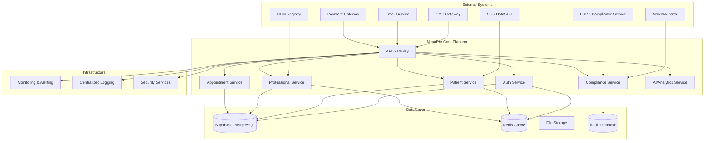
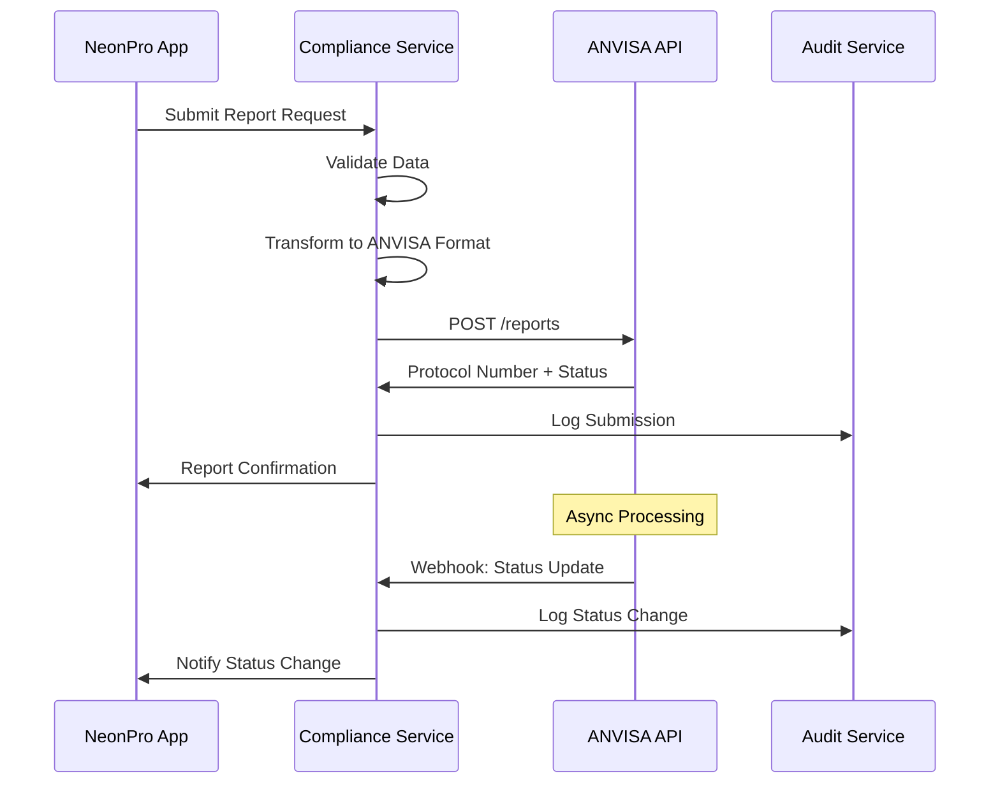
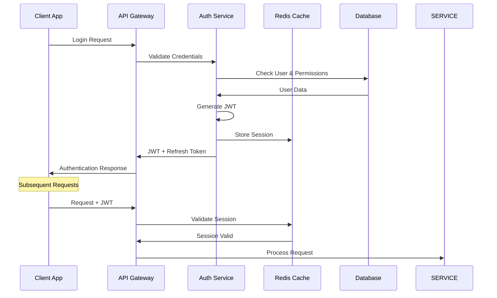
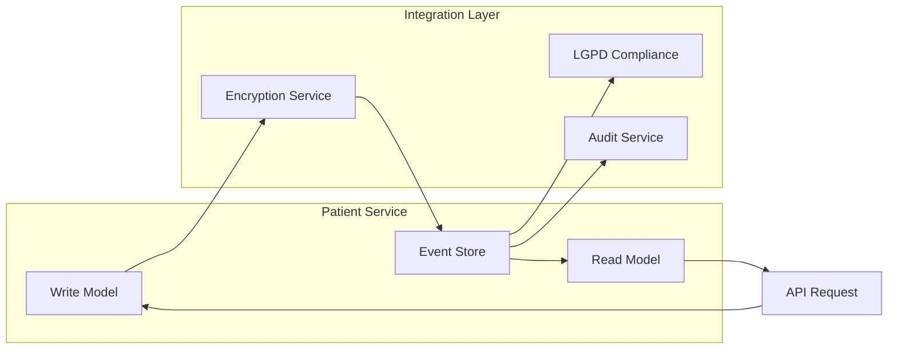
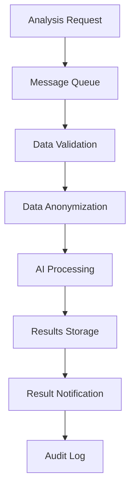
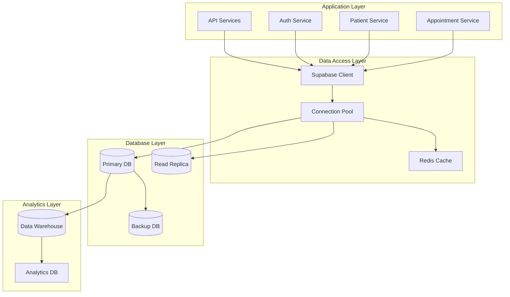

# NeonPro Integration Specifications

## 📋 Overview

This document defines comprehensive integration specifications for the NeonPro Healthcare Platform, detailing how the system integrates with external services, internal components, and Brazilian healthcare regulatory systems while maintaining FHIR compliance and LGPD data protection.

### Integration Architecture Principles

1. **FHIR-Native Approach**: All healthcare data exchanges follow HL7 FHIR R4 standards
2. **Brazilian Compliance**: Integration with ANVISA, CFM, and LGPD systems
3. **Security First**: All integrations use encrypted channels and authentication
4. **Resilience**: Circuit breakers, retries, and graceful degradation
5. **Audit Trail**: Complete logging of all integration activities
6. **Real-time Capability**: Event-driven architecture for immediate updates

---

## 🏗️ System Integration Architecture

### High-Level Integration Overview



---

## 🔌 External System Integrations

### 1. ANVISA Integration Specification

**Purpose**: Regulatory compliance reporting and adverse event tracking
**Protocol**: HTTPS REST API with mutual TLS authentication
**Data Format**: FHIR R4 + ANVISA-specific extensions

#### Connection Details

```yaml
Integration Type: REST API
Base URL: https://api.anvisa.gov.br/v1
Authentication: Mutual TLS + API Key
Rate Limits: 100 requests/hour
Timeout: 30 seconds
Retry Policy: Exponential backoff (3 attempts)
```

#### Data Exchange Patterns

```typescript
// ANVISA Report Submission Interface
export interface AnvisaReportSubmission {
  readonly reportType: "adverse_event" | "facility_inspection" | "medication_tracking";
  readonly reportId: string;
  readonly facilityId: string;
  readonly professionalCRM: string;
  readonly reportData: FHIRBundle;
  readonly submissionDate: string;
  readonly urgency: "routine" | "urgent" | "immediate";
}

// ANVISA Response Format
export interface AnvisaResponse {
  readonly success: boolean;
  readonly protocolNumber: string;
  readonly submissionId: string;
  readonly status: "received" | "processing" | "approved" | "rejected";
  readonly errors?: readonly AnvisaValidationError[];
  readonly nextReviewDate?: string;
}
```

#### Integration Flow Sequence



### 2. CFM Professional License Integration

**Purpose**: Real-time validation of medical professional licenses
**Protocol**: HTTPS REST API with OAuth2 authentication
**Data Format**: JSON with CFM-specific schemas

#### Connection Specification

```yaml
Integration Type: REST API + Webhook
Base URL: https://portal.cfm.org.br/api/v2
Authentication: OAuth2 Client Credentials
Rate Limits: 1000 requests/hour
Cache TTL: 24 hours for license data
Webhook Endpoint: /api/v1/webhooks/cfm
```

#### License Validation Interface

```typescript
export interface CFMLicenseValidationRequest {
  readonly crm: string; // CRM number
  readonly uf: string; // Brazilian state
  readonly professionalName: string;
  readonly specialization?: string;
}

export interface CFMLicenseValidationResponse {
  readonly isValid: boolean;
  readonly status: "active" | "suspended" | "cancelled" | "expired";
  readonly professionalData: {
    readonly fullName: string;
    readonly crm: string;
    readonly uf: string;
    readonly specializations: readonly string[];
    readonly registrationDate: string;
    readonly expirationDate?: string;
  };
  readonly restrictions?: readonly string[];
  readonly lastUpdate: string;
}
```

### 3. SUS DataSUS Integration

**Purpose**: Patient identification and healthcare history access
**Protocol**: SOAP Web Services (legacy) + REST API (modern)
**Data Format**: FHIR R4 Patient Resource

#### Connection Configuration

```yaml
Integration Type: Hybrid (SOAP + REST)
Legacy SOAP URL: https://servicos.datasus.gov.br/wsdl
Modern REST URL: https://api.datasus.gov.br/fhir/v1
Authentication: X.509 Certificate + JWT
Rate Limits: 500 requests/minute
Data Encryption: AES-256 at rest, TLS 1.3 in transit
```

#### Patient Lookup Interface

```typescript
export interface SUSPatientLookupRequest {
  readonly cpf?: string; // Encrypted
  readonly cartaoSUS?: string; // SUS card number
  readonly fullName?: string; // Encrypted
  readonly mothersName?: string; // Encrypted, required for disambiguation
  readonly dateOfBirth?: string;
}

export interface SUSPatientResponse {
  readonly found: boolean;
  readonly patient?: {
    readonly cartaoSUS: string;
    readonly cpf: string; // Masked
    readonly fullName: string; // Encrypted
    readonly dateOfBirth: string;
    readonly address: BrazilianAddress;
    readonly healthcareHistory?: readonly HealthcareEvent[];
  };
  readonly privacyLevel: "public" | "restricted" | "confidential";
  readonly accessAuthorization: string; // Required for restricted access
}
```

### 4. LGPD Compliance Service Integration

**Purpose**: Data protection compliance monitoring and reporting
**Protocol**: HTTPS REST API with OAuth2
**Data Format**: GDPR/LGPD compliance JSON schemas

#### Integration Specification

```yaml
Integration Type: REST API + Event Stream
Base URL: https://lgpd-compliance.neonpro.com.br/api/v1
Authentication: OAuth2 + mTLS
Event Stream: Server-Sent Events (SSE)
Retention: 7 years (LGPD requirement)
Encryption: Field-level encryption for PII
```

#### LGPD Data Processing Record

```typescript
export interface LGPDDataProcessingRecord {
  readonly id: string;
  readonly dataSubjectId: string; // Patient/User ID
  readonly processingPurpose: string;
  readonly legalBasis: "consent" | "contract" | "legal_obligation" | "vital_interests" | "public_task" | "legitimate_interests";
  readonly dataCategories: readonly string[];
  readonly recipients?: readonly string[]; // Third parties
  readonly dataRetentionPeriod: string;
  readonly crossBorderTransfer: boolean;
  readonly safeguards?: string;
  readonly timestamp: string;
  readonly processingSystem: string;
}

export interface LGPDConsentManagement {
  readonly consentId: string;
  readonly dataSubjectId: string;
  readonly purposes: readonly {
    readonly purpose: string;
    readonly granted: boolean;
    readonly timestamp: string;
    readonly expiryDate?: string;
  }[];
  readonly withdrawalRight: boolean;
  readonly granularConsent: boolean;
  readonly consentEvidence: string; // Audit trail
}
```

### 5. Communication Services Integration

**Purpose**: Multi-channel patient and professional communication
**Protocol**: REST APIs with various providers
**Data Format**: Provider-specific JSON/XML

#### SMS Gateway Integration

```typescript
export interface SMSGatewayConfig {
  readonly provider: "twilio" | "aws_sns" | "nexmo";
  readonly apiKey: string; // Encrypted
  readonly webhook: string;
  readonly rateLimits: {
    readonly perMinute: number;
    readonly perHour: number;
    readonly perDay: number;
  };
}

export interface SMSMessage {
  readonly messageId: string;
  readonly to: string; // Brazilian phone number
  readonly message: string;
  readonly type: "appointment_reminder" | "emergency_alert" | "verification" | "marketing";
  readonly scheduledFor?: string;
  readonly priority: "low" | "normal" | "high" | "urgent";
  readonly lgpdConsent: boolean; // Required for marketing
}
```

#### Email Service Integration

```typescript
export interface EmailServiceConfig {
  readonly provider: "aws_ses" | "sendgrid" | "postmark";
  readonly apiKey: string; // Encrypted
  readonly fromEmail: string;
  readonly replyToEmail: string;
  readonly templates: Record<string, string>;
}

export interface EmailMessage {
  readonly messageId: string;
  readonly to: string; // Encrypted email
  readonly subject: string;
  readonly template: string;
  readonly variables: Record<string, unknown>;
  readonly type: "transactional" | "marketing" | "system";
  readonly attachments?: readonly EmailAttachment[];
  readonly lgpdCompliant: boolean;
}
```

---

## 🔄 Internal Component Integrations

### 1. Authentication Service Integration

**Integration Pattern**: JWT-based stateless authentication with Redis session store

#### Authentication Flow



#### Authentication Integration Interface

```typescript
export interface AuthenticationContext {
  readonly user: {
    readonly id: string;
    readonly email: string;
    readonly role: HealthcareRole;
    readonly permissions: readonly string[];
    readonly clinicId?: string;
    readonly emergencyAccess: boolean;
  };
  readonly session: {
    readonly sessionId: string;
    readonly issuedAt: string;
    readonly expiresAt: string;
    readonly ipAddress: string;
    readonly userAgent: string;
  };
  readonly security: {
    readonly mfaVerified: boolean;
    readonly riskLevel: "low" | "medium" | "high";
    readonly lastActivity: string;
    readonly deviceFingerprint?: string;
  };
}

export interface AuthorizationCheck {
  readonly resource: string;
  readonly action: "create" | "read" | "update" | "delete";
  readonly scope?: "own" | "clinic" | "all";
  readonly context?: Record<string, unknown>;
}
```

### 2. Patient Service Integration

**Integration Pattern**: Event-driven architecture with CQRS pattern

#### Patient Data Flow



#### Patient Integration Events

```typescript
export interface PatientEvent {
  readonly eventId: string;
  readonly eventType: "patient_created" | "patient_updated" | "consent_changed" | "data_accessed";
  readonly patientId: string;
  readonly timestamp: string;
  readonly metadata: {
    readonly userId: string;
    readonly userRole: string;
    readonly ipAddress: string;
    readonly changes?: Record<string, unknown>;
  };
  readonly lgpdImpact: boolean;
  readonly auditRequired: boolean;
}

export interface PatientDataAccess {
  readonly accessId: string;
  readonly patientId: string;
  readonly accessorId: string;
  readonly accessorRole: HealthcareRole;
  readonly dataFields: readonly string[];
  readonly purpose: string;
  readonly legalBasis: string;
  readonly timestamp: string;
  readonly emergencyAccess?: boolean;
}
```

### 3. Appointment Service Integration

**Integration Pattern**: Microservice with distributed transaction support

#### Appointment Workflow

```typescript
export interface AppointmentWorkflow {
  readonly workflowId: string;
  readonly appointmentId: string;
  readonly steps: readonly {
    readonly stepId: string;
    readonly stepType: "validation" | "notification" | "calendar_update" | "payment" | "confirmation";
    readonly status: "pending" | "processing" | "completed" | "failed";
    readonly executedAt?: string;
    readonly retryCount: number;
    readonly errorMessage?: string;
  }[];
  readonly compensationRequired: boolean;
}

export interface AppointmentIntegrationEvents {
  readonly scheduled: {
    readonly appointmentId: string;
    readonly patientId: string;
    readonly professionalId: string;
    readonly scheduledDate: string;
    readonly notificationRequired: boolean;
  };
  readonly confirmed: {
    readonly appointmentId: string;
    readonly confirmedAt: string;
    readonly confirmedBy: string;
  };
  readonly cancelled: {
    readonly appointmentId: string;
    readonly cancelledAt: string;
    readonly cancelledBy: string;
    readonly reason: string;
    readonly compensationAmount?: number;
  };
}
```

### 4. AI/Analytics Service Integration

**Integration Pattern**: Asynchronous processing with message queues

#### AI Processing Pipeline



#### AI Integration Specification

```typescript
export interface AIAnalysisRequest {
  readonly requestId: string;
  readonly analysisType: "risk_assessment" | "appointment_optimization" | "patient_insights" | "compliance_check";
  readonly inputData: {
    readonly patientId?: string;
    readonly professionalId?: string;
    readonly timeRange?: {
      readonly start: string;
      readonly end: string;
    };
    readonly parameters: Record<string, unknown>;
  };
  readonly privacy: {
    readonly anonymizationLevel: "none" | "partial" | "full";
    readonly dataRetention: string; // ISO duration
    readonly sharedWithThirdParty: boolean;
  };
  readonly priority: "low" | "normal" | "high" | "urgent";
  readonly callbackUrl?: string;
}

export interface AIAnalysisResult {
  readonly requestId: string;
  readonly analysisId: string;
  readonly status: "completed" | "failed" | "partially_completed";
  readonly results: {
    readonly insights: readonly string[];
    readonly recommendations: readonly string[];
    readonly confidence: number; // 0-1
    readonly riskFactors?: readonly string[];
    readonly modelVersion: string;
  };
  readonly metadata: {
    readonly processingTime: number; // milliseconds
    readonly dataPointsAnalyzed: number;
    readonly modelAccuracy: number;
    readonly biasDetection?: Record<string, unknown>;
  };
  readonly privacy: {
    readonly dataAnonymized: boolean;
    readonly retentionExpiry: string;
    readonly accessLog: readonly string[];
  };
}
```

---

## 🔒 Security Integration Specifications

### 1. Encryption Service Integration

**Purpose**: Field-level encryption for LGPD compliance
**Integration Pattern**: Service mesh with dedicated encryption service

```typescript
export interface EncryptionServiceConfig {
  readonly keyManagement: {
    readonly provider: "aws_kms" | "azure_key_vault" | "hashicorp_vault";
    readonly region: string;
    readonly keyRotationPeriod: string; // ISO duration
    readonly backupStrategy: "multi_region" | "cross_cloud";
  };
  readonly encryption: {
    readonly algorithm: "aes-256-gcm";
    readonly keyDerivation: "pbkdf2" | "scrypt";
    readonly iterations: number;
    readonly saltLength: number;
  };
}

export interface EncryptionRequest {
  readonly dataId: string;
  readonly plaintext: string | Buffer;
  readonly context: {
    readonly purpose: string;
    readonly dataClassification: "public" | "internal" | "confidential" | "restricted";
    readonly retentionPeriod: string;
  };
  readonly keyVersion?: string;
}

export interface DecryptionRequest {
  readonly dataId: string;
  readonly ciphertext: string;
  readonly context: {
    readonly requestorId: string;
    readonly requestorRole: string;
    readonly accessPurpose: string;
    readonly auditRequired: boolean;
  };
}
```

### 2. Audit Service Integration

**Purpose**: Comprehensive audit trail for compliance
**Integration Pattern**: Event sourcing with immutable audit logs

```typescript
export interface AuditEvent {
  readonly eventId: string;
  readonly timestamp: string;
  readonly actor: {
    readonly userId: string;
    readonly userRole: HealthcareRole;
    readonly sessionId: string;
    readonly ipAddress: string;
    readonly userAgent?: string;
  };
  readonly action: {
    readonly type: string; // CRUD operation
    readonly resource: string;
    readonly resourceId: string;
    readonly result: "success" | "failure";
    readonly errorCode?: string;
  };
  readonly data: {
    readonly before?: Record<string, unknown>;
    readonly after?: Record<string, unknown>;
    readonly changes?: Record<string, unknown>;
    readonly sensitive: boolean;
  };
  readonly compliance: {
    readonly lgpdImpact: boolean;
    readonly retentionClass: "standard" | "extended" | "permanent";
    readonly anonymizationRequired: boolean;
  };
}

export interface ComplianceReport {
  readonly reportId: string;
  readonly reportType: "access_log" | "data_processing" | "consent_tracking" | "breach_report";
  readonly timeRange: {
    readonly start: string;
    readonly end: string;
  };
  readonly filters: {
    readonly userRoles?: readonly HealthcareRole[];
    readonly resources?: readonly string[];
    readonly actions?: readonly string[];
    readonly complianceFlags?: readonly string[];
  };
  readonly format: "json" | "csv" | "pdf";
  readonly encryption: boolean;
}
```

---

## 📊 Data Integration Patterns

### 1. Database Integration Architecture



### 2. Real-time Data Synchronization

```typescript
export interface DataSynchronizationConfig {
  readonly sources: readonly {
    readonly sourceId: string;
    readonly type: "database" | "api" | "file" | "stream";
    readonly connectionString: string;
    readonly syncFrequency: string; // Cron expression
    readonly batchSize: number;
  }[];
  readonly transformation: {
    readonly rules: readonly TransformationRule[];
    readonly validation: ValidationSchema;
    readonly errorHandling: "skip" | "retry" | "fail";
  };
  readonly targets: readonly {
    readonly targetId: string;
    readonly type: "database" | "cache" | "search_index" | "analytics";
    readonly connectionString: string;
    readonly syncMode: "full" | "incremental" | "delta";
  }[];
}

export interface SyncStatus {
  readonly syncId: string;
  readonly status: "running" | "completed" | "failed" | "paused";
  readonly startedAt: string;
  readonly completedAt?: string;
  readonly recordsProcessed: number;
  readonly recordsError: number;
  readonly lastError?: string;
  readonly nextSync: string;
}
```

---

## 🔄 API Integration Standards

### 1. RESTful API Integration

```typescript
export interface APIIntegrationStandards {
  readonly versioning: {
    readonly strategy: "url" | "header" | "query";
    readonly currentVersion: string;
    readonly supportedVersions: readonly string[];
    readonly deprecationPolicy: string; // Time period before removal
  };
  readonly authentication: {
    readonly methods: readonly ("bearer" | "basic" | "oauth2" | "mutual_tls")[];
    readonly tokenExpiry: string; // ISO duration
    readonly refreshStrategy: "automatic" | "manual";
  };
  readonly rateLimit: {
    readonly strategy: "fixed_window" | "sliding_window" | "token_bucket";
    readonly limits: Record<string, number>; // endpoint -> requests per time unit
    readonly headers: readonly string[]; // Rate limit headers to include
  };
  readonly errorHandling: {
    readonly standardFormat: boolean;
    readonly errorCodes: Record<string, string>;
    readonly retryStrategy: "exponential_backoff" | "linear" | "custom";
    readonly maxRetries: number;
  };
}
```

### 2. FHIR Integration Compliance

```typescript
export interface FHIRIntegrationSpec {
  readonly version: "R4" | "R5";
  readonly capabilities: {
    readonly resources: readonly string[]; // Supported FHIR resources
    readonly interactions: readonly ("read" | "create" | "update" | "delete" | "search")[];
    readonly searchParameters: Record<string, string[]>;
    readonly profiles: readonly string[]; // FHIR profiles implemented
  };
  readonly brazilianExtensions: {
    readonly cpfExtension: boolean;
    readonly susCardExtension: boolean;
    readonly crmExtension: boolean;
    readonly anvisaExtension: boolean;
  };
  readonly validation: {
    readonly strictMode: boolean;
    readonly customValidators: readonly string[];
    readonly terminologyService: string; // URL to terminology server
  };
}
```

---

## 🚨 Error Handling & Resilience Patterns

### 1. Circuit Breaker Pattern

```typescript
export interface CircuitBreakerConfig {
  readonly serviceName: string;
  readonly failureThreshold: number; // Failures before opening circuit
  readonly recoveryTimeout: number; // Milliseconds
  readonly monitoringWindow: number; // Time window for failure counting
  readonly fallbackStrategy: "cached_response" | "default_response" | "alternative_service";
  readonly alerts: {
    readonly enabled: boolean;
    readonly channels: readonly ("email" | "sms" | "slack" | "webhook")[];
    readonly recipients: readonly string[];
  };
}

export interface CircuitBreakerState {
  readonly state: "closed" | "open" | "half_open";
  readonly failureCount: number;
  readonly lastFailureTime?: string;
  readonly nextRetryTime?: string;
  readonly metrics: {
    readonly totalRequests: number;
    readonly failedRequests: number;
    readonly averageResponseTime: number;
    readonly lastWindowStats: {
      readonly successRate: number;
      readonly requestCount: number;
    };
  };
}
```

### 2. Retry and Fallback Strategies

```typescript
export interface RetryStrategy {
  readonly maxAttempts: number;
  readonly backoffStrategy: "exponential" | "linear" | "fixed";
  readonly baseDelay: number; // milliseconds
  readonly maxDelay: number;
  readonly jitter: boolean; // Add randomness to prevent thundering herd
  readonly retryableErrors: readonly string[]; // Error codes/types to retry
}

export interface FallbackStrategy {
  readonly enabled: boolean;
  readonly type: "cache" | "alternative_service" | "default_response" | "graceful_degradation";
  readonly configuration: {
    readonly cacheKey?: string;
    readonly alternativeEndpoint?: string;
    readonly defaultResponse?: Record<string, unknown>;
    readonly degradedFeatures?: readonly string[];
  };
  readonly healthCheck: {
    readonly enabled: boolean;
    readonly interval: number; // milliseconds
    readonly endpoint: string;
    readonly timeout: number;
  };
}
```

---

## 📈 Monitoring & Observability Integration

### 1. Distributed Tracing

```typescript
export interface TracingConfiguration {
  readonly provider: "jaeger" | "zipkin" | "aws_xray";
  readonly samplingRate: number; // 0-1, percentage of requests to trace
  readonly serviceMap: Record<string, string>; // service name -> version
  readonly customTags: Record<string, string>; // Additional metadata
  readonly export: {
    readonly endpoint: string;
    readonly batchSize: number;
    readonly flushInterval: number; // milliseconds
  };
}

export interface HealthCheckEndpoints {
  readonly endpoints: readonly {
    readonly path: string;
    readonly method: "GET" | "HEAD";
    readonly timeout: number;
    readonly expectedStatus: number[];
    readonly dependencies: readonly string[];
  }[];
  readonly aggregation: {
    readonly strategy: "all_must_pass" | "majority_pass" | "any_pass";
    readonly cacheTTL: number; // seconds
    readonly alertOnFailure: boolean;
  };
}
```

---

## 🌟 Integration Best Practices

### Implementation Guidelines

1. **Idempotency**: All integration endpoints must support idempotent operations
2. **Timeouts**: Configure appropriate timeouts for all external integrations
3. **Monitoring**: Implement comprehensive monitoring and alerting
4. **Documentation**: Maintain up-to-date API documentation and integration guides
5. **Testing**: Implement integration testing with mock services
6. **Security**: Use defense-in-depth security approaches
7. **Compliance**: Ensure all integrations maintain LGPD and healthcare compliance

### Performance Considerations

1. **Connection Pooling**: Use connection pools for database and external API connections
2. **Caching**: Implement intelligent caching strategies
3. **Asynchronous Processing**: Use async patterns for non-critical operations
4. **Batching**: Batch operations where possible to reduce API calls
5. **Compression**: Use compression for large data transfers

### Compliance Requirements

1. **Audit Logging**: Log all integration activities
2. **Data Encryption**: Encrypt data in transit and at rest
3. **Access Control**: Implement proper authentication and authorization
4. **Data Retention**: Follow LGPD data retention requirements
5. **Incident Response**: Have procedures for integration failures

---

This comprehensive integration specification ensures robust, secure, and compliant integration patterns throughout the NeonPro Healthcare Platform, supporting Brazilian healthcare regulations and international best practices.