# NeonPro Application Flows

## Overview

This document describes the core user journeys and system interactions in NeonPro, a mobile-first SaaS platform for Brazilian aesthetic clinics. It focuses on WHAT happens in each flow and WHY, providing a reference for understanding how users interact with the system and how components work together.

**For technical implementation details**, see [architecture.md](./architecture.md) and [frontend-architecture.md](./frontend-architecture.md).

## System Architecture Context

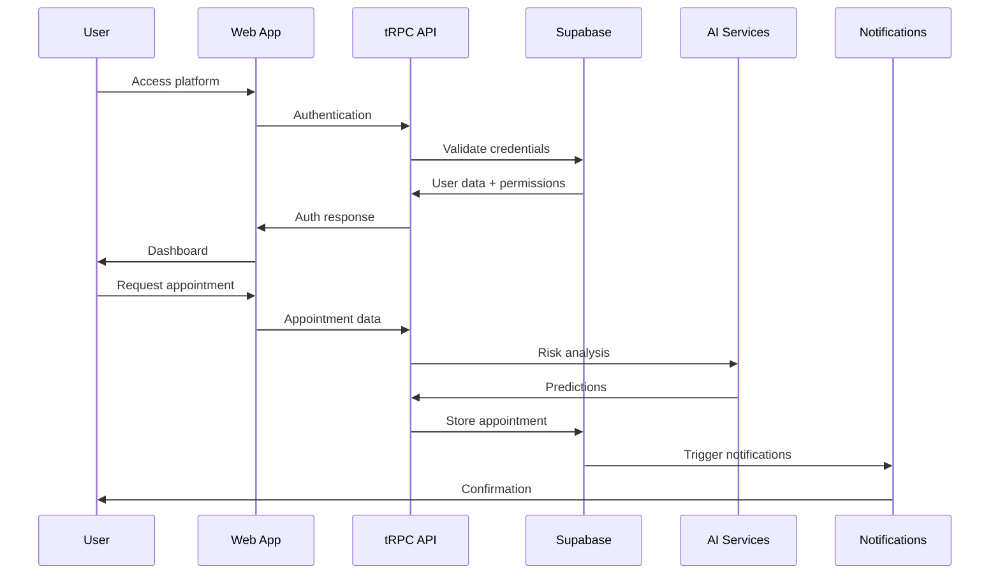

## Authentication & Authorization

### User Authentication Flow

**Purpose**: Multi-role access control for patients, professionals, and administrators

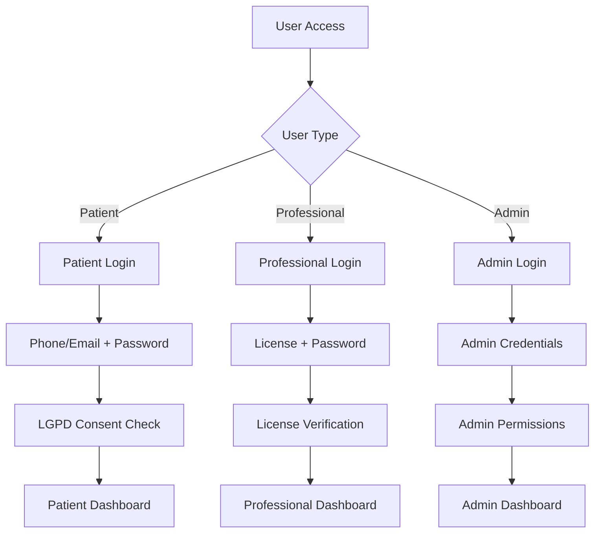

**Flow Steps**:

1. User type detection (patient/professional/admin)
2. Role-specific credential validation
3. LGPD consent verification for patients
4. Session creation with appropriate permissions
5. Dashboard routing based on role

### Professional License Validation

**Purpose**: Council-specific license verification (CFM, COREN, CFF, CNEP)

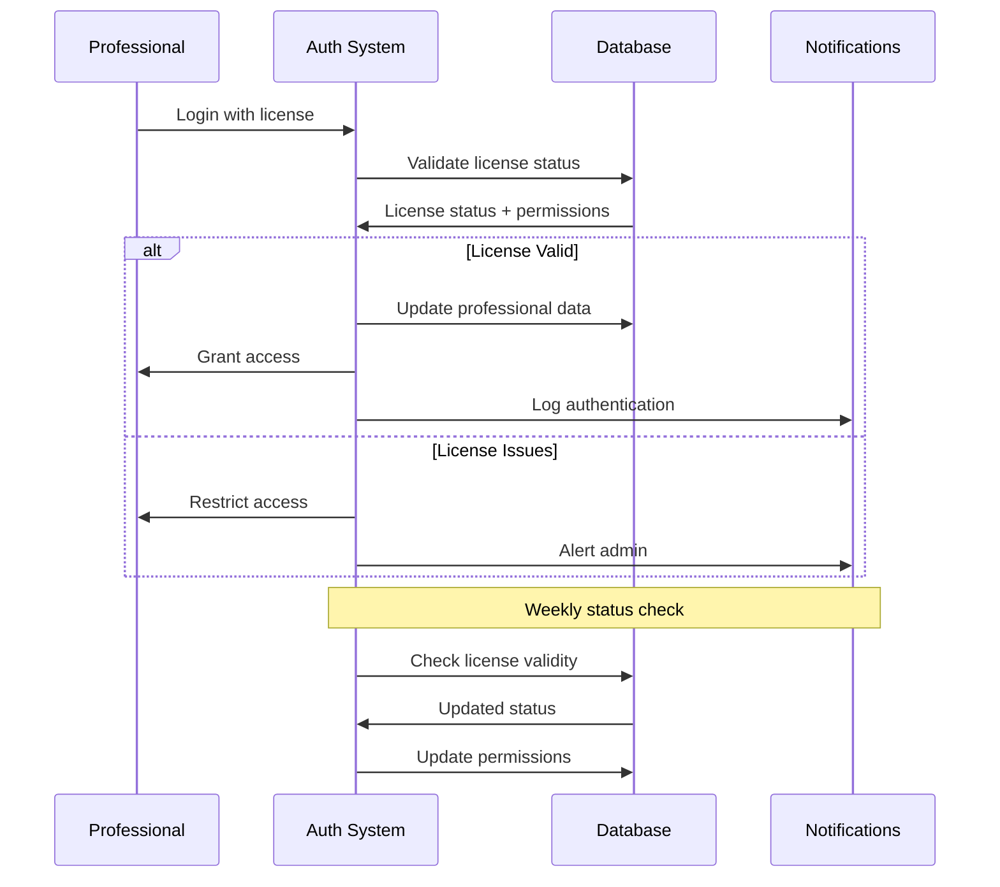

**Flow Steps**:

1. Professional submits license number and password
2. System validates license status with council database
3. Verify aesthetic procedure authorizations
4. Grant or restrict access based on license status
5. Create session with appropriate permissions
6. Weekly automated license status checks

## Patient Management

### Patient Registration & Onboarding

**Purpose**: LGPD-compliant patient onboarding with treatment history

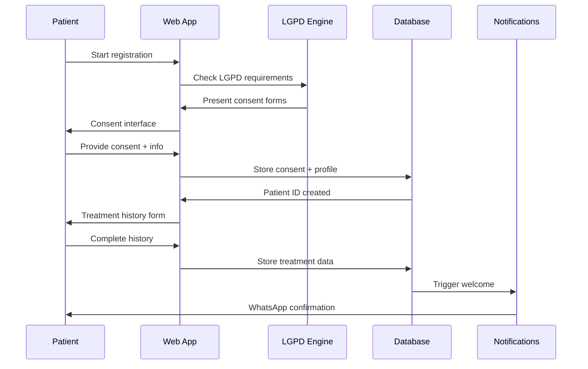

**Flow Steps**:

1. Patient initiates registration
2. System presents LGPD consent forms
3. Patient provides consent for data processing
4. Collect personal details (name, contact, address)
5. Gather treatment history, preferences, goals
6. Generate patient profile with unique ID
7. Send WhatsApp confirmation with next steps

### Patient Lifecycle Management

**Purpose**: Complete patient lifecycle with treatment history tracking

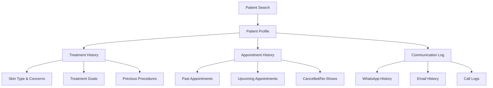

**Flow Steps**:

1. Search patient by name, phone, or email
2. Load comprehensive patient profile
3. Access treatment history (skin type, concerns, goals, procedures)
4. Review appointment history with patterns
5. Access complete communication history

## Professional Workflows

### Professional Dashboard

**Purpose**: Centralized interface for managing appointments, patients, and analytics

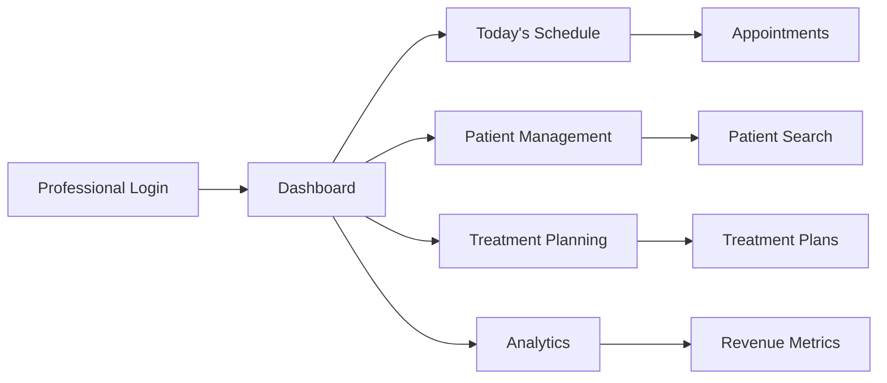

**Flow Steps**:

1. Display key metrics (appointments, revenue, satisfaction)
2. View today's schedule with available slots
3. Search patients and access treatment history
4. Plan treatments and consultations
5. Track revenue and appointment analytics

## Appointment Management

### Appointment Scheduling

**Purpose**: AI-powered scheduling with no-show prediction and WhatsApp integration

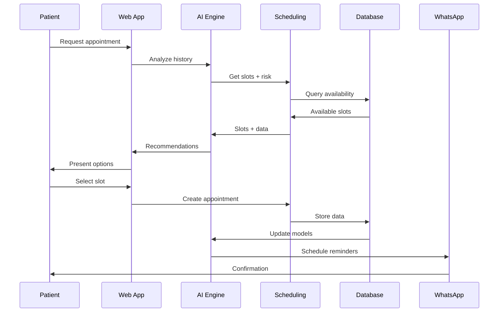

**Flow Steps**:

1. Patient submits appointment request with procedure preferences
2. AI analyzes patient history and no-show risk factors
3. System queries professional schedules and resource availability
4. AI generates optimized recommendations
5. Display best options with duration and preparation
6. Patient selects slot, system creates appointment
7. WhatsApp confirmation with preparation instructions

### Anti-No-Show Engine

**Purpose**: AI-powered prediction and intervention to reduce appointment cancellations

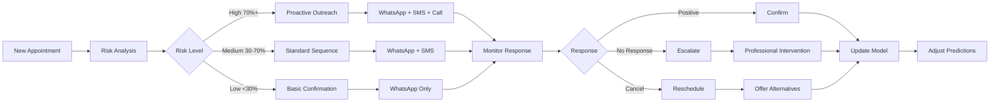

**Flow Steps**:

1. Analyze patient history and behavioral patterns
2. Classify appointments as high, medium, or low risk
3. Deploy appropriate WhatsApp reminder sequence
4. Track patient engagement with reminders
5. Escalate to professional intervention for high-risk cases
6. Update prediction algorithms based on outcomes

## Compliance & Data Protection

### LGPD Compliance Flow

**Purpose**: Patient data protection and consent management

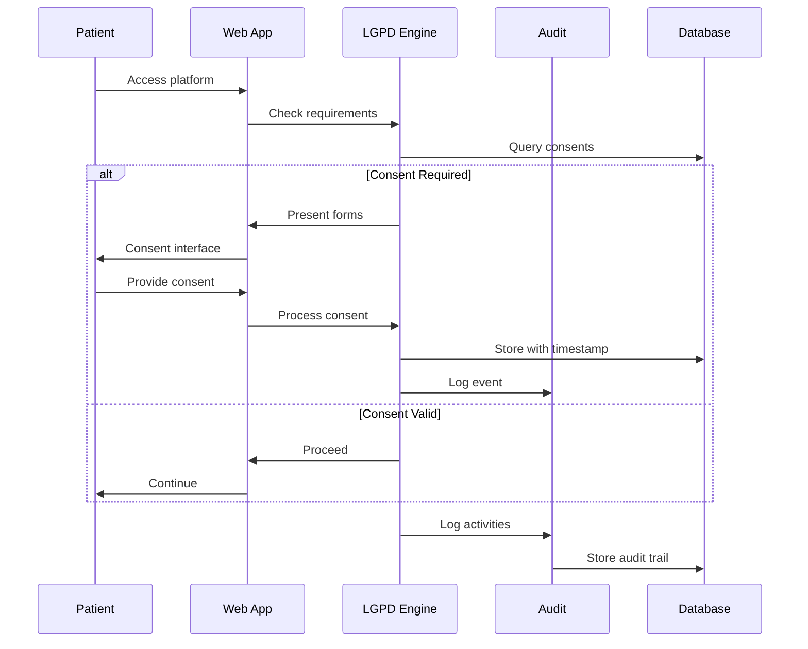

**Flow Steps**:

1. Verify existing consents for patient data processing
2. Present consent forms for treatment and marketing
3. Store consent with timestamp and legal basis
4. Proceed with authorized data processing
5. Record all data processing for compliance audit
6. Process patient data access and deletion requests

### Real-time Compliance Monitoring

**Purpose**: Continuous monitoring of regulatory compliance (LGPD, CFM, ANVISA)

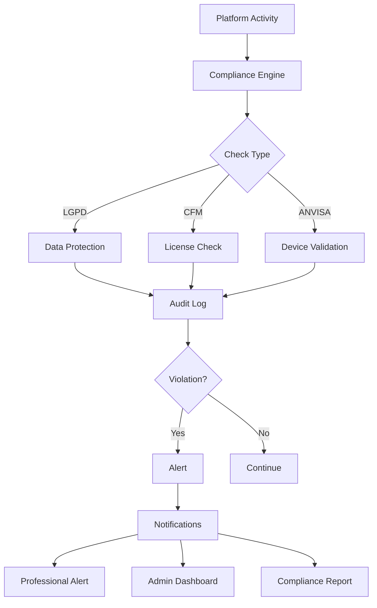

**Flow Steps**:

1. Real-time monitoring of all platform activities
2. Multi-layer validation (LGPD, CFM, ANVISA)
3. Comprehensive audit trail creation
4. Automated violation detection
5. Immediate alerts with severity classification
6. Stakeholder notification and corrective action tracking

## Treatment Workflows

### Treatment Planning

**Purpose**: Structured treatment planning with patient consultation

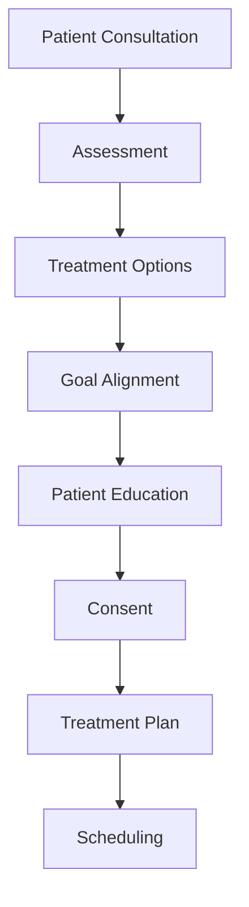

**Flow Steps**:

1. Professional evaluates patient goals and concerns
2. Review skin type, concerns, and suitable procedures
3. Present aesthetic procedures with expected outcomes
4. Ensure patient expectations match realistic outcomes
5. Provide detailed procedure and aftercare information
6. Obtain informed consent for planned procedures
7. Document treatment plan with timeline and costs
8. Schedule treatment sessions with appropriate intervals

### Procedure Execution

**Purpose**: Structured procedure execution with safety protocols

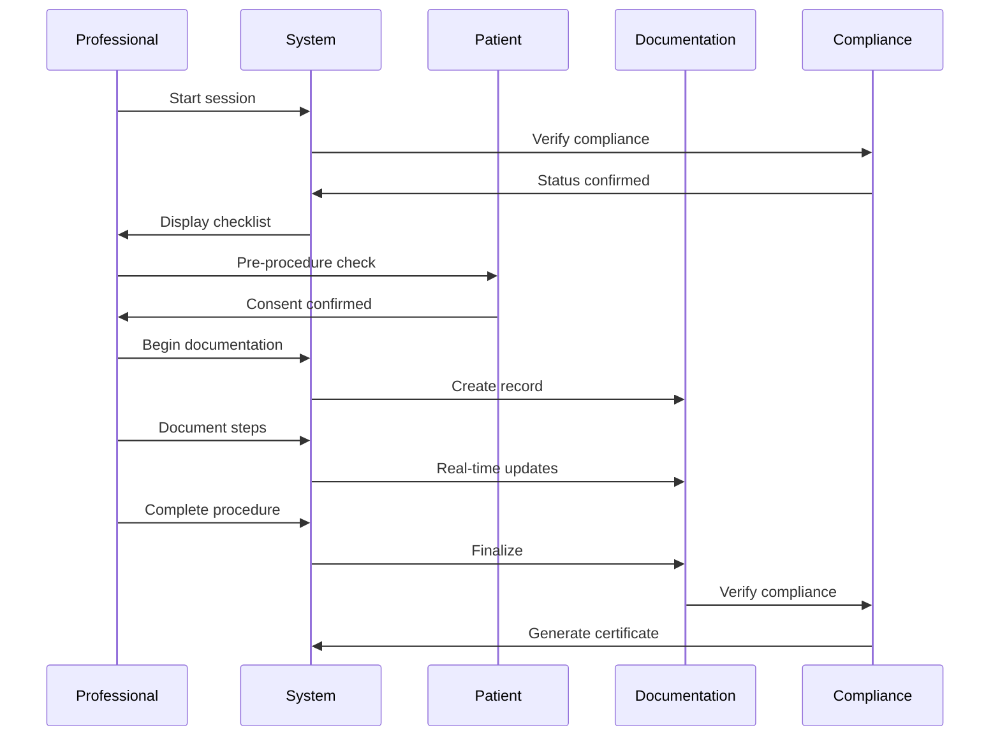

**Flow Steps**:

1. Professional starts procedure session with patient verification
2. System verifies all regulatory requirements
3. Execute safety checklist and consent verification
4. Document each procedure step with timestamps
5. Track procedure progress and complications
6. Finalize documentation and generate certificates
7. Provide aftercare instructions and schedule follow-up

### Photo Management & Consent

**Purpose**: Before/after photo management with LGPD compliance

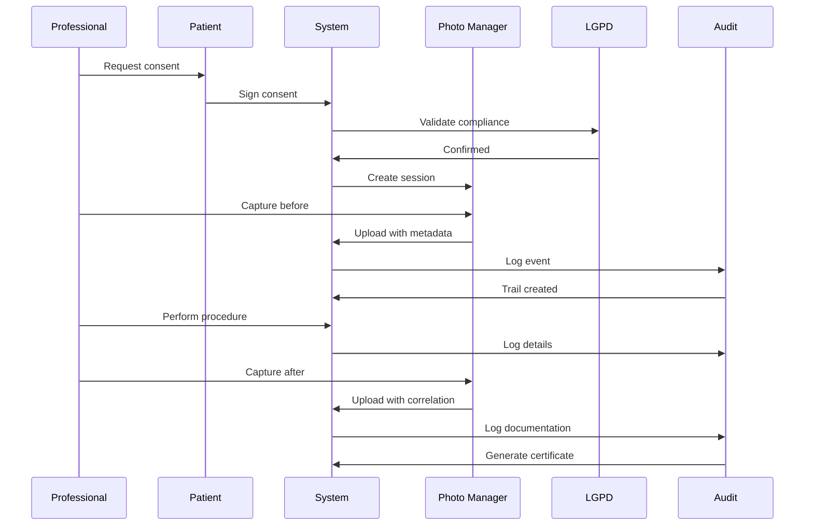

**Flow Steps**:

1. Granular consent for treatment, marketing, portfolio, educational use
2. Structured photo capture with standardized protocols
3. Automatic correlation with treatment records
4. Automated watermarking, encryption, access controls
5. Scheduled cleanup based on consent expiration
6. Real-time monitoring of photo access and usage

### Multi-Council Professional Validation

**Purpose**: Council-specific validation (CFM, COREN, CFF, CNEP)

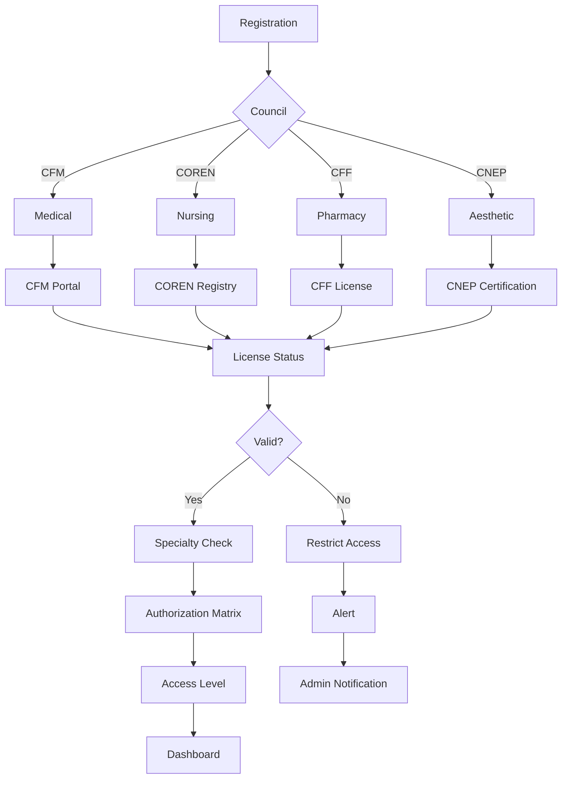

**Flow Steps**:

1. Automatic identification of professional council type
2. Real-time license validation via council APIs
3. Validation of aesthetic procedure specializations
4. Determination of authorized procedures
5. Real-time permission updates based on license status
6. Continuous monitoring of license validity

### Equipment Integration

**Purpose**: ANVISA-compliant device management

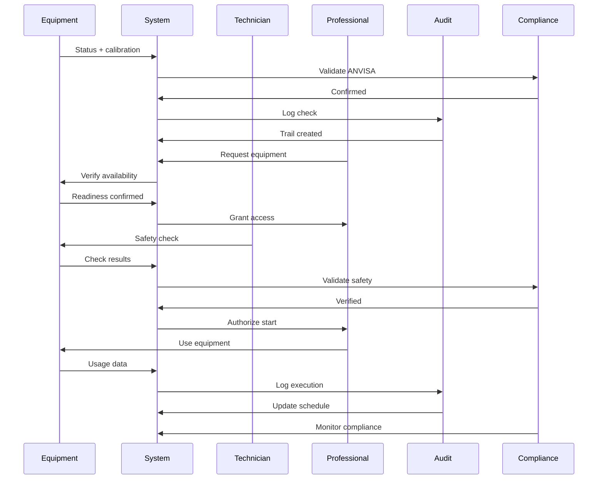

**Flow Steps**:

1. ANVISA compliance verification and device classification
2. Scheduled maintenance and calibration tracking
3. Pre-procedure safety checks and parameter verification
4. Real-time tracking of equipment utilization
5. Automated maintenance scheduling based on usage
6. Generation of ANVISA compliance reports

## Patient Communication

### Marketing & Communication

**Purpose**: Consent-based marketing and multi-channel communication

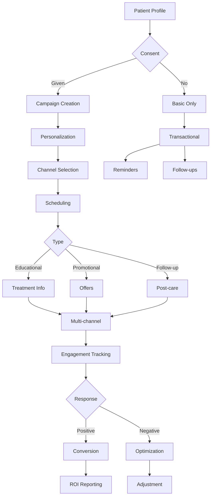

**Flow Steps**:

1. Granular marketing consent tracking and preference management
2. AI-driven content customization based on treatment history
3. Multi-channel communication (email, SMS, WhatsApp, push)
4. Automated campaign scheduling and execution
5. Real-time tracking of patient engagement and response
6. LGPD compliance monitoring for marketing communications

## Summary

This document describes the core user journeys and system interactions in NeonPro, focusing on how users interact with the system and how components work together.

### Key Flows

**Authentication & Authorization**

- Multi-role access control (patients, professionals, admins)
- Council-specific license validation (CFM, COREN, CFF, CNEP)
- LGPD-compliant consent management

**Patient Management**

- LGPD-compliant onboarding with treatment history
- Complete patient lifecycle tracking
- Multi-channel communication

**Appointment Management**

- AI-powered scheduling with no-show prediction
- WhatsApp-first communication strategy
- Real-time availability optimization

**Treatment Workflows**

- Structured treatment planning with patient consultation
- Procedure execution with safety protocols
- Before/after photo management with LGPD compliance

**Compliance & Monitoring**

- Real-time compliance monitoring (LGPD, CFM, ANVISA)
- Comprehensive audit trail generation
- Automated violation detection and alerting

### Integration Points

All flows integrate with:

- WhatsApp Business API for patient communication
- AI-powered risk assessment and optimization
- Real-time schedule synchronization
- LGPD-compliant data handling
- Multi-council professional validation

**For technical implementation details**, see:

- [System Architecture](./architecture.md) - Architecture overview and design patterns
- [Frontend Architecture](./frontend-architecture.md) - UI/UX implementation patterns
- [Technology Stack](./tech-stack.md) - Technology decisions and rationale
- [Source Tree](./source-tree.md) - Code organization and structure
