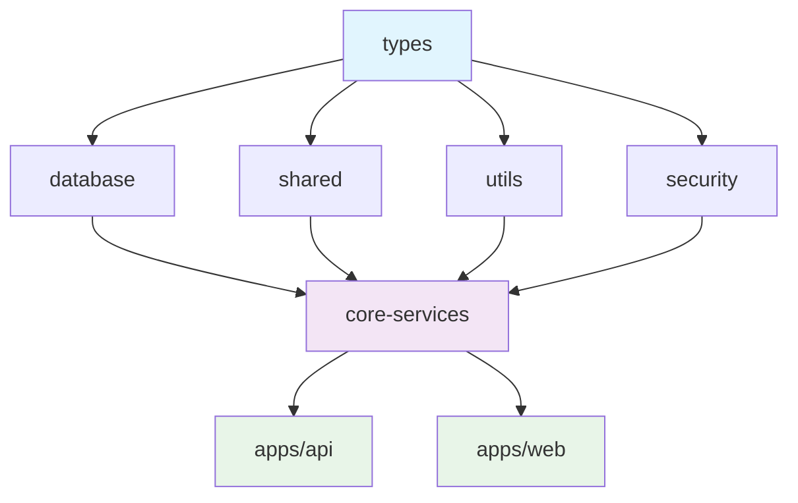

# NeonPro Source Tree Organization

This document provides detailed guidance on **HOW** the NeonPro codebase is organized, including directory structure rationale, package dependencies, file naming conventions, and developer navigation principles.

## Monorepo Structure Overview

NeonPro uses a **Turborepo-based monorepo** with 2 applications and 7 shared packages, optimized for Brazilian aesthetic clinic compliance and rapid development.

```
neonpro/
├── 📁 apps/                              # Application Layer (2 apps)
│   ├── 📁 api/                           # Backend API (Vite + Hono + tRPC v11 + Prisma + Supabase)
│   │   ├── 📄 package.json               # API dependencies & scripts
│   │   ├── 📄 vite.config.ts             # Vite build configuration
│   │   ├── 📄 tsconfig.json              # TypeScript configuration
│   │   └── 📁 src/                       # API source code
│   │       ├── 📁 trpc/                  # tRPC infrastructure
│   │       │   ├── 📄 context.ts         # tRPC context with Prisma + Supabase
│   │       │   ├── 📄 trpc.ts            # Core tRPC setup with middleware
│   │       │   ├── 📄 schemas.ts         # Valibot validation schemas
│   │       │   ├── 📄 router.ts          # Main AppRouter composition
│   │       │   ├── 📄 index.ts           # Clean exports for client integration
│   │       │   ├── 📁 routers/           # Domain-specific tRPC routers
│   │       │   ├── 📁 contracts/         # tRPC contract definitions
│   │       │   │   ├── 📄 clients.ts    # LGPD-compliant client operations
│   │       │   │   ├── 📄 appointments.ts # Professional Council validation + no-show prediction
│   │       │   │   └── 📄 ai.ts          # Portuguese aesthetic clinic AI support
│   │       │   └── 📁 middleware/        # Aesthetic clinic compliance middleware
│   │       │       ├── 📄 lgpd-audit.ts  # LGPD audit logging
│   │       │       ├── 📄 professional-council-validation.ts # Professional Council license validation
│   │       │       └── 📄 prisma-rls.ts  # Row Level Security enforcement
│   │       ├── 📁 services/              # Aesthetic clinic business logic services
│   │       │   ├── 📄 lgpd-compliance.ts # Data lifecycle management
│   │       │   ├── 📄 no-show-prediction.ts # AI-powered predictions
│   │       │   └── 📄 virtual-consultation.ts    # Professional Council-compliant virtual consultation
│   │       ├── 📁 types/                 # API-specific types
│   │       └── 📁 tests/                 # API test suites
│   │           ├── 📁 contract/          # tRPC contract tests
│   │           │   ├── 📄 clients.contract.test.ts
│   │           │   ├── 📄 appointments.contract.test.ts
│   │           │   └── 📄 ai.contract.test.ts
│   │           └── 📁 integration/       # Aesthetic clinic compliance tests
│   │               ├── 📄 lgpd-compliance.test.ts
│   │               ├── 📄 professional-council-virtual-consultation.test.ts
│   │               └── 📄 cosmetic-compliance.test.ts
│   │
│   └── 📁 web/                           # Frontend Application (TanStack Router + Vite)
│       ├── 📄 package.json               # Web dependencies & scripts
│       ├── 📄 vite.config.ts             # Vite build configuration
│       ├── 📄 vitest.config.ts           # Test configuration
│       ├── 📄 index.html                 # HTML entry point
│       ├── 📁 .tanstack/                 # TanStack Router cache
│       └── 📁 src/                       # Frontend source code
│           ├── 📄 main.tsx               # Application entry point
│           ├── 📄 App.tsx                # Root App component
│           ├── 📄 routeTree.gen.ts       # Auto-generated route tree
│           ├── 📄 nav-items.tsx          # Navigation configuration
│           ├── 📄 index.css              # Global styles
│           ├── 📁 routes/                # File-based routing (TanStack Router)
│           │   ├── 📄 __root.tsx         # Root layout route
│           │   ├── 📄 404.tsx            # 404 error page
│           │   ├── 📄 index.tsx          # Homepage route
│           │   ├── 📁 __tests__/          # Route test files
│           │   ├── 📁 demos/              # Demo and showcase pages
│           │   ├── 📁 auth/               # Authentication routes
│           │   ├── 📁 dashboard/          # Dashboard and analytics
│           │   ├── 📁 financial/          # Financial and billing features
│           │   ├── 📁 services/           # Service management routes
│           │   ├── 📁 admin/              # Administration panel
│           │   ├── 📁 profile/            # User profile management
│           │   ├── 📁 ai/                 # AI-powered features
│           │   ├── 📁 appointments/       # Appointment scheduling
│           │   └── 📁 clients/           # Client management
│           ├── 📁 components/            # React components
│           │   └── 📁 ui/                # shadcn/ui components
│           ├── 📁 __tests__/             # Consolidated test directory
│           │   ├── 📁 contracts/         # Contract tests
│           │   ├── 📁 e2e/               # End-to-end tests
│           │   ├── 📁 integration/       # Integration tests
│           │   ├── 📁 mobile/            # Mobile-specific tests
│           │   ├── 📁 performance/       # Performance tests
│           │   ├── 📁 ui/                # UI component tests
│           │   └── 📄 test-utils.tsx    # Test utilities
│           ├── 📁 types/                 # Frontend-specific types
│           ├── 📁 docs/                  # Documentation (moved from components)
│           │   ├── 📁 backup/            # Backup of removed files
│           │   ├── 📁 components/        # Component documentation
│           │   └── 📁 research/          # Research and notes
│           └── 📁 integrations/          # External service integrations
│               └── 📁 supabase/          # Supabase client & types
│
├── 📁 packages/                          # Shared Package Layer (7 packages)
│   ├── 📁 types/                         # @neonpro/types - TypeScript definitions
│   │   └── 📁 src/                       # Type definitions
│   │       ├── 📄 client.valibot.ts     # Brazilian client validation (CPF)
│   │       ├── 📄 lgpd.valibot.ts        # LGPD consent schemas
│   │       ├── 📄 appointment.valibot.ts # Appointment + TUSS validation
│   │       └── 📄 index.ts               # Unified type exports
│   ├── 📁 database/                      # @neonpro/database - Prisma + Supabase
│   │   ├── 📄 package.json               # Database package config
│   │   ├── 📁 prisma/                    # Prisma ORM configuration
│   │   │   ├── 📄 schema.prisma          # Aesthetic clinic data models (Client, LGPD, etc)
│   │   │   └── 📁 migrations/            # Database migration scripts
│   │   ├── 📁 src/                       # Database utilities
│   │   │   └── 📁 types/                 # Generated Prisma types
│   │   └── 📁 scripts/                   # Database scripts
│   │       └── 📁 aesthetic-clinic/            # Aesthetic clinic-specific scripts
│   ├── 📁 shared/                        # @neonpro/shared - Common utilities
│   │   └── 📁 src/                       # Shared source code
│   │       ├── 📁 auth/                  # Authentication utilities
│   │       └── 📁 templates/             # Template components
│   ├── 📁 utils/                         # @neonpro/utils - Utility functions
│   │   └── 📁 src/                       # Utility source code
│   │       ├── 📁 auth/                  # Auth utilities
│   │       ├── 📁 components/            # Component utilities
│   │       ├── 📁 analytics/             # Analytics utilities
│   │       ├── 📁 performance/           # Performance utilities
│   │       └── 📁 compliance/            # LGPD/Cosmetic compliance
│   ├── 📁 security/                      # @neonpro/security - Security utilities
│   ├── 📁 core-services/                 # @neonpro/core-services - Business logic
│   │   └── 📁 src/                       # Service source code
│   │       └── 📁 services/              # Business service implementations
│   └── 📁 config/                        # @neonpro/config - Shared configurations
│
├── 📁 tools/                             # Development & Testing Tools
│   ├── 📁 audit/                         # Monorepo audit tools
│   ├── 📁 monorepo-audit/                # Advanced audit utilities
│   └── 📁 testing/                       # Testing utilities & configurations
│
├── 📁 docs/                              # Project Documentation
│   ├── 📄 AGENTS.md                      # Agent coordination system
│   ├── 📁 architecture/                  # Architecture documentation
│   ├── 📁 apis/                          # API documentation
│   ├── 📁 rules/                         # Coding standards & rules
│   └── 📁 database-schema/               # Database documentation
│
├── 📁 .github/                           # GitHub workflows & templates
├── 📁 .vscode/                           # VS Code workspace settings
├── 📁 .husky/                            # Git hooks
├── 📄 turbo.json                         # Turborepo configuration
├── 📄 package.json                       # Root package configuration
├── 📄 pnpm-workspace.yaml                # PNPM workspace definition
├── 📄 tsconfig.json                      # Root TypeScript configuration
├── 📄 vitest.config.ts                   # Global test configuration
└── 📄 README.md                          # Project overview
```

## Organization Principles

### Directory Structure Rationale

**Application Layer (`apps/`)**:

- **Separation of Concerns**: Frontend (`web`) and backend (`api`) are completely isolated
- **Independent Deployment**: Apps can be deployed separately with different strategies
- **Scalability**: New applications can be added without affecting existing ones

**Package Layer (`packages/`)**:

- **Dependency Hierarchy**: Packages follow a clear dependency chain (types → database → shared → utils/security → core-services)
- **Single Responsibility**: Each package has a focused, well-defined purpose
- **Reusability**: Packages can be shared across applications and potentially extracted as standalone libraries
- **Brazilian Compliance**: Security and compliance concerns are isolated in dedicated packages

**Tool Layer (`tools/`)**:

- **Development Efficiency**: Specialized tools for monorepo management and quality assurance
- **Automation**: Scripts and utilities for common development tasks
- **Quality Gates**: Audit and testing tools ensure code quality and architectural compliance

### Package Dependency Chain



**Dependency Rules**:

1. **Foundation Layer**: `types` has no dependencies (pure TypeScript definitions)
2. **Infrastructure Layer**: `database`, `shared`, `utils`, `security` depend only on `types`
3. **Service Layer**: `core-services` depends on all infrastructure packages
4. **Application Layer**: Apps depend on all packages as needed
5. **No Circular Dependencies**: Strict enforcement through Turborepo configuration

### Code Location Guidelines

| What You're Looking For | Primary Location              | Secondary Location                 |
| ----------------------- | ----------------------------- | ---------------------------------- |
| **API Endpoints**       | `apps/api/src/`               | -                                  |
| **React Components**    | `apps/web/src/components/`    | `packages/shared/src/` (reusable)  |
| **Business Logic**      | `packages/core-services/src/` | `apps/*/src/` (app-specific)       |
| **Type Definitions**    | `packages/types/src/`         | `apps/*/src/types/` (app-specific) |
| **Database Schemas**    | `packages/database/src/`      | -                                  |
| **Utility Functions**   | `packages/utils/src/`         | `apps/*/src/lib/` (app-specific)   |
| **Security/Compliance** | `packages/security/src/`      | `packages/utils/src/compliance/`   |
| **Configuration**       | `packages/config/`            | Root config files                  |
| **Tests**               | `apps/*/src/__tests__/`       | `packages/*/src/*.test.ts`         |
| **Documentation**       | `docs/`                       | `README.md` files in packages      |

## Workspace Configuration

### Turborepo Build Pipeline

The build system follows a **dependency-first approach** where packages build in the correct order based on their dependencies:

```json
{
  "tasks": {
    "build": {
      "dependsOn": ["^build"],
      "inputs": ["src/**/*.{ts,tsx,js,jsx}", "package.json", "tsconfig.json"],
      "outputs": ["dist/**", "build/**"],
      "cache": true
    }
  }
}
```

**Build Order** (automatically managed by Turborepo):

1. `@neonpro/types` (no dependencies)
2. `@neonpro/database`, `@neonpro/shared`, `@neonpro/utils`, `@neonpro/security` (parallel)
3. `@neonpro/core-services` (depends on all above)
4. `apps/api`, `apps/web` (parallel, depend on packages as needed)

### Package Manager Strategy

**Primary-First Approach with Intelligent Fallback**

- **Primary**: **Bun** (3-5x faster for all operations)
  - Full workspace management with `bun-workspace.json`
  - Native TypeScript support, built-in bundler
  - Optimized for monorepo development
- **Secondary**: **PNPM** (workspace compatibility)
  - Workspace protocol support (`workspace:*`)
  - Fallback for dependencies requiring PNPM-specific features
  - Mature ecosystem for edge cases
- **Tertiary**: **NPM** (universal compatibility)
  - Final fallback for maximum compatibility
  - Legacy dependencies and special cases
- **Intelligent Fallback**: Automated script detects best available package manager
  - `./scripts/package-manager-fallback.sh` for automatic selection
  - Seamless transitions between package managers
  - Colored output for clear status reporting

**Workspace Benefits**:

- Shared dependencies hoisted to root (PNPM-style)
- Consistent versions across packages
- Efficient CI/CD caching with Turborepo
- Automatic package manager detection and fallback

## Package Dependencies & Relationships

### Application Dependencies

**`apps/api`** (Backend API):

```json
{
  "dependencies": {
    "@neonpro/types": "workspace:*",
    "@neonpro/database": "workspace:*",
    "@neonpro/core-services": "workspace:*",
    "@neonpro/security": "workspace:*"
  }
}
```

**`apps/web`** (Frontend Application):

```json
{
  "dependencies": {
    "@neonpro/types": "workspace:*",
    "@neonpro/shared": "workspace:*",
    "@neonpro/utils": "workspace:*",
    "@neonpro/core-services": "workspace:*"
  }
}
```

### Package Dependencies Matrix

| Package           | Depends On      | Used By                   | Purpose                              |
| ----------------- | --------------- | ------------------------- | ------------------------------------ |
| **types**         | None            | All packages & apps       | TypeScript definitions, interfaces   |
| **database**      | types           | core-services, api        | Supabase schemas, database utilities |
| **shared**        | types           | utils, core-services, web | Common components, auth utilities    |
| **utils**         | types           | core-services, web        | Utility functions, formatters        |
| **security**      | types, database | core-services, api        | Security utilities, LGPD compliance  |
| **core-services** | All above       | api, web                  | Business logic, service layer        |
| **config**        | None            | All packages & apps       | Shared configurations                |

### Import Patterns & Conventions

**Package Imports** (External dependencies):

```typescript
// Type-only imports (preferred for types)
import type { Database } from '@neonpro/database';
import type { Appointment, Client } from '@neonpro/types';

// Runtime imports
import { ClientService } from '@neonpro/core-services';
import { encryptPII } from '@neonpro/security';
import { formatCurrency, formatDate } from '@neonpro/utils';
```

**Local Imports** (Within same app/package):

```typescript
// Relative imports for local files
import { Header } from '../components/Header';
import { useAuth } from '../hooks/useAuth';

// Alias imports (configured in tsconfig.json)
import { Button } from '@/components/ui/button';
import { cn } from '@/lib/utils';
import type { AppRouter } from '@/types/router';
```

**Import Order Convention**:

1. External libraries (React, etc.)
2. Internal packages (`@neonpro/*`)
3. Local relative imports
4. Type-only imports at the end

## Development Workflow Scripts

### Monorepo Commands

**Development**:

```bash
# Start all applications in development mode (Bun primary)
bun run dev

# Start with intelligent fallback (auto-detects best package manager)
./scripts/package-manager-fallback.sh dev

# Start specific applications
bun run dev:web
bun run dev:api

# Fallback options when needed
pnpm --filter @neonpro/web dev
npm run dev --workspace=@neonpro/web

# Start with specific package rebuilding
bun run dev --filter @neonpro/web...
```

**Building**:

```bash
# Build all packages and applications (respects dependency order)
bun run build

# With intelligent fallback
./scripts/package-manager-fallback.sh build

# Build specific package and its dependencies
bun run build --filter @neonpro/core-services...

# Build only applications (assumes packages are built)
bun run build --filter "./apps/*"

# Fallback options
pnpm build
npm run build
```

**Quality Assurance**:

```bash
# Canonical workspace scripts (Bun primary)
bun run lint
bun run type-check
bun run test:backend
bun run test:frontend
bun run test:aesthetic-clinic -- --regression
bun run constitutional:full

# With intelligent fallback
./scripts/package-manager-fallback.sh lint
./scripts/package-manager-fallback.sh test:aesthetic-clinic

# Fallback options when needed
pnpm lint
pnpm type-check
pnpm test:backend
pnpm test:frontend
```

Always archive CLI output in Archon task notes and fall back to `./scripts/package-manager-fallback.sh test:aesthetic-clinic -- --audit-only` when compliance gates fail so the rerun is traceable.

### Package-Specific Scripts

Each package includes standardized scripts:

- `build`: Compile TypeScript to `dist/`
- `dev`: Watch mode for development
- `test`: Run package-specific tests
- `lint`: ESLint checking
- `type-check`: TypeScript validation

## File Naming Conventions

### Components & Code Files

| File Type             | Convention               | Example               | Location      |
| --------------------- | ------------------------ | --------------------- | ------------- |
| **React Components**  | PascalCase               | `ClientCard.tsx`      | `components/` |
| **Custom Hooks**      | camelCase + `use` prefix | `useClientData.ts`    | `hooks/`      |
| **Utility Functions** | camelCase                | `formatCurrency.ts`   | `utils/`      |
| **Type Definitions**  | PascalCase               | `Client.ts`           | `types/`      |
| **API Routes**        | kebab-case               | `client-profile.ts`   | `routes/`     |
| **Test Files**        | Same as source + `.test` | `ClientCard.test.tsx` | `__tests__/`  |
| **Configuration**     | kebab-case               | `vite.config.ts`      | Root level    |

### Directory Naming

| Directory Type         | Convention | Example                 | Rationale              |
| ---------------------- | ---------- | ----------------------- | ---------------------- |
| **Feature Modules**    | kebab-case | `client-management/`    | URL-friendly, readable |
| **Technical Concepts** | camelCase  | `components/`, `hooks/` | JavaScript convention  |
| **Package Names**      | kebab-case | `core-services/`        | NPM convention         |
| **Configuration**      | dot-prefix | `.github/`, `.vscode/`  | Hidden/config files    |

### Special File Patterns

**Generated Files**:

- `routeTree.gen.ts` - Auto-generated TanStack Router tree
- `*.d.ts` - TypeScript declaration files
- `index.ts` - Package entry points (barrel exports)

**Configuration Files**:

- `package.json` - Package configuration
- `tsconfig.json` - TypeScript configuration
- `vite.config.ts` - Vite build configuration
- `vitest.config.ts` - Test configuration

## Developer Navigation Guide

### Quick Reference Table

| What You Need           | Primary Location              | Secondary Location               | Notes                     |
| ----------------------- | ----------------------------- | -------------------------------- | ------------------------- |
| **API Endpoints**       | `apps/api/src/`               | -                                | Hono.dev routes           |
| **React Pages**         | `apps/web/src/routes/`        | `apps/web/src/pages/`            | TanStack Router           |
| **UI Components**       | `apps/web/src/components/ui/` | `packages/shared/src/`           | shadcn/ui + custom        |
| **Business Logic**      | `packages/core-services/src/` | `apps/web/src/hooks/`            | Services vs hooks         |
| **Type Definitions**    | `packages/types/src/`         | `apps/*/src/types/`              | Shared vs app-specific    |
| **Database Schemas**    | `packages/database/src/`      | -                                | Supabase schemas          |
| **Utilities**           | `packages/utils/src/`         | `apps/*/src/lib/`                | Shared vs app-specific    |
| **Security/Compliance** | `packages/security/src/`      | `packages/utils/src/compliance/` | LGPD/Cosmetic Regulations |
| **Tests**               | `apps/*/src/__tests__/`       | `packages/*/src/*.test.ts`       | App vs package tests      |
| **Configuration**       | `packages/config/`            | Root config files                | Shared vs global          |

### Module Organization Patterns

**Feature-Based Organization** (Recommended for large features):

```
apps/web/src/
├── features/
│   ├── client-management/
│   │   ├── components/
│   │   ├── hooks/
│   │   ├── types/
│   │   └── index.ts
│   └── appointment-scheduling/
│       ├── components/
│       ├── hooks/
│       ├── types/
│       └── index.ts
```

**Layer-Based Organization** (Current structure):

```
apps/web/src/
├── components/     # All components
├── hooks/         # All hooks
├── types/         # All types
└── routes/        # All routes
```

### Code Discovery Strategies

**Finding Existing Code**:

1. **Start with types**: Check `packages/types/src/` for data structures
2. **Check services**: Look in `packages/core-services/src/` for business logic
3. **Find components**: Search `apps/web/src/components/` for UI elements
4. **Review tests**: Check `__tests__/` directories for usage examples

**Adding New Code**:

1. **Determine scope**: App-specific vs shared across apps
2. **Choose layer**: Types → Database → Services → Components → Routes
3. **Follow conventions**: Use established naming and organization patterns
4. **Update exports**: Add to `index.ts` files for discoverability

## Monorepo Best Practices

### Package Boundaries

**Do**:

- Keep packages focused on single responsibilities
- Use workspace dependencies (`workspace:*`) for internal packages
- Export everything through `index.ts` barrel files
- Follow semantic versioning for package updates

**Don't**:

- Create circular dependencies between packages
- Import directly from package internals (use public API)
- Mix concerns within a single package
- Bypass the dependency hierarchy

### Development Efficiency

**Turborepo Optimization**:

- Use `--filter` to work on specific packages
- Leverage caching for faster builds
- Run tasks in parallel when possible
- Use `--continue` to run all tasks even if some fail

**IDE Configuration**:

- Configure path mapping in `tsconfig.json`
- Use workspace-aware extensions
- Set up debugging for monorepo structure
- Configure linting rules consistently

## Deployment & Production Considerations

The NeonPro monorepo is optimized for production deployment on Vercel with the following considerations:

**Build Configuration**:

- Turborepo handles dependency-aware builds
- Apps build in parallel after packages complete
- Vercel deployment configured for Vite + TanStack Router stack

**Package Distribution**:

- `@neonpro/web` → Frontend application (Vercel static hosting)
- `@neonpro/api` → Backend API (Vercel serverless functions)
- Shared packages → Bundled into applications during build

**📋 Deployment Guide**: For complete deployment setup, configuration, and production readiness checklist, see [`../features/deploy-vercel.md`](../features/deploy-vercel.md).

---

**Document Status**: ✅ Enhanced - Detailed Codebase Organization
**Target Length**: 300-400 lines (Current: ~380 lines)
**Focus**: HOW code is organized and navigated
**Last Updated**: 2025-09-09
**Next Review**: 2025-12-09
