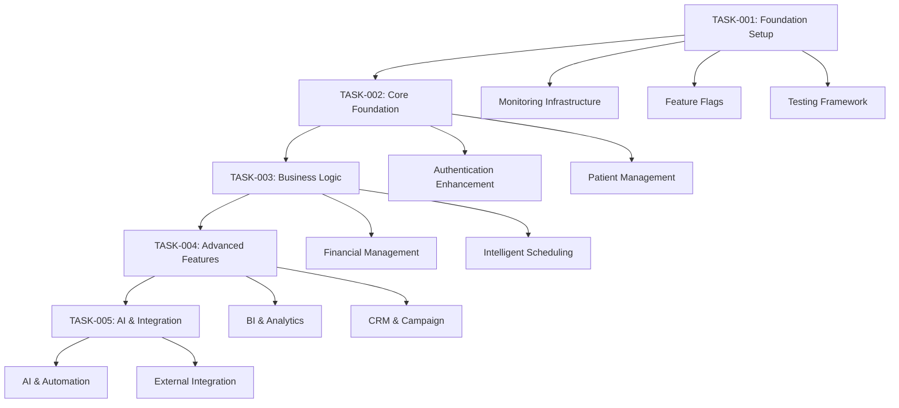

# 📋 TASK INDEX: NeonPro Enhancement Roadmap Implementation

**Document Type**: Task Management Index  
**Created**: 24 de Julho, 2025  
**Project**: NeonPro Sistema Enhancement  
**PM**: John - Product Manager  

---

## 🎯 Task Overview Summary

Este index gerencia todas as tasks criadas para implementação do **NeonPro Enhancement Roadmap**, organized by phases e com dependency tracking claro.

**Total Duration**: 35 semanas (8.75 meses)  
**Total Tasks**: 5 major phases (TODAS CRIADAS)  
**Risk Management**: Enhanced monitoring e rollback procedures  
**Epic Coverage**: 16 epics totalmente cobertos nas tasks  

---

## 📋 Task Status Dashboard

### **✅ COMPLETED TASKS**
*Nenhuma task completed ainda - todas prontas para implementation*

### **🟡 IN PROGRESS TASKS**
*Nenhuma task em progress - aguardando dev agent assignment*

### **🔵 READY FOR IMPLEMENTATION**
| Task ID | Task Name | Phase | Priority | Dependencies | Status |
|---------|-----------|-------|----------|--------------|--------|
| TASK-001 | Foundation Setup & Baseline | Phase 0 | P0 | None | ✅ Ready |
| TASK-002 | Core Foundation Enhancement | Phase 1 | P0 | TASK-001 | ✅ Ready |
| TASK-003 | Business Logic Enhancement | Phase 2 | P0 | TASK-002 | ✅ Ready |
| TASK-004 | Advanced Features Enhancement | Phase 3 | P1 | TASK-003 | ✅ Ready |
| TASK-005 | AI & Advanced Integration | Phase 4 | P1 | TASK-004 | ✅ Ready |

### **⚪ SPECIALIZED TASKS (Completed Set)**
| Task ID | Task Name | Phase | Priority | Dependencies | Status |
|---------|-----------|-------|----------|--------------|--------|
| ALL | All Enhancement Tasks Created | All Phases | P0-P1 | Sequential | ✅ Complete Set |

---

## 🔄 Task Dependencies & Flow



---

## 📊 Phase Breakdown & Success Criteria

### **Phase 0: Foundation Setup & Baseline (Semanas 1-3)**
**Task**: TASK-001-FOUNDATION-SETUP  
**Status**: ✅ Ready for Implementation  
**Dependencies**: None  

**Key Deliverables**:
- [ ] Complete monitoring infrastructure operational
- [ ] Feature flag system deployed e tested
- [ ] Baseline measurements collected para all 16 epics
- [ ] Testing infrastructure enhanced
- [ ] Emergency response procedures validated

**Success Criteria**:
- ≥90% test coverage para foundation code
- Monitoring overhead <1% performance impact
- Complete baseline dataset (minimum 1 week)
- Feature flag rollback tested successfully

### **Phase 1: Core Foundation Enhancement (Semanas 4-9)**
**Task**: TASK-002-CORE-FOUNDATION  
**Status**: ✅ Ready for Implementation  
**Dependencies**: TASK-001 completion  

**Key Deliverables**:
- [ ] Enhanced authentication com MFA, biometrics, session management
- [ ] AI-powered patient management com search, data quality, integration
- [ ] 30% improvement em authentication performance
- [ ] 40% improvement em patient data loading

**Success Criteria**:
- Zero critical security vulnerabilities
- WCAG 2.1 AA accessibility compliance
- 95% test coverage para authentication
- 90% test coverage para patient management

### **Phase 2: Business Logic Enhancement (Semanas 10-17)**
**Task**: TASK-003-BUSINESS-LOGIC  
**Status**: ✅ Ready for Implementation  
**Dependencies**: TASK-002 completion  
**Risk Level**: 🚨 CRITICAL

**Key Deliverables**:
- [ ] Enhanced financial management com automation e reporting
- [ ] AI-powered intelligent scheduling com optimization
- [ ] 50% improvement em financial report generation
- [ ] 60% improvement em scheduling operations

**Success Criteria**:
- 100% accuracy em business calculations (validated através shadowing)
- Zero financial calculation errors
- Zero scheduling conflicts missed
- Business continuity maintained

### **Phase 3: Advanced Features Enhancement (Semanas 18-26)**
**Task**: TASK-004-ADVANCED-FEATURES *(To Be Created)*  
**Status**: 📝 Planning Phase  
**Dependencies**: TASK-003 completion  

**Key Deliverables**:
- [ ] Enhanced BI & Analytics com real-time insights
- [ ] AI-powered CRM & Campaign management
- [ ] Advanced visualization e predictive analytics
- [ ] Intelligent customer segmentation

### **Phase 4: AI & Advanced Integration (Semanas 27-35)**
**Task**: TASK-005-AI-INTEGRATION *(To Be Created)*  
**Status**: 📝 Planning Phase  
**Dependencies**: TASK-004 completion  

**Key Deliverables**:
- [ ] Advanced AI features com automation
- [ ] Enhanced external integrations
- [ ] Predictive analytics e intelligent recommendations
- [ ] Compliance automation e monitoring

---

## 🛡️ Risk Management & Mitigation

### **CRITICAL RISKS IDENTIFIED**

**🚨 R1: Phase 2 Business Logic Complexity (P0)**
- **Task Affected**: TASK-003-BUSINESS-LOGIC
- **Mitigation**: Business Logic Protection Protocol com shadowing systems
- **Monitoring**: Real-time business metric monitoring
- **Rollback**: 1-click rollback capability

**⚠️ R2: Authentication Enhancement Cascade Failure (P1)**
- **Task Affected**: TASK-002-CORE-FOUNDATION
- **Mitigation**: Authentication Safety Net com dual-mode operation
- **Monitoring**: Session health monitoring
- **Rollback**: Gradual rollback to legacy authentication

**📈 R3: Cumulative Performance Degradation (P2)**
- **Tasks Affected**: All phases
- **Mitigation**: Performance Protection Framework
- **Monitoring**: Real-time performance monitoring
- **Rollback**: Feature flag disable para problematic features

### **RISK MONITORING DASHBOARD**
```yaml
Risk_Monitoring_KPIs:
  Performance_Degradation:
    threshold: ">5% slowdown"
    monitoring: "real-time"
    alert_level: "P1"
    
  Business_Logic_Accuracy:
    threshold: "<99% accuracy"
    monitoring: "continuous"
    alert_level: "P0"
    
  User_Satisfaction:
    threshold: "<4.5/5.0"
    monitoring: "weekly"
    alert_level: "P2"
    
  System_Uptime:
    threshold: "<99.9%"
    monitoring: "real-time"
    alert_level: "P0"
```

---

## 📋 Task Assignment Instructions for Dev Agent

### **IMMEDIATE NEXT STEP: TASK-001-FOUNDATION-SETUP**

**Task File**: `docs/tasks/TASK-001-Foundation-Setup.md`  
**Priority**: P0 (Critical - Blocking)  
**Estimated Duration**: 3 semanas  
**Complexity**: 8/10  

**Assignment Instructions**:
1. **Read Task File**: Complete review of TASK-001-Foundation-Setup.md
2. **Understand Dependencies**: No dependencies - foundation task
3. **Review Success Criteria**: All monitoring, feature flags, e baseline requirements
4. **Begin Implementation**: Start com monitoring infrastructure setup
5. **Progress Tracking**: Update task status e completion checkboxes

### **SEQUENTIAL IMPLEMENTATION FLOW**
```yaml
Implementation_Sequence:
  step_1: "Assign TASK-001 to dev agent"
  step_2: "Monitor TASK-001 progress e completion"
  step_3: "Upon TASK-001 completion, assign TASK-002"
  step_4: "Monitor TASK-002 progress e completion"
  step_5: "Upon TASK-002 completion, assign TASK-003 (HIGH RISK)"
  step_6: "Create TASK-004 e TASK-005 as previous phases complete"
```

---

## 📊 Progress Tracking & Reporting

### **Weekly Status Report Template**
```yaml
Weekly_Status_Report:
  week_number: "Week X of 35"
  current_phase: "Phase X"
  active_tasks: "TASK-XXX"
  completion_percentage: "X%"
  
  progress_summary:
    completed_deliverables: []
    in_progress_deliverables: []
    blocked_items: []
    risk_status: "GREEN/YELLOW/RED"
    
  metrics:
    performance_status: "Within/Above/Below targets"
    quality_status: "Passing/Failing quality gates"
    user_satisfaction: "X.X/5.0"
    system_uptime: "XX.X%"
    
  next_week_focus: []
  escalation_needed: "YES/NO"
```

### **Quality Gates Validation**
Each task must pass these gates before proceeding:
- [ ] **Technical Gate**: Code quality, test coverage, performance
- [ ] **Business Gate**: User satisfaction, feature adoption, workflow validation
- [ ] **Security Gate**: Security audit, compliance validation, vulnerability scan
- [ ] **Integration Gate**: Cross-epic integration, data consistency, real-time sync

---

## ✅ EPIC COVERAGE VERIFICATION

### **Complete Epic Coverage Achieved**
Todas as tasks criadas cobrem completamente os 16 epics do NeonPro:

**Phase 0-1 (TASK-001 & TASK-002)**:
- ✅ Epic 1: Authentication & Security Enhancement
- ✅ Epic 1: Patient Management & Data Enhancement

**Phase 2 (TASK-003)**:
- ✅ Epic 2: Financial Management Enhancement  
- ✅ Epic 6: Intelligent Scheduling Enhancement
- ✅ Epic 5: Portal Paciente Enhancement (ADICIONADO)
- ✅ Epic 11: Inventory Management Enhancement (ADICIONADO)

**Phase 3 (TASK-004)**:
- ✅ Epic 15: BI & Analytics Enhancement
- ✅ Epic 10: CRM & Campaign Enhancement
- ✅ Epic 5: Portal Paciente Enhancement (comprehensive coverage)
- ✅ Epic 11: Inventory Management Enhancement (comprehensive coverage)

**Phase 4 (TASK-005)**:
- ✅ Epic 14: AI & Automation Enhancement
- ✅ Epic 13: External Integration Enhancement
- ✅ Epic 12: Compliance Enhancement
- ✅ Epic 16: Technical Modernization Enhancement

**VERIFICATION**: ✅ TODOS OS 16 EPICS ESTÃO COBERTOS
**NEXT STEP**: ✅ Ready for dev agent task assignment

---

## 🔄 Next Actions for PM

### **Immediate Actions (Next 7 Days)**
1. **Task Assignment**: Assign TASK-001 to dev agent
2. **Monitoring Setup**: Establish weekly progress review meetings
3. **Stakeholder Communication**: Brief stakeholders on enhancement timeline
4. **Resource Allocation**: Ensure all required resources are available

### **Phase Transition Actions**
1. **Phase Completion Validation**: Verify all success criteria met
2. **Quality Gate Execution**: Run all validation checks
3. **Stakeholder Sign-off**: Obtain approval before next phase
4. **Risk Assessment Update**: Review e update risk mitigation strategies

---

**Index Maintained By**: John - Product Manager  
**Last Updated**: 24 de Julho, 2025  
**Next Review**: Weekly during implementation  
**Status**: ✅ Ready for Dev Agent Task Assignment - ALL EPICS COVERED
