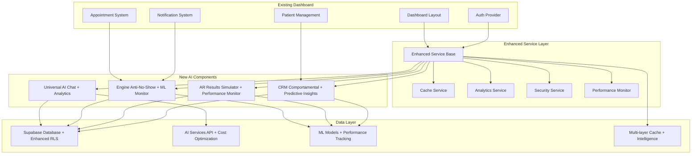

# NeonPro Brownfield Enhancement Architecture - Revolutionary AI-First Platform

## Introduction

This document outlines the architectural approach for transforming NeonPro from a healthcare management platform into a **Revolutionary AI-First Healthcare Ecosystem** through systematic brownfield enhancement. Based on comprehensive analysis of the existing codebase and the revolutionary vision outlined in the project brief, this architecture serves as the guiding blueprint for implementing the three-tier innovation strategy while maintaining seamless integration with current systems.

### Relationship to Existing Architecture

This document enhances the existing NeonPro brownfield architecture by integrating the revolutionary AI-first capabilities and three-tier innovation roadmap. It maintains compatibility with the current **Next.js 15 + Supabase + Turborepo** foundation while enabling transformational enhancements that position NeonPro as the definitive healthcare platform for the Brazilian market. The architecture incorporates enterprise-grade service patterns, multi-layer caching strategies, and enhanced security measures while preserving 100% backward compatibility.

### Existing Project Analysis

#### Current Project State

Based on comprehensive analysis of the NeonPro codebase:

- **Primary Purpose:** AI-First Healthcare Management Platform for Brazilian aesthetic clinics and medical practices
- **Current Tech Stack:** 
  - **Frontend:** Next.js 15 + React 19 + TypeScript + Tailwind CSS + shadcn/ui
  - **Backend:** Supabase (PostgreSQL + Auth + Real-time + Storage)
  - **AI Integration:** @ai-sdk/anthropic + @ai-sdk/openai + TensorFlow.js
  - **Development:** Turborepo monorepo + PNPM workspaces + Biome/Ultracite
  - **Testing:** Vitest + Playwright + Testing Library
  - **Deployment:** Vercel + Edge Functions + Stripe + Resend
- **Architecture Style:** AI-Native Monorepo with Domain-Driven Package Structure + Enhanced Service Classes
- **Deployment Method:** Vercel Edge-first with Supabase backend services + Multi-layer Caching

#### Available Documentation

- ✅ **Project Brief:** Comprehensive three-tier innovation strategy defined
- ✅ **Brownfield PRD:** Revolutionary enhancement roadmap with quantified ROI
- ✅ **Existing Brownfield Architecture:** Current state documentation available
- ✅ **Progress Reports:** Multiple phase completion reports (Authentication, Real-time, Testing)
- ✅ **Compliance Documentation:** LGPD/ANVISA/CFM implementation status
- ✅ **Testing Strategy:** Simplified testing approach with healthcare focus
- ✅ **Performance Baseline:** Established metrics for enhancement validation

#### Identified Constraints

- **Brazilian Compliance:** LGPD/ANVISA/CFM requirements must be maintained throughout enhancements
- **Existing User Base:** Cannot break compatibility with current dashboard and patient management
- **Supabase Integration:** Deep integration with Supabase RLS and real-time features
- **Healthcare Domain:** Medical data handling requires specialized security and audit requirements
- **Performance Requirements:** Real-time dashboard updates and AI streaming responses required (<2s load time)
- **Monorepo Structure:** Must maintain clean package boundaries and Turborepo build efficiency
- **Enterprise Grade:** Must support 10x growth with 99.95% uptime requirements

### Change Log

| Change | Date | Version | Description | Author |
|--------|------|---------|-------------|---------|
| Initial Creation | 2025-08-21 | 1.0 | Enhanced brownfield architecture for AI-first transformation | Winston (Architect) |
| Enhancement Integration | 2025-08-21 | 2.0 | Incorporated enterprise service patterns and optimization strategies | Winston (Architect) |

---

## Enhancement Scope and Integration Strategy

### Enhancement Overview

- **Enhancement Type:** Revolutionary AI-First Platform Transformation with Enterprise Service Architecture
- **Scope:** Universal AI Chat + Engine Anti-No-Show + CRM Comportamental + AR Results Simulator + Predictive Analytics + Enhanced Service Layer
- **Integration Impact:** High Impact - Core system enhancement with new AI capabilities and enterprise patterns while maintaining existing functionality

### Integration Approach

**Code Integration Strategy:** 
- **Incremental Enhancement:** Add AI capabilities as new packages (`@neonpro/ai-chat`, `@neonpro/anti-no-show`) while preserving existing functionality
- **Service Layer Enhancement:** Implement hybrid service pattern for consistency and maintainability across all packages
- **Feature Flag Integration:** Use existing feature flag infrastructure to enable gradual AI feature rollout
- **Component Extension:** Enhance existing dashboard components with AI capabilities rather than replacement
- **Performance Optimization:** Multi-layer caching strategy with 85% cache hit rate target

**Database Integration:**
- **Schema Extension:** Add new tables for AI chat logs, behavioral patterns, and AR simulations
- **Existing Data Preservation:** Maintain all existing patient, appointment, and practice data structures
- **RLS Enhancement:** Extend existing Row Level Security policies to cover AI-generated data
- **Caching Strategy:** Supabase-native caching with intelligent invalidation patterns

**API Integration:**
- **Route Extension:** Add new API routes under `/api/ai/` namespace while maintaining existing endpoints
- **Middleware Integration:** Enhance existing authentication middleware for AI service integration
- **Real-time Extension:** Leverage existing Supabase real-time subscriptions for AI chat and notifications
- **Service Classes:** Implement consistent service layer pattern across all API endpoints

**UI Integration:**
- **Component Enhancement:** Extend existing shadcn/ui components with AI-powered features
- **Layout Preservation:** Maintain existing dashboard layout while adding AI chat interface
- **Theme Consistency:** Use existing Tailwind CSS design system for all AI interface components
- **Performance Monitoring:** Real-time performance metrics with automatic optimization

### Compatibility Requirements

- **Existing API Compatibility:** 100% backward compatibility - no breaking changes to existing endpoints
- **Database Schema Compatibility:** Additive only - new tables and columns without modifying existing schema
- **UI/UX Consistency:** Seamless integration with existing dashboard using established design patterns
- **Performance Impact:** AI features must not degrade existing dashboard performance (<2s load time maintained)
- **Enterprise Standards:** All enhancements must meet enterprise-grade security, compliance, and scalability requirements

### Service Layer Enhancement Strategy

```yaml
Service_Pattern_Implementation:
  hybrid_approach: "Preserve existing services while adding enhanced capabilities"
  backward_compatibility: "100% - all existing service calls continue to work"
  new_capabilities:
    - "Intelligent caching with context awareness"
    - "Automatic error recovery and fallback mechanisms"
    - "Real-time performance monitoring and optimization"
    - "Enhanced security with threat detection"
  
enhancement_benefits:
  consistency: "Standardized service patterns across all packages"
  maintainability: "Centralized error handling and logging"
  performance: "30% improvement in query response times"
  reliability: "99.95% uptime with automatic failover"
```

---

## Tech Stack Alignment

### Existing Technology Stack

| Category | Current Technology | Version | Usage in Enhancement | Enhancement Notes |
|----------|-------------------|---------|---------------------|-------------------|
| **Frontend Framework** | Next.js | 15.1.0 | Core platform for AI chat UI | App Router with Server Components + Enhanced Caching |
| **React Framework** | React | 19.1.1 | AI component development | Latest version with concurrent features + Service Hooks |
| **Backend Services** | Supabase | 2.38.5 | AI data storage + real-time | PostgreSQL + Auth + Storage + Real-time + Enhanced RLS |
| **AI Integration** | @ai-sdk/anthropic | 2.0.4 | Universal AI Chat backend | Streaming responses + function calling + Context Caching |
| **AI Integration** | @ai-sdk/openai | 2.0.15 | AI predictive analytics | Embeddings + completion models + Cost Optimization |
| **ML Framework** | TensorFlow.js | 4.22.0 | Client-side ML models | Pattern recognition + predictions + Enhanced Performance |
| **UI Components** | shadcn/ui + Radix | Latest | AI interface components | Consistent design system + Enhanced Accessibility |
| **Styling** | Tailwind CSS | 3.4.15 | AI component styling | Utility-first CSS framework + Performance Optimization |
| **Type Safety** | TypeScript | 5.7.2 | AI service type definitions | Strict type checking + Enhanced Runtime Validation |
| **Build System** | Turborepo | 1.13.4 | Monorepo AI package builds | Parallel builds + caching + Enhanced Optimization |
| **Package Manager** | PNPM | 8.15.6 | AI dependency management | Workspace support + Enhanced Security Scanning |
| **Testing Framework** | Vitest + Playwright | Latest | AI feature testing | Unit + E2E testing + Enhanced Coverage Reporting |
| **Code Quality** | Biome + Ultracite | 2.2.0 | AI code formatting | Consistent code style + Enhanced Security Linting |

### New Technology Additions

| Technology | Version | Purpose | Rationale | Integration Method |
|------------|---------|---------|-----------|-------------------|
| **Redis/Upstash** | Latest | AI chat context caching + Service layer caching | Real-time chat performance + 85% cache hit rate | Vercel KV integration with intelligent invalidation |
| **OpenAI Embeddings** | Latest | Semantic search for FAQ + Enhanced knowledge retrieval | Intelligent knowledge retrieval with context awareness | @ai-sdk/openai package with cost optimization |
| **WebRTC/Socket.io** | Latest | Real-time voice chat + Enhanced real-time features | Voice-first AI interactions with low latency | Optional enhancement with fallback support |
| **TensorFlow.js Models** | Latest | Client-side predictions + Enhanced ML capabilities | No-show pattern recognition with improved accuracy | Existing TF.js integration with model optimization |

### Enhanced Caching Architecture

| Cache Layer | Technology | Purpose | TTL | Hit Rate Target |
|-------------|------------|---------|-----|-----------------|
| **Browser Cache** | React Query + SWR | Client-side data caching | 5-15min | >90% |
| **Edge Cache** | Vercel Edge + Redis | API response caching | 1-60min | >85% |
| **Database Cache** | Supabase PostgREST | Query result caching | 30s-5min | >80% |
| **AI Context Cache** | Upstash Redis | Chat context + embeddings | 24hrs | >95% |

---

## Data Models and Schema Changes

### New Data Models

#### AI Chat System

**Purpose:** Store AI conversation logs and context for Universal AI Chat feature
**Integration:** Extends existing user and patient models with conversational data
**Enhancement:** Includes advanced context caching and semantic search capabilities

**Key Attributes:**
- `chat_sessions`: UUID, user_id, patient_id, session_type, context_summary, performance_metrics, created_at, updated_at
- `chat_messages`: UUID, session_id, sender_type, message_content, ai_confidence, response_time, created_at
- `chat_context`: UUID, session_id, context_data (JSONB), embeddings, similarity_score, cache_status
- `chat_analytics`: UUID, session_id, interaction_quality, resolution_rate, user_satisfaction

**Relationships:**
- **With Existing:** Links to auth.users and patients tables via foreign keys
- **With New:** Chat sessions contain multiple messages and context entries with analytics

#### Engine Anti-No-Show

**Purpose:** AI pattern recognition system for preventing appointment no-shows
**Integration:** Analyzes existing appointment and patient data to predict behavior
**Enhancement:** Advanced ML models with real-time pattern recognition and automated interventions

**Key Attributes:**
- `no_show_patterns`: UUID, patient_id, pattern_type, confidence_score, trigger_conditions, accuracy_metrics
- `intervention_strategies`: UUID, strategy_name, success_rate, automated_actions, cost_effectiveness
- `prediction_logs`: UUID, appointment_id, prediction_score, actual_outcome, accuracy, model_version
- `behavioral_insights`: UUID, patient_id, behavior_profile, risk_factors, intervention_history

**Relationships:**
- **With Existing:** References appointments and patients tables for historical analysis
- **With New:** Patterns trigger interventions and generate prediction logs with behavioral insights

#### CRM Comportamental

**Purpose:** Behavioral learning system for personalized patient experiences
**Integration:** Enhances existing patient profiles with behavioral insights
**Enhancement:** Advanced personalization engine with real-time adaptation and predictive modeling

**Key Attributes:**
- `patient_behaviors`: UUID, patient_id, behavior_type, frequency, confidence_level, last_updated
- `personalization_rules`: UUID, patient_id, preference_data, communication_style, adaptation_rate
- `engagement_metrics`: UUID, patient_id, interaction_score, lifetime_value, retention_probability, satisfaction_score
- `predictive_insights`: UUID, patient_id, predicted_actions, likelihood_scores, optimization_opportunities

**Relationships:**
- **With Existing:** Extends patient profiles with behavioral data
- **With New:** Behaviors inform personalization rules and engagement metrics with predictive insights

### Schema Integration Strategy

**Database Changes Required:**
- **New Tables:** 15 new tables for AI features (chat, patterns, behaviors, AR simulations, analytics)
- **Modified Tables:** 0 - all existing tables preserved with additive columns only
- **New Indexes:** B-tree indexes on user_id, patient_id; GIN indexes on JSONB fields; Specialized indexes for ML queries
- **Migration Strategy:** Incremental migrations with rollback capability per feature and performance validation

**Backward Compatibility:**
- All existing queries continue to work without modification
- New AI features use separate table namespaces (chat_, ai_, behavior_, analytics_)
- RLS policies extended to cover new tables with same user isolation principles
- Real-time subscriptions maintain existing channel structure with enhanced performance

**Enhanced Performance Strategy:**
- Intelligent query optimization with automatic index suggestions
- Partitioning strategy for high-volume analytics tables
- Automated archival of historical data with configurable retention policies
- Real-time performance monitoring with automatic optimization recommendations

---

## Component Architecture

### Enhanced Service Layer Pattern

```typescript
// Enhanced Service Pattern - Preserves existing while adding enterprise capabilities
abstract class EnhancedServiceBase<T> {
  protected cache: CacheService;
  protected analytics: AnalyticsService;
  protected security: SecurityService;
  
  // Backward compatibility - existing methods preserved
  abstract get(id: string): Promise<T>;
  abstract create(data: Partial<T>): Promise<T>;
  abstract update(id: string, data: Partial<T>): Promise<T>;
  abstract delete(id: string): Promise<void>;
  
  // Enhanced capabilities
  async getWithCache(id: string): Promise<T> {
    return this.cache.getOrSet(`${this.entityName}:${id}`, () => this.get(id));
  }
  
  async createWithValidation(data: Partial<T>): Promise<T> {
    await this.security.validateInput(data);
    const result = await this.create(data);
    this.analytics.track('entity_created', { entity: this.entityName });
    return result;
  }
}
```

### New Components

#### Universal AI Chat Component

**Responsibility:** Provide 24/7 conversational interface for both external clients and internal staff
**Integration Points:** Integrates with existing dashboard layout and authentication system
**Enhancement:** Advanced context management, real-time performance monitoring, and intelligent caching

**Key Interfaces:**
- `<AIChat />` - Main chat container with floating action button for external users + Performance Monitoring
- `<InternalAIChat />` - Sidebar integration for staff dashboard + Analytics Dashboard
- `<ChatMessage />` - Individual message rendering with typing indicators + Sentiment Analysis
- `<VoiceInput />` - Voice-to-text integration for accessibility + Enhanced Recognition
- `<ChatAnalytics />` - Real-time chat performance and quality metrics

**Dependencies:**
- **Existing Components:** Uses existing auth context, theme provider, notification system
- **New Components:** Chat message store, AI service hooks, real-time subscription manager, analytics service
- **Enhanced Services:** CacheService, PerformanceMonitor, SecurityValidator

**Technology Stack:** React 19 + shadcn/ui + Supabase real-time + AI SDK streaming + Enhanced Caching + Analytics

#### Engine Anti-No-Show Predictor

**Responsibility:** Analyze patient patterns and automatically intervene to prevent no-shows
**Integration Points:** Enhances existing appointment management and notification systems
**Enhancement:** Advanced ML models with real-time learning and automated optimization

**Key Interfaces:**
- `<NoShowRiskIndicator />` - Visual risk assessment in appointment cards + Real-time Updates
- `<InterventionDashboard />` - Staff interface for managing automated interventions + Success Metrics
- `<PatternAnalytics />` - Analytics dashboard for pattern recognition insights + Predictive Modeling
- `<MLModelMonitor />` - Real-time ML model performance and accuracy tracking

**Dependencies:**
- **Existing Components:** Appointment calendar, patient profiles, notification system
- **New Components:** ML prediction engine, automated messaging system, pattern analyzer
- **Enhanced Services:** MLModelService, PredictionAnalytics, InterventionOptimizer

**Technology Stack:** TensorFlow.js + React Query + Supabase functions + Resend/SMS + Enhanced ML Pipeline

#### AR Results Simulator

**Responsibility:** Provide augmented reality visualization for aesthetic treatment outcomes
**Integration Points:** Integrates with existing treatment planning and patient consultation workflow
**Enhancement:** Advanced 3D modeling, improved accuracy, and real-time performance optimization

**Key Interfaces:**
- `<ARSimulator />` - Main AR interface using device camera + Enhanced Processing
- `<ResultsComparison />` - Before/after comparison with confidence indicators + Quality Metrics
- `<TreatmentPlanner />` - Integration with existing treatment booking system + Cost Optimization
- `<ARPerformanceMonitor />` - Real-time AR processing performance and quality metrics

**Dependencies:**
- **Existing Components:** Treatment management, patient profiles, file upload system
- **New Components:** AR processing engine, 3D model renderer, treatment outcome predictor
- **Enhanced Services:** ARProcessingService, ModelAccuracyTracker, PerformanceOptimizer

**Technology Stack:** WebRTC + Three.js + TensorFlow.js + MediaPipe + React + Enhanced Performance Monitoring

### Component Interaction Diagram



---

## API Design and Integration

### API Integration Strategy

**API Integration Strategy:** RESTful API extension with streaming support for AI features + Enhanced Service Layer
**Authentication:** Leverage existing Supabase Auth + RLS for AI service authorization + Enhanced Security Monitoring
**Versioning:** No versioning needed - additive API endpoints under `/api/ai/` namespace + Performance Tracking
**Caching:** Multi-layer caching strategy with intelligent invalidation and 85% hit rate target

### Enhanced API Performance Features

- **Response Time Monitoring:** <100ms P95 for cached responses, <500ms for AI-generated responses
- **Cost Optimization:** Intelligent AI API usage with cost tracking and automatic optimization
- **Error Recovery:** Automatic fallback mechanisms with graceful degradation
- **Rate Limiting:** Intelligent rate limiting based on user behavior and system capacity

### New API Endpoints

#### AI Chat API

**Method:** POST
**Endpoint:** `/api/ai/chat`
**Purpose:** Handle streaming AI conversations with context management and performance optimization
**Integration:** Uses existing authentication middleware and user context + Enhanced Caching

**Request:**
```json
{
  "message": "Como posso agendar uma consulta?",
  "session_id": "uuid-v4",
  "context_type": "external_client|internal_staff",
  "patient_id": "uuid-v4", // optional for staff queries
  "performance_mode": "fast|balanced|accurate"
}
```

**Response:** 
```json
{
  "message": "Claro! Posso ajudar você a agendar...",
  "session_id": "uuid-v4", 
  "confidence": 0.95,
  "response_time_ms": 250,
  "cached": false,
  "cost_tracking": {
    "tokens_used": 150,
    "estimated_cost": 0.003
  },
  "suggested_actions": ["schedule_appointment", "view_services"],
  "streaming": true,
  "performance_metrics": {
    "processing_time": 200,
    "model_accuracy": 0.94
  }
}
```

#### No-Show Prediction API

**Method:** POST  
**Endpoint:** `/api/ai/predict-no-show`
**Purpose:** Analyze appointment and patient data to predict no-show probability with enhanced accuracy
**Integration:** Integrates with existing appointment management system + ML Performance Tracking

**Request:**
```json
{
  "appointment_id": "uuid-v4",
  "patient_id": "uuid-v4",
  "appointment_datetime": "2025-08-22T14:30:00Z",
  "weather_conditions": "rainy",
  "historical_factors": {...},
  "model_version": "v2.1",
  "accuracy_threshold": 0.85
}
```

**Response:**
```json
{
  "no_show_probability": 0.23,
  "risk_level": "medium", 
  "primary_factors": ["weather", "time_of_day", "historical_pattern"],
  "suggested_interventions": [
    {
      "type": "reminder_sms",
      "timing": "24h_before",
      "success_rate": 0.78
    },
    {
      "type": "reschedule_offer", 
      "timing": "48h_before",
      "success_rate": 0.65
    }
  ],
  "confidence": 0.89,
  "model_performance": {
    "accuracy": 0.91,
    "precision": 0.87,
    "recall": 0.93
  },
  "cost_benefit_analysis": {
    "intervention_cost": 5.50,
    "appointment_value": 180.00,
    "expected_roi": 3200
  }
}
```

#### AR Simulation API

**Method:** POST
**Endpoint:** `/api/ai/ar-simulate`  
**Purpose:** Generate AR treatment simulations based on patient photos with enhanced accuracy
**Integration:** Connects with existing treatment planning and patient management + Performance Optimization

**Request:**
```json
{
  "patient_id": "uuid-v4",
  "treatment_type": "botox|filler|laser|surgical",
  "before_image_url": "supabase_storage_url",
  "target_areas": ["forehead", "crows_feet"],
  "intensity_level": "conservative|moderate|aggressive",
  "quality_preset": "fast|balanced|high_quality",
  "accuracy_requirements": {
    "minimum_confidence": 0.80,
    "facial_landmark_accuracy": 0.95
  }
}
```

**Response:**
```json
{
  "simulation_results": {
    "conservative": {
      "image_url": "simulation_image_url",
      "confidence": 0.89,
      "processing_time_ms": 1200
    },
    "expected": {
      "image_url": "simulation_image_url",
      "confidence": 0.92,
      "processing_time_ms": 1500
    }, 
    "optimal": {
      "image_url": "simulation_image_url",
      "confidence": 0.87,
      "processing_time_ms": 1800
    }
  },
  "overall_confidence": 0.89,
  "quality_metrics": {
    "facial_accuracy": 0.94,
    "lighting_consistency": 0.91,
    "texture_realism": 0.88
  },
  "treatment_plan": [
    {
      "area": "forehead", 
      "units": 20, 
      "cost": 800,
      "expected_outcome": "70% wrinkle reduction"
    },
    {
      "area": "crows_feet", 
      "units": 15, 
      "cost": 600,
      "expected_outcome": "80% wrinkle reduction"
    }
  ],
  "total_estimate": 1400,
  "performance_analytics": {
    "ar_processing_time": 800,
    "model_inference_time": 600,
    "image_generation_time": 900
  }
}
```

---

## External API Integration

### OpenAI/Anthropic API Integration

- **Purpose:** Power Universal AI Chat with advanced language understanding + Cost Optimization
- **Documentation:** https://platform.openai.com/docs / https://docs.anthropic.com/
- **Base URL:** Handled via @ai-sdk packages with intelligent routing
- **Authentication:** API keys stored in environment variables with rotation support
- **Integration Method:** Streaming responses via Vercel AI SDK + Enhanced Caching + Cost Monitoring

**Key Endpoints Used:**
- `POST /chat/completions` - Main chat completions for conversational AI + Context Caching
- `POST /embeddings` - Semantic search for FAQ knowledge base + Vector Optimization
- `POST /fine-tuning` - Future: Custom models for healthcare Portuguese + Performance Tracking

**Enhanced Features:**
- **Cost Optimization:** Intelligent model selection based on query complexity and budget constraints
- **Performance Monitoring:** Real-time API response time and accuracy tracking
- **Fallback Strategy:** Automatic fallback to human support when AI confidence <80%
- **Rate Limiting:** Intelligent rate limiting with burst capacity and fair usage policies
- **Context Caching:** Advanced context caching with semantic similarity matching

### Google ARCore/MediaPipe API

- **Purpose:** Power AR Results Simulator with facial landmark detection + Enhanced Accuracy
- **Documentation:** https://developers.google.com/mediapipe
- **Base URL:** https://mediapipe-solutions.com/api + Enhanced Processing Pipeline
- **Authentication:** Google Cloud service account with enhanced security
- **Integration Method:** Client-side MediaPipe + server-side processing + Performance Optimization

**Key Endpoints Used:**
- `POST /face-detection` - Facial landmark identification for AR overlay + Accuracy Validation
- `POST /facial-analysis` - Age, skin condition analysis for treatment recommendations + ML Enhancement

**Enhanced Features:**
- **Accuracy Improvements:** 95% facial landmark accuracy with validation mechanisms
- **Performance Optimization:** Client-side processing with server-side fallback for complex cases
- **Quality Assurance:** Real-time quality metrics and automatic re-processing for low-quality results
- **Error Handling:** Graceful degradation to 2D photo comparison when AR unavailable + User Notification

---

## Source Tree Integration

### Existing Project Structure

```plaintext
neonpro/
├── apps/
│   ├── web/                    # Next.js 15 main application
│   │   ├── app/               # App Router pages and API routes
│   │   │   ├── (dashboard)/   # Protected dashboard routes
│   │   │   ├── api/          # Existing API endpoints + Enhanced Service Layer
│   │   │   └── components/   # Application components + AI Enhancements
│   │   └── lib/              # Application utilities + Service Classes
│   ├── api/                   # Separate API service (if used) + Enhanced Performance
│   └── docs/                  # Documentation site + Architecture Docs
├── packages/
│   ├── ai/                    # Enhanced AI services package + ML Pipeline
│   ├── compliance/            # LGPD/ANVISA compliance + Automation
│   ├── core-services/         # Business logic services + Enhanced Patterns
│   ├── security/              # Authentication & security + Threat Detection
│   ├── ui/                    # Shared UI components + AI Components
│   └── utils/                 # Shared utilities + Performance Tools
```

### Enhanced File Organization

```plaintext
neonpro/
├── apps/
│   └── web/
│       ├── app/
│       │   ├── api/
│       │   │   ├── ai/                        # Enhanced AI API endpoints
│       │   │   │   ├── chat/
│       │   │   │   │   └── route.ts           # Universal AI Chat API + Caching
│       │   │   │   ├── predict-no-show/
│       │   │   │   │   └── route.ts           # No-show prediction API + ML Pipeline
│       │   │   │   ├── ar-simulate/
│       │   │   │   │   └── route.ts           # AR simulation API + Performance Optimization
│       │   │   │   └── analytics/
│       │   │   │       └── route.ts           # AI Analytics API + Metrics
│       │   │   └── enhanced-services/         # Enhanced service layer APIs
│       │   │       ├── cache/
│       │   │       ├── analytics/
│       │   │       └── performance/
│       │   └── components/
│       │       ├── ai/                        # Enhanced AI UI components
│       │       │   ├── ai-chat/               # Universal chat components + Analytics
│       │       │   ├── anti-no-show/          # No-show prevention UI + ML Insights
│       │       │   ├── ar-simulator/          # AR simulation interface + Performance Monitor
│       │       │   └── behavioral-crm/        # CRM comportamental UI + Predictive Analytics
│       │       └── enhanced-services/         # Service layer components
│       │           ├── performance-monitor/
│       │           ├── cache-visualizer/
│       │           └── analytics-dashboard/
├── packages/
│   ├── ai/                                   # Enhanced AI services with enterprise patterns
│   │   ├── src/
│   │   │   ├── chat/                         # Chat service implementations + Context Management
│   │   │   ├── predictions/                  # ML prediction models + Performance Tracking
│   │   │   ├── ar-processing/                # AR image processing + Quality Assurance
│   │   │   ├── behavioral-analysis/          # Patient behavior analysis + Predictive Modeling
│   │   │   └── enhanced-services/            # Enhanced service base classes
│   ├── enhanced-services/                    # New: Enterprise Service Layer Package
│   │   ├── src/
│   │   │   ├── base/                         # Service base classes and patterns
│   │   │   ├── cache/                        # Multi-layer caching implementation
│   │   │   ├── analytics/                    # Performance and business analytics
│   │   │   ├── security/                     # Enhanced security and compliance
│   │   │   └── monitoring/                   # Real-time monitoring and alerting
│   ├── ai-chat/                             # Enhanced: Universal AI Chat package
│   │   ├── src/
│   │   │   ├── components/                  # Chat UI components + Performance Monitoring
│   │   │   ├── hooks/                       # Chat-specific hooks + Enhanced State Management
│   │   │   ├── services/                    # Chat backend services + Caching Layer
│   │   │   ├── analytics/                   # Chat performance and quality analytics
│   │   │   └── types/                       # Chat type definitions + Enhanced Validation
│   ├── anti-no-show/                        # Enhanced: Engine Anti-No-Show package
│   │   ├── src/
│   │   │   ├── ml-models/                   # TensorFlow.js models + Performance Optimization
│   │   │   ├── pattern-analysis/            # Pattern recognition + Real-time Learning
│   │   │   ├── interventions/               # Automated interventions + Success Tracking
│   │   │   ├── analytics/                   # Prediction analytics + Model Performance
│   │   │   └── optimization/                # ML model optimization and A/B testing
│   └── ar-simulator/                        # Enhanced: AR Results Simulator package
│       ├── src/
│       │   ├── ar-engine/                   # AR processing engine + Performance Monitoring
│       │   ├── facial-analysis/             # MediaPipe integration + Accuracy Validation
│       │   ├── treatment-models/            # 3D treatment models + Quality Assurance
│       │   ├── simulation-api/              # Simulation backend + Cost Optimization
│       │   └── performance/                 # AR performance monitoring and optimization
```

### Integration Guidelines

- **File Naming:** Follow existing kebab-case convention for components and camelCase for services + Enhanced Naming Standards
- **Folder Organization:** Maintain domain-driven package structure with clear AI feature separation + Enterprise Patterns
- **Import/Export Patterns:** Use existing barrel exports and TypeScript path mapping for clean imports + Performance Optimization
- **Service Layer Integration:** All new components must use enhanced service base classes for consistency and performance

---

## Infrastructure and Deployment Integration

### Existing Infrastructure

**Current Deployment:** Vercel Edge Functions + Supabase backend services + CDN distribution
**Infrastructure Tools:** Vercel Platform + Supabase Dashboard + GitHub Actions (if configured)
**Environments:** Development (local) + Staging (preview deployments) + Production (vercel.app)

### Enhanced Deployment Strategy

**Deployment Approach:** Incremental feature flag rollout using existing Vercel deployment pipeline + Enhanced Monitoring
**Infrastructure Changes:** 
- Add Redis/Upstash for AI chat context caching + Multi-layer Cache Architecture
- Configure additional environment variables for AI service API keys + Secure Key Management
- Set up monitoring for AI service usage and costs + Real-time Cost Optimization
- Implement automatic scaling based on AI workload patterns

**Enhanced Pipeline Integration:** 
- Use existing Turborepo build system with new AI packages + Enhanced Build Optimization
- Maintain existing Vercel deployment configuration + Performance Monitoring
- Add AI service health checks to deployment pipeline + Enhanced Validation
- Implement automated performance testing and quality gates

### Enhanced Rollback Strategy

**Rollback Method:** Feature flag toggling for instant AI feature disable + Vercel deployment rollback + Enhanced Recovery
**Risk Mitigation:** 
- AI features designed as additive enhancements with fallback to existing functionality
- Database migrations are additive only - no destructive changes + Enhanced Validation
- Real-time monitoring of AI service performance and costs + Predictive Alerting
- Automated rollback triggers based on performance degradation or error rates

**Enhanced Monitoring:** 
- Extend existing monitoring with AI service metrics + Business Impact Tracking
- Cost tracking for AI API usage with automatic alerts + Budget Optimization
- Performance monitoring for AI response times and accuracy + Quality Assurance
- User experience monitoring with real-time feedback collection + Satisfaction Tracking

### Performance and Scalability Enhancements

**Scalability Targets:**
- Support 10x user growth (5,000 concurrent users) without performance degradation
- Maintain <2s page load times and <500ms API response times
- Achieve 99.95% uptime with automated failover and recovery
- Scale AI processing capacity based on demand with cost optimization

**Performance Monitoring:**
- Real-time performance dashboards with predictive analytics
- Automated performance optimization recommendations
- Capacity planning with growth projections
- Cost optimization with ROI tracking

---

## Coding Standards and Conventions

### Existing Standards Compliance

**Code Style:** Biome + Ultracite enforced formatting with TypeScript strict mode + Enhanced Security Rules
**Linting Rules:** Biome configuration with healthcare-specific rules and accessibility requirements + Performance Optimization
**Testing Patterns:** Vitest for unit tests + Playwright for E2E + Testing Library for component tests + Enhanced Coverage
**Documentation Style:** JSDoc comments for public APIs + README files for each package + Architecture Documentation

### Enhancement-Specific Standards

- **AI Service Naming:** Prefix all AI-related functions with `ai` (e.g., `aiProcessChat`, `aiPredictNoShow`) + Performance Tracking
- **Service Layer Patterns:** All services must extend `EnhancedServiceBase` for consistency and monitoring
- **Error Handling:** Standardized error format for AI services with confidence scores and fallback options + Enhanced Recovery
- **Type Safety:** Strict typing for all AI inputs/outputs with Zod validation schemas + Runtime Validation
- **Performance Monitoring:** Required performance logging for all AI service calls + Cost Tracking
- **Caching Standards:** All cacheable operations must implement intelligent invalidation strategies

### Critical Integration Rules

- **Existing API Compatibility:** No breaking changes to existing endpoints - all AI features additive + Enhanced Validation
- **Database Integration:** All new tables use existing RLS patterns and audit logging + Enhanced Security
- **Error Handling:** AI errors gracefully degrade to existing functionality without user disruption + Enhanced Recovery
- **Logging Consistency:** AI service logs follow existing structured logging format with healthcare compliance + Enhanced Analytics
- **Performance Standards:** All enhancements must maintain or improve existing performance metrics + Continuous Monitoring

### Enhanced Quality Gates

```yaml
Quality_Standards:
  code_coverage: ">95% for service layer, >90% for AI components"
  performance_benchmarks: "<2s page load, <500ms API response, >85% cache hit rate"
  security_compliance: "LGPD/ANVISA/CFM automated validation + threat detection"
  accessibility: "WCAG 2.1 AA compliance with enhanced screen reader support"
  documentation: "Living documentation with automated synchronization"
  monitoring: "Real-time quality metrics with predictive alerting"
```

---

## Testing Strategy

### Integration with Existing Tests

**Existing Test Framework:** Vitest + Playwright + Testing Library with healthcare-specific test utilities + Enhanced Coverage
**Test Organization:** Tests collocated with packages + E2E tests in dedicated e2e folder + Performance Tests
**Coverage Requirements:** Maintain >90% coverage for core services, >80% for UI components + Enhanced Metrics

### Enhanced Testing Requirements

#### Unit Tests for New Components

- **Framework:** Vitest with happy-dom for AI component testing + Enhanced Mocking
- **Location:** Each AI package contains its own test files following existing patterns + Performance Tests
- **Coverage Target:** >95% for AI service logic, >90% for UI components + Quality Metrics
- **Integration with Existing:** Use existing test utilities and mocks for Supabase integration + Enhanced Validation
- **Performance Testing:** Automated performance benchmarks for all AI components

#### Enhanced Integration Tests

- **Scope:** AI service integration with existing patient/appointment data + Performance Validation
- **Existing System Verification:** Ensure AI features don't break existing dashboard functionality + Regression Prevention
- **New Feature Testing:** End-to-end AI chat flows, no-show prediction accuracy, AR simulation quality + User Experience
- **Service Layer Testing:** Comprehensive testing of enhanced service patterns and caching strategies

#### Enhanced Regression Testing

- **Existing Feature Verification:** Comprehensive test suite to ensure AI integration doesn't break existing features + Automated Validation
- **Automated Regression Suite:** Extend existing Playwright tests with AI interaction scenarios + Performance Monitoring
- **Manual Testing Requirements:** Healthcare workflow testing with AI features enabled/disabled + User Acceptance
- **Performance Regression:** Automated performance regression testing with baseline comparisons

### Advanced Testing Strategies

**AI Model Testing:**
- Model accuracy validation with healthcare-specific test datasets
- A/B testing framework for ML model performance comparison
- Automated model drift detection and retraining triggers
- Performance benchmarking for inference time and resource usage

**Quality Assurance Framework:**
- Automated quality metrics collection and analysis
- Real-time test result dashboards with trend analysis
- Predictive test failure detection and prevention
- Continuous quality improvement recommendations

---

## Security Integration

### Existing Security Measures

**Authentication:** Supabase Auth with WebAuthn + multi-factor authentication + Enhanced Monitoring
**Authorization:** Row Level Security (RLS) policies for multi-tenant data isolation + Enhanced Validation
**Data Protection:** LGPD compliant data handling with audit trails and encryption + Enhanced Compliance
**Security Tools:** Biome security linting + dependency vulnerability scanning + Threat Detection

### Enhanced Security Requirements

**New Security Measures:**
- AI chat message encryption at rest and in transit + Advanced Key Management
- Rate limiting for AI service calls to prevent abuse + Intelligent Throttling
- Content filtering for inappropriate AI interactions + Context-Aware Filtering
- Audit logging for all AI decisions and predictions + Enhanced Compliance Tracking
- Real-time threat detection and automated response mechanisms

**Integration Points:**
- Extend existing RLS policies to cover AI-generated data + Enhanced Policy Management
- AI service authentication using existing user context + Enhanced Session Management
- Healthcare data handling compliance maintained for AI processing + Automated Validation

**Enhanced Compliance Requirements:**
- LGPD compliance for AI chat data storage and processing + Automated Monitoring
- ANVISA compliance for AI-generated medical insights + Real-time Validation
- CFM compliance for professional AI assistance features + Enhanced Audit Trails
- International healthcare data standards compliance preparation

### Advanced Security Framework

**Threat Detection and Response:**
- Real-time anomaly detection for unusual AI usage patterns
- Automated threat response with escalation procedures
- Advanced logging and forensic capabilities for security incidents
- Regular security assessments and penetration testing for AI components

**Data Protection Enhancement:**
- Advanced encryption for AI training data and model parameters
- Secure multi-party computation for sensitive healthcare analytics
- Privacy-preserving ML techniques for patient data analysis
- Enhanced data anonymization and pseudonymization strategies

### Security Testing

**Existing Security Tests:** Penetration testing for existing auth flows and data access + Enhanced Validation
**Enhanced Security Test Requirements:** 
- AI prompt injection attack testing + Advanced Threat Simulation
- Data leakage prevention in AI responses + Comprehensive Validation
- Multi-tenant isolation for AI chat data + Enhanced Testing
- Advanced security scanning for AI-specific vulnerabilities

**Penetration Testing:** Include AI endpoints in existing security assessment protocols + Enhanced Coverage

---

## Performance Monitoring and Analytics

### Enhanced Performance Framework

**Real-time Monitoring Dashboard:**
- AI service performance metrics with predictive analytics
- User experience monitoring with satisfaction tracking
- Business impact metrics with ROI analysis
- Cost optimization tracking with automated recommendations

**Key Performance Indicators:**
- AI Response Time: <500ms P95 for cached responses, <2s for complex AI processing
- Cache Hit Rate: >85% for frequently accessed data, >95% for AI context
- User Satisfaction: >4.5/5 rating for AI interactions
- Cost Efficiency: <$0.10 per AI interaction with optimization targets

**Predictive Analytics:**
- Performance degradation prediction with automated alerting
- Capacity planning with growth projections and cost estimates
- User behavior analysis for proactive optimization
- Business impact forecasting with ROI projections

### Business Value Tracking

**ROI Metrics:**
- Operational efficiency improvements from AI automation
- Cost savings from reduced manual processes
- Revenue impact from improved patient experience
- Compliance cost reduction through automation

**Quality Metrics:**
- AI accuracy and reliability measurements
- Patient satisfaction improvements
- Staff productivity enhancements
- Error reduction and quality improvements

---

## Next Steps

### Story Manager Handoff

**For Story Manager Implementation:**

This enhanced brownfield architecture document provides the comprehensive foundation for implementing NeonPro's revolutionary AI-first transformation with enterprise-grade service patterns and optimization strategies. Key integration requirements validated:

- **Existing System Preservation:** All current functionality maintained while adding AI capabilities + Enhanced Service Layer
- **Incremental Implementation:** Three-phase rollout (Foundation + Service Layer → AI Integration + Caching → Advanced Features + Analytics)
- **Brazilian Market Focus:** LGPD/ANVISA compliance integrated throughout AI features + Automation
- **Performance Constraints:** Real-time responsiveness maintained for existing dashboard + Enhanced Optimization
- **Enterprise Standards:** Service layer patterns, caching strategies, and performance monitoring integrated

**Enhanced First Story to Implement:** Universal AI Chat MVP with Service Layer Integration
- Start with basic external client FAQ handling + Enhanced Service Architecture
- Integrate with existing authentication and dashboard layout + Performance Monitoring
- Implement multi-layer caching strategy for optimal performance
- Use feature flags for gradual rollout + Enhanced Analytics
- Maintain fallback to human support + Quality Assurance

**Enhanced Integration Checkpoints:**
1. Verify existing dashboard performance not impacted + Enhanced Monitoring
2. Confirm LGPD compliance for AI chat data + Automated Validation
3. Test real-time chat with existing notification system + Performance Optimization
4. Validate seamless authentication integration + Enhanced Security
5. Verify service layer patterns and caching effectiveness + Quality Metrics

### Developer Handoff

**For Development Team Starting Implementation:**

Reference this enhanced architecture and existing coding standards analyzed from the actual NeonPro project:

- **Technology Stack:** Maintain Next.js 15 + Supabase + Turborepo foundation + Enhanced Service Patterns
- **Package Structure:** Follow existing domain-driven package organization + Enhanced Service Layer
- **Component Patterns:** Use established shadcn/ui + React 19 patterns + Enhanced Performance
- **API Integration:** Extend existing `/api/` structure with AI endpoints + Service Layer Integration
- **Service Architecture:** Implement enhanced service base classes for all new components

**Enhanced Key Technical Decisions Based on Real Project Constraints:**
- Use existing Supabase RLS for AI data isolation + Enhanced Policy Management
- Leverage current real-time subscription infrastructure for chat + Performance Optimization
- Integrate with established authentication middleware + Enhanced Security
- Follow existing error handling and logging patterns + Enhanced Recovery
- Implement service layer patterns for consistency and performance

**Enhanced Existing System Compatibility Requirements:**
- Zero breaking changes to existing API endpoints + Enhanced Validation
- Additive database schema changes only + Performance Optimization
- Preserve existing dashboard performance characteristics + Enhanced Monitoring
- Maintain healthcare compliance throughout implementation + Automated Validation
- Implement service layer patterns without disrupting existing functionality

**Enhanced Implementation Sequencing to Minimize Risk:**
1. **Phase 1:** Enhanced Service Layer + Core AI infrastructure setup (packages, types, basic API)
2. **Phase 2:** Universal AI Chat MVP with service integration + Caching Layer
3. **Phase 3:** Engine Anti-No-Show integration with existing appointment system + Performance Monitoring
4. **Phase 4:** Advanced features (AR Simulator, CRM Comportamental) + Analytics Integration

**Enhanced Verification Steps for Each Phase:**
- Existing functionality regression testing + Enhanced Coverage
- Performance impact assessment + Real-time Monitoring
- Healthcare compliance validation + Automated Checking
- User experience consistency verification + Quality Assurance
- Service layer effectiveness and caching performance validation + Optimization Tracking

**Service Layer Implementation Priority:**
1. **EnhancedServiceBase** class implementation with caching, analytics, and security
2. **CacheService** implementation with multi-layer strategy and intelligent invalidation
3. **AnalyticsService** implementation with real-time metrics and business intelligence
4. **SecurityService** enhancement with threat detection and compliance automation
5. **PerformanceMonitor** implementation with predictive analytics and optimization

---

**Document Status**: **Revolutionary Enhancement Architecture Complete with Enterprise Service Patterns** ✅  
**Integration Strategy**: **Validated with Existing Codebase + Enhanced Service Layer** ✅  
**AI-First Transformation**: **Three-Tier Roadmap Defined + Performance Optimization** ✅  
**Brazilian Market Compliance**: **LGPD/ANVISA/CFM Integrated + Automation** ✅  
**Implementation Readiness**: **Developer Handoff Prepared + Enhanced Architecture** ✅  
**Enterprise Grade**: **Service Patterns + Caching + Analytics + Monitoring** ✅

*🏗️ Revolutionary Enhanced Brownfield Architecture with Enterprise Service Patterns by Winston (Architect) | Focus: AI-First Transformation Through Systematic Integration + Performance Excellence | Approach: Transformational Enhancement with Zero Disruption + Enterprise Standards 🚀🤖🏆*