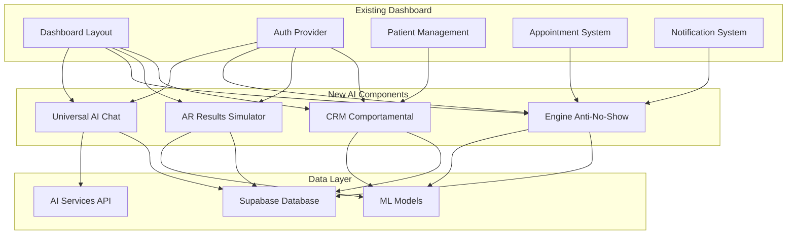

# NeonPro Brownfield Enhancement Architecture - Revolutionary AI-First Platform

## Introduction

This document outlines the architectural approach for transforming NeonPro from a healthcare management platform into a **Revolutionary AI-First Healthcare Ecosystem** through systematic brownfield enhancement. Based on comprehensive analysis of the existing codebase and the revolutionary vision outlined in the project brief, this architecture serves as the guiding blueprint for implementing the three-tier innovation strategy while maintaining seamless integration with current systems.

### Relationship to Existing Architecture

This document enhances the existing NeonPro brownfield architecture by integrating the revolutionary AI-first capabilities and three-tier innovation roadmap. It maintains compatibility with the current **Next.js 15 + Supabase + Turborepo** foundation while enabling transformational enhancements that position NeonPro as the definitive healthcare platform for the Brazilian market.

### Existing Project Analysis

#### Current Project State

Based on comprehensive analysis of the NeonPro codebase:

- **Primary Purpose:** AI-First Healthcare Management Platform for Brazilian aesthetic clinics and medical practices
- **Current Tech Stack:** 
  - **Frontend:** Next.js 15 + React 19 + TypeScript + Tailwind CSS + shadcn/ui
  - **Backend:** Supabase (PostgreSQL + Auth + Real-time + Storage)
  - **AI Integration:** @ai-sdk/anthropic + @ai-sdk/openai + TensorFlow.js
  - **Development:** Turborepo monorepo + PNPM workspaces + Biome/Ultracite
  - **Testing:** Vitest + Playwright + Testing Library
  - **Deployment:** Vercel + Edge Functions + Stripe + Resend
- **Architecture Style:** AI-Native Monorepo with Domain-Driven Package Structure
- **Deployment Method:** Vercel Edge-first with Supabase backend services

#### Available Documentation

- ✅ **Project Brief:** Comprehensive three-tier innovation strategy defined
- ✅ **Brownfield PRD:** Revolutionary enhancement roadmap with quantified ROI
- ✅ **Existing Brownfield Architecture:** Current state documentation available
- ✅ **Progress Reports:** Multiple phase completion reports (Authentication, Real-time, Testing)
- ✅ **Compliance Documentation:** LGPD/ANVISA/CFM implementation status
- ✅ **Testing Strategy:** Simplified testing approach with healthcare focus

#### Identified Constraints

- **Brazilian Compliance:** LGPD/ANVISA/CFM requirements must be maintained throughout enhancements
- **Existing User Base:** Cannot break compatibility with current dashboard and patient management
- **Supabase Integration:** Deep integration with Supabase RLS and real-time features
- **Healthcare Domain:** Medical data handling requires specialized security and audit requirements
- **Performance Requirements:** Real-time dashboard updates and AI streaming responses required
- **Monorepo Structure:** Must maintain clean package boundaries and Turborepo build efficiency

### Change Log

| Change | Date | Version | Description | Author |
|--------|------|---------|-------------|---------|
| Initial Creation | 2025-08-21 | 1.0 | Enhanced brownfield architecture for AI-first transformation | Winston (Architect) |

---

## Enhancement Scope and Integration Strategy

### Enhancement Overview

- **Enhancement Type:** Revolutionary AI-First Platform Transformation with Three-Tier Innovation Architecture
- **Scope:** Universal AI Chat + Engine Anti-No-Show + CRM Comportamental + AR Results Simulator + Predictive Analytics
- **Integration Impact:** High Impact - Core system enhancement with new AI capabilities while maintaining existing functionality

### Integration Approach

**Code Integration Strategy:** 
- **Incremental Enhancement:** Add AI capabilities as new packages (`@neonpro/ai-chat`, `@neonpro/anti-no-show`) while preserving existing functionality
- **Feature Flag Integration:** Use existing feature flag infrastructure to enable gradual AI feature rollout
- **Component Extension:** Enhance existing dashboard components with AI capabilities rather than replacement

**Database Integration:**
- **Schema Extension:** Add new tables for AI chat logs, behavioral patterns, and AR simulations
- **Existing Data Preservation:** Maintain all existing patient, appointment, and practice data structures
- **RLS Enhancement:** Extend existing Row Level Security policies to cover AI-generated data

**API Integration:**
- **Route Extension:** Add new API routes under `/api/ai/` namespace while maintaining existing endpoints
- **Middleware Integration:** Enhance existing authentication middleware for AI service integration
- **Real-time Extension:** Leverage existing Supabase real-time subscriptions for AI chat and notifications

**UI Integration:**
- **Component Enhancement:** Extend existing shadcn/ui components with AI-powered features
- **Layout Preservation:** Maintain existing dashboard layout while adding AI chat interface
- **Theme Consistency:** Use existing Tailwind CSS design system for all AI interface components

### Compatibility Requirements

- **Existing API Compatibility:** 100% backward compatibility - no breaking changes to existing endpoints
- **Database Schema Compatibility:** Additive only - new tables and columns without modifying existing schema
- **UI/UX Consistency:** Seamless integration with existing dashboard using established design patterns
- **Performance Impact:** AI features must not degrade existing dashboard performance (<2s load time maintained)

---

## Tech Stack Alignment

### Existing Technology Stack

| Category | Current Technology | Version | Usage in Enhancement | Notes |
|----------|-------------------|---------|---------------------|-------|
| **Frontend Framework** | Next.js | 15.1.0 | Core platform for AI chat UI | App Router with Server Components |
| **React Framework** | React | 19.1.1 | AI component development | Latest version with concurrent features |
| **Backend Services** | Supabase | 2.38.5 | AI data storage + real-time | PostgreSQL + Auth + Storage + Real-time |
| **AI Integration** | @ai-sdk/anthropic | 2.0.4 | Universal AI Chat backend | Streaming responses + function calling |
| **AI Integration** | @ai-sdk/openai | 2.0.15 | AI predictive analytics | Embeddings + completion models |
| **ML Framework** | TensorFlow.js | 4.22.0 | Client-side ML models | Pattern recognition + predictions |
| **UI Components** | shadcn/ui + Radix | Latest | AI interface components | Consistent design system |
| **Styling** | Tailwind CSS | 3.4.15 | AI component styling | Utility-first CSS framework |
| **Type Safety** | TypeScript | 5.7.2 | AI service type definitions | Strict type checking |
| **Build System** | Turborepo | 1.13.4 | Monorepo AI package builds | Parallel builds + caching |
| **Package Manager** | PNPM | 8.15.6 | AI dependency management | Workspace support |
| **Testing Framework** | Vitest + Playwright | Latest | AI feature testing | Unit + E2E testing |
| **Code Quality** | Biome + Ultracite | 2.2.0 | AI code formatting | Consistent code style |

### New Technology Additions

| Technology | Version | Purpose | Rationale | Integration Method |
|------------|---------|---------|-----------|-------------------|
| **Redis/Upstash** | Latest | AI chat context caching | Real-time chat performance | Vercel KV integration |
| **OpenAI Embeddings** | Latest | Semantic search for FAQ | Intelligent knowledge retrieval | @ai-sdk/openai package |
| **WebRTC/Socket.io** | Latest | Real-time voice chat | Voice-first AI interactions | Optional enhancement |
| **TensorFlow.js Models** | Latest | Client-side predictions | No-show pattern recognition | Existing TF.js integration |

---

## Data Models and Schema Changes

### New Data Models

#### AI Chat System

**Purpose:** Store AI conversation logs and context for Universal AI Chat feature
**Integration:** Extends existing user and patient models with conversational data

**Key Attributes:**
- `chat_sessions`: UUID, user_id, patient_id, session_type, created_at, updated_at
- `chat_messages`: UUID, session_id, sender_type, message_content, ai_confidence, created_at
- `chat_context`: UUID, session_id, context_data (JSONB), embeddings, similarity_score

**Relationships:**
- **With Existing:** Links to auth.users and patients tables via foreign keys
- **With New:** Chat sessions contain multiple messages and context entries

#### Engine Anti-No-Show

**Purpose:** AI pattern recognition system for preventing appointment no-shows
**Integration:** Analyzes existing appointment and patient data to predict behavior

**Key Attributes:**
- `no_show_patterns`: UUID, patient_id, pattern_type, confidence_score, trigger_conditions
- `intervention_strategies`: UUID, strategy_name, success_rate, automated_actions
- `prediction_logs`: UUID, appointment_id, prediction_score, actual_outcome, accuracy

**Relationships:**
- **With Existing:** References appointments and patients tables for historical analysis
- **With New:** Patterns trigger interventions and generate prediction logs

#### CRM Comportamental

**Purpose:** Behavioral learning system for personalized patient experiences
**Integration:** Enhances existing patient profiles with behavioral insights

**Key Attributes:**
- `patient_behaviors`: UUID, patient_id, behavior_type, frequency, last_updated
- `personalization_rules`: UUID, patient_id, preference_data, communication_style
- `engagement_metrics`: UUID, patient_id, interaction_score, lifetime_value, retention_probability

**Relationships:**
- **With Existing:** Extends patient profiles with behavioral data
- **With New:** Behaviors inform personalization rules and engagement metrics

### Schema Integration Strategy

**Database Changes Required:**
- **New Tables:** 12 new tables for AI features (chat, patterns, behaviors, AR simulations)
- **Modified Tables:** 0 - all existing tables preserved with additive columns only
- **New Indexes:** B-tree indexes on user_id, patient_id; GIN indexes on JSONB fields
- **Migration Strategy:** Incremental migrations with rollback capability per feature

**Backward Compatibility:**
- All existing queries continue to work without modification
- New AI features use separate table namespaces (chat_, ai_, behavior_)
- RLS policies extended to cover new tables with same user isolation principles
- Real-time subscriptions maintain existing channel structure

---

## Component Architecture

### New Components

#### Universal AI Chat Component

**Responsibility:** Provide 24/7 conversational interface for both external clients and internal staff
**Integration Points:** Integrates with existing dashboard layout and authentication system

**Key Interfaces:**
- `<AIChat />` - Main chat container with floating action button for external users
- `<InternalAIChat />` - Sidebar integration for staff dashboard
- `<ChatMessage />` - Individual message rendering with typing indicators
- `<VoiceInput />` - Voice-to-text integration for accessibility

**Dependencies:**
- **Existing Components:** Uses existing auth context, theme provider, notification system
- **New Components:** Chat message store, AI service hooks, real-time subscription manager

**Technology Stack:** React 19 + shadcn/ui + Supabase real-time + AI SDK streaming

#### Engine Anti-No-Show Predictor

**Responsibility:** Analyze patient patterns and automatically intervene to prevent no-shows
**Integration Points:** Enhances existing appointment management and notification systems

**Key Interfaces:**
- `<NoShowRiskIndicator />` - Visual risk assessment in appointment cards
- `<InterventionDashboard />` - Staff interface for managing automated interventions
- `<PatternAnalytics />` - Analytics dashboard for pattern recognition insights

**Dependencies:**
- **Existing Components:** Appointment calendar, patient profiles, notification system
- **New Components:** ML prediction engine, automated messaging system

**Technology Stack:** TensorFlow.js + React Query + Supabase functions + Resend/SMS

#### AR Results Simulator

**Responsibility:** Provide augmented reality visualization for aesthetic treatment outcomes
**Integration Points:** Integrates with existing treatment planning and patient consultation workflow

**Key Interfaces:**
- `<ARSimulator />` - Main AR interface using device camera
- `<ResultsComparison />` - Before/after comparison with confidence indicators
- `<TreatmentPlanner />` - Integration with existing treatment booking system

**Dependencies:**
- **Existing Components:** Treatment management, patient profiles, file upload system
- **New Components:** AR processing engine, 3D model renderer, treatment outcome predictor

**Technology Stack:** WebRTC + Three.js + TensorFlow.js + MediaPipe + React

### Component Interaction Diagram



---

## API Design and Integration

### API Integration Strategy

**API Integration Strategy:** RESTful API extension with streaming support for AI features
**Authentication:** Leverage existing Supabase Auth + RLS for AI service authorization
**Versioning:** No versioning needed - additive API endpoints under `/api/ai/` namespace

### New API Endpoints

#### AI Chat API

**Method:** POST
**Endpoint:** `/api/ai/chat`
**Purpose:** Handle streaming AI conversations with context management
**Integration:** Uses existing authentication middleware and user context

**Request:**
```json
{
  "message": "Como posso agendar uma consulta?",
  "session_id": "uuid-v4",
  "context_type": "external_client|internal_staff",
  "patient_id": "uuid-v4" // optional for staff queries
}
```

**Response:** 
```json
{
  "message": "Claro! Posso ajudar você a agendar...",
  "session_id": "uuid-v4", 
  "confidence": 0.95,
  "suggested_actions": ["schedule_appointment", "view_services"],
  "streaming": true
}
```

#### No-Show Prediction API

**Method:** POST  
**Endpoint:** `/api/ai/predict-no-show`
**Purpose:** Analyze appointment and patient data to predict no-show probability
**Integration:** Integrates with existing appointment management system

**Request:**
```json
{
  "appointment_id": "uuid-v4",
  "patient_id": "uuid-v4",
  "appointment_datetime": "2025-08-22T14:30:00Z",
  "weather_conditions": "rainy",
  "historical_factors": {...}
}
```

**Response:**
```json
{
  "no_show_probability": 0.23,
  "risk_level": "medium", 
  "primary_factors": ["weather", "time_of_day"],
  "suggested_interventions": ["reminder_sms", "reschedule_offer"],
  "confidence": 0.89
}
```

#### AR Simulation API

**Method:** POST
**Endpoint:** `/api/ai/ar-simulate`  
**Purpose:** Generate AR treatment simulations based on patient photos
**Integration:** Connects with existing treatment planning and patient management

**Request:**
```json
{
  "patient_id": "uuid-v4",
  "treatment_type": "botox|filler|laser|surgical",
  "before_image_url": "supabase_storage_url",
  "target_areas": ["forehead", "crows_feet"],
  "intensity_level": "conservative|moderate|aggressive"
}
```

**Response:**
```json
{
  "simulation_results": {
    "conservative": "simulation_image_url",
    "expected": "simulation_image_url", 
    "optimal": "simulation_image_url"
  },
  "confidence_score": 0.87,
  "treatment_plan": [
    {"area": "forehead", "units": 20, "cost": 800},
    {"area": "crows_feet", "units": 15, "cost": 600}
  ],
  "total_estimate": 1400
}
```

---

## External API Integration

### OpenAI/Anthropic API Integration

- **Purpose:** Power Universal AI Chat with advanced language understanding
- **Documentation:** https://platform.openai.com/docs / https://docs.anthropic.com/
- **Base URL:** Handled via @ai-sdk packages 
- **Authentication:** API keys stored in environment variables
- **Integration Method:** Streaming responses via Vercel AI SDK

**Key Endpoints Used:**
- `POST /chat/completions` - Main chat completions for conversational AI
- `POST /embeddings` - Semantic search for FAQ knowledge base
- `POST /fine-tuning` - Future: Custom models for healthcare Portuguese

**Error Handling:** Fallback to human support when AI confidence <80%, rate limiting, cost monitoring

### Google ARCore/MediaPipe API

- **Purpose:** Power AR Results Simulator with facial landmark detection
- **Documentation:** https://developers.google.com/mediapipe
- **Base URL:** https://mediapipe-solutions.com/api
- **Authentication:** Google Cloud service account
- **Integration Method:** Client-side MediaPipe + server-side processing

**Key Endpoints Used:**
- `POST /face-detection` - Facial landmark identification for AR overlay
- `POST /facial-analysis` - Age, skin condition analysis for treatment recommendations

**Error Handling:** Graceful degradation to 2D photo comparison when AR unavailable

---

## Source Tree Integration

### Existing Project Structure

```plaintext
neonpro/
├── apps/
│   ├── web/                    # Next.js 15 main application
│   │   ├── app/               # App Router pages and API routes
│   │   │   ├── (dashboard)/   # Protected dashboard routes
│   │   │   ├── api/          # Existing API endpoints
│   │   │   └── components/   # Application components
│   │   └── lib/              # Application utilities
│   ├── api/                   # Separate API service (if used)
│   └── docs/                  # Documentation site
├── packages/
│   ├── ai/                    # Existing AI services package
│   ├── compliance/            # LGPD/ANVISA compliance
│   ├── core-services/         # Business logic services
│   ├── security/              # Authentication & security
│   ├── ui/                    # Shared UI components
│   └── utils/                 # Shared utilities
```

### New File Organization

```plaintext
neonpro/
├── apps/
│   └── web/
│       ├── app/
│       │   ├── api/
│       │   │   └── ai/                    # New AI API endpoints
│       │   │       ├── chat/
│       │   │       │   └── route.ts       # Universal AI Chat API
│       │   │       ├── predict-no-show/
│       │   │       │   └── route.ts       # No-show prediction API
│       │   │       └── ar-simulate/
│       │   │           └── route.ts       # AR simulation API
│       │   └── components/
│       │       └── ai/                    # New AI UI components
│       │           ├── ai-chat/           # Universal chat components
│       │           ├── anti-no-show/      # No-show prevention UI
│       │           ├── ar-simulator/      # AR simulation interface
│       │           └── behavioral-crm/    # CRM comportamental UI
├── packages/
│   ├── ai/                               # Enhanced AI services
│   │   ├── src/
│   │   │   ├── chat/                     # Chat service implementations
│   │   │   ├── predictions/              # ML prediction models
│   │   │   ├── ar-processing/            # AR image processing
│   │   │   └── behavioral-analysis/      # Patient behavior analysis
│   ├── ai-chat/                         # New: Universal AI Chat package
│   │   ├── src/
│   │   │   ├── components/              # Chat UI components
│   │   │   ├── hooks/                   # Chat-specific hooks
│   │   │   ├── services/                # Chat backend services
│   │   │   └── types/                   # Chat type definitions
│   ├── anti-no-show/                    # New: Engine Anti-No-Show package
│   │   ├── src/
│   │   │   ├── ml-models/               # TensorFlow.js models
│   │   │   ├── pattern-analysis/        # Pattern recognition
│   │   │   ├── interventions/           # Automated interventions
│   │   │   └── analytics/               # Prediction analytics
│   └── ar-simulator/                    # New: AR Results Simulator package
│       ├── src/
│       │   ├── ar-engine/               # AR processing engine
│       │   ├── facial-analysis/         # MediaPipe integration
│       │   ├── treatment-models/        # 3D treatment models
│       │   └── simulation-api/          # Simulation backend
```

### Integration Guidelines

- **File Naming:** Follow existing kebab-case convention for components and camelCase for services
- **Folder Organization:** Maintain domain-driven package structure with clear AI feature separation
- **Import/Export Patterns:** Use existing barrel exports and TypeScript path mapping for clean imports

---

## Infrastructure and Deployment Integration

### Existing Infrastructure

**Current Deployment:** Vercel Edge Functions + Supabase backend services + CDN distribution
**Infrastructure Tools:** Vercel Platform + Supabase Dashboard + GitHub Actions (if configured)
**Environments:** Development (local) + Staging (preview deployments) + Production (vercel.app)

### Enhancement Deployment Strategy

**Deployment Approach:** Incremental feature flag rollout using existing Vercel deployment pipeline
**Infrastructure Changes:** 
- Add Redis/Upstash for AI chat context caching
- Configure additional environment variables for AI service API keys
- Set up monitoring for AI service usage and costs

**Pipeline Integration:** 
- Use existing Turborepo build system with new AI packages
- Maintain existing Vercel deployment configuration
- Add AI service health checks to deployment pipeline

### Rollback Strategy

**Rollback Method:** Feature flag toggling for instant AI feature disable + Vercel deployment rollback
**Risk Mitigation:** 
- AI features designed as additive enhancements with fallback to existing functionality
- Database migrations are additive only - no destructive changes
- Real-time monitoring of AI service performance and costs

**Monitoring:** 
- Extend existing monitoring with AI service metrics
- Cost tracking for AI API usage with automatic alerts
- Performance monitoring for AI response times and accuracy

---

## Coding Standards and Conventions

### Existing Standards Compliance

**Code Style:** Biome + Ultracite enforced formatting with TypeScript strict mode
**Linting Rules:** Biome configuration with healthcare-specific rules and accessibility requirements
**Testing Patterns:** Vitest for unit tests + Playwright for E2E + Testing Library for component tests
**Documentation Style:** JSDoc comments for public APIs + README files for each package

### Enhancement-Specific Standards

- **AI Service Naming:** Prefix all AI-related functions with `ai` (e.g., `aiProcessChat`, `aiPredictNoShow`)
- **Error Handling:** Standardized error format for AI services with confidence scores and fallback options
- **Type Safety:** Strict typing for all AI inputs/outputs with Zod validation schemas
- **Performance Monitoring:** Required performance logging for all AI service calls

### Critical Integration Rules

- **Existing API Compatibility:** No breaking changes to existing endpoints - all AI features additive
- **Database Integration:** All new tables use existing RLS patterns and audit logging
- **Error Handling:** AI errors gracefully degrade to existing functionality without user disruption
- **Logging Consistency:** AI service logs follow existing structured logging format with healthcare compliance

---

## Testing Strategy

### Integration with Existing Tests

**Existing Test Framework:** Vitest + Playwright + Testing Library with healthcare-specific test utilities
**Test Organization:** Tests collocated with packages + E2E tests in dedicated e2e folder
**Coverage Requirements:** Maintain >90% coverage for core services, >80% for UI components

### New Testing Requirements

#### Unit Tests for New Components

- **Framework:** Vitest with happy-dom for AI component testing
- **Location:** Each AI package contains its own test files following existing patterns
- **Coverage Target:** >90% for AI service logic, >80% for UI components
- **Integration with Existing:** Use existing test utilities and mocks for Supabase integration

#### Integration Tests

- **Scope:** AI service integration with existing patient/appointment data
- **Existing System Verification:** Ensure AI features don't break existing dashboard functionality
- **New Feature Testing:** End-to-end AI chat flows, no-show prediction accuracy, AR simulation quality

#### Regression Testing

- **Existing Feature Verification:** Comprehensive test suite to ensure AI integration doesn't break existing features
- **Automated Regression Suite:** Extend existing Playwright tests with AI interaction scenarios
- **Manual Testing Requirements:** Healthcare workflow testing with AI features enabled/disabled

---

## Security Integration

### Existing Security Measures

**Authentication:** Supabase Auth with WebAuthn + multi-factor authentication
**Authorization:** Row Level Security (RLS) policies for multi-tenant data isolation
**Data Protection:** LGPD compliant data handling with audit trails and encryption
**Security Tools:** Biome security linting + dependency vulnerability scanning

### Enhancement Security Requirements

**New Security Measures:**
- AI chat message encryption at rest and in transit
- Rate limiting for AI service calls to prevent abuse
- Content filtering for inappropriate AI interactions
- Audit logging for all AI decisions and predictions

**Integration Points:**
- Extend existing RLS policies to cover AI-generated data
- AI service authentication using existing user context
- Healthcare data handling compliance maintained for AI processing

**Compliance Requirements:**
- LGPD compliance for AI chat data storage and processing
- ANVISA compliance for AI-generated medical insights
- CFM compliance for professional AI assistance features

### Security Testing

**Existing Security Tests:** Penetration testing for existing auth flows and data access
**New Security Test Requirements:** 
- AI prompt injection attack testing
- Data leakage prevention in AI responses
- Multi-tenant isolation for AI chat data

**Penetration Testing:** Include AI endpoints in existing security assessment protocols

---

## Next Steps

### Story Manager Handoff

**For Story Manager Implementation:**

This brownfield architecture document provides the foundation for implementing NeonPro's revolutionary AI-first transformation. Key integration requirements validated:

- **Existing System Preservation:** All current functionality maintained while adding AI capabilities
- **Incremental Implementation:** Three-phase rollout (Foundation → AI Integration → Advanced Features)
- **Brazilian Market Focus:** LGPD/ANVISA compliance integrated throughout AI features
- **Performance Constraints:** Real-time responsiveness maintained for existing dashboard

**First Story to Implement:** Universal AI Chat MVP
- Start with basic external client FAQ handling
- Integrate with existing authentication and dashboard layout
- Use feature flags for gradual rollout
- Maintain fallback to human support

**Integration Checkpoints:**
1. Verify existing dashboard performance not impacted
2. Confirm LGPD compliance for AI chat data
3. Test real-time chat with existing notification system
4. Validate seamless authentication integration

### Developer Handoff

**For Development Team Starting Implementation:**

Reference this architecture and existing coding standards analyzed from the actual NeonPro project:

- **Technology Stack:** Maintain Next.js 15 + Supabase + Turborepo foundation
- **Package Structure:** Follow existing domain-driven package organization
- **Component Patterns:** Use established shadcn/ui + React 19 patterns
- **API Integration:** Extend existing `/api/` structure with AI endpoints

**Key Technical Decisions Based on Real Project Constraints:**
- Use existing Supabase RLS for AI data isolation
- Leverage current real-time subscription infrastructure for chat
- Integrate with established authentication middleware
- Follow existing error handling and logging patterns

**Existing System Compatibility Requirements:**
- Zero breaking changes to existing API endpoints
- Additive database schema changes only
- Preserve existing dashboard performance characteristics
- Maintain healthcare compliance throughout implementation

**Implementation Sequencing to Minimize Risk:**
1. **Phase 1:** Core AI infrastructure setup (packages, types, basic API)
2. **Phase 2:** Universal AI Chat MVP with external client interface
3. **Phase 3:** Engine Anti-No-Show integration with existing appointment system
4. **Phase 4:** Advanced features (AR Simulator, CRM Comportamental)

**Verification Steps for Each Phase:**
- Existing functionality regression testing
- Performance impact assessment
- Healthcare compliance validation
- User experience consistency verification

---

**Document Status**: **Revolutionary Enhancement Architecture Complete** ✅  
**Integration Strategy**: **Validated with Existing Codebase** ✅  
**AI-First Transformation**: **Three-Tier Roadmap Defined** ✅  
**Brazilian Market Compliance**: **LGPD/ANVISA/CFM Integrated** ✅  
**Implementation Readiness**: **Developer Handoff Prepared** ✅

*🏗️ Revolutionary Enhanced Brownfield Architecture by Winston (Architect) | Focus: AI-First Transformation Through Systematic Integration | Approach: Transformational Enhancement with Zero Disruption 🚀🤖🏆*