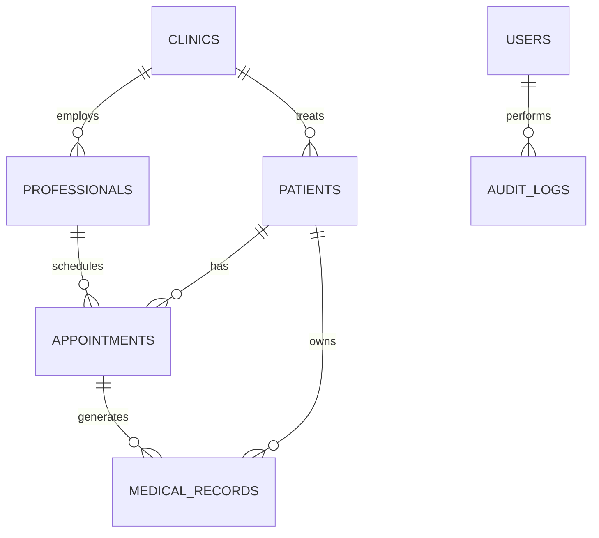

# 🗄️ NeonPro Database Schema Documentation

**Documentação completa do esquema de banco de dados para sistema de gestão em saúde**

## 📋 **Estrutura de Documentação**

```
docs/database-schema/
├── README.md                    # Este arquivo - visão geral
├── tables/                      # Documentação de tabelas
│   ├── patients.md             # Tabela de pacientes
│   ├── appointments.md         # Tabela de consultas  
│   ├── professionals.md        # Tabela de profissionais
│   ├── clinics.md              # Tabela de clínicas
│   ├── audit_logs.md           # Logs de auditoria
│   └── user_sessions.md        # Sessões de usuário
├── relationships/               # Relacionamentos entre tabelas
│   ├── patient-appointment.md
│   ├── professional-clinic.md
│   └── appointment-service.md
├── migrations/                  # Documentação de migrações
│   ├── 001_initial_schema.md
│   ├── 002_add_lgpd_fields.md
│   └── migration_log.md
└── policies/                    # Políticas RLS (Row Level Security)
    ├── patients_rls.md
    ├── appointments_rls.md
    └── audit_rls.md
```

## 🏗️ **Visão Geral do Schema**

### **Core Tables**

- **patients** - Dados dos pacientes (LGPD compliant)
- **appointments** - Consultas e agendamentos
- **professionals** - Médicos, enfermeiros, etc.
- **clinics** - Dados das clínicas/estabelecimentos
- **services** - Serviços oferecidos pelas clínicas

### **System Tables**

- **users** - Usuários do sistema
- **user_sessions** - Sessões ativas
- **audit_logs** - Auditoria de ações (compliance)
- **system_settings** - Configurações do sistema

### **Healthcare Tables**

- **medical_records** - Prontuários médicos
- **prescriptions** - Prescrições médicas
- **treatments** - Tratamentos realizados
- **insurance_plans** - Planos de saúde

## 🔐 **Compliance & Segurança**

### **LGPD (Lei Geral de Proteção de Dados)**

```sql
-- Campos obrigatórios para compliance LGPD
CREATE TABLE patients (
  id UUID PRIMARY KEY DEFAULT gen_random_uuid(),
  
  -- Dados pessoais
  full_name VARCHAR(255) NOT NULL,
  cpf VARCHAR(14) UNIQUE NOT NULL,
  
  -- Relacionamento com clínica
  clinic_id UUID REFERENCES clinics(id),
  
  -- Compliance LGPD
  lgpd_consent BOOLEAN DEFAULT false,
  lgpd_consent_date TIMESTAMPTZ,
  data_retention_until TIMESTAMPTZ,
  anonymization_date TIMESTAMPTZ,
  
  -- Auditoria
  created_at TIMESTAMPTZ DEFAULT NOW(),
  updated_at TIMESTAMPTZ DEFAULT NOW(),
  created_by UUID REFERENCES users(id),
  updated_by UUID REFERENCES users(id)
);
```

### **Row Level Security (RLS)**

```sql
-- Exemplo de política RLS para pacientes
CREATE POLICY "Users can only see their own clinic patients"
ON patients FOR SELECT
TO authenticated
USING (
  clinic_id IN (
    SELECT clinic_id FROM user_clinic_access 
    WHERE user_id = auth.uid()
  )
);
```

## 📊 **Principais Relacionamentos**



## 🏥 **Tabelas Principais**

### **patients** - Gestão de Pacientes

```sql
CREATE TABLE patients (
  id UUID PRIMARY KEY DEFAULT gen_random_uuid(),
  clinic_id UUID NOT NULL REFERENCES clinics(id),
  
  -- Dados pessoais
  full_name VARCHAR(255) NOT NULL,
  cpf VARCHAR(14) UNIQUE NOT NULL,
  rg VARCHAR(20),
  date_of_birth DATE NOT NULL,
  gender CHAR(1) CHECK (gender IN ('M', 'F', 'O')),
  
  -- Contato
  email VARCHAR(255),
  phone VARCHAR(20),
  mobile VARCHAR(20),
  
  -- Endereço
  address_street VARCHAR(255),
  address_number VARCHAR(10),
  address_complement VARCHAR(100),
  address_neighborhood VARCHAR(100),
  address_city VARCHAR(100),
  address_state CHAR(2),
  address_zipcode VARCHAR(10),
  
  -- Saúde
  blood_type VARCHAR(3),
  allergies TEXT[],
  emergency_contact_name VARCHAR(255),
  emergency_contact_phone VARCHAR(20),
  
  -- LGPD Compliance
  lgpd_consent BOOLEAN DEFAULT false,
  lgpd_consent_date TIMESTAMPTZ,
  data_retention_until TIMESTAMPTZ,
  
  -- Auditoria
  created_at TIMESTAMPTZ DEFAULT NOW(),
  updated_at TIMESTAMPTZ DEFAULT NOW(),
  created_by UUID REFERENCES users(id),
  updated_by UUID REFERENCES users(id)
);
```

### **appointments** - Gestão de Consultas

```sql
CREATE TABLE appointments (
  id UUID PRIMARY KEY DEFAULT gen_random_uuid(),
  patient_id UUID NOT NULL REFERENCES patients(id),
  professional_id UUID NOT NULL REFERENCES professionals(id),
  clinic_id UUID NOT NULL REFERENCES clinics(id),
  
  -- Agendamento
  appointment_date TIMESTAMPTZ NOT NULL,
  duration_minutes INTEGER DEFAULT 30,
  appointment_type VARCHAR(50) NOT NULL,
  status VARCHAR(20) DEFAULT 'scheduled' 
    CHECK (status IN ('scheduled', 'confirmed', 'in_progress', 'completed', 'cancelled', 'no_show')),
  
  -- Detalhes
  reason TEXT,
  notes TEXT,
  private_notes TEXT, -- Apenas para profissionais
  
  -- Financeiro
  price DECIMAL(10,2),
  payment_status VARCHAR(20) DEFAULT 'pending',
  
  -- Auditoria
  created_at TIMESTAMPTZ DEFAULT NOW(),
  updated_at TIMESTAMPTZ DEFAULT NOW(),
  created_by UUID REFERENCES users(id),
  updated_by UUID REFERENCES users(id)
);
```

### **professionals** - Gestão de Profissionais

```sql
CREATE TABLE professionals (
  id UUID PRIMARY KEY DEFAULT gen_random_uuid(),
  user_id UUID UNIQUE REFERENCES users(id),
  
  -- Dados profissionais
  full_name VARCHAR(255) NOT NULL,
  professional_type VARCHAR(50) NOT NULL, -- 'doctor', 'nurse', 'therapist'
  specialty VARCHAR(100),
  license_number VARCHAR(50) UNIQUE,
  license_state CHAR(2),
  
  -- Contato
  email VARCHAR(255) UNIQUE,
  phone VARCHAR(20),
  
  -- Status
  status VARCHAR(20) DEFAULT 'active',
  hire_date DATE,
  
  -- Auditoria
  created_at TIMESTAMPTZ DEFAULT NOW(),
  updated_at TIMESTAMPTZ DEFAULT NOW()
);
```

## 🔄 **Migrações**

### **Sistema de Versionamento**

- **Numeração sequencial**: `001`, `002`, `003`...
- **Nomenclatura descritiva**: `001_initial_schema.sql`
- **Rollback scripts**: `001_initial_schema_rollback.sql`
- **Documentação**: Cada migração tem arquivo `.md` explicando mudanças

### **Log de Migrações**

| Versão | Data       | Descrição      | Status       |
| ------ | ---------- | -------------- | ------------ |
| 001    | 2025-01-08 | Schema inicial | ✅ Aplicado  |
| 002    | TBD        | Campos LGPD    | ⏳ Planejado |
| 003    | TBD        | RLS Policies   | ⏳ Planejado |

## 🛡️ **Políticas de Segurança**

### **Auditoria Completa**

```sql
-- Trigger para auditoria automática
CREATE OR REPLACE FUNCTION audit_trigger()
RETURNS TRIGGER AS $$
BEGIN
  INSERT INTO audit_logs (
    table_name,
    operation,
    old_values,
    new_values,
    user_id,
    timestamp
  ) VALUES (
    TG_TABLE_NAME,
    TG_OP,
    to_jsonb(OLD),
    to_jsonb(NEW),
    auth.uid(),
    NOW()
  );
  RETURN COALESCE(NEW, OLD);
END;
$$ LANGUAGE plpgsql;
```

## 📊 **Métricas & Monitoramento**

### **Índices Principais**

```sql
-- Performance indexes
CREATE INDEX idx_patients_clinic_id ON patients(clinic_id);
CREATE INDEX idx_appointments_date ON appointments(appointment_date);
CREATE INDEX idx_appointments_patient_id ON appointments(patient_id);
CREATE INDEX idx_audit_logs_table_timestamp ON audit_logs(table_name, timestamp);

-- LGPD compliance indexes
CREATE INDEX idx_patients_retention ON patients(data_retention_until)
  WHERE data_retention_until IS NOT NULL;
```

### **Estatísticas de Uso**

- **Total de pacientes**: Query em tempo real
- **Consultas por mês**: Agregação otimizada
- **Logs de auditoria**: Retention policy automático

## 🚀 **Próximos Passos**

1. **Documentar tabelas individuais** - Criar arquivos detalhados para cada tabela
2. **Implementar RLS policies** - Políticas de segurança row-level
3. **Criar views otimizadas** - Views para relatórios e analytics
4. **Testes de performance** - Benchmarks e otimização de queries
5. **Backup e recovery** - Estratégias de backup automatizado

---

**Status**: ✅ **ATIVO** - Estrutura criada, documentação detalhada pendente\
**Última Atualização**: 2025-01-08\
**Database**: PostgreSQL via Supabase\
**ORM**: Prisma
