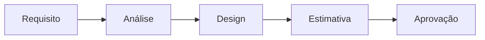
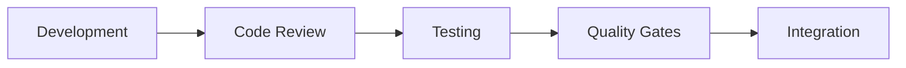
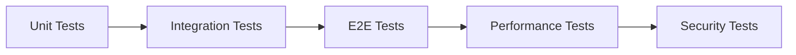
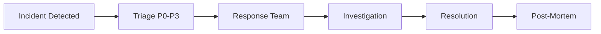

# 🚀 NeonPro - Guia de Desenvolvimento Contínuo

## 📋 **Visão Geral**

Este guia estabelece o processo de desenvolvimento contínuo para o NeonPro, garantindo qualidade, performance e compliance LGPD em cada iteração.

### **🎯 Objetivos**
- ✅ Manter **zero erros críticos** no TypeScript build
- ✅ Preservar **compliance LGPD/ANVISA/CFM** 
- ✅ Garantir **performance ≤100ms** para operações médicas
- ✅ Assegurar **qualidade ≥9.5/10** em todas as entregas
- ✅ Manter **segurança de dados** e auditoria completa

---

## 🔄 **Ciclo de Desenvolvimento**

### **Fase 1: Planejamento & Análise**


**Checklist de Planejamento:**
- [ ] Requisito claramente definido com critérios de aceite
- [ ] Impacto em compliance LGPD avaliado
- [ ] Performance de dados médicos considerada
- [ ] Arquitetura e dependências mapeadas
- [ ] Estimativa de esforço e prazo definida

**Templates de Análise:**
```yaml
# Template de User Story Healthcare
COMO: [tipo de usuário médico/administrativo]
QUERO: [funcionalidade específica]
PARA: [objetivo clínico/administrativo]

CRITÉRIOS DE ACEITE:
- [ ] Funcionalidade completa e testada
- [ ] Performance ≤100ms para dados de paciente
- [ ] Compliance LGPD mantido
- [ ] Auditoria completa implementada
- [ ] Testes E2E passando

CONSIDERAÇÕES TÉCNICAS:
- Database: [impacto no schema]
- API: [endpoints necessários]
- Frontend: [componentes afetados] 
- Security: [RLS policies necessárias]
```

### **Fase 2: Implementação**


**Workflow de Desenvolvimento:**

1. **Branch Strategy**
```bash
# Feature branches from main
git checkout main
git pull origin main
git checkout -b feature/NEON-123-patient-consent-management

# Commit convention
git commit -m "feat(consent): implement patient consent tracking for LGPD compliance

- Add consent preferences component
- Implement audit logging for consent changes
- Add RLS policies for consent data access
- Include healthcare compliance validations

Closes NEON-123"
```

2. **Code Quality Standards**
```bash
# Before each commit
bun run build          # Zero TypeScript errors
bun run lint:fix       # Linting compliance
bun run type-check     # Type safety validation
bun run test           # Unit tests passing
```

3. **Healthcare-Specific Validations**
- [ ] Patient data encryption at rest and in transit
- [ ] Consent management for all data operations
- [ ] Audit trail for all medical data access
- [ ] Performance monitoring for patient workflows
- [ ] ANVISA/CFM compliance checkpoints

### **Fase 3: Testes & Qualidade**


**Estratégia de Testes:**

1. **Unit Tests** (≥90% coverage)
```javascript
// Healthcare-specific test patterns
describe('PatientConsentService', () => {
  it('should track consent changes with LGPD compliance', () => {
    // Test implementation
  });
  
  it('should audit all patient data access', () => {
    // Test implementation  
  });
  
  it('should enforce RLS policies for multi-tenant data', () => {
    // Test implementation
  });
});
```

2. **Integration Tests**
```bash
# API integration tests
npm run test:integration

# Database integration with RLS
npm run test:db-integration

# Healthcare workflow tests
npm run test:healthcare-flows
```

3. **E2E Tests**
```bash
# Post-deployment validation
node tests/e2e/post-deploy-tests.js

# Healthcare user journeys
node tests/e2e/healthcare-workflows.js
```

4. **Performance Tests**
```bash
# Core Web Vitals monitoring
node scripts/performance/dashboard-generator.js

# Healthcare performance validation
node scripts/performance/healthcare-performance.js
```

### **Fase 4: Deploy & Monitoramento**

**Deploy Checklist:**
```bash
# 1. Pre-deploy validation
./scripts/deploy.sh --dry-run

# 2. Production deployment
./scripts/deploy.sh --production

# 3. Post-deploy monitoring
node monitoring/scripts/health-check.js
node scripts/performance/dashboard-generator.js
```

**Monitoramento Contínuo:**
- ⚡ **Performance**: Core Web Vitals ≤ thresholds
- 🔒 **Security**: Vulnerability scanning automático
- 📊 **Analytics**: User behavior e healthcare metrics
- 🏥 **Compliance**: LGPD audit logs e reporting
- 🚨 **Alertas**: Notificações em tempo real para issues

---

## 🛠️ **Ferramentas e Scripts**

### **Scripts de Desenvolvimento**
```bash
# Workflow completo de desenvolvimento
npm run dev:workflow

# Quality gates validation
npm run quality:check

# Healthcare compliance validation
npm run compliance:check

# Performance benchmarking
npm run perf:benchmark
```

### **Monitoramento de Produção**
```bash
# Health checks automáticos
node monitoring/scripts/health-check.js

# Performance dashboard
node scripts/performance/dashboard-generator.js

# Error tracking analysis
node monitoring/scripts/error-analysis.js

# LGPD compliance report
node scripts/compliance/lgpd-report.js
```

### **Debugging e Troubleshooting**
```bash
# Logs estruturados
node scripts/logs/analyze-logs.js

# Performance profiling
node scripts/performance/profile-analysis.js

# Database query analysis
node scripts/db/query-performance.js
```

---

## 📊 **Métricas e KPIs**

### **Qualidade de Código**
- **TypeScript Errors**: 0 (zero tolerance)
- **Test Coverage**: ≥90% 
- **Code Quality Score**: ≥9.5/10
- **Security Vulnerabilities**: 0 críticas
- **Performance Score**: ≥90/100

### **Healthcare Performance**
- **Patient Data Load**: ≤100ms
- **Appointment Booking**: ≤200ms
- **Medical Record Access**: ≤150ms
- **Audit Log Writing**: ≤50ms
- **Consent Management**: ≤75ms

### **LGPD Compliance**
- **Data Access Audit**: 100% logged
- **Consent Tracking**: 100% captured
- **Data Retention**: Policy compliant
- **Patient Rights**: Fully implemented
- **Security Incidents**: 0 tolerance

### **Business Metrics**
- **User Satisfaction**: ≥4.5/5
- **System Availability**: ≥99.9%
- **Data Accuracy**: ≥99.95%
- **Compliance Score**: 100%
- **Performance SLA**: ≥95% compliance

---

## 🔧 **Configuração de Ambiente**

### **Desenvolvimento Local**
```bash
# Setup inicial
git clone https://github.com/neonpro/neonpro.git
cd neonpro
cp .env.example .env.local

# Configurar variáveis healthcare
export ENABLE_HEALTHCARE_COMPLIANCE=true
export LGPD_AUDIT_LEVEL=strict
export PERFORMANCE_MONITORING=enabled
export ERROR_TRACKING=sentry

# Install dependencies
bun install

# Start development
bun run dev
```

### **Staging Environment**
```bash
# Deploy para staging
vercel --env staging

# Testes de integração
npm run test:staging

# Performance validation
npm run perf:staging
```

### **Production Environment**
```bash
# Deploy production com validação
./scripts/deploy.sh --production --validate

# Monitoramento pós-deploy
./scripts/monitoring/post-deploy-check.sh

# Performance baseline
./scripts/performance/baseline-check.sh
```

---

## 🚨 **Processo de Incidentes**

### **Classificação de Incidentes**
- **P0 - Critical**: Sistema indisponível, dados de paciente em risco
- **P1 - High**: Funcionalidade healthcare comprometida
- **P2 - Medium**: Performance degradada, compliance em risco
- **P3 - Low**: Melhorias, bugs não críticos

### **Response Process**


**Incident Response Commands:**
```bash
# Emergency deployment rollback
vercel rollback --production

# Emergency health check
node monitoring/scripts/emergency-health.js

# Performance emergency analysis
node scripts/performance/emergency-analysis.js

# Security incident response
node scripts/security/incident-response.js
```

---

## 📚 **Documentação e Knowledge Base**

### **Estrutura de Documentação**
```
docs/
├── api/                 # API documentation
├── architecture/        # System architecture
├── compliance/         # LGPD/Healthcare compliance
├── deployment/         # Deploy procedures
├── development/        # Development guidelines
├── features/           # Feature documentation
├── performance/        # Performance optimization
├── security/           # Security procedures
└── troubleshooting/    # Issue resolution
```

### **Manutenção de Docs**
- **Daily**: Update feature docs após commits
- **Weekly**: Review compliance documentation
- **Monthly**: Architecture review e updates
- **Quarterly**: Complete documentation audit

---

## 🔄 **Processo de Release**

### **Release Types**
- **Hotfix**: Correções críticas (P0/P1)
- **Patch**: Bug fixes e melhorias menores
- **Minor**: Novas features, não breaking changes
- **Major**: Breaking changes, major features

### **Release Checklist**
```bash
# Pre-release validation
- [ ] All tests passing (unit, integration, E2E)
- [ ] Performance benchmarks met
- [ ] Security scan clean
- [ ] LGPD compliance verified
- [ ] Documentation updated
- [ ] Changelog prepared

# Release execution  
- [ ] Version bump (semantic versioning)
- [ ] Git tag created
- [ ] Production deploy executed
- [ ] Post-deploy validation passed
- [ ] Monitoring alerts configured
- [ ] Rollback plan prepared

# Post-release
- [ ] Performance metrics validated
- [ ] User feedback collected
- [ ] Issues tracked and prioritized
- [ ] Next iteration planned
```

---

## 🎯 **Continuous Improvement**

### **Weekly Reviews**
- **Code Quality**: Review metrics e improvement opportunities
- **Performance**: Analyze Core Web Vitals trends
- **Security**: Review vulnerability scans
- **Healthcare Compliance**: Audit trail review

### **Monthly Retrospectives**
- **Process Efficiency**: Development workflow optimization
- **Quality Metrics**: Trend analysis e targets adjustment
- **Technology Stack**: Evaluate updates e improvements
- **Team Feedback**: Process improvements

### **Quarterly Planning**
- **Architecture Review**: System scalability e maintainability
- **Technology Roadmap**: Stack updates e modernization
- **Compliance Audit**: Full LGPD/Healthcare review
- **Performance Optimization**: Major performance initiatives

---

## 📞 **Contatos e Escalation**

### **Responsabilidades**
- **Tech Lead**: Architecture decisions, code reviews
- **DevOps**: Deployment, monitoring, infrastructure  
- **Security**: Compliance, vulnerability management
- **Healthcare**: LGPD/ANVISA compliance, clinical workflows

### **Escalation Matrix**
```
P0 (Critical) → Immediate → All stakeholders
P1 (High)     → 1 hour   → Tech Lead + DevOps
P2 (Medium)   → 4 hours  → Assigned developer
P3 (Low)      → Next day → Normal workflow
```

---

**🎉 Este guia garante desenvolvimento consistente, qualidade superior e compliance total com regulamentações healthcare brasileiras.**

*Última atualização: $(date)*
*Próxima revisão: Mensal*