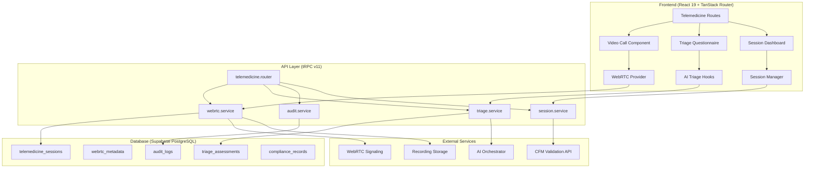

# Telemedicine Platform System Architecture

## Overview
System architecture for NeonPro's WebRTC-based telemedicine platform, integrating with existing tRPC, Supabase, and React infrastructure while ensuring CFM, ANVISA, and LGPD compliance.

## Architecture Overview



## Component Architecture

### Frontend Components

#### 1. Telemedicine Provider (Context)
```typescript
interface TelemedicineContextValue {
  currentSession: TelemedicineSession | null;
  webrtcConnection: RTCPeerConnection | null;
  signaling: SignalingService;
  sessionState: SessionState;
  
  // Actions
  startSession: (sessionId: string) => Promise<void>;
  endSession: () => Promise<void>;
  sendTriageData: (data: TriageData) => Promise<void>;
  logAuditEvent: (event: AuditEvent) => Promise<void>;
}

const TelemedicineProvider: React.FC<{ children: React.ReactNode }> = ({ children }) => {
  // Provider implementation with WebRTC and tRPC integration
};
```

#### 2. Video Call Component
```typescript
interface VideoCallProps {
  sessionId: string;
  role: 'doctor' | 'patient';
  onConnectionStateChange: (state: RTCPeerConnectionState) => void;
  onError: (error: WebRTCError) => void;
}

const VideoCallComponent: React.FC<VideoCallProps> = ({
  sessionId,
  role,
  onConnectionStateChange,
  onError
}) => {
  // WebRTC video calling implementation
  // Camera/microphone controls
  // Connection status display
  // Error handling and reconnection
};
```

#### 3. AI Triage Questionnaire
```typescript
interface TriageQuestionnaireProps {
  patientId: string;
  onAssessmentComplete: (assessment: TriageAssessment) => void;
  mode: 'initial' | 'follow_up';
}

const TriageQuestionnaire: React.FC<TriageQuestionnaireProps> = ({
  patientId,
  onAssessmentComplete,
  mode
}) => {
  // Dynamic form generation based on AI recommendations
  // Symptom tracking and severity assessment
  // Risk scoring and priority calculation
};
```

### Backend Services

#### 1. tRPC Telemedicine Router
```typescript
export const telemedicineRouter = router({
  // Session Management
  createSession: publicProcedure
    .input(z.object({
      patientId: z.string().uuid(),
      sessionType: z.enum(['consultation', 'follow_up', 'emergency']),
      triageData: TriageDataSchema.optional()
    }))
    .mutation(async ({ input, ctx }) => {
      // Create session with AI triage scoring
      // Assign doctor based on availability and specialization
      // Initialize WebRTC room
      // Log audit event for LGPD compliance
    }),

  // WebRTC Signaling
  initializeCall: protectedProcedure
    .input(z.object({
      sessionId: z.string().uuid(),
      role: z.enum(['doctor', 'patient']),
      sdpOffer: z.string().optional()
    }))
    .mutation(async ({ input, ctx }) => {
      // Initialize WebRTC peer connection
      // Generate/handle SDP offers and answers
      // Manage ICE candidates
      // Start session recording if required
    }),

  // AI Triage Assessment
  assessSymptoms: publicProcedure
    .input(TriageAssessmentSchema)
    .mutation(async ({ input, ctx }) => {
      // Analyze symptoms using AI orchestrator
      // Calculate risk score and priority
      // Generate recommendations
      // Store assessment for medical record
    }),

  // Compliance and Audit
  logAuditEvent: protectedProcedure
    .input(AuditEventSchema)
    .mutation(async ({ input, ctx }) => {
      // Log all system events for LGPD compliance
      // Track data access and modifications
      // Maintain immutable audit trail
    }),

  // Session Status Updates
  updateSessionStatus: protectedProcedure
    .input(z.object({
      sessionId: z.string().uuid(),
      status: z.enum(['active', 'completed', 'cancelled']),
      metadata: z.record(z.any()).optional()
    }))
    .mutation(async ({ input, ctx }) => {
      // Update session status with timestamps
      // Trigger real-time notifications
      // Update medical records
    })
});
```

#### 2. WebRTC Signaling Service
```typescript
class WebRTCSignalingService {
  private supabase: SupabaseClient;
  private rooms = new Map<string, WebRTCRoom>();

  async createRoom(sessionId: string): Promise<WebRTCRoom> {
    // Create WebRTC room with unique identifier
    // Configure STUN/TURN servers for Brazilian infrastructure
    // Set up recording capabilities
    // Enable end-to-end encryption
  }

  async handleSignaling(
    roomId: string,
    participantId: string,
    signal: SignalingMessage
  ): Promise<void> {
    // Handle SDP offers, answers, and ICE candidates
    // Relay signaling messages between participants
    // Maintain connection state and quality metrics
  }

  async startRecording(roomId: string): Promise<void> {
    // Initialize encrypted recording
    // Store in compliance-ready format
    // Generate audit trail entries
  }
}
```

#### 3. AI Triage Service
```typescript
class AITriageService {
  private aiOrchestrator: HealthcareAIOrchestrator;

  async assessSymptoms(symptoms: SymptomData): Promise<TriageAssessment> {
    // Use existing AI orchestrator for analysis
    // Apply Brazilian healthcare context
    // Calculate priority score (1-5)
    // Generate specialist recommendations
    
    return {
      riskScore: number,
      priority: 'low' | 'medium' | 'high' | 'critical',
      recommendedSpecialist: string,
      urgencyLevel: number,
      followUpRequired: boolean,
      aiConfidence: number
    };
  }

  async generateQuestions(
    patientHistory: PatientHistory,
    initialSymptoms: string[]
  ): Promise<DynamicQuestion[]> {
    // Generate contextual follow-up questions
    // Adapt based on patient responses
    // Focus on differential diagnosis
  }
}
```

## Database Schema Design

### Core Tables

#### 1. Telemedicine Sessions
```sql
CREATE TABLE telemedicine_sessions (
  id UUID PRIMARY KEY DEFAULT gen_random_uuid(),
  doctor_id UUID REFERENCES auth.users(id) NOT NULL,
  patient_id UUID REFERENCES patients(id) NOT NULL,
  clinic_id UUID REFERENCES clinics(id) NOT NULL,
  
  -- Session Details
  session_type VARCHAR NOT NULL CHECK (session_type IN ('consultation', 'follow_up', 'emergency')),
  status VARCHAR NOT NULL DEFAULT 'scheduled' CHECK (status IN ('scheduled', 'active', 'completed', 'cancelled')),
  title VARCHAR(255),
  description TEXT,
  
  -- WebRTC Configuration
  webrtc_room_id VARCHAR UNIQUE,
  signaling_server_url TEXT,
  recording_enabled BOOLEAN DEFAULT false,
  recording_url TEXT,
  
  -- AI Triage Data
  triage_score INTEGER CHECK (triage_score BETWEEN 1 AND 5),
  priority_level VARCHAR CHECK (priority_level IN ('low', 'medium', 'high', 'critical')),
  ai_assessment JSONB,
  
  -- Compliance
  cfm_verified BOOLEAN DEFAULT false,
  lgpd_consent_obtained BOOLEAN DEFAULT false,
  patient_consent_recording BOOLEAN DEFAULT false,
  compliance_verified BOOLEAN DEFAULT false,
  
  -- Timestamps
  scheduled_at TIMESTAMPTZ,
  started_at TIMESTAMPTZ,
  ended_at TIMESTAMPTZ,
  created_at TIMESTAMPTZ DEFAULT NOW(),
  updated_at TIMESTAMPTZ DEFAULT NOW()
);

-- Enable RLS for multi-tenant isolation
ALTER TABLE telemedicine_sessions ENABLE ROW LEVEL SECURITY;

-- RLS Policies
CREATE POLICY "Users can access sessions from their clinic" ON telemedicine_sessions
  FOR ALL USING (clinic_id = auth.jwt() ->> 'clinic_id'::text);

CREATE POLICY "Doctors can access their sessions" ON telemedicine_sessions
  FOR ALL USING (doctor_id = auth.uid());

CREATE POLICY "Patients can access their sessions" ON telemedicine_sessions
  FOR SELECT USING (patient_id = auth.uid());
```

#### 2. WebRTC Metadata
```sql
CREATE TABLE webrtc_metadata (
  id UUID PRIMARY KEY DEFAULT gen_random_uuid(),
  session_id UUID REFERENCES telemedicine_sessions(id) ON DELETE CASCADE,
  
  -- Connection Details
  peer_connection_id VARCHAR NOT NULL,
  participant_role VARCHAR NOT NULL CHECK (participant_role IN ('doctor', 'patient')),
  ice_connection_state VARCHAR,
  signaling_state VARCHAR,
  
  -- Quality Metrics
  video_resolution VARCHAR,
  audio_bitrate INTEGER,
  video_bitrate INTEGER,
  latency_ms INTEGER,
  packet_loss_percentage DECIMAL(5,2),
  
  -- Security
  encryption_enabled BOOLEAN DEFAULT true,
  dtls_fingerprint TEXT,
  
  -- Timestamps
  connected_at TIMESTAMPTZ,
  disconnected_at TIMESTAMPTZ,
  created_at TIMESTAMPTZ DEFAULT NOW()
);

ALTER TABLE webrtc_metadata ENABLE ROW LEVEL SECURITY;
```

#### 3. Triage Assessments
```sql
CREATE TABLE triage_assessments (
  id UUID PRIMARY KEY DEFAULT gen_random_uuid(),
  session_id UUID REFERENCES telemedicine_sessions(id),
  patient_id UUID REFERENCES patients(id) NOT NULL,
  
  -- Assessment Data
  symptoms JSONB NOT NULL, -- Structured symptom data
  severity_score INTEGER CHECK (severity_score BETWEEN 1 AND 10),
  pain_level INTEGER CHECK (pain_level BETWEEN 0 AND 10),
  vital_signs JSONB, -- Blood pressure, temperature, etc.
  
  -- AI Analysis
  ai_risk_score INTEGER CHECK (ai_risk_score BETWEEN 1 AND 5),
  ai_confidence DECIMAL(3,2) CHECK (ai_confidence BETWEEN 0 AND 1),
  recommended_specialist VARCHAR,
  urgency_level INTEGER CHECK (urgency_level BETWEEN 1 AND 5),
  differential_diagnosis JSONB,
  
  -- Questionnaire Responses
  responses JSONB NOT NULL, -- Dynamic questionnaire responses
  completion_time_seconds INTEGER,
  
  -- Medical Professional Review
  reviewed_by UUID REFERENCES auth.users(id),
  professional_override BOOLEAN DEFAULT false,
  professional_notes TEXT,
  final_priority VARCHAR CHECK (final_priority IN ('low', 'medium', 'high', 'critical')),
  
  created_at TIMESTAMPTZ DEFAULT NOW(),
  reviewed_at TIMESTAMPTZ
);

ALTER TABLE triage_assessments ENABLE ROW LEVEL SECURITY;
```

#### 4. Audit Logs (LGPD Compliance)
```sql
CREATE TABLE audit_logs (
  id UUID PRIMARY KEY DEFAULT gen_random_uuid(),
  
  -- Event Details
  event_type VARCHAR NOT NULL, -- 'session_start', 'data_access', 'recording_start', etc.
  event_category VARCHAR NOT NULL, -- 'telemedicine', 'data_processing', 'consent'
  resource_type VARCHAR NOT NULL, -- 'session', 'patient', 'recording'
  resource_id UUID,
  
  -- User Context
  user_id UUID REFERENCES auth.users(id),
  user_role VARCHAR,
  clinic_id UUID REFERENCES clinics(id),
  
  -- LGPD Compliance
  data_subject_id UUID, -- Patient whose data was accessed
  legal_basis VARCHAR, -- LGPD legal basis for processing
  consent_obtained BOOLEAN,
  data_category VARCHAR, -- 'medical', 'personal', 'sensitive'
  
  -- Technical Details
  ip_address INET,
  user_agent TEXT,
  session_id VARCHAR,
  request_method VARCHAR,
  request_url TEXT,
  
  -- Event Data
  event_data JSONB,
  before_state JSONB,
  after_state JSONB,
  
  -- Compliance Status
  gdpr_lawful_basis VARCHAR,
  retention_period_days INTEGER,
  anonymization_required BOOLEAN DEFAULT false,
  
  created_at TIMESTAMPTZ DEFAULT NOW()
);

-- Audit logs should never be modified, only inserted
ALTER TABLE audit_logs ENABLE ROW LEVEL SECURITY;
```

## Security Architecture

### 1. End-to-End Encryption
```typescript
interface EncryptionConfig {
  webrtc: {
    dtls: boolean;           // DTLS for data channels
    srtp: boolean;           // SRTP for media streams
    insertableStreams: boolean; // E2EE with insertable streams
  };
  storage: {
    algorithm: 'AES-256-GCM';
    keyRotation: boolean;
    geoRestriction: 'brazil-only';
  };
  communication: {
    tls: '1.3';
    certificatePinning: boolean;
    hsts: boolean;
  };
}
```

### 2. Access Control Matrix
```yaml
roles:
  patient:
    permissions:
      - view_own_sessions
      - join_assigned_sessions
      - complete_triage_assessment
      - view_own_audit_logs
    restrictions:
      - cannot_access_other_patients
      - cannot_modify_medical_records
      - cannot_start_recording

  doctor:
    permissions:
      - view_clinic_sessions
      - start_stop_sessions
      - access_patient_records
      - control_recording
      - override_ai_triage
    restrictions:
      - clinic_isolation_enforced
      - patient_consent_required
      - cfm_license_verified

  admin:
    permissions:
      - manage_all_sessions
      - access_audit_logs
      - configure_compliance_settings
      - generate_reports
    restrictions:
      - multi_factor_auth_required
      - audit_all_actions
      - limited_to_own_clinic
```

### 3. Compliance Framework
```typescript
class ComplianceFramework {
  // CFM Resolution 2.314/2022 Compliance
  async validateCFMCompliance(session: TelemedicineSession): Promise<ComplianceResult> {
    return {
      doctorLicenseVerified: boolean,
      patientConsentObtained: boolean,
      sessionRecordingCompliant: boolean,
      medicalRecordIntegrated: boolean,
      qualityStandardsMet: boolean
    };
  }

  // LGPD Data Protection
  async ensureLGPDCompliance(dataOperation: DataOperation): Promise<void> {
    // Validate legal basis for processing
    // Ensure consent is documented
    // Apply data minimization principles
    // Log audit trail
  }

  // ANVISA Medical Device Compliance
  async validateAnvisaCompliance(): Promise<AnvisaComplianceStatus> {
    return {
      deviceRegistered: boolean,
      riskAssessmentCurrent: boolean,
      qualitySystemActive: boolean,
      postMarketSurveillance: boolean
    };
  }
}
```

## Integration Points

### 1. Existing NeonPro Infrastructure
- **Authentication**: Extends Supabase Auth with CFM validation
- **Database**: Uses existing PostgreSQL with new telemedicine schema
- **API**: Adds telemedicine router to existing tRPC setup
- **AI**: Integrates with existing healthcare AI orchestrator
- **Security**: Uses existing anonymization and audit utilities

### 2. External Services
- **WebRTC Infrastructure**: Brazilian STUN/TURN servers
- **Recording Storage**: Encrypted cloud storage with Brazilian residency
- **CFM API**: Real-time license validation
- **AI Services**: OpenAI/Anthropic via existing Vercel AI SDK
- **Compliance Monitoring**: Automated regulatory checking

### 3. Frontend Routes
```typescript
// TanStack Router integration
const telemedicineRoutes = {
  '/telemedicine': {
    component: TelemedicineDashboard,
    loader: loadUserSessions
  },
  '/telemedicine/session/$sessionId': {
    component: VideoCallPage,
    loader: loadSessionDetails
  },
  '/telemedicine/triage': {
    component: TriageQuestionnaire,
    loader: loadPatientHistory
  },
  '/telemedicine/admin': {
    component: AdminDashboard,
    loader: loadComplianceStatus
  }
};
```

## Performance and Scalability

### 1. Performance Targets
- **Video Quality**: 720p minimum, adaptive bitrate
- **Audio Quality**: 22kHz sampling rate
- **Latency**: <150ms for real-time interaction
- **Uptime**: 99.9% availability during consultation hours
- **Concurrent Sessions**: 100+ simultaneous sessions per instance

### 2. Scalability Architecture
- **Horizontal Scaling**: Multiple WebRTC SFU instances
- **Database Sharding**: Partition by clinic_id for isolation
- **CDN Distribution**: Brazilian edge locations for media delivery
- **Auto-scaling**: Based on active session count
- **Load Balancing**: Geographic routing to nearest servers

## Implementation Phases

### Phase 1: Core Infrastructure (Weeks 1-3)
1. Database schema implementation with RLS policies
2. Basic tRPC routers for session management
3. WebRTC signaling service setup
4. CFM integration for doctor validation
5. Basic audit logging for LGPD compliance

### Phase 2: Video Calling (Weeks 4-6)
1. React video calling component
2. WebRTC peer connection management
3. Session recording with encryption
4. Connection quality monitoring
5. Error handling and reconnection logic

### Phase 3: AI Triage (Weeks 7-9)
1. AI-powered symptom assessment
2. Dynamic questionnaire generation
3. Risk scoring and priority assignment
4. Integration with appointment scheduling
5. Medical professional override system

### Phase 4: Compliance & Polish (Weeks 10-12)
1. Comprehensive audit trail implementation
2. ANVISA medical device compliance
3. Security audit and penetration testing
4. Performance optimization and scaling tests
5. Documentation and training materials

---

**Architecture Status**: ✅ Complete - System design documented
**Integration Status**: 🟡 Ready for implementation
**Compliance Status**: 🟡 Framework designed, implementation pending
**Next Phase**: Database schema implementation and tRPC router development
**Last Updated**: 2025-01-28