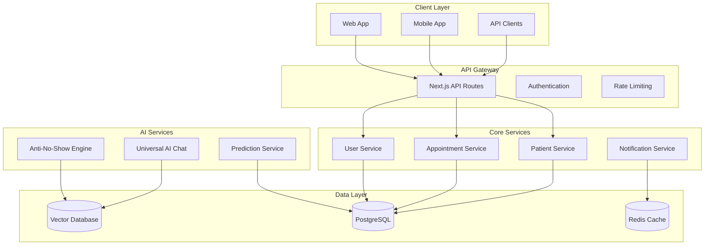

# Functional and Technical Specifications

## 4. Functional Requirements

### 4.1 Essential Features (MVP)

**Sistema Universal de Chat IA**

- Assistente conversacional especializado em estética
- Integração com WhatsApp Business API
- Processamento de linguagem natural em português
- Base de conhecimento sobre procedimentos estéticos
- Agendamento automático via chat
- Triagem inicial de pacientes
- Suporte 24/7 automatizado

**Engine Anti-No-Show**

- Análise comportamental preditiva de pacientes
- Scoring de risco de falta em consultas (0.00 a 1.00)
- Automação de lembretes personalizados
- Otimização de timing de comunicação
- Integração com múltiplos canais (WhatsApp, SMS, email)
- Dashboard de métricas de prevenção
- Redução de 78% em no-shows (meta)

**Dashboard de Comando Unificado**

- Visão consolidada de todas as operações
- Métricas em tempo real
- Alertas inteligentes
- Gestão de agenda centralizada
- Controle financeiro integrado
- Relatórios executivos automatizados
- Interface responsiva para mobile

**Sistema de Agendamento Inteligente**

- Calendário drag-and-drop
- Sincronização em tempo real
- Otimização automática de horários
- Gestão de salas e equipamentos
- Integração com calendários externos
- Notificações push inteligentes
- Reagendamento automático

## 5. Technical Architecture

### 5.1 Technology Stack

**Frontend**

- Next.js 15 (App Router)
- React 19 (Server Components)
- TypeScript 5.0+
- Tailwind CSS 3.4+
- shadcn/ui (Design System)
- Framer Motion (Animations)

**Backend & Database**

- Supabase (PostgreSQL + Auth + Storage)
- Redis (Caching & Sessions)
- Prisma (ORM)
- tRPC (Type-safe APIs)

**Development & Deploy**

- Turborepo (Monorepo)
- Docker (Containerization)
- Vercel (Deployment)
- GitHub Actions (CI/CD)
- ESLint + Prettier (Code Quality)

**AI & ML Layer**

- OpenAI GPT-4 (Conversational AI)
- Custom ML Models (Anti-No-Show)
- Vector Database (Knowledge Base)
- TensorFlow.js (Client-side ML)
- Hugging Face (NLP Models)

**Communication & Integration**

- WebSockets (Real-time)
- Server-Sent Events (Live Updates)
- WhatsApp Business API
- Twilio (SMS)
- Push Notifications

### 5.2 Database Schema (Core Entities)

```sql
-- Clinics
CREATE TABLE clinics (
    id UUID PRIMARY KEY DEFAULT gen_random_uuid(),
    name VARCHAR(255) NOT NULL,
    cnpj VARCHAR(18) UNIQUE,
    address JSONB,
    settings JSONB,
    subscription_plan VARCHAR(50),
    created_at TIMESTAMP DEFAULT NOW()
);

-- Patients
CREATE TABLE patients (
    id UUID PRIMARY KEY DEFAULT gen_random_uuid(),
    clinic_id UUID REFERENCES clinics(id) NOT NULL,
    name VARCHAR(255) NOT NULL,
    email VARCHAR(255),
    phone VARCHAR(20),
    cpf VARCHAR(14) UNIQUE,
    behavior_profile JSONB,
    created_at TIMESTAMP DEFAULT NOW()
);

-- Anti-No-Show Analysis
CREATE TABLE patient_behavior_analysis (
    id UUID PRIMARY KEY,
    patient_id UUID REFERENCES patients(id),
    -- Reference: the 'appointments' table is defined in docs/database-schema/appointments.sql (see section "Appointments Schema")
    appointment_id UUID REFERENCES appointments(id),
    behavior_score DECIMAL(3,2), -- 0.00 a 1.00
    risk_factors JSONB,
    prediction_confidence DECIMAL(3,2),
    recommended_actions JSONB,
    created_at TIMESTAMP DEFAULT NOW()
);
```

### 5.3 System Architecture



### 5.4 Enhanced Features (Should Have)

**CRM Comportamental** (Priority: Medium)

- Perfil comportamental detalhado de cada paciente
- Análise de preferências e padrões de consumo
- Comunicação personalizada baseada em IA
- Previsão de ciclo de vida do paciente
- Otimização de tempo de tratamento

**Gestor de Estoque Preditivo** (Priority: Medium)

- Controle de estoque com IA preditiva
- Reabastecimento automático baseado em padrões
- Gestão de validade e alertas de vencimento
- Otimização de custos e redução de desperdício
- Integração com fornecedores

**Assistente de Gestão IA** (Priority: Medium)

- Insights preditivos para tomada de decisão
- Otimização de processos operacionais
- Análise de performance da equipe
- Recomendações de melhoria automáticas
- Relatórios executivos inteligentes

**Sistema de Compliance Automatizado** (Priority: Medium)

- Conformidade automática com LGPD, ANVISA
- Auditoria contínua de processos
- Documentação automática de conformidade
- Alertas de não conformidade
- Relatórios regulatórios automatizados

### 5.3 Future Considerations (Could Have)

**Simulador de Resultados AR** (Priority: Low)

- Realidade aumentada para visualização de resultados
- Integração com câmera de dispositivos móveis
- Biblioteca de tratamentos e resultados esperados
- Personalização baseada em características do paciente
- Compartilhamento de simulações

**Modo Auto-Piloto** (Priority: Low)

- Operação autônoma de processos rotineiros
- Tomada de decisão automatizada baseada em IA
- Intervenção humana apenas em exceções
- Aprendizado contínuo e otimização
- Monitoramento de performance autônoma

**Digital Twin Practice** (Priority: Low)

- Gêmeo digital completo da clínica
- Simulação de cenários e estratégias
- Otimização preditiva de recursos
- Análise de impacto de mudanças
- Planejamento estratégico automatizado

## 6. User Experience Design

### 6.1 Design Principles

**Mobile-First Philosophy**

- Prioridade absoluta para experiência mobile (95% dos pacientes)
- Interface touch-optimized com gestos intuitivos
- Carregamento rápido mesmo em conexões lentas
- Offline-first para funcionalidades críticas

**Simplicidade Inteligente**

- Interface limpa com foco em ações principais
- Redução de cliques para tarefas frequentes
- Navegação contextual baseada no perfil do usuário
- Feedback visual imediato para todas as ações

**Acessibilidade Universal**

- Conformidade com WCAG 2.1 AA
- Suporte a leitores de tela
- Alto contraste e fontes legíveis
- Navegação por teclado completa

**Personalização Inteligente**

- Interface adaptativa baseada em uso
- Dashboards personalizados por perfil
- Preferências de notificação granulares
- Temas claro/escuro automáticos

### 6.2 Key User Flows

**Fluxo de Agendamento (Paciente)**

- **Entry points**: Chat IA, app mobile, website, WhatsApp
- **Happy path**: Acesso → Seleção de serviço → Escolha de horário → Confirmação → Lembrete
- **Alternative paths**: Reagendamento, cancelamento, lista de espera
- **Error handling**: Horários indisponíveis, dados incompletos, falhas de conexão

**Fluxo de Gestão (Proprietário)**

- **Entry points**: Dashboard web, app mobile, notificações push
- **Happy path**: Login → Dashboard executivo → Análise de KPIs → Ações estratégicas
- **Alternative paths**: Relatórios detalhados, configurações, gestão de equipe
- **Error handling**: Dados não carregados, permissões insuficientes, timeouts

**Fluxo de Atendimento (Equipe)**

- **Entry points**: App mobile, terminal da clínica, tablet
- **Happy path**: Check-in → Histórico do paciente → Atendimento → Follow-up
- **Alternative paths**: Emergências, transferências, reagendamentos
- **Error handling**: Paciente não encontrado, sistema offline, dados incompletos

### 6.3 Responsive Design Requirements

**Mobile-first (320px-768px)**

- Navegação bottom-tab com 4-5 itens principais
- Gestos swipe para navegação lateral
- FAB (Floating Action Button) para ações primárias
- Cards verticais com informações essenciais
- Formulários step-by-step

**Tablet considerations (768px-1024px)**

- Sidebar colapsível com navegação expandida
- Multi-panel views para dashboards
- Drag & drop para agendamentos
- Modais maiores para formulários complexos
- Split-screen para comparações

**Desktop enhancements (1024px+)**

- Múltiplas janelas e abas
- Atalhos de teclado para power users
- Visualizações de dados complexas
- Hover states e tooltips informativos
- Bulk actions para operações em massa

### 6.4 Interface Requirements

**Navigation**

- Breadcrumbs contextuais
- Menu hamburger com categorização
- Search global com filtros inteligentes
- Quick actions sempre visíveis
- Deep linking para compartilhamento

**Information architecture**

- Hierarquia clara com máximo 3 níveis
- Agrupamento lógico por contexto de uso
- Labels descritivos e consistentes
- Fluxos lineares para tarefas complexas
- Shortcuts para usuários experientes

**Visual design**

- Sistema de design NeonPro consistente
- Cores: Azul médico (#0066CC), Verde saúde (#00CC66)
- Tipografia: Inter (sistema), Roboto (fallback)
- Espaçamento: Grid 8px, componentes modulares
- Iconografia: Phosphor icons, outline style

**Accessibility**

- Contraste mínimo 4.5:1 para texto normal
- Focus indicators visíveis em todos os elementos
- Labels descritivos para screen readers
- Navegação por teclado em ordem lógica
- Textos alternativos para todas as imagens

## 7. Technical Specifications

### 7.1 System Architecture

**Arquitetura Moderna e Escalável**

- **Frontend**: Next.js 15 + React 19 + TypeScript
- **Backend**: Supabase (PostgreSQL via Prisma) + Hono API (Vercel Functions)
- **Monorepo**: Turborepo para gestão de múltiplos pacotes
- **UI Framework**: shadcn/ui + Tailwind CSS
- **Estado Global**: Zustand + React Query

**Infraestrutura Cloud-Native**

- **Hosting**: Vercel (Frontend) + Supabase (Backend)
- **CDN**: Vercel Edge Network para performance global
- **Database**: PostgreSQL com extensões de IA (pgvector)
- **Storage**: Supabase Storage para arquivos e imagens
- **Monitoring**: Vercel Analytics + Supabase Metrics

**Arquitetura de IA**

- **LLM Principal**: OpenAI GPT-4 Turbo para chat inteligente
- **ML Customizado**: Modelos próprios para previsão de no-show
- **Vector Database**: pgvector para busca semântica
- **RAG System**: Retrieval-Augmented Generation para respostas contextuais
- **Execution Model**: Vercel Functions (Node.js/serverless, regional by default); use Vercel Edge Functions (runtime: 'edge') only where ultra-low latency is required

**Microserviços e APIs**

- **API Gateway**: Hono API (Vercel Functions)
- **Authentication**: Supabase Auth com MFA
- **Real-time**: WebSockets via Supabase Realtime
- **Webhooks**: Integração com WhatsApp Business API
- **Third-party**: APIs de pagamento, SMS, calendários

### 7.2 Data Requirements

**Modelo de Dados Principal**

```sql
-- Clínicas
CREATE TABLE clinics (
  id UUID PRIMARY KEY,
  name VARCHAR(255) NOT NULL,
  settings JSONB,
  created_at TIMESTAMP DEFAULT NOW()
);

-- Pacientes
CREATE TABLE patients (
  id UUID PRIMARY KEY,
  clinic_id UUID REFERENCES clinics(id),
  name VARCHAR(255) NOT NULL,
  phone VARCHAR(20),
  email VARCHAR(255),
  behavioral_profile JSONB,
  no_show_score INTEGER DEFAULT 50,
  created_at TIMESTAMP DEFAULT NOW()
);

-- Agendamentos
CREATE TABLE appointments (
  id UUID PRIMARY KEY,
  patient_id UUID REFERENCES patients(id),
  clinic_id UUID REFERENCES clinics(id),
  scheduled_at TIMESTAMP NOT NULL,
  status VARCHAR(50) DEFAULT 'scheduled',
  no_show_risk_score INTEGER,
  created_at TIMESTAMP DEFAULT NOW()
);

-- Conversas de IA
CREATE TABLE ai_conversations (
  id UUID PRIMARY KEY,
  patient_id UUID REFERENCES patients(id),
  messages JSONB[],
  context_embeddings vector(1536),
  created_at TIMESTAMP DEFAULT NOW()
);
```

**Gestão de Dados**

- **Backup**: Backup automático diário com retenção de 30 dias
- **Replicação**: Multi-region para alta disponibilidade
- **Archiving**: Dados antigos movidos para cold storage após 2 anos
- **GDPR/LGPD**: Anonimização e direito ao esquecimento

### 7.3 Performance Requirements

**Métricas de Performance**

- **Tempo de Carregamento**: <2s para primeira página
- **Tempo de Resposta API**: <500ms para 95% das requisições
- **Chat IA**: <2s para respostas contextuais
- **Uptime**: 99.9% (máximo 8.76h de downtime/ano)
- **Throughput**: 10.000+ requisições simultâneas

**Otimizações Implementadas**

- **Code Splitting**: Carregamento sob demanda de componentes
- **Image Optimization**: WebP/AVIF com lazy loading
- **Caching**: Redis para cache de sessões e dados frequentes
- **CDN**: Assets estáticos servidos via edge locations
- **Database**: Índices otimizados e query optimization

**Monitoramento Contínuo**

- **Core Web Vitals**: LCP <2.5s, FID <100ms, CLS <0.1
- **Real User Monitoring**: Métricas de usuários reais
- **Synthetic Monitoring**: Testes automatizados 24/7
- **Error Tracking**: Sentry para captura de erros
- **Performance Budgets**: Limites automáticos de bundle size

### 7.4 Security & Compliance

**Autenticação e Autorização**

- **Multi-Factor Authentication**: SMS, TOTP, biometria
- **Role-Based Access Control**: Permissões granulares por função
- **Session Management**: JWT com refresh tokens seguros
- **Password Policy**: Senhas fortes obrigatórias
- **Account Lockout**: Proteção contra ataques de força bruta

**Proteção de Dados**

- **Encryption at Rest**: AES-256 para dados sensíveis
- **Encryption in Transit**: TLS 1.3 para todas as comunicações
- **Data Masking**: Dados sensíveis mascarados em logs
- **PII Protection**: Identificação e proteção automática de dados pessoais
- **Audit Logs**: Rastreamento completo de ações sensíveis

**Compliance Regulatório**

- **LGPD**: Conformidade completa com lei brasileira
- **ANVISA**: Atendimento a regulamentações de saúde
- **Normas Profissionais**: Conformidade com normas de procedimentos estéticos
- **ISO 27001**: Implementação de controles de segurança
- **SOC 2**: Auditoria de controles de segurança

**Segurança de Aplicação**

- **OWASP Top 10**: Proteção contra vulnerabilidades conhecidas
- **Input Validation**: Sanitização de todas as entradas
- **SQL Injection**: Prepared statements e ORM seguro
- **XSS Protection**: Content Security Policy e sanitização
- **CSRF Protection**: Tokens CSRF em formulários

**Monitoramento de Segurança**

- **SIEM**: Security Information and Event Management
- **Intrusion Detection**: Detecção automática de atividades suspeitas
- **Vulnerability Scanning**: Varreduras automáticas de segurança
- **Penetration Testing**: Testes de penetração trimestrais
- **Security Awareness**: Treinamento contínuo da equipe
