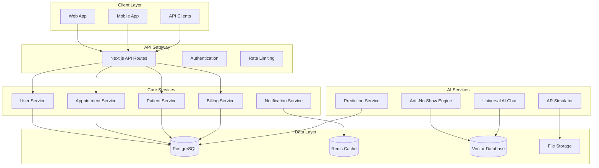

# Technical Architecture

## Core Technology Stack

### Foundation Layer
**Objetivo**: Base sólida, performática e escalável

#### Frontend Stack
- **Next.js 15**: Framework React com App Router e Server Components
- **React 19**: Biblioteca UI com Concurrent Features e Suspense
- **TypeScript 5.3+**: Tipagem estática para maior confiabilidade
- **Tailwind CSS 4.0**: Utility-first CSS framework
- **shadcn/ui**: Componentes acessíveis e customizáveis
- **Framer Motion**: Animações fluidas e interações avançadas

#### Backend & Database
- **Supabase**: Backend-as-a-Service com PostgreSQL
- **PostgreSQL 15+**: Banco de dados relacional principal
- **Redis**: Cache e sessões em memória
- **Prisma**: ORM type-safe para TypeScript
- **tRPC**: Type-safe APIs end-to-end

#### Development & Deployment
- **Turborepo**: Monorepo com build otimizado
- **Docker**: Containerização para consistência
- **Vercel**: Deploy automático e edge computing
- **GitHub Actions**: CI/CD pipeline automatizado
- **ESLint + Prettier**: Code quality e formatação

### AI Enhancement Layer
**Objetivo**: Inteligência artificial avançada e automação

#### AI & Machine Learning
- **OpenAI GPT-4**: Large Language Model principal
- **Custom ML Models**: Modelos especializados em estética
- **Vector Database**: Embeddings para busca semântica
- **TensorFlow.js**: ML no cliente para performance
- **Hugging Face**: Modelos open-source especializados

#### Real-time & Communication
- **WebSockets**: Comunicação em tempo real
- **Server-Sent Events**: Updates automáticos
- **WhatsApp Business API**: Integração oficial
- **Twilio**: SMS e comunicação multi-canal
- **Push Notifications**: Notificações nativas

## System Architecture Overview

### Microservices Architecture



## Database Schema Architecture

### Core Entities

```sql
-- Users and Authentication
CREATE TABLE users (
    id UUID PRIMARY KEY DEFAULT gen_random_uuid(),
    email VARCHAR(255) UNIQUE NOT NULL,
    password_hash VARCHAR(255) NOT NULL,
    role user_role NOT NULL DEFAULT 'user',
    clinic_id UUID REFERENCES clinics(id),
    profile JSONB,
    created_at TIMESTAMP DEFAULT NOW(),
    updated_at TIMESTAMP DEFAULT NOW()
);

-- Clinics
CREATE TABLE clinics (
    id UUID PRIMARY KEY DEFAULT gen_random_uuid(),
    name VARCHAR(255) NOT NULL,
    cnpj VARCHAR(18) UNIQUE,
    address JSONB,
    settings JSONB,
    subscription_plan VARCHAR(50),
    created_at TIMESTAMP DEFAULT NOW(),
    updated_at TIMESTAMP DEFAULT NOW()
);

-- Patients
CREATE TABLE patients (
    id UUID PRIMARY KEY DEFAULT gen_random_uuid(),
    clinic_id UUID REFERENCES clinics(id) NOT NULL,
    name VARCHAR(255) NOT NULL,
    email VARCHAR(255),
    phone VARCHAR(20),
    cpf VARCHAR(14) UNIQUE,
    birth_date DATE,
    medical_history JSONB,
    preferences JSONB,
    behavior_profile JSONB,
    created_at TIMESTAMP DEFAULT NOW(),
    updated_at TIMESTAMP DEFAULT NOW()
);

-- Appointments
CREATE TABLE appointments (
    id UUID PRIMARY KEY DEFAULT gen_random_uuid(),
    clinic_id UUID REFERENCES clinics(id) NOT NULL,
    patient_id UUID REFERENCES patients(id) NOT NULL,
    professional_id UUID REFERENCES users(id),
    service_id UUID REFERENCES services(id),
    scheduled_at TIMESTAMP NOT NULL,
    duration_minutes INTEGER DEFAULT 60,
    status appointment_status DEFAULT 'scheduled',
    notes TEXT,
    metadata JSONB,
    created_at TIMESTAMP DEFAULT NOW(),
    updated_at TIMESTAMP DEFAULT NOW()
);

-- Services
CREATE TABLE services (
    id UUID PRIMARY KEY DEFAULT gen_random_uuid(),
    clinic_id UUID REFERENCES clinics(id) NOT NULL,
    name VARCHAR(255) NOT NULL,
    description TEXT,
    duration_minutes INTEGER NOT NULL,
    price DECIMAL(10,2),
    category VARCHAR(100),
    requirements JSONB,
    created_at TIMESTAMP DEFAULT NOW(),
    updated_at TIMESTAMP DEFAULT NOW()
);
```

### AI-Specific Tables

```sql
-- Behavioral Analysis
CREATE TABLE patient_behavior_analysis (
    id UUID PRIMARY KEY DEFAULT gen_random_uuid(),
    patient_id UUID REFERENCES patients(id) NOT NULL,
    appointment_id UUID REFERENCES appointments(id),
    behavior_score DECIMAL(3,2) CHECK (behavior_score >= 0 AND behavior_score <= 1),
    risk_factors JSONB,
    prediction_confidence DECIMAL(3,2),
    recommended_actions JSONB,
    model_version VARCHAR(50),
    created_at TIMESTAMP DEFAULT NOW()
);

-- AI Chat Conversations
CREATE TABLE ai_conversations (
    id UUID PRIMARY KEY DEFAULT gen_random_uuid(),
    patient_id UUID REFERENCES patients(id),
    clinic_id UUID REFERENCES clinics(id) NOT NULL,
    session_id VARCHAR(255) NOT NULL,
    messages JSONB NOT NULL,
    context JSONB,
    outcome VARCHAR(100),
    satisfaction_score INTEGER CHECK (satisfaction_score >= 1 AND satisfaction_score <= 5),
    created_at TIMESTAMP DEFAULT NOW(),
    updated_at TIMESTAMP DEFAULT NOW()
);

-- Prediction Models
CREATE TABLE prediction_models (
    id UUID PRIMARY KEY DEFAULT gen_random_uuid(),
    name VARCHAR(255) NOT NULL,
    version VARCHAR(50) NOT NULL,
    model_type VARCHAR(100) NOT NULL,
    parameters JSONB,
    performance_metrics JSONB,
    is_active BOOLEAN DEFAULT false,
    created_at TIMESTAMP DEFAULT NOW()
);

-- Vector Embeddings
CREATE TABLE embeddings (
    id UUID PRIMARY KEY DEFAULT gen_random_uuid(),
    entity_type VARCHAR(100) NOT NULL,
    entity_id UUID NOT NULL,
    embedding vector(1536),
    metadata JSONB,
    created_at TIMESTAMP DEFAULT NOW()
);
```

### Indexes for Performance

```sql
-- Core indexes
CREATE INDEX idx_appointments_clinic_date ON appointments(clinic_id, scheduled_at);
CREATE INDEX idx_appointments_patient ON appointments(patient_id);
CREATE INDEX idx_patients_clinic ON patients(clinic_id);
CREATE INDEX idx_behavior_analysis_patient ON patient_behavior_analysis(patient_id);
CREATE INDEX idx_behavior_analysis_score ON patient_behavior_analysis(behavior_score);

-- Vector similarity search
CREATE INDEX idx_embeddings_vector ON embeddings USING ivfflat (embedding vector_cosine_ops);
CREATE INDEX idx_embeddings_entity ON embeddings(entity_type, entity_id);
```

## API Architecture

### RESTful API Design

```typescript
// API Route Structure
interface APIRoutes {
  // Authentication
  'POST /api/auth/login': LoginRequest;
  'POST /api/auth/logout': void;
  'POST /api/auth/refresh': RefreshRequest;
  
  // Patients
  'GET /api/patients': PaginatedResponse<Patient>;
  'POST /api/patients': CreatePatientRequest;
  'GET /api/patients/:id': Patient;
  'PUT /api/patients/:id': UpdatePatientRequest;
  'DELETE /api/patients/:id': void;
  
  // Appointments
  'GET /api/appointments': PaginatedResponse<Appointment>;
  'POST /api/appointments': CreateAppointmentRequest;
  'GET /api/appointments/:id': Appointment;
  'PUT /api/appointments/:id': UpdateAppointmentRequest;
  'DELETE /api/appointments/:id': void;
  
  // AI Services
  'POST /api/ai/chat': ChatRequest;
  'POST /api/ai/predict-noshow': NoShowPredictionRequest;
  'POST /api/ai/simulate-procedure': ProcedureSimulationRequest;
}
```

### tRPC Procedures

```typescript
// Type-safe API with tRPC
export const appRouter = router({
  // Patient procedures
  patient: router({
    list: publicProcedure
      .input(z.object({ clinicId: z.string().uuid() }))
      .query(({ input }) => getPatients(input.clinicId)),
    
    create: publicProcedure
      .input(createPatientSchema)
      .mutation(({ input }) => createPatient(input)),
    
    behaviorAnalysis: publicProcedure
      .input(z.object({ patientId: z.string().uuid() }))
      .query(({ input }) => analyzeBehavior(input.patientId)),
  }),
  
  // AI procedures
  ai: router({
    chat: publicProcedure
      .input(chatSchema)
      .mutation(({ input }) => processChat(input)),
    
    predictNoShow: publicProcedure
      .input(noShowPredictionSchema)
      .mutation(({ input }) => predictNoShow(input)),
  }),
});
```

## Security Architecture

### Authentication & Authorization

```typescript
// JWT Token Structure
interface JWTPayload {
  userId: string;
  clinicId: string;
  role: UserRole;
  permissions: Permission[];
  iat: number;
  exp: number;
}

// Role-Based Access Control
enum UserRole {
  SUPER_ADMIN = 'super_admin',
  CLINIC_ADMIN = 'clinic_admin',
  DOCTOR = 'doctor',
  RECEPTIONIST = 'receptionist',
  USER = 'user'
}

// Permission System
interface Permission {
  resource: string;
  actions: ('create' | 'read' | 'update' | 'delete')[];
  conditions?: Record<string, any>;
}
```

### Data Encryption

```typescript
// Encryption Configuration
interface EncryptionConfig {
  algorithm: 'AES-256-GCM';
  keyDerivation: 'PBKDF2';
  iterations: 100000;
  saltLength: 32;
  ivLength: 16;
  tagLength: 16;
}

// Field-level encryption for sensitive data
interface EncryptedField {
  encrypted: string;
  iv: string;
  tag: string;
  algorithm: string;
}
```

## Performance Optimization

### Caching Strategy

```typescript
// Multi-layer caching
interface CacheStrategy {
  // Browser cache
  clientCache: {
    staticAssets: '1 year';
    apiResponses: '5 minutes';
    userPreferences: '1 day';
  };
  
  // CDN cache
  cdnCache: {
    images: '30 days';
    documents: '7 days';
    api: '1 minute';
  };
  
  // Redis cache
  serverCache: {
    sessions: '24 hours';
    frequentQueries: '1 hour';
    computedResults: '30 minutes';
  };
}
```

### Database Optimization

```sql
-- Partitioning for large tables
CREATE TABLE appointments_2024 PARTITION OF appointments
FOR VALUES FROM ('2024-01-01') TO ('2025-01-01');

-- Materialized views for complex queries
CREATE MATERIALIZED VIEW patient_statistics AS
SELECT 
    clinic_id,
    COUNT(*) as total_patients,
    AVG(behavior_score) as avg_behavior_score,
    COUNT(CASE WHEN last_appointment > NOW() - INTERVAL '30 days' THEN 1 END) as active_patients
FROM patients p
LEFT JOIN patient_behavior_analysis pba ON p.id = pba.patient_id
GROUP BY clinic_id;

-- Refresh materialized view hourly
CREATE OR REPLACE FUNCTION refresh_patient_statistics()
RETURNS void AS $$
BEGIN
    REFRESH MATERIALIZED VIEW CONCURRENTLY patient_statistics;
END;
$$ LANGUAGE plpgsql;
```

## Monitoring & Observability

### Application Monitoring

```typescript
// Monitoring Stack
interface MonitoringStack {
  // Application Performance Monitoring
  apm: 'Vercel Analytics' | 'Sentry';
  
  // Logging
  logging: {
    application: 'Winston + CloudWatch';
    database: 'PostgreSQL logs';
    infrastructure: 'Docker logs';
  };
  
  // Metrics
  metrics: {
    business: 'Custom dashboards';
    technical: 'Prometheus + Grafana';
    user: 'Google Analytics 4';
  };
  
  // Alerting
  alerts: {
    errors: 'Slack + Email';
    performance: 'PagerDuty';
    business: 'Custom webhooks';
  };
}
```

### Health Checks

```typescript
// Health check endpoints
interface HealthChecks {
  '/api/health': {
    status: 'healthy' | 'degraded' | 'unhealthy';
    timestamp: string;
    version: string;
    uptime: number;
  };
  
  '/api/health/database': {
    postgresql: 'connected' | 'disconnected';
    redis: 'connected' | 'disconnected';
    responseTime: number;
  };
  
  '/api/health/external': {
    openai: 'available' | 'unavailable';
    whatsapp: 'available' | 'unavailable';
    payment: 'available' | 'unavailable';
  };
}
```

## Deployment Architecture

### Infrastructure as Code

```yaml
# Docker Compose for development
version: '3.8'
services:
  app:
    build: .
    ports:
      - "3000:3000"
    environment:
      - DATABASE_URL=${DATABASE_URL}
      - REDIS_URL=${REDIS_URL}
      - OPENAI_API_KEY=${OPENAI_API_KEY}
    depends_on:
      - postgres
      - redis
  
  postgres:
    image: postgres:15
    environment:
      - POSTGRES_DB=neonpro
      - POSTGRES_USER=postgres
      - POSTGRES_PASSWORD=password
    volumes:
      - postgres_data:/var/lib/postgresql/data
  
  redis:
    image: redis:7-alpine
    volumes:
      - redis_data:/data

volumes:
  postgres_data:
  redis_data:
```

### CI/CD Pipeline

```yaml
# GitHub Actions workflow
name: Deploy to Production

on:
  push:
    branches: [main]

jobs:
  test:
    runs-on: ubuntu-latest
    steps:
      - uses: actions/checkout@v4
      - uses: actions/setup-node@v4
        with:
          node-version: '20'
      - run: npm ci
      - run: npm run test
      - run: npm run build
  
  deploy:
    needs: test
    runs-on: ubuntu-latest
    steps:
      - uses: actions/checkout@v4
      - uses: vercel/action@v1
        with:
          vercel-token: ${{ secrets.VERCEL_TOKEN }}
          vercel-org-id: ${{ secrets.ORG_ID }}
          vercel-project-id: ${{ secrets.PROJECT_ID }}
```

## Scalability Considerations

### Horizontal Scaling

- **Load Balancing**: Vercel Edge Network para distribuição global
- **Database Scaling**: Read replicas para queries de leitura
- **Cache Scaling**: Redis Cluster para alta disponibilidade
- **File Storage**: CDN para assets estáticos

### Performance Targets

- **Page Load**: <2 segundos (First Contentful Paint)
- **API Response**: <500ms (95th percentile)
- **Database Queries**: <100ms (média)
- **Concurrent Users**: 1000+ por instância
- **Uptime**: 99.9% SLA garantido