# 🏗️ NeonPro System Overview & Context

*Auto-loaded by BMad Dev Agent (@dev) - Version: BMad v4.29.0*

## 🎯 BMAD-Enhanced System Vision

NeonPro é a primeira **"Aesthetic Wellness Intelligence Platform"** do Brasil, seguindo os princípios do BMAD Method para desenvolvimento ágil orientado por IA, combinando gestão inteligente de clínicas estéticas com IA preditiva, wellness integration e compliance total LGPD/ANVISA/CFM.

**Market Position**: Líder em SaaS para clínicas estéticas com diferencial competitivo em IA e wellness  
**Target Revenue**: R$ 15M ARR (500 clínicas × R$ 2.500/mês)  
**Quality Standard**: ≥9.5/10 em todos os componentes (BMAD Quality Gate)  
**Compliance Level**: 100% LGPD/ANVISA/CFM  
**Development Method**: BMAD (Breakthrough Method for Agile AI Driven Development)

## 🏛️ BMAD Architectural Philosophy

**"AI-First Sharded Microservices with BMAD Orchestration"** - Arquitetura híbrida seguindo padrões BMAD, combinando Next.js 15 + React 19 + Vite com microservices especializados, IA preditiva integrada e sharding inteligente por clinic_id.

### BMAD-Enhanced Core Principles
- **AI-First Development**: Inteligência artificial em todas as operações, seguindo BMAD AI-driven patterns
- **Wellness-Integrated**: Abordagem holística física + mental com arquitetura orientada por domínio
- **Compliance-Native**: LGPD/ANVISA/CFM by design com audit trails automáticos
- **Sharded-Performance**: Escalabilidade horizontal inteligente com multi-tenant isolation
- **Edge-Optimized**: Latência <100ms globalmente usando Vercel Edge + Supabase Edge Functions
- **Security-Hardened**: Zero-trust architecture com ML threat detection
- **Real-time-Sync**: Sincronização multi-device instantânea via Supabase Realtime
- **BMAD-Compliant**: Seguindo workflow de Planning → Development → Quality → Deployment

## 🌐 BMAD-Enhanced High-Level Architecture

```mermaid
graph TB
    subgraph "BMAD Planning Layer"
        BMAD1[Analyst Agent: Market Research]
        BMAD2[PM Agent: PRD Creation]
        BMAD3[Architect Agent: System Design]
        BMAD4[PO Agent: Epic Management]
        BMAD5[SM Agent: Story Creation]
    end
    
    subgraph "AI Intelligence Layer"
        AI1[Treatment Success Prediction]
        AI2[No-Show Probability Engine]
        AI3[Revenue Forecasting ML]
        AI4[Computer Vision Analysis]
        AI5[Wellness Score Calculator]
        AI6[Scheduling Optimization AI]
        AI7[BMAD Context Engine]
    end
    
    subgraph "Hybrid Frontend Layer"
        A[Next.js 15 App Router + React 19]
        B[Vite Development Server]
        C[React Server Components]
        D[Client Components]
        E[Edge Functions]
        F[Smart Middleware]
        G[PWA Service Worker]
        H[Multi-Layer Cache]
    end
    
    subgraph "Microservices Layer"
        MS1[Patient Management Service]
        MS2[Scheduling Optimization Service]
        MS3[Billing Intelligence Service]
        MS4[Wellness Integration Service]
        MS5[Professional Validation Service]
        MS6[Audit Trail Service]
        MS7[BMAD Documentation Service]
    end
    
    subgraph "Sharded Data Plane (Supabase + RLS)"
        DB1[Shard 1: Clinics 1-100]
        DB2[Shard 2: Clinics 101-200]
        DB3[Shard 3: Analytics Data]
        DB4[Shard 4: Audit Logs]
        DB5[Shard 5: BMAD Artifacts]
        RLS[Row Level Security]
        RT[Real-time Subscriptions]
    end
    
    subgraph "Compliance & Security Layer"
        LGPD[LGPD Compliance Engine]
        ANVISA[ANVISA Medical Compliance]
        CFM[CFM Professional Validation]
        SEC[Zero-Trust Security]
        AUDIT[Immutable Audit Trail]
        BMAD_AUDIT[BMAD Quality Gates]
    end
    
    subgraph "External Integrations"
        PAY[Payment Gateways]
        SMS[SMS/Email/WhatsApp]
        CRM[CRM/CRO/CFM APIs]
        WELLNESS[Psychology APIs]
        VISION[Computer Vision APIs]
        BMAD_TOOLS[BMAD Agent Ecosystem]
    end
    
    BMAD1 --> BMAD2
    BMAD2 --> BMAD3
    BMAD3 --> BMAD4
    BMAD4 --> BMAD5
    
    A --> C
    A --> D
    B --> D
    C --> MS1
    D --> MS2
    E --> AI1
    
    MS1 --> DB1
    MS2 --> DB2
    MS3 --> DB3
    MS6 --> DB4
    MS7 --> DB5
    
    AI1 --> AI4
    AI2 --> AI5
    AI3 --> AI6
    AI7 --> BMAD_TOOLS
    
    LGPD --> AUDIT
    ANVISA --> CFM
    SEC --> RLS
    BMAD_AUDIT --> AUDIT
    
    MS4 --> WELLNESS
    MS5 --> CRM
    AI4 --> VISION
```

## 🔄 BMAD Development Workflow Integration

### Planning Phase (Web UI/Powerful IDE Agents)
1. **Analyst Research**: Market analysis and competitive research for aesthetic clinic industry
2. **Project Brief Creation**: Define NeonPro's unique value proposition and target market
3. **PRD Development**: Functional and non-functional requirements with user stories
4. **Architecture Design**: System design following BMAD patterns and quality gates
5. **UX Specification**: Frontend design system with accessibility compliance

### Development Phase (IDE-Based)
1. **Document Sharding**: Break down PRD and Architecture into manageable shards
2. **Story Creation**: SM agent creates detailed development stories from epics
3. **Sequential Development**: Dev agent implements following coding standards (≥9.5/10)
4. **Quality Assurance**: QA agent validates against BMAD quality checklist
5. **Continuous Integration**: Automated testing and compliance validation

### Quality Gates (BMAD Compliance)
- **Code Quality**: ≥9.5/10 rating on all components
- **Type Safety**: 100% TypeScript coverage with strict configuration
- **Security**: Zero-trust architecture with RLS compliance
- **Performance**: <100ms edge latency globally
- **Accessibility**: WCAG 2.1 AA+ compliance
- **Documentation**: Auto-generated and maintained architecture docs

## 💡 BMAD Method Benefits for NeonPro

### Development Velocity
- **50%+ Faster Development**: Vite HMR + React 19 concurrent features
- **Consistent Quality**: BMAD agents ensure coding standards compliance
- **Reduced Context Loss**: Sharded documentation maintains development context
- **Automated Planning**: AI agents handle requirements gathering and architecture

### Business Value
- **Predictable Delivery**: Structured workflow reduces development uncertainty
- **Quality Assurance**: Built-in quality gates prevent technical debt
- **Scalable Architecture**: Design patterns support growth to 500+ clinics
- **Compliance-Ready**: LGPD/ANVISA/CFM compliance built into architecture

### Technical Excellence
- **Modern Stack**: React 19 + Next.js 15 + Vite for optimal performance
- **AI-Driven**: Machine learning integrated into core business processes
- **Security-First**: Zero-trust architecture with comprehensive audit trails
- **Real-Time**: Instant synchronization across all devices and platforms

---

*This system overview is maintained as part of the BMAD Method and serves as the foundation for all architectural decisions in NeonPro development.*
