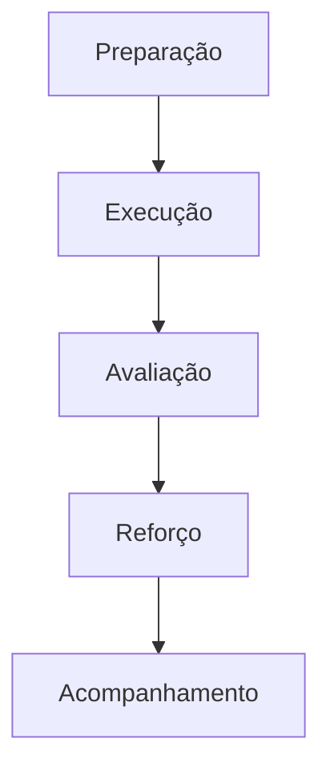

# Roteiros de Treinamento - NeonPro Sistema de Gestão

**Versão:** 1.0.0  
**Data:** Setembro 2024  
**Classificação:** Documento de Treinamento  
**Compliance:** LGPD, ANVISA, CFM

---

## 📋 Índice

1. [Introdução aos Roteiros de Treinamento](#introdução-aos-roteiros-de-treinamento)
2. [Roteiros para Administração](#roteiros-para-administração)
3. [Roteiros para Profissionais de Saúde](#roteiros-para-profissionais-de-saúde)
4. [Roteiros para Recepção](#roteiros-para-recepção)
5. [Roteiros de Segurança](#roteiros-de-segurança)
6. [Roteiros de Telemedicina](#roteiros-de-telemedicina)
7. [Roteiros de Integração](#roteiros-de-integração)
8. [Roteiros de Emergência](#roteiros-de-emergência)
9. [Roteiros de Reforço](#roteiros-de-reforço)
10. [Materiais de Apoio](#materiais-de-apoio)

---

## 🎯 Introdução aos Roteiros de Treinamento

### Objetivo do Documento

Este documento contém roteiros estruturados para todos os treinamentos do sistema NeonPro, garantindo padronização e eficácia no processo de capacitação.

### Público-Alvo

- **Novos funcionários:** Funcionários recém-contratados
- **Funcionários existentes:** Atualizações e reciclagens
- **Gestores:** Supervisão de treinamentos
- **Treinadores:** Execução dos treinamentos

### Metodologia



---

## 👔 Roteiros para Administração

### Módulo 1: Introdução à Plataforma

#### Roteiro Básico (90 minutos)

**Objetivos:**
- Compreender a arquitetura do sistema
- Navegar pelos principais módulos
- Identificar funcionalidades administrativas

**Material Necessário:**
- Computador com acesso ao NeonPro
- Projetor ou telas compartilhadas
- Manual do Administrador
- Checklist de atividades

**Estrutura do Roteiro:**

```markdown
# Roteiro: Introdução ao NeonPro

## Apresentação (15 minutos)
- História e propósito do NeonPro
- Visão geral da plataforma
- Benefícios para a clínica

## Demonstração Prática (45 minutos)
- Tela inicial e dashboard
- Navegação pelos módulos
- Menu principal e configurações
- Busca e filtros

## Prática Guiada (20 minutos)
- Acessar diferentes seções
- Visualizar informações básicas
- Utilizar ferramentas de busca

## Avaliação (10 minutos)
- Questionário prático
- Demonstração de navegação
- Perguntas e respostas
```

#### Checklist do Treinador

- [ ] Ambientes de teste preparados
- [ ] Material de apresentação carregado
- [ ] Exercícios práticos configurados
- [ ] Formulários de avaliação impressos
- [ ] Senhas temporárias geradas

### Módulo 2: Gestão Financeira

#### Roteiro Completo (120 minutos)

**Cenários Práticos:**

```markdown
## Cenário 1: Cadastro de Paciente (15 minutos)
1. Acessar módulo de Pacientes
2. Clicar em "Novo Paciente"
3. Preencher informações básicas
4. Verificar dados de contato
5. Salvar e confirmar

## Cenário 2: Agendamento (20 minutos)
1. Buscar paciente cadastrado
2. Selecionar profissional disponível
3. Escolher tipo de procedimento
4. Definir data e horário
5. Confirmar agendamento
6. Enviar confirmação

## Cenário 3: Financeiro (25 minutos)
1. Visualizar faturas pendentes
2. Gerar nova fatura
3. Aplicar pagamentos
4. Emitir relatórios
5. Conciliar contas

## Cenário 4: Relatórios (20 minutos)
1. Acessar dashboard analítico
2. Configurar filtros
3. Exportar dados
4. Analisar métricas
5. Identificar tendências
```

#### Atividades Práticas

**Exercício 1: Cadastro Completo**
- Cadastrar 3 pacientes diferentes
- Agendar consultas para cada um
- Gerar faturas correspondentes
- Verificar fluxo completo

**Exercício 2: Análise de Dados**
- Acessar relatórios mensais
- Comparar períodos
- Identificar padrões
- Sugerir melhorias

### Módulo 3: Recursos Humanos

#### Roteiro Interativo (150 minutos)

**Simulações:**

```markdown
## Simulação 1: Contratação (30 minutos)
- Cadastrar novo funcionário
- Definir permissões de acesso
- Configurar escalas de trabalho
- Gerar contratos

## Simulação 2: Avaliação (25 minutos)
- Acessar módulo de avaliação
- Preencher formulários
- Registrar feedback
- Gerar relatórios

## Simulação 3: Gestão de Férias (20 minutos)
- Solicitar períodos de férias
- Aprovar ou rejeitar
- Calcular folha de pagamento
- Atualizar escalas
```

---

## 👨‍⚕️ Roteiros para Profissionais de Saúde

### Módulo 1: Utilização da Plataforma

#### Roteiro Básico (60 minutos)

**Objetivos:**
- Dominar navegação clínica
- Gerenciar prontuários eletrônicos
- Utilizar ferramentas de diagnóstico

**Estrutura:**

```markdown
## Navegação Clínica (20 minutos)
1. Acesso ao perfil profissional
2. Dashboard de atendimentos
3. Calendário de consultas
4. Pacientes atribuídos

## Prontuário Eletrônico (25 minutos)
1. Abrir prontuário do paciente
2. Visualizar histórico
3. Adicionar novas anotações
4. Anexar exames
5. Prescrever tratamentos

## Prescrição Digital (15 minutos)
1. Acessar módulo de prescrição
2. Selecionar medicamentos
3. Definir dosagens
4. Emitir receitas
5. Enviar para farmácia
```

#### Dicas para o Treinador

- Usar exemplos de casos reais (anonimizados)
- Demonstrar fluxos de trabalho típicos
- Enfatizar importância da documentação
- Praticar com diferentes cenários

### Módulo 2: Fluxos Clínicos

#### Roteiro Avançado (180 minutos)

**Cenários Clínicos:**

```markdown
## Cenário 1: Primeira Consulta (45 minutos)
1. Recepcionar paciente no sistema
2. Acessar histórico prévio
3. Realizar anamnese digital
4. Registrar informações vitais
5. Documentar exame físico
6. Elaborar plano de tratamento
7. Agendar retornos
8. Gerar orientações

## Cenário 2: Acompanhamento (30 minutos)
1. Revisar histórico de tratamentos
2. Avaliar evolução do paciente
3. Registrar novas observações
4. Ajustar protocolos
5. Documentar respostas
6. Planejar próximos passos

## Cenário 3: Emergência (35 minutos)
1. Identificar paciente em emergência
2. Acessar histórico rápido
3. Registrar informações críticas
4. Notificar equipe médica
5. Documentar intervenções
6. Atualizar prontuário
7. Gerar relatório emergencial
```

### Módulo 3: Procedimentos Específicos

#### Roteiro Especializado (120 minutos)

**Procedimentos por Área:**

```markdown
## Procedimentos Estéticos (40 minutos)
- Preenchimento facial
- Toxina botulínica
- Peelings químicos
- Laserterapia
- Microagulhamento

## Procedimentos Dermatológicos (40 minutos)
- Mapeamento corporal
- Fototerapia
- Crioterapia
- Biópsias
- Cirurgias menores

## Procedimentos de Recuperação (40 minutos)
- Pós-operatório
- Tratamentos complementares
- Acompanhamento de resultados
- Gestão de complicações
```

---

## 📞 Roteiros para Recepção

### Módulo 1: Fundamentos

#### Roteiro Inicial (90 minutos)

**Objetivos:**
- Compreender papel da recepção no sistema
- Dominar interface de atendimento
- Gerenciar fluxo de pacientes

**Estrutura:**

```markdown
## Interface de Recepção (25 minutos)
1. Tela inicial do dia
2. Lista de agendamentos
3. Status dos pacientes
4. Notificações do sistema
5. Ferramentas rápidas

## Cadastro de Pacientes (30 minutos)
1. Novo cadastro rápido
2. Busca de pacientes existentes
3. Atualização de informações
4. Verificação de documentos
5. Fotos e impressões digitais

## Comunicação (20 minutos)
1. Sistema de chamada
2. Mensagens internas
3. Comunicação com pacientes
4. Notificações automáticas
5. Feedback dos atendimentos

## Avaliação (15 minutos)
- Teste prático de cadastro
- Simulação de atendimento
- Perguntas e respostas
```

### Módulo 2: Gestão de Agendamentos

#### Roteiro Operacional (120 minutos)

**Cenários Práticos:**

```markdown
## Cenário 1: Agendamento Presencial (30 minutos)
1. Receber solicitação do paciente
2. Consultar disponibilidade
3. Selecionar profissional adequado
4. Escolher horário disponível
5. Confirmar tipo de procedimento
6. Registrar informações adicionais
7. Enviar confirmação
8. Atualizar agenda

## Cenário 2: Remarcação (25 minutos)
1. Identificar motivo da remarcação
2. Consultar novas disponibilidades
3. Verificar políticas da clínica
4. Oferecer alternativas
5. Confirmar novo horário
6. Atualizar sistema
7. Notificar profissionais
8. Registrar alteração

## Cenário 3: Cancelamento (20 minutos)
1. Receber solicitação
2. Verificar política de cancelamento
3. Confirmar procedimento
4. Processar cancelamento
5. Atualizar agenda
6. Liberar vaga
7. Notificar equipe
8. Registrar motivo

## Cenário 4: Agendamento Online (15 minutos)
1. Acessar novos agendamentos
2. Verificar informações
3. Confirmar disponibilidade
4. Validar documentos
5. Finalizar cadastro
6. Enviar confirmação
```

### Módulo 3: Atendimento ao Paciente

#### Roteiro de Serviço (90 minutos)

**Protocolos de Atendimento:**

```markdown
## Protocolo de Boas-vindas (15 minutos)
1. Saudação profissional
2. Verificação de agendamento
3. Confirmação de documentos
4. Orientação inicial
5. Encaminhamento adequado

## Protocolo de Espera (10 minutos)
1. Informar tempo de espera
2. Oferecer comodidades
3. Manter comunicação
4. Atualizar status
5. Gerenciar expectativas

## Protocolo de Pós-Atendimento (15 minutos)
1. Confirmar finalização
2. Agendar retornos
3. Explicar próximos passos
4. Verificar satisfação
5. Despedida profissional

## Protocolo de Emergência (20 minutos)
1. Identificar situação de emergência
2. Acionar equipe médica
3. Manter paciente calmo
4. Documentar ocorrência
5. Comunicar familiares
6. Seguir protocolos
```

---

## 🔒 Roteiros de Segurança

### Módulo 1: Segurança da Informação

#### Roteiro Completo (120 minutos)

**Cenários de Segurança:**

```markdown
## Cenário 1: Acesso Seguro (20 minutos)
1. Login seguro
2. Autenticação de dois fatores
3. Gerenciamento de senhas
4. Sessões seguras
5. Logout adequado

## Cenário 2: Proteção de Dados (30 minutos)
1. Classificação de informações
2. Manipulação de dados sensíveis
3. Compartilhamento seguro
4. Armazenamento adequado
5. Descarte seguro

## Cenário 3: Incidentes de Segurança (25 minutos)
1. Identificação de vulnerabilidades
2. Relatório de incidentes
3. Contenção de danos
4. Recuperação de sistemas
5. Aprendizado e melhoria

## Cenário 4: Auditoria (15 minutos)
1. Revisão de logs
2. Verificação de acessos
3. Análise de padrões
4. Relatórios de conformidade
5. Ações corretivas
```

### Módulo 2: LGPD na Prática

#### Roteiro de Compliance (150 minutos)

**Exercícios Práticos:**

```markdown
## Exercício 1: Consentimento (30 minutos)
- Solicitar consentimento adequado
- Explicar tratamento de dados
- Registrar autorizações
- Gerenciar revogações
- Documentar processos

## Exercício 2: Direitos do Titular (25 minutos)
- Atender solicitações de acesso
- Processar pedidos de exclusão
- Corrigir informações incorretas
- Portabilidade de dados
- Responder a reclamações

## Exercício 3: Notificações (20 minutos)
- Identificar vazamentos
- Notificar autoridades
- Comunicar titulares
- Documentar medidas
- Prevenir recorrência

## Exercício 4: Auditoria (15 minutos)
- Verificar conformidade
- Identificar não conformidades
- Implementar correções
- Atualizar políticas
- Treinar equipe
```

---

## 🏥 Roteiros de Telemedicina

### Módulo 1: Plataforma de Telemedicina

#### Roteiro Completo (180 minutos)

**Cenários de Telemedicina:**

```markdown
## Cenário 1: Configuração (30 minutos)
1. Preparar ambiente
2. Testar equipamentos
3. Verificar conexão
4. Configurar perfil
5. Testar áudio/vídeo

## Cenário 2: Atendimento Remoto (45 minutos)
1. Iniciar sessão
2. Verificar paciente
3. Conduzir consulta
4. Documentar atendimento
5. Prescrever tratamentos
6. Agendar seguimento

## Cenário 3: Emergência Remota (35 minutos)
1. Identificar emergência
2. Orientar paciente
3. Acionar suporte local
4. Documentar situação
5. Coordenar resposta
6. Acompanhar evolução

## Cenário 4: Acompanhamento (25 minutos)
1. Avaliar resultados
2. Ajustar tratamentos
3. Educar paciente
4. Monitorar evolução
5. Planejar cuidados
```

### Módulo 2: Procedimentos Remotos

#### Roteiro Especializado (150 minutos)

**Procedimentos por Telemedicina:**

```markdown
## Avaliação Dermatológica Remota (40 minutos)
- Guia para fotos clínicas
- Análise de lesões
- Triagem de condições
- Orientação para consulta presencial
- Acompanhamento pós-procedimento

## Consulta de Acompanhamento (30 minutos)
- Revisão de tratamentos
- Avaliação de resultados
- Ajuste de protocolos
- Educação continuada
- Planejamento futuro

## Orientação Pré-operatória (35 minutos)
- Explicação de procedimentos
- Preparação do paciente
- Expectativas realistas
- Cuidados pós-operatórios
- Sinais de alerta

## Suporte Pós-procedimento (25 minutos)
- Monitoramento de recuperação
- Identificação de complicações
- Intervenções precoces
- Encaminhamento adequado
- Documentação completa
```

---

## 🔄 Roteiros de Integração

### Módulo 1: Integração de Novos Funcionários

#### Roteiro Semanal (5 dias)

**Dia 1: Introdução (4 horas)**
- Apresentação da clínica
- Tour pelas instalações
- Conhecer a equipe
- Visão geral do sistema
- Configuração inicial

**Dia 2: Sistema Básico (6 horas)**
- Login e navegação
- Perfil do usuário
- Notificações
- Busca básica
- Ajuda online

**Dia 3: Funções Específicas (6 horas)**
- Módulo principal
- Tarefas diárias
- Procedimentos padrão
- Atendimento ao paciente
- Documentação

**Dia 4: Integração com Equipe (4 horas)**
- Trabalho com parceiro
- Simulações de equipe
- Comunicação interna
- Resolução de problemas
- Feedback

**Dia 5: Avaliação e Certificação (4 horas)**
- Teste prático
- Avaliação teórica
- Feedback final
- Certificação
- Plano de desenvolvimento

### Módulo 2: Atualizações do Sistema

#### Roteiro de Atualização (60 minutos)

**Processo de Atualização:**

```markdown
## Antes da Atualização (15 minutos)
1. Comunicar nova versão
2. Backup de dados
3. Preparar ambiente
4. Agendar manutenção
5. Informar pacientes

## Durante a Atualização (20 minutos)
1. Executar atualização
2. Verificar componentes
3. Testar funcionalidades
4. Validar integrações
5. Documentar mudanças

## Após a Atualização (25 minutos)
1. Testar ambiente
2. Validar workflows
3. Treinar novidades
4. Suporte inicial
5. Coletar feedback
```

---

## 🚨 Roteiros de Emergência

### Módulo 1: Falhas do Sistema

#### Roteiro de Contingência (90 minutos)

**Cenários de Emergência:**

```markdown
## Cenário 1: Queda do Sistema (25 minutos)
1. Identificar tipo de falha
2. Ativar plano B
3. Comunicar pacientes
4. Documentar manualmente
5. Manter operações
6. Aguardar recuperação

## Cenário 2: Perda de Conexão (20 minutos)
1. Verificar conectividade
2. Ativar modo offline
3. Sincronizar dados
4. Comunicar equipe
5. Monitorar recuperação

## Cenário 3: Dados Corrompidos (15 minutos)
1. Identificar problema
2. Restaurar backup
3. Verificar integridade
4. Validar informações
5. Documentar incidente

## Cenário 4: Segurança Comprometida (20 minutos)
1. Isolar sistemas
2. Investigar incidente
3. Notificar autoridades
4. Recuperar sistemas
5. Implementar melhorias
```

### Módulo 2: Emergências Médicas

#### Roteiro de Resposta (120 minutos)

**Protocolos de Emergência:**

```markdown
## Parada Cardiorrespiratória (30 minutos)
1. Identificar situação
2. Ativar equipe médica
3. Iniciar RCP se treinado
4. Utilizar DEA se disponível
5. Documentar tempo
6. Comunicar familiares
7. Manter registros

## Reação Alérgica (25 minutos)
1. Identificar sinais e sintomas
2. Avaliar gravidade
3. Administrar medicação
4. Monitorar evolução
5. Documentar tratamento
6. Prevenir recorrência

## Crise Hipertensiva (20 minutos)
1. Medir pressão arterial
2. Avaliar sintomas
3. Administrar medicação
4. Monitorar sinais vitais
5. Encaminhar para emergência
6. Documentar evento

## Emergência Psiquiátrica (25 minutos)
1. Avaliar segurança
2. Reduzir estímulos
3. Comunicar equipe
4. Conter se necessário
5. Documentar incidente
6. Encaminhar especialista
```

---

## 📚 Roteiros de Reforço

### Módulo 1: Reforço Mensal

#### Roteiro de Reciclagem (60 minutos)

**Estrutura Mensal:**

```markdown
## Atualizações do Sistema (15 minutos)
- Novas funcionalidades
- Mudanças importantes
- Melhorias implementadas
- Padrões atualizados

## Revisão de Procedimentos (20 minutos)
- Procedimentos críticos
- Erros comuns
- Melhores práticas
- Dicas de eficiência

## Estudos de Caso (15 minutos)
- Casos reais recentes
- Lições aprendidas
- Melhorias implementadas
- Prevenção de erros

## Perguntas e Respostas (10 minutos)
- Dúvidas da equipe
- Compartilhamento de experiências
- Sugestões de melhoria
- Planejamento futuro
```

### Módulo 2: Reforço Trimestral

#### Roteiro Completo (180 minutos)

**Avaliação Compreensiva:**

```markdown
## Avaliação Teórica (60 minutos)
- Questionário completo
- Casos clínicos
- Situações de emergência
- Procedimentos complexos
- Compliance e regulamentações

## Avaliação Prática (90 minutos)
- Simulações realistas
- Procedimentos completos
- Atendimento de emergência
- Trabalho em equipe
- Tomada de decisão

## Feedback e Desenvolvimento (30 minutos)
- Análise de resultados
- Identificação de gaps
- Planos de melhoria
- Treinamentos adicionais
- Metas futuras
```

---

## 🎭 Materiais de Apoio

### Slides de Apresentação

**Slide 1: Introdução**
```
Título: NeonPro - Sistema de Gestão de Clínicas Estéticas
Subtítulo: Treinamento Profissional
Data: [Data do treinamento]
Instrutor: [Nome do instrutor]
```

**Slide 2: Objetivos**
```
✓ Dominar navegação do sistema
✓ Realizar procedimentos essenciais
✓ Garantir compliance regulatório
✓ Melhorar eficiência operacional
✓ Proporcionar excelência no atendimento
```

### Exercícios Práticos

**Exercício 1: Navegação Básica**
```markdown
1. Faça login no sistema
2. Navegue pelos 5 principais módulos
3. Encontre 3 diferentes tipos de relatórios
4. Acesse seu perfil e atualize informações
5. Utilize a função de busca
```

**Exercício 2: Cadastro Completo**
```markdown
1. Cadastre um novo paciente
2. Agende 3 consultas diferentes
3. Crie um prontuário inicial
4. Anexe 2 documentos
5. Gere um relatório do paciente
```

### Checklists de Avaliação

**Checklist de Competência Básica**
- [ ] Realizar login seguro
- [ ] Navegar pelo sistema
- [ ] Realizar busca de pacientes
- [ ] Visualizar agenda
- [ ] Acessar ajuda online
- [ ] Compreender notificações
- [ ] Utilizar mensagens internas
- [ ] Gerar relatórios básicos

**Checklist de Competência Avançada**
- [ ] Realizar cadastro completo
- [ ] Gerenciar agendamentos complexos
- [ ] Utilizar prontuário eletrônico
- [ ] Prescrever tratamentos
- [ ] Gerenciar documentos
- [ ] Realizar backup de dados
- [ ] Identificar e relatar problemas
- [ ] Treinar novos usuários

### Formulários de Avaliação

**Avaliação de Treinamento**
```
Nome do Participante: _________________
Data do Treinamento: _________________
Instrutor: _________________________

Avaliação (1-5):
[ ] Clareza do conteúdo
[ ] Qualidade da apresentação
[ ] Utilidade prática
[ ] Tempo adequado
[ ] Material de apoio

Comentários:
_________________________________________________
_________________________________________________
_________________________________________________
```

**Certificado de Conclusão**
```
CERTIFICADO DE CONCLUSÃO

Certificamos que [Nome do Participante] concluiu com sucesso
o treinamento [Nome do Treinamento] em [Data].

Carga Horária: [X] horas
Avaliação Final: [Nota/Conceito]

Instrutor: [Nome do Instrutor]
Coordenador: [Nome do Coordenador]

Assinaturas:
_______________________      _______________________
Instrutor                Coordenador
```

### Simuladores e Ambientes de Teste

**Configuração de Ambiente de Teste**
```markdown
## Passos para Configuração
1. Criar usuário de teste
2. Configurar permissões adequadas
3. Preparar dados de teste
4. Isolar ambiente de produção
5. Documentar cenários
6. Monitorar desempenho

## Cenários de Teste
- Usuário básico
- Profissional de saúde
- Administrador
- Recepcionista
- Emergência médica
```

### Vídeos de Treinamento

**Estrutura de Vídeos**
```markdown
## Vídeo 1: Introdução (5 minutos)
- Visão geral do sistema
- Benefícios principais
- Navegação básica
- Próximos passos

## Vídeo 2: Módulos Principais (10 minutos)
- Dashboard
- Pacientes
- Agendamentos
- Financeiro
- Relatórios

## Vídeo 3: Procedimentos Essenciais (15 minutos)
- Cadastro de pacientes
- Agendamento
- Consultas
- Prescrições
```

---

## 📊 Métricas de Avaliação

### Indicadores de Sucesso

**Métricas de Treinamento:**
- Taxa de conclusão: ≥90%
- Satisfação dos participantes: ≥4.5/5
- Retenção de conhecimento: ≥85%
- Aplicação prática: ≥80%
- Redução de erros: ≥70%

**Métricas Operacionais:**
- Tempo de treinamento: Redução de 30%
- Custo de treinamento: Redução de 25%
- Produtividade pós-treinamento: Aumento de 40%
- Satisfação do paciente: Aumento de 20%

---

## 🔧 Manutenção dos Roteiros

### Processo de Atualização

1. **Revisão Mensal**
   - Avaliar eficácia
   - Identificar gaps
   - Coletar feedback
   - Atualizar conteúdo

2. **Atualização Trimestral**
   - Incorporar novas funcionalidades
   - Atualizar regulamentações
   - Melhorar metodologia
   - Validar procedimentos

3. **Validação Semestral**
   - Testar todos os roteiros
   - Validar cenários
   - Verificar compliance
   - Certificar qualidade

### Controle de Versão

```markdown
Versão 1.0.0 - Setembro/2024
- Versão inicial
- Todos os módulos básicos
- Cenários fundamentais
- Material de apoio completo
```

---

## 📞 Suporte ao Treinamento

### Canais de Suporte

**Suporte Imediato:**
- Chat interno do sistema
- Telefone da clínica
- Mensageiro instantâneo
- Help desk presencial

**Suporte Técnico:**
- Email de suporte
- Portal de ajuda
- Fórum de discussão
- Base de conhecimento

**Documentação:**
- Manuais online
- Vídeos tutoriais
- FAQs atualizadas
- Guias rápidos

### Procedimento de Escalada

**Nível 1: Suporte Básico**
- Problemas de navegação
- Dúvidas de procedimento
- Ajuda com funcionalidades
- Tempo de resposta: 15 minutos

**Nível 2: Suporte Técnico**
- Erros do sistema
- Problemas de configuração
- Dificuldades técnicas
- Tempo de resposta: 30 minutos

**Nível 3: Suporte Avançado**
- Problemas complexos
- Customizações
- Integrações
- Tempo de resposta: 60 minutos

---

## 🎯 Conclusão

Estes roteiros fornecem uma estrutura completa e padronizada para todos os treinamentos do sistema NeonPro, garantindo:

- **Consistência:** Mesmo padrão para todos os usuários
- **Qualidade:** Conteúdo validado e atualizado
- **Eficácia:** Resultados mensuráveis
- **Compliance:** Atendimento a todas as regulamentações
- **Melhoria Contínua:** Processos de atualização constantes

**Próximos Passos:**

1. [ ] Implementar roteiros na clínica
2. [ ] Treinar instrutores
3. [ ] Preparar ambientes de teste
4. [ ] Coletar feedback inicial
5. [ ] Ajustar conforme necessário
6. [ ] Monitorar resultados
7. [ ] Atualizar periodicamente

---

**📋 Documentos Relacionados:**
- Manual do Administrador
- Manual do Profissional de Saúde
- Manual da Recepção
- Manual do Paciente
- Guia de Treinamento
- Políticas de Segurança
- Protocolos de Emergência

**🔗 Recursos Adicionais:**
- Portal de ajuda online
- Vídeos tutoriais
- Webinars mensais
- Fórum de comunidade
- Base de conhecimento
- Suporte técnico 24/7

---

*Este documento é propriedade intelectual da NeonPro e não deve ser compartilhado sem autorização. Todos os direitos reservados.*