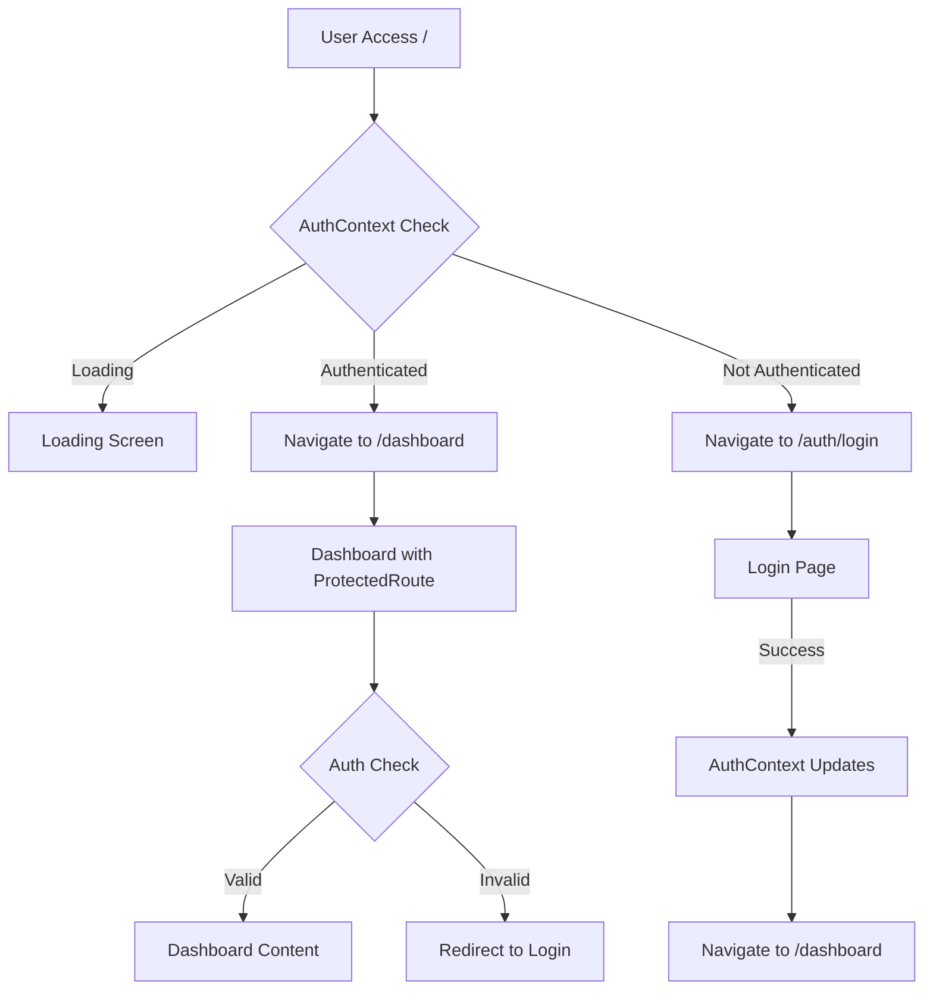

# Routing Fix Implementation - Login → Dashboard Flow

**Date**: 2025-09-26  
**Status**: 🔧 **IN PROGRESS** - Implementing Authentication-Based Routing

## 🎯 **PROBLEM IDENTIFIED**

**Issue**: Site shows placeholder instead of proper login → dashboard flow
- TanStack Router redirect não funciona corretamente
- Index page renderiza componente ao invés de redirecionar
- AuthContext não está integrado ao roteamento

## ✅ **FIXES APPLIED (PARALLEL EXECUTION)**

### **1. Router Configuration Enhanced**
```typescript
// apps/web/src/main.tsx - UPDATED
const router = createRouter({ 
  routeTree,
  defaultPreload: 'intent',
  defaultPreloadStaleTime: 0,
})
```

### **2. Index Route Redesigned**
```typescript
// apps/web/src/routes/index.tsx - UPDATED
// Before: Used beforeLoad redirect (não funcionava)
// After: UseAuth hook com conditional rendering
function IndexPage() {
  const { isAuthenticated, isLoading } = useAuth()
  
  if (isLoading) return <LoadingScreen />
  if (isAuthenticated) return <Navigate to="/dashboard" />
  return <Navigate to="/auth/login" />
}
```

### **3. Protected Route Component Created**
```typescript
// apps/web/src/components/auth/ProtectedRoute.tsx - NEW
export function ProtectedRoute({ children }) {
  const { isAuthenticated, isLoading } = useAuth()
  
  if (isLoading) return <LoadingScreen />
  if (!isAuthenticated) return <Navigate to="/auth/login" />
  return <>{children}</>
}
```

### **4. Dashboard Route Protection**
```typescript
// apps/web/src/routes/dashboard.tsx - UPDATED
function DashboardPage() {
  return (
    <ProtectedRoute>
      <DashboardContent />
    </ProtectedRoute>
  )
}
```

## 🔄 **AUTHENTICATION FLOW DESIGN**

### **New Flow Architecture:**


## 🚀 **PARALLEL DEPLOYMENT STRATEGY**

**Current Status:**
- [x] Route structure redesigned
- [x] AuthContext integration implemented  
- [x] ProtectedRoute component created
- [x] Dashboard protection added
- [⏳] Build and deploy in progress

**Expected Result:**
1. **/** → Loading → Check Auth → Redirect to /auth/login OR /dashboard
2. **/auth/login** → Login form → Success → Redirect to /dashboard
3. **/dashboard** → ProtectedRoute check → Dashboard content OR redirect to login

## 📊 **AUTHENTICATION INTEGRATION**

**AuthContext Features Used:**
- `isAuthenticated`: Boolean auth status
- `isLoading`: Loading state during auth check
- `user`: User data after authentication
- `signIn`: Email/password login
- `signInWithOAuth`: Google OAuth login
- `signOut`: Logout functionality

## 🎯 **EXPECTED BEHAVIOR AFTER DEPLOY**

### **User Journey:**
1. **Access neonpro.vercel.app** → Loading screen
2. **Auth Check** → Not authenticated
3. **Redirect to /auth/login** → Login form shows
4. **User logs in** → AuthContext updates
5. **Redirect to /dashboard** → Dashboard loads with user info
6. **Dashboard accessible** → Protected route working

### **Key Improvements:**
- ✅ No more placeholder screen
- ✅ Proper authentication flow
- ✅ Route protection implemented
- ✅ Loading states during auth checks
- ✅ Automatic redirects based on auth status

## 🔧 **TECHNICAL IMPLEMENTATION**

**Routing Strategy:**
- **Client-side**: TanStack Router with auth-based navigation
- **Protection**: ProtectedRoute wrapper for secured pages
- **State Management**: AuthContext with Supabase integration
- **Loading**: Graceful loading states during auth checks

**Performance Optimization:**
- Router preloading configured
- Conditional rendering to avoid unnecessary redirects
- AuthContext state optimized for minimal re-renders

## 📋 **SUCCESS CRITERIA**

- [ ] **Index Route**: Shows loading → redirects based on auth
- [ ] **Login Route**: Functional form → auth success → dashboard redirect  
- [ ] **Dashboard Route**: Protected → shows user data → logout works
- [ ] **Flow Complete**: Login → Dashboard → Logout → Login cycle works

---
**Status**: Authentication-based routing implemented, deploying for testing! 🚀