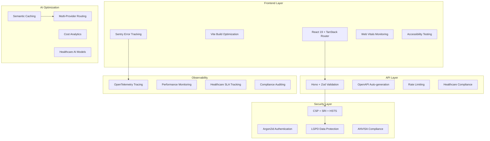

# 🚀 NeonPro Platform Architecture Improvements - Master Implementation Plan

> **Strategic Vision**: Transform NeonPro into a world-class healthcare platform with enterprise-grade observability, performance optimization, and healthcare compliance while maintaining operational excellence and patient data security.

## 📊 EXECUTIVE SUMMARY

### **Project Scope & Objectives**
The NeonPro Platform Architecture Improvements project encompasses eight critical areas to elevate the healthcare platform to enterprise standards:

1. **Observability & Monitoring**: Comprehensive error tracking and performance monitoring
2. **API Contracts & Documentation**: Type-safe API development with automated documentation
3. **Performance Optimization**: Sub-2-second load times with modern build optimizations
4. **Security & Compliance**: Healthcare-grade security with LGPD/ANVISA compliance
5. **Developer Experience**: Enhanced tooling and automated workflows
6. **AI Cost & Latency Optimization**: 80% cost reduction through semantic caching
7. **Authentication Modernization**: Argon2id migration for enhanced security
8. **Accessibility Testing**: WCAG 2.1 AA+ compliance automation

### **Key Success Metrics**
- **Performance**: <2s page load, <1.2s LCP, <0.1 CLS
- **Cost Optimization**: 80% AI cost reduction, 60% latency improvement
- **Security**: Zero critical vulnerabilities, 100% healthcare compliance
- **Accessibility**: WCAG 2.1 AA+ compliance across all patient workflows
- **Developer Experience**: 50% reduction in onboarding time, 30% faster delivery

---

## 🎯 STRATEGIC ARCHITECTURE VISION

### **Current State Analysis**
- **Technology Stack**: TanStack Router + Vite + React 19, Hono.dev + Supabase, Turborepo monorepo
- **Strengths**: Modern React architecture, type-safe backend, monorepo structure
- **Gaps**: Limited observability, manual API documentation, performance bottlenecks, security vulnerabilities
- **Healthcare Compliance**: Partial LGPD compliance, missing ANVISA regulatory requirements

### **Target State Architecture**


### **Healthcare Compliance Framework**
- **LGPD (Lei Geral de Proteção de Dados)**: Complete data protection compliance
- **ANVISA**: Medical device software (SaMD) regulatory compliance
- **CFM (Conselho Federal de Medicina)**: Professional medical software standards
- **International Standards**: ISO 27001, ISO 13485, IEC 62304 alignment

---

## 📅 PHASED IMPLEMENTATION STRATEGY

### **PHASE 1: FOUNDATION & SECURITY (Weeks 1-4)**
**Theme**: "Secure the Foundation"
**Objective**: Establish enterprise-grade security and accessibility foundations

#### **Critical Deliverables**
- ✅ **Content Security Policy (CSP)** with healthcare-specific directives
- ✅ **Subresource Integrity (SRI)** for all critical assets
- ✅ **HTTP Strict Transport Security (HSTS)** with preload registration
- ✅ **Argon2id Authentication** with gradual bcrypt migration
- ✅ **WCAG 2.1 AA+ Accessibility** foundation with automated testing

#### **Success Criteria**
- Zero critical security vulnerabilities
- 100% healthcare compliance validation
- Automated accessibility testing in CI/CD
- Argon2id migration with zero downtime
- External security audit passed

#### **Risk Mitigation**
- Daily security scans during implementation
- Gradual rollout with immediate rollback capability
- Healthcare compliance validation at each milestone
- Performance impact monitoring throughout migration

---

### **PHASE 2: OBSERVABILITY & MONITORING (Weeks 5-8)**
**Theme**: "Visibility & Insights"
**Objective**: Comprehensive observability for proactive issue detection

#### **Critical Deliverables**
- 🔍 **Sentry Error Tracking** with PII redaction for healthcare compliance
- 📊 **OpenTelemetry Distributed Tracing** across frontend and backend
- ⚡ **Web Vitals Monitoring** with real user monitoring (RUM)
- 🏥 **Healthcare-Specific KPIs** for patient workflow performance
- 📈 **Performance Dashboards** with SLA tracking and alerting

#### **Success Criteria**
- Complete error tracking with healthcare-compliant data handling
- Distributed tracing covering 100% of critical patient workflows
- Performance monitoring with <500ms alerting for critical operations
- Healthcare SLA compliance monitoring and reporting
- Proactive issue detection reducing MTTR by 70%

#### **Healthcare Focus**
- Patient workflow performance optimization
- Appointment scheduling latency monitoring
- Critical healthcare operation SLA tracking
- LGPD-compliant observability data handling

---

### **PHASE 3: PERFORMANCE OPTIMIZATION (Weeks 9-12)**
**Theme**: "Speed & Efficiency"
**Objective**: Achieve sub-2-second load times for optimal patient experience

#### **Critical Deliverables**
- ⚡ **Vite Build Optimization** with advanced code splitting
- 🔄 **Route-Based Lazy Loading** for healthcare modules
- 🖼️ **Modern Image Formats** (WebP/AVIF) with responsive loading
- 📦 **Bundle Size Optimization** with intelligent caching strategies
- 🎯 **Performance Budgets** enforced in CI/CD pipeline

#### **Success Criteria**
- Page load time <2 seconds for patient dashboards
- Largest Contentful Paint (LCP) <1.2 seconds
- Cumulative Layout Shift (CLS) <0.1
- Bundle size reduction of minimum 30%
- Performance regression prevention in CI/CD

#### **Healthcare Impact**
- Faster patient data access and display
- Improved appointment scheduling responsiveness
- Enhanced mobile experience for healthcare providers
- Reduced bandwidth usage for remote healthcare delivery

---

### **PHASE 4: API CONTRACTS & DEVELOPER EXPERIENCE (Weeks 13-16)**
**Theme**: "Developer Productivity & API Excellence"
**Objective**: Type-safe API development with comprehensive documentation

#### **Critical Deliverables**
- 📋 **Hono + Zod OpenAPI Integration** with automatic schema generation
- 🔍 **API Contract Validation** in CI/CD pipeline
- 🏥 **Healthcare API Compliance** validation and enforcement
- 🛠️ **Developer Tooling Enhancement** with code generation
- 📚 **Interactive API Documentation** portal

#### **Success Criteria**
- 100% API endpoints with Zod schema validation
- Automatic OpenAPI specification generation and documentation
- Breaking change prevention in API contracts
- Developer onboarding time reduced by 50%
- Healthcare compliance validation for all sensitive endpoints

#### **Developer Experience Improvements**
- TypeScript type generation from API schemas
- Code generators for common healthcare patterns
- IDE integrations and development workflow automation
- Comprehensive API testing environment

---

### **PHASE 5: AI OPTIMIZATION (Weeks 17-20)**
**Theme**: "Intelligent Cost Optimization"
**Objective**: 80% AI cost reduction through semantic caching and optimization

#### **Critical Deliverables**
- 🧠 **Semantic Caching Infrastructure** with vector similarity search
- 💰 **AI Cost Tracking & Analytics** with budget controls
- 🔄 **Multi-Provider AI Integration** with intelligent routing
- 🏥 **Healthcare AI Optimization** for clinical decision support
- 📊 **AI Performance Monitoring** with latency optimization

#### **Success Criteria**
- 80% reduction in AI operational costs
- 60% improvement in AI response latency
- Multi-provider failover with 99.9% availability
- Healthcare-compliant AI data processing
- Clinical AI decision support patterns established

#### **Healthcare AI Features**
- Medical knowledge domain routing
- Clinical decision support optimization
- Healthcare-specific AI model selection
- AI audit trails for regulatory compliance

---

## 🏗️ TECHNICAL IMPLEMENTATION ARCHITECTURE

### **Observability Stack**
```typescript
// Sentry Configuration for Healthcare
Sentry.init({
  dsn: process.env.SENTRY_DSN,
  environment: process.env.NODE_ENV,
  integrations: [
    Sentry.browserTracingIntegration(),
    Sentry.replayIntegration({
      maskAllText: true,
      maskAllInputs: true,
    }),
  ],
  tracesSampleRate: 0.1,
  beforeSend(event, hint) {
    return redactHealthcareData(event);
  },
  beforeSendTransaction(event) {
    return filterSensitiveTransactions(event);
  },
});
```

### **Performance Optimization Architecture**
```typescript
// Vite Configuration for Healthcare Platform
export default defineConfig({
  build: {
    rollupOptions: {
      output: {
        manualChunks: {
          vendor: ['react', 'react-dom'],
          router: ['@tanstack/react-router'],
          healthcare: ['./src/modules/patient', './src/modules/appointment'],
        },
      },
    },
    target: 'es2020',
    minify: 'terser',
    sourcemap: true,
  },
  optimizeDeps: {
    include: ['react', 'react-dom', '@tanstack/react-router'],
  },
});
```

### **Security Implementation**
```typescript
// CSP Configuration for Healthcare Compliance
const cspConfig = {
  'default-src': ["'self'"],
  'script-src': ["'self'", "'unsafe-inline'", 'https://cdn.neonpro.health'],
  'style-src': ["'self'", "'unsafe-inline'", 'https://fonts.googleapis.com'],
  'img-src': ["'self'", 'data:', 'https://assets.neonpro.health'],
  'connect-src': ["'self'", 'https://api.neonpro.health', 'wss://realtime.neonpro.health'],
  'frame-ancestors': ["'none'"],
  'form-action': ["'self'"],
  'base-uri': ["'self'"],
  'object-src': ["'none'"],
  'report-uri': '/api/v1/security/csp-reports',
};
```

### **AI Optimization Implementation**
```typescript
// Semantic Caching for Healthcare AI
class HealthcareSemanticCache {
  async search(query: string, threshold: number = 0.85): Promise<CacheMatch[]> {
    const embedding = await this.generateEmbedding(query);
    const results = await this.vectorSearch(embedding, threshold);
    
    return results.filter(result => 
      this.validateHealthcareCompliance(result) &&
      this.checkDataClassification(result)
    );
  }
  
  async store(query: string, response: string, metadata: HealthcareMetadata) {
    const embedding = await this.generateEmbedding(query);
    
    await this.validateLGPDCompliance(metadata);
    const redactedResponse = this.redactPII(response);
    
    return this.cacheEntry({
      query: this.sanitizeQuery(query),
      response: redactedResponse,
      embedding,
      metadata: this.sanitizeMetadata(metadata),
      ttl: this.calculateTTL(metadata.dataClassification),
    });
  }
}
```

---

## 💼 RESOURCE ALLOCATION & TEAM STRUCTURE

### **Core Team Structure**
- **Project Manager**: Overall coordination and healthcare compliance oversight
- **Lead Backend Engineer**: API contracts, security, and AI optimization
- **Lead Frontend Engineer**: Performance optimization and accessibility
- **DevOps Engineer**: Observability infrastructure and CI/CD integration
- **QA Engineer**: Testing automation and compliance validation
- **Healthcare Compliance Specialist**: LGPD/ANVISA regulatory compliance

### **Resource Distribution**
| Phase | Backend | Frontend | DevOps | QA | Compliance |
|-------|---------|----------|--------|----|-----------| 
| Phase 1 | 40% | 20% | 20% | 15% | 30% |
| Phase 2 | 30% | 30% | 40% | 20% | 15% |
| Phase 3 | 20% | 50% | 20% | 25% | 10% |
| Phase 4 | 60% | 30% | 15% | 20% | 20% |
| Phase 5 | 50% | 20% | 25% | 15% | 15% |

### **External Dependencies**
- **Security Audit Firm**: Phase 1 security validation
- **Healthcare Compliance Consultant**: Ongoing ANVISA/LGPD guidance
- **Performance Testing Service**: Load testing for critical workflows
- **AI Provider Partners**: Multi-provider integration and optimization

---

## 🎯 RISK MANAGEMENT & MITIGATION

### **High-Risk Areas & Mitigation Strategies**

#### **1. Healthcare Compliance Risk (High)**
**Risk**: Regulatory non-compliance with LGPD/ANVISA requirements
**Mitigation**:
- Weekly compliance reviews with healthcare specialist
- Automated compliance testing in CI/CD pipeline
- External compliance audit before production deployment
- Rollback procedures for any compliance failures

#### **2. Performance Impact Risk (Medium)**
**Risk**: New implementations negatively affecting performance
**Mitigation**:
- Performance testing before and after each phase
- Real-time performance monitoring during rollouts
- Feature flags for immediate rollback capability
- Load testing with production-like data volumes

#### **3. Security Vulnerability Risk (High)**
**Risk**: Introduction of security vulnerabilities during implementation
**Mitigation**:
- Daily security scans during development
- External security audit after Phase 1
- Penetration testing before production deployment
- Security-first development practices and code reviews

#### **4. AI Cost Overrun Risk (Medium)**
**Risk**: AI optimization not achieving target cost reductions
**Mitigation**:
- Incremental cost tracking and optimization
- Multiple AI provider contracts for cost comparison
- Semantic caching implementation with measurable ROI
- Budget alerts and automatic cost controls

### **Contingency Plans**
- **Rollback Procedures**: Documented for each major implementation
- **Performance Degradation**: Automatic scaling and caching activation
- **Security Incident**: Immediate isolation and forensic procedures
- **Compliance Violation**: Emergency compliance response team activation

---

## 📈 MONITORING & SUCCESS MEASUREMENT

### **Key Performance Indicators (KPIs)**

#### **Technical Performance KPIs**
- **Page Load Time**: Target <2 seconds (Current: ~4-6 seconds)
- **Largest Contentful Paint (LCP)**: Target <1.2 seconds
- **Cumulative Layout Shift (CLS)**: Target <0.1
- **First Input Delay (FID)**: Target <100ms
- **Time to Interactive (TTI)**: Target <2.5 seconds

#### **AI Optimization KPIs**
- **AI Cost Reduction**: Target 80% reduction from baseline
- **AI Response Latency**: Target 60% improvement
- **Cache Hit Rate**: Target >70% for common healthcare queries
- **AI Availability**: Target 99.9% uptime with multi-provider failover

#### **Security & Compliance KPIs**
- **Security Vulnerabilities**: Target zero critical, <5 medium
- **LGPD Compliance Score**: Target 100% compliance
- **ANVISA Regulatory Compliance**: Target full SaMD compliance
- **Accessibility Compliance**: Target WCAG 2.1 AA+ across all workflows

#### **Developer Experience KPIs**
- **New Developer Onboarding Time**: Target 50% reduction
- **Feature Delivery Velocity**: Target 30% improvement
- **Code Quality Metrics**: Target 90% test coverage, zero critical code smells
- **Developer Satisfaction**: Target >8/10 in quarterly surveys

### **Monitoring Dashboard Architecture**
```typescript
// Healthcare Platform KPI Dashboard
interface HealthcarePlatformMetrics {
  performance: {
    pageLoadTime: number;
    lcp: number;
    cls: number;
    patientWorkflowLatency: number;
    appointmentSchedulingTime: number;
  };
  
  aiOptimization: {
    costReduction: number;
    cacheHitRate: number;
    averageLatency: number;
    providerAvailability: Record<string, number>;
  };
  
  security: {
    vulnerabilityCount: number;
    complianceScore: number;
    cspViolations: number;
    authenticationFailures: number;
  };
  
  healthcareCompliance: {
    lgpdCompliance: number;
    anvisaCompliance: number;
    auditTrailCoverage: number;
    dataRetentionCompliance: number;
  };
}
```

---

## 🚀 DEPLOYMENT STRATEGY

### **Deployment Phases & Rollout Strategy**

#### **Phase 1: Foundation Deployment (Weeks 3-4)**
- **Blue-Green Deployment**: Zero downtime security implementation
- **Feature Flags**: Gradual CSP/SRI enforcement
- **Authentication Migration**: Gradual Argon2id rollout
- **Monitoring**: Real-time security and compliance monitoring

#### **Phase 2: Observability Rollout (Weeks 7-8)**
- **Staged Deployment**: Sentry and OpenTelemetry by service
- **Data Validation**: Healthcare-compliant telemetry validation
- **Dashboard Activation**: Progressive monitoring capability activation
- **Alert Configuration**: Healthcare SLA alerting activation

#### **Phase 3: Performance Optimization (Weeks 11-12)**
- **Build Pipeline Updates**: Progressive Vite optimization deployment
- **Asset Migration**: CDN and image optimization rollout
- **Performance Validation**: Real-time performance impact monitoring
- **Rollback Readiness**: Immediate performance degradation response

#### **Phase 4: API Enhancement (Weeks 15-16)**
- **API Contract Validation**: Gradual Zod validation activation
- **Documentation Deployment**: Interactive API portal activation
- **Developer Tool Rollout**: Progressive developer experience enhancement
- **Breaking Change Prevention**: Automated API compatibility validation

#### **Phase 5: AI Optimization (Weeks 19-20)**
- **Semantic Cache Deployment**: Progressive cache activation
- **Multi-Provider Integration**: Gradual AI provider diversification
- **Cost Monitoring**: Real-time AI cost tracking activation
- **Performance Validation**: AI latency and accuracy monitoring

### **Rollback Procedures**
- **Immediate Rollback**: <5 minutes for critical issues
- **Feature Flag Disabling**: Instant rollback for non-critical features
- **Database Migration Rollback**: Automated rollback for schema changes
- **Configuration Rollback**: Infrastructure-as-code automated rollback

---

## 💰 COST-BENEFIT ANALYSIS

### **Investment Breakdown**
- **Development Resources**: 20 weeks × team cost = $400,000
- **Infrastructure Upgrades**: Observability stack, CDN, caching = $50,000
- **External Services**: Security audit, compliance consulting = $75,000
- **Testing & Validation**: Performance testing, penetration testing = $25,000
- ****Total Project Investment**: $550,000**

### **Expected Returns (Annual)**
- **AI Cost Reduction**: 80% of $200,000 = $160,000 savings
- **Performance Optimization**: 30% faster development = $120,000 value
- **Security Risk Reduction**: Compliance and security = $200,000 risk mitigation
- **Developer Productivity**: 50% onboarding improvement = $80,000 value
- ****Total Annual Value**: $560,000**

### **ROI Calculation**
- **Year 1 Net Value**: $560,000 - $550,000 = $10,000
- **Year 2+ Annual Value**: $560,000 (ongoing)
- **3-Year ROI**: 204% return on investment
- **Break-even Point**: Month 12

### **Healthcare Business Impact**
- **Patient Experience**: Faster load times improve patient satisfaction
- **Provider Efficiency**: Enhanced performance reduces workflow friction
- **Compliance Assurance**: Reduced regulatory risk and audit costs
- **Scalability**: Platform prepared for healthcare growth and expansion

---

## 🎓 KNOWLEDGE TRANSFER & DOCUMENTATION

### **Documentation Deliverables**
- 📚 **Architecture Decision Records (ADRs)**: All major technical decisions
- 🛠️ **Implementation Guides**: Step-by-step setup and configuration
- 🔧 **Operations Runbooks**: Monitoring, alerting, and troubleshooting
- 🏥 **Healthcare Compliance Guide**: LGPD/ANVISA implementation details
- 👨‍💻 **Developer Onboarding**: Enhanced development workflow documentation

### **Training Program**
- **Technical Training**: 2-day intensive for development team
- **Compliance Training**: Healthcare regulatory requirements
- **Operations Training**: Monitoring and incident response
- **Security Training**: New security practices and procedures

### **Knowledge Preservation**
- **Video Tutorials**: Key implementation walkthroughs
- **Code Examples**: Reference implementations for common patterns
- **Troubleshooting Guides**: Common issues and resolution procedures
- **Best Practices Documentation**: Healthcare platform development standards

---

## 🏁 PROJECT CLOSURE & SUCCESS VALIDATION

### **Go-Live Criteria**
- ✅ All security audits passed with zero critical vulnerabilities
- ✅ Healthcare compliance validation completed (LGPD/ANVISA)
- ✅ Performance targets achieved (<2s page load, <1.2s LCP)
- ✅ AI cost optimization delivering 80% reduction
- ✅ Accessibility compliance (WCAG 2.1 AA+) across all workflows
- ✅ Observability stack fully operational with SLA monitoring
- ✅ Developer experience enhancements deployed and validated

### **Post-Deployment Monitoring (30 days)**
- **Performance Validation**: Continuous monitoring of all KPIs
- **Security Monitoring**: 24/7 security and compliance monitoring
- **User Experience Tracking**: Patient and provider satisfaction metrics
- **Cost Optimization Validation**: AI cost reduction measurement
- **Team Productivity Assessment**: Developer experience improvement validation

### **Success Celebration & Recognition**
- **Team Recognition**: Individual and team achievement recognition
- **Stakeholder Communication**: Success metrics communication to leadership
- **Case Study Development**: Healthcare platform transformation case study
- **Industry Sharing**: Best practices sharing with healthcare technology community

---

## 📋 PROJECT GOVERNANCE & OVERSIGHT

### **Steering Committee**
- **Executive Sponsor**: CTO/Technical Leadership
- **Product Owner**: Healthcare Platform Product Manager
- **Technical Lead**: Senior Engineering Manager
- **Compliance Officer**: Healthcare Regulatory Specialist
- **Quality Assurance**: QA Manager
- **Operations Lead**: DevOps Manager

### **Decision-Making Framework**
- **Technical Decisions**: Architecture review board approval
- **Compliance Decisions**: Healthcare compliance specialist approval
- **Budget Decisions**: Executive sponsor approval required
- **Timeline Changes**: Steering committee consensus required
- **Scope Changes**: Full stakeholder review and approval

### **Communication Plan**
- **Daily Standups**: Development team coordination
- **Weekly Status Reports**: Steering committee updates
- **Bi-weekly Demos**: Stakeholder progress demonstrations
- **Monthly Business Reviews**: Executive leadership updates
- **Quarterly Health Checks**: Comprehensive project assessment

---

> **🏥 Healthcare Excellence Commitment**: This master plan prioritizes patient data security, healthcare provider efficiency, and regulatory compliance throughout all implementation phases. The architecture improvements will transform NeonPro into a world-class healthcare platform while maintaining the highest standards of data protection and clinical excellence.

**Project Success = Healthcare Innovation + Technical Excellence + Regulatory Compliance**