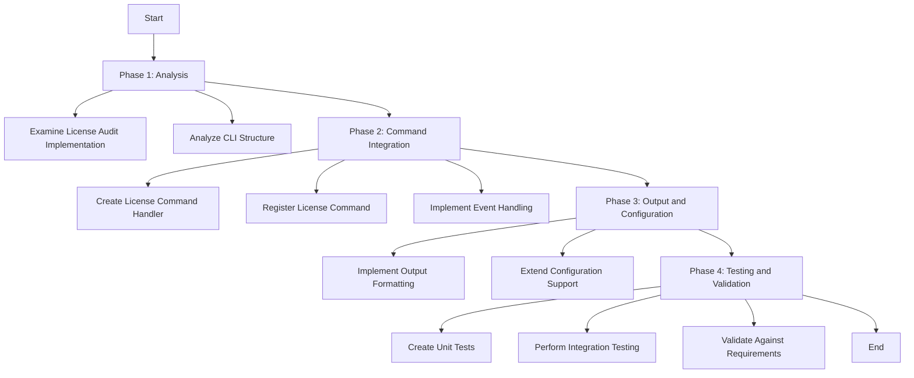
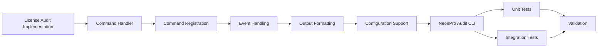
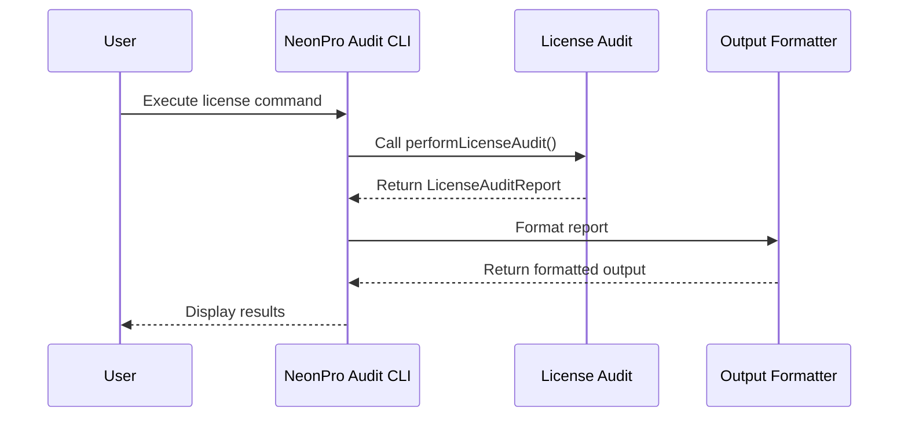
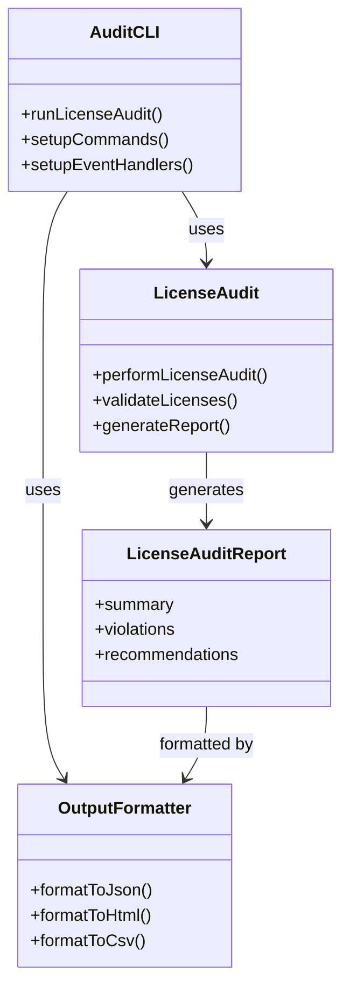

# License Audit Command Integration Workflow

## Workflow Diagram

```mermaid
graph TD
    A[Start] --> B[Phase 1: Analysis]
    B --> B1[Examine License Audit Implementation]
    B --> B2[Analyze CLI Structure]
    B --> C[Phase 2: Command Integration]
    C --> C1[Create License Command Handler]
    C --> C2[Register License Command]
    C --> C3[Implement Event Handling]
    C --> D[Phase 3: Output and Configuration]
    D --> D1[Implement Output Formatting]
    D --> D2[Extend Configuration Support]
    D --> E[Phase 4: Testing and Validation]
    E --> E1[Create Unit Tests]
    E --> E2[Perform Integration Testing]
    E --> E3[Validate Against Requirements]
    E --> F[End]
```

## Integration Architecture

```mermaid
graph LR
    LA[License Audit Implementation] --> CH[Command Handler]
    CH --> CR[Command Registration]
    CR --> EH[Event Handling]
    EH --> OF[Output Formatting]
    OF --> CS[Configuration Support]
    CS --> CLI[NeonPro Audit CLI]
    CLI --> UT[Unit Tests]
    CLI --> IT[Integration Tests]
    UT --> VR[Validation]
    IT --> VR
```

## Data Flow

```mermaid
sequenceDiagram
    participant U as User
    participant CLI as NeonPro Audit CLI
    participant LA as License Audit
    participant OF as Output Formatter
    
    U->>CLI: Execute license command
    CLI->>LA: Call performLicenseAudit()
    LA-->>CLI: Return LicenseAuditReport
    CLI->>OF: Format report
    OF-->>CLI: Return formatted output
    CLI-->>U: Display results
```

## Component Relationships

```mermaid
classDiagram
    class AuditCLI {
        +runLicenseAudit()
        +setupCommands()
        +setupEventHandlers()
    }
    
    class LicenseAudit {
        +performLicenseAudit()
        +validateLicenses()
        +generateReport()
    }
    
    class LicenseAuditReport {
        +summary
        +violations
        +recommendations
    }
    
    class OutputFormatter {
        +formatToJson()
        +formatToHtml()
        +formatToCsv()
    }
    
    AuditCLI --> LicenseAudit : uses
    LicenseAudit --> LicenseAuditReport : generates
    AuditCLI --> OutputFormatter : uses
    LicenseAuditReport --> OutputFormatter : formatted by
```
