# Phase 2: Dependency Graph Analysis

**Generated**: 2025-09-06  
**Project**: NeonPro Healthcare Platform  
**Phase**: Dependency Graph Analysis and Import Mapping  
**Owner**: Static Analysis Agent  
**Status**: Completed  

## Executive Summary

| Metric | Value |
|--------|-------|
| **Active Package Dependencies** | 8 packages with clear hierarchy |
| **Dependency Depth** | 2 levels (clean architecture) |
| **Circular Dependencies** | 0 (✅ None detected) |
| **External Dependencies** | 4 common across packages |
| **Archived Package References** | 5 packages still referencing active |

## Dependency Graph Visualization

```mermaid
graph TD
    %% Level 0 - Foundation
    CONFIG[📁 @neonpro/config<br/>20K]
    DATABASE[🗄️ @neonpro/database<br/>5.4M]
    TYPES[📝 @neonpro/types<br/>2.9M]
    
    %% Level 1 - Infrastructure
    UTILS[🔧 @neonpro/utils<br/>1.6M]
    SECURITY[🔒 @neonpro/security<br/>2.7M]
    
    %% Level 2 - Application
    CORE[⚡ @neonpro/core-services<br/>9.0M]
    SHARED[🤝 @neonpro/shared<br/>4.1M]
    UI[🎨 @neonpro/ui<br/>3.8M]
    
    %% Dependencies
    DATABASE --> UTILS
    UTILS --> CORE
    UTILS --> UI
    DATABASE --> SHARED
    CONFIG -.-> CORE
    CONFIG -.-> SECURITY
    TYPES -.-> SECURITY
    
    %% Styling
    classDef level0 fill:#e1f5fe
    classDef level1 fill:#f3e5f5  
    classDef level2 fill:#e8f5e8
    
    class CONFIG,DATABASE,TYPES level0
    class UTILS,SECURITY level1
    class CORE,SHARED,UI level2
```



## Dependency Analysis by Level

### Level 0: Foundation Packages (No Dependencies)

#### 🗄️ @neonpro/database (5.4M)
- **Role**: Database foundation layer
- **Dependencies**: None
- **Dependents**: core-services, shared, utils
- **Exports**: Prisma client, Supabase client, healthcare utilities
- **Critical**: Core infrastructure package

#### 📁 @neonpro/config (20K)
- **Role**: Build and development configuration
- **Dependencies**: None  
- **Dependents**: core-services (dev), security (peer)
- **Exports**: TypeScript configs, build configurations
- **Status**: ⚠️ Potential duplicate with archived version

#### 📝 @neonpro/types (2.9M)
- **Role**: Type definitions
- **Dependencies**: None
- **Dependents**: security (peer dependency)
- **Status**: ⚠️ Overlap with @neonpro/shared

### Level 1: Infrastructure Packages

#### 🔧 @neonpro/utils (1.6M)
- **Dependencies**: database
- **Dependents**: core-services, ui
- **Exports**: Utility functions, validation, formatters
- **Usage**: Brazilian document validation, formatting utilities

#### 🔒 @neonpro/security (2.7M)  
- **Dependencies**: config (peer), types (peer)
- **Dependents**: None (top-level consumer)
- **Exports**: Authentication, authorization, audit services
- **Status**: ✅ Successfully absorbed @neonpro/auth

### Level 2: Application Packages

#### ⚡ @neonpro/core-services (9.0M)
- **Dependencies**: database, utils, config (dev)
- **Dependents**: None (top-level consumer)
- **Exports**: Business logic for scheduling, treatment, patient management
- **Status**: ✅ Well-structured with domain exports

#### 🤝 @neonpro/shared (4.1M)
- **Dependencies**: database
- **Dependents**: None (top-level consumer)  
- **Exports**: Schemas, API client, React hooks
- **Status**: ⚠️ Type overlap with @neonpro/types

#### 🎨 @neonpro/ui (3.8M)
- **Dependencies**: utils
- **Dependents**: None (top-level consumer)
- **Exports**: Healthcare design system, shadcn/ui components
- **Status**: ✅ Standalone design system

## External Dependencies Analysis

### Common Dependencies (High Consolidation Value)

| Package | Used By | Purpose | Version Consistency |
|---------|---------|---------|-------------------|
| `zod` | 7 packages | Schema validation | ✅ Consistent |
| `@supabase/supabase-js` | 6 packages | Database client | ⚠️ Version drift |
| `date-fns` | 4 packages | Date utilities | ⚠️ Mixed versions |
| `typescript` | All packages | Type checking | ✅ Consistent |

### Specialized Dependencies

**UI Components** (@neonpro/ui):
- @radix-ui/react-* (15 components)
- lucide-react (icons)
- class-variance-authority (variants)

**Security & Auth** (@neonpro/security):
- bcryptjs (password hashing)
- jsonwebtoken (JWT handling)  
- speakeasy (MFA/2FA)

**Database ORM** (@neonpro/database):
- @prisma/client (ORM client)
- prisma (ORM tooling)

## Import Pattern Analysis

### Static Imports (Active Packages)

#### Real Import Usage
```typescript
// @neonpro/core-services/src/enterprise/index.ts
export { UnifiedAuditService as EnterpriseAuditService } from "@neonpro/security";
```

#### Template References (Commented)
```typescript
// packages/shared/src/templates/healthcare-api-template.ts  
// import { Logger } from '@neonpro/utils';
// import { healthcareSecurityMiddleware } from '@neonpro/api/middleware';

// packages/shared/src/templates/healthcare-feature-template.ts
// import { HealthcareEncryption } from '@neonpro/core-services';
// import { AuditService } from '@neonpro/monitoring';
```

### Dynamic Imports
- **Lazy Loading**: None detected
- **Conditional Imports**: None detected  
- **Code Splitting**: Standard build-time splitting

## Archived Package Dependency Issues

### Critical: Still Referencing Active Packages

#### 🔥 @neonpro/compliance (Archived - Healthcare Risk)
```json
"peerDependencies": {
  "@neonpro/types": "workspace:*",
  "@neonpro/config": "workspace:*", 
  "@neonpro/security": "workspace:*"
}
```
**Impact**: LGPD/ANVISA/CFM compliance features unavailable
**Solution**: Reintegrate into @neonpro/security

#### @neonpro/auth (Successfully Migrated)
```json
"deprecated": "Merged into @neonpro/security. Please migrate imports to @neonpro/security/auth."
```
**Status**: ✅ Migration completed

#### @neonpro/ai (Archived)
- References: core-services, database, types, ui
- **Decision Needed**: Reactivate or permanently remove

#### @neonpro/integrations (Archived)
- References: database
- **Consideration**: Integrate into core-services for healthcare systems

## Circular Dependency Analysis

### ✅ Result: No Circular Dependencies Detected

**Validation**: 
- Level-based dependency hierarchy maintained
- No back-references between levels
- Clean unidirectional dependency flow

### Dependency Depth: 2 Levels Maximum
```
Level 0: config, database, types (foundation)
    ↓
Level 1: utils, security (infrastructure)  
    ↓
Level 2: core-services, shared, ui (application)
```

## Application Entry Points

### apps/api (Backend)
**Imports**:
- @neonpro/core-services (business logic)
- @neonpro/database (data access)
- @neonpro/security (authentication/authorization)
- @neonpro/shared (schemas, types)

### apps/web (Frontend)  
**Imports**:
- @neonpro/ui (components, design system)
- @neonpro/shared (API client, hooks)
- @neonpro/database (client utilities)
- @neonpro/security (auth components)

## Unused Files Analysis

### Template Files (Commented Imports)
**Location**: packages/shared/src/templates/
- healthcare-api-template.ts
- healthcare-feature-template.ts  
- healthcare-component-template.tsx

**Status**: Development templates with commented @neonpro imports
**Recommendation**: Review for active usage or removal

### Archived Package Files
**Location**: packages/_archive/
- All files in archived packages are technically unused by active system
- Still consume 11M of storage space
- Some contain valuable compliance and AI logic

### Build Artifacts
**Locations**: 
- packages/*/dist/ directories
- Generated files from build processes
**Status**: Build artifacts, safe to clean

## Consolidation Impact Analysis

### 1. Types + Shared Merge
**Current**:
```
@neonpro/security → @neonpro/types (peer dep)
```

**After Consolidation**:
```
@neonpro/security → @neonpro/shared/types
```

**Changes Required**:
- Update imports from @neonpro/types to @neonpro/shared/types
- Remove @neonpro/types package
- Consolidate type definitions

### 2. Compliance Reintegration
**Current**:
```
@neonpro/compliance (archived) → @neonpro/security, @neonpro/types
```

**After Reintegration**:
```
@neonpro/security (expanded with compliance features)
```

**Changes Required**:
- Move compliance code to @neonpro/security/compliance
- Update any references to compliance features
- Healthcare regulatory compliance restored

## Dependency Health Score

### ✅ Healthy Patterns
- Clean level-based hierarchy (no circular dependencies)
- Consistent external dependency usage
- Proper separation of concerns
- Foundation packages have no dependencies

### ⚠️ Attention Needed  
- Version drift in date-fns, @supabase/supabase-js
- Type definitions scattered across types + shared
- Config package duplication (active + archived)

### 🔥 Critical Issues
- Healthcare compliance features archived (@neonpro/compliance)
- Archived packages consuming 11M storage
- Template files with commented imports need review

## Recommendations

### Immediate (P0)
1. **Reintegrate @neonpro/compliance** into @neonpro/security
2. **Merge @neonpro/types** into @neonpro/shared/types  
3. **Resolve config duplication** (active vs archived)

### Short-term (P1)
1. **Standardize external dependency versions**
2. **Review template files** for active usage
3. **Clean build artifacts** and unused dist/ folders

### Long-term (P2)
1. **Archive cleanup**: Remove or document permanently archived packages
2. **Dependency optimization**: Consider consolidating common external deps
3. **Import analysis automation**: Set up tooling to track package usage

## Success Metrics

### Before Optimization
- 15 total packages (8 active + 7 archived)
- 2-level dependency depth
- 0 circular dependencies  
- 4 common external dependencies

### After Consolidation Target
- 10-12 total packages
- Maintained 2-level depth
- 0 circular dependencies
- Consolidated compliance and types
- Standardized external dependency versions

## Next Phase Preparation

This dependency analysis provides the foundation for:

1. **Phase 3**: Detailed redundancy detection using import patterns
2. **Phase 4**: Consolidation planning with dependency impact analysis
3. **Phase 5-6**: Safe execution with dependency graph validation

The dependency structure is clean and well-architected, making consolidation feasible with minimal risk to system stability.

---

**Key Finding**: Clean dependency architecture with no circular dependencies, making package consolidation safe and straightforward.

**Critical Gap**: Healthcare compliance features (@neonpro/compliance) archived, requiring immediate reintegration for regulatory compliance.