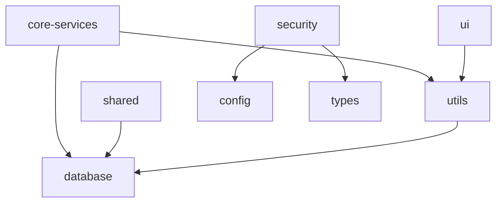

# Phase 1: Package Inventory Report

**Generated**: 2025-09-06  
**Project**: NeonPro Healthcare Platform  
**Phase**: Package Inventory and Mapping  
**Owner**: Mapping Agent (apex-dev)  
**Status**: Completed  

## Executive Summary

| Metric | Value |
|--------|-------|
| **Total Packages** | 15 |
| **Active Packages** | 8 |
| **Archived Packages** | 7 |
| **Total Size** | 40.5M |
| **Active Size** | 29.5M |
| **Archived Size** | 11.0M |

## Active Packages Analysis

### Core Infrastructure (Large Packages)

| Package | Size | Description | Status |
|---------|------|-------------|---------|
| `@neonpro/core-services` | 9.0M | Core business services for healthcare SaaS | ✅ Core package |
| `@neonpro/database` | 5.4M | Consolidated Prisma ORM + Supabase integration | ✅ Already consolidated |
| `@neonpro/shared` | 4.1M | Shared types, schemas, and API client | ⚠️ Overlap with types |
| `@neonpro/ui` | 3.8M | Healthcare design system with shadcn/ui | ✅ Standalone UI system |
| `@neonpro/types` | 2.9M | Shared TypeScript types and interfaces | ⚠️ Merge with shared |
| `@neonpro/security` | 2.7M | Security infrastructure (absorbed auth) | ✅ Absorbed auth package |

### Utility Packages (Small Packages)

| Package | Size | Description | Status |
|---------|------|-------------|---------|
| `@neonpro/utils` | 1.6M | Shared utilities and helper functions | ✅ Utility functions |
| `@neonpro/config` | 20K | TypeScript and build configurations | ⚠️ Potential duplicate |

## Archived Packages Analysis

### Critical Archived Packages

| Package | Size | Description | Priority |
|---------|------|-------------|----------|
| `@neonpro/compliance` | ~1.1M | LGPD, ANVISA, CFM compliance automation | 🔥 **High** - Critical reintegration |
| `@neonpro/ai` | ~1.5M | AI Healthcare features with compliance | 🔍 **Medium** - Review for reactivation |
| `@neonpro/integrations` | ~1.2M | Healthcare systems integration | 🔍 **Medium** - Consider core-services |

### Successfully Migrated

| Package | Size | Description | Status |
|---------|------|-------------|---------|
| `@neonpro/auth` | ~1.2M | Authentication utilities | ✅ **Merged into security** |

### Utility Archived

| Package | Size | Description | Recommendation |
|---------|------|-------------|----------------|
| `@neonpro/cache` | ~0.8M | LGPD compliant caching utilities | Integrate into utils |
| `@neonpro/config` (archive) | ~0.5M | Shared configurations | Remove duplicate |
| `@neonpro/testing` | ~5.7M | Testing utilities (no package.json) | Review contents |

## Package Structure Analysis

### Export Patterns

**Comprehensive Exports** (Well-structured):
- `@neonpro/core-services`: 6 domain exports (scheduling, treatment, patient, etc.)
- `@neonpro/shared`: 5 specialized exports (api-client, hooks, schemas)
- `@neonpro/ui`: Theme-based and component-based exports
- `@neonpro/database`: Client and Prisma exports

**Simple Exports** (Basic structure):
- `@neonpro/types`: Single main export
- `@neonpro/utils`: Main + validation export
- `@neonpro/config`: JSON configuration files

### Build System Analysis

**Modern Build Setup**:
- `@neonpro/core-services`: tsup (CJS + ESM)
- `@neonpro/security`: tsc + tsup hybrid
- `@neonpro/shared`: tsc with build config

**Basic Build Setup**:
- `@neonpro/types`, `@neonpro/utils`, `@neonpro/ui`: tsc only

## Dependency Analysis

### Internal Dependencies



### Most Depended On Packages

1. **@neonpro/database** - Foundation layer (Prisma + Supabase)
2. **@neonpro/utils** - Utility layer (helper functions)
3. **@neonpro/types** - Type definitions (scattered with shared)
4. **zod** - External validation across packages
5. **@supabase/supabase-js** - External database client

### External Dependencies Patterns

**Common Across Packages**:
- `zod`: Validation (7 packages)
- `@supabase/supabase-js`: Database client (6 packages)
- `date-fns`: Date utilities (4 packages)
- `typescript`: Development (all packages)

**Specialized Dependencies**:
- **UI**: `@radix-ui/*`, `class-variance-authority`, `lucide-react`
- **Security**: `bcryptjs`, `jsonwebtoken`, `jose`, `speakeasy`
- **Database**: `@prisma/client`, Supabase tooling

## Consolidation Opportunities

### 🔥 High Priority Consolidations

#### 1. Duplicate Config Issue
```
Problem: Two @neonpro/config packages (active + archived)
Impact: Confusion, maintenance overhead
Solution: Remove archived config, consolidate build configurations
Files: packages/config vs packages/_archive/config
```

#### 2. Types Scattered Across Packages
```
Problem: @neonpro/types + @neonpro/shared both handle types
Impact: Import confusion, duplication
Solution: Merge @neonpro/types into @neonpro/shared/types
Size Impact: 2.9M → consolidated into 4.1M shared package
```

#### 3. Critical Compliance Package Archived
```
Problem: @neonpro/compliance in archive (LGPD/ANVISA/CFM)
Impact: Healthcare compliance features unavailable
Solution: Reintegrate compliance into @neonpro/security
Healthcare Risk: High - regulatory compliance essential
```

### 🔍 Medium Priority Consolidations

#### 4. Cache Utilities in Archive
```
Problem: @neonpro/cache archived but caching needed
Impact: Performance optimization unavailable
Solution: Integrate caching utilities into @neonpro/utils
```

#### 5. Integration Features Archived
```
Problem: @neonpro/integrations in archive (HL7, FHIR, EHR)
Impact: Healthcare system integrations unavailable
Solution: Evaluate for integration into @neonpro/core-services
```

### ⚡ Low Priority Consolidations

#### 6. AI Features Archived
```
Problem: @neonpro/ai archived (chat, ML, workflow)
Impact: AI features unavailable for development
Solution: Review for potential reactivation or permanent removal
```

#### 7. Testing Package Structure
```
Problem: @neonpro/testing has no package.json
Impact: Unknown testing utility availability
Solution: Review contents and decide on consolidation approach
```

## Package Health Assessment

### ✅ Healthy Packages (No Action Needed)

1. **@neonpro/database** - Well-consolidated, comprehensive Prisma + Supabase
2. **@neonpro/core-services** - Good domain separation, clear exports
3. **@neonpro/ui** - Standalone design system, comprehensive theming
4. **@neonpro/security** - Successfully absorbed @neonpro/auth

### ⚠️ Needs Attention

1. **@neonpro/shared** - Overlaps with types, could be consolidated
2. **@neonpro/types** - Small, redundant with shared types
3. **@neonpro/config** - Potential duplicate with archived version

### 🔥 Critical Issues

1. **@neonpro/compliance** - Healthcare compliance features archived
2. **Archive management** - 11M of archived code needs review

## Recommendations

### Immediate Actions (P0)

1. **Resolve config duplication**: Remove archived config or merge differences
2. **Reintegrate compliance**: Move LGPD/ANVISA features to security package
3. **Consolidate types**: Merge @neonpro/types into @neonpro/shared

### Short-term Actions (P1)

1. **Cache integration**: Move cache utilities to @neonpro/utils
2. **Testing review**: Assess @neonpro/testing contents
3. **Integration assessment**: Evaluate @neonpro/integrations for reactivation

### Long-term Actions (P2)

1. **AI features review**: Decide on @neonpro/ai reactivation
2. **Archive cleanup**: Remove or document permanently archived packages
3. **Build system standardization**: Align all packages on tsup for CJS+ESM

## Success Metrics

### Before Consolidation
- 15 total packages (8 active + 7 archived)
- 40.5M total size
- Complex dependency graph with overlaps

### After Consolidation Target
- ~10-12 total packages (8-10 active + 2-4 archived)
- ~35M total size (12% reduction)
- Simplified dependency graph
- Zero critical compliance gaps

## Next Phase Preparation

This inventory provides the foundation for:

1. **Phase 2**: Dependency graph analysis with import/export mapping
2. **Phase 3**: Detailed redundancy detection using agent analysis
3. **Phases 4-6**: Systematic consolidation execution with quality gates

The package structure is moderately complex but manageable, with clear consolidation opportunities that align with constitutional principles (KISS/YAGNI) and healthcare compliance requirements.

---

**Key Finding**: Healthcare compliance features (@neonpro/compliance) are archived, creating a critical gap that must be addressed immediately for regulatory compliance (LGPD/ANVISA/CFM).

**Consolidation Potential**: 3-5 packages can be consolidated, reducing complexity by ~20-25% while maintaining all functionality.